[toc]

## 未读

http://www.alloyteam.com/2012/10/the-css3-transform-perspective-property/
http://www.alloyteam.com/2012/11/css3-3d-transform/

## CSS3 3D Transforms in IE10

http://blogs.msdn.com/b/ie/archive/2012/02/02/css3-3d-transforms-in-ie10.aspx

For example, the Windows 8 Metro style Start page uses subtle 3D transforms to highlight pressed tiles, as shown below.

**向CSS Transforms增加第三个维度**

3D transform扩展并增加了函数：函数`rotate()`, `scale()`, `translate()`, `skew()`, `matrix()`扩展到使用第三个参数表示z轴；`matrix3d()`增加10个参数；增加了`rotateZ()`和`scaleZ()`等函数。

一个新的transform函数`perspective`向元素添加深度感，远方的点看起来更小。

3D Transforms还添加了一些新的CSS属性。除了`transform`和`transform-origin`属性，IE10 supports vendor-prefixed `perspective`, `perspective-origin`, `backface-visibility`, and the `flat` value of `transform-style`.

**透视**

transform函数`perspective`对3D变换非常重要。它设置观察者的位置，将可观察的内容映射到一个金字塔（viewing pyramid）上，接着投影到一个2D平面（viewing plane）。若没有perspective，z空间中所有点都展平到同一个2D平面，3D变换将没有深度感。例如，对于沿z轴移动的变换，`perspective`函数对最终效果有关键影响。

下图中，粉色是原来的未经变换的元素，橙色是变换后的元素：

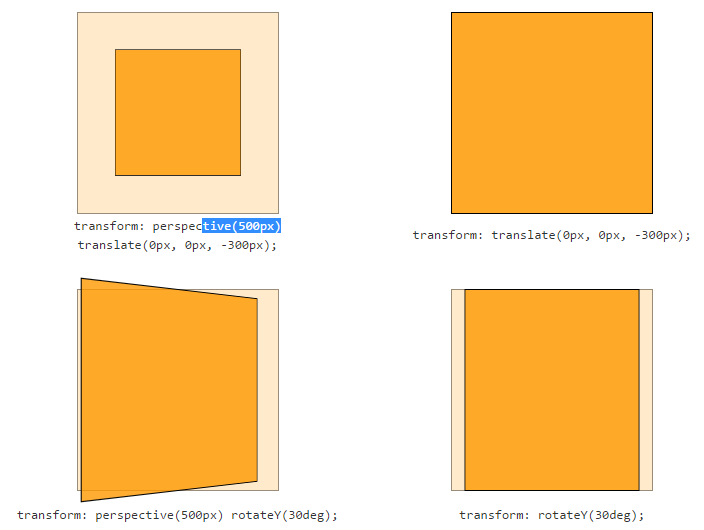

向多个元素添加透视的简便方法是向它们的父元素添加`perspective`属性。`perspective`属性向每个子元素添加perspective变换。

	#parent {
		perspective: 500px;
	}

	#div1 {
		position: absolute;
		transform-origin: 0px 0px;
		transform: rotateY(30deg);
	}

	#div2 {
		position: absolute;
		transform-origin: 0px 0px;
		transform: rotateY(30deg) translate(220px);
	}

`perspective-origin`属性与`perspective`连用，可以将viewpoint从元素中心移开。

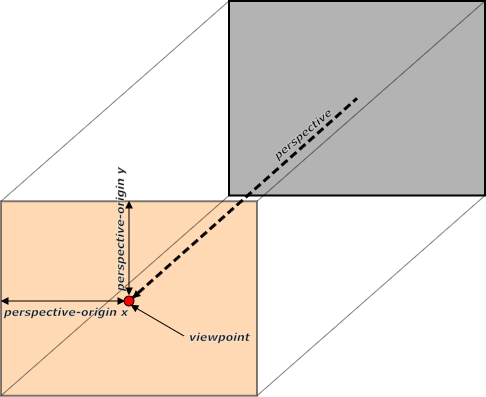

Below, you can see that shifting the perspective origin to the left makes the content to the right of the original perspective origin appear farther away.

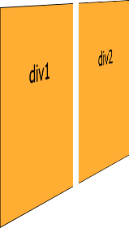

	#parent {
		perspective: 500px;
		perspective-origin: -300px 0px;
	}

**backface-visibility**

{{一个正方体，有不透明和透明正方体两种。在一面画一个东西，旋转正方体180度，对于不透明的正方体，画的东西将不可见。但对于透明的正方体，可以透过正方体看到画的东西的背面。这里的backface指的就是这个背面，即是正方体一个面的正面和背面，而不是正方体的对着的两个面。`backface-visibility`设为hidden就相当于把一个透明的正方体改成一个不透明的正方体。}}

`backface-visibility`属性用于隐藏内容的背面（backface）。By default, the backface is visible and the transformed content can be seen even when flipped. But when backface-visibility is set to hidden, content is hidden when the element is rotated such that the front side is no longer visible. 该属性可以用于实现有多个边的对象，如下图的扑克牌。By setting backface-visibility to hidden, it’s easy to ensure that only the front-facing sides are visible.

    .card, .card div {
        position: absolute;
        width: 102px;
        height: 143px;
    }

    .card div:nth-child(1) {
        background-image: url('redback.png');
    }

    .card div:nth-child(2) {
        background-image: url('8clubs.png');
        backface-visibility: hidden;
    }

	

Creating six cards as defined above and giving each a `style="transform: rotateY(ndeg)"` property with a different rotation value n, results in this:

未发生旋转时，显示的是第二个div，即显示梅花8，因为按绘制顺序（注意绝对定位）它在上面。但如果转90度后，因为第二个div设置了`backface-visibility: hidden;`，于是它不可见了。

**3D变换与动画/过场**

Best of all, you can even use 3D transforms in conjunction with CSS transitions and animations. If you are using IE10 or another browser that supports CSS3 Animations of CSS3 3D Transforms, try this example of scrolling text, built by animating the transform property.

    #parentDiv {
        perspective: 500px;
        perspective-origin: 150px 500px;
    }

    #div1 {
        transform-origin: 150px 500px;
        animation: scrollText 200s linear infinite;
    }

    @keyframes scrollText {
        0% { transform: rotateX(45deg) translateY(500px); }
        100% { transform: rotateX(45deg) translateY(-8300px); }
    }

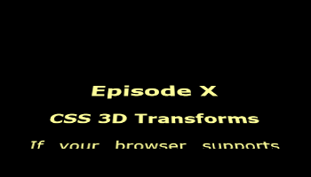 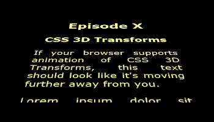

## CSS 3-D Transforms 介绍（最佳）

http://24ways.org/2010/intro-to-css-3d-transforms/

### 透视

要激活3D空间，元素需要透视（perspective）。可以通过两种方式：使用`perspective`属性或使用`perspective`函数：

    -webkit-perspective: 600;
	-webkit-transform: perspective(600);

使用函数的例子：

    #red .box {
      background-color: red;
      transform: perspective( 600px ) rotateY( 45deg );
    }

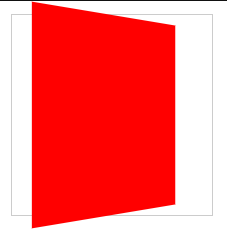

使用属性的例子。注意属性加载父容器上！

    #blue {
      perspective: 600px;
    }

    #blue .box {
      background-color: blue;
      transform: rotateY( 45deg );
    }

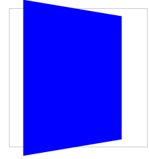

两种方式有差别！函数形式便于直接对单个元素应用3D变换。但如果有多个元素，每个元素位置不同，使用函数形式，每个元素的消失点（vanishing point，{{应该指透视金字塔的顶点}}）将不同。如果想让所有元素共享一个3D空间，可以在它们的*父容器上*设置`perspective`属性。下面是比较：

    #red figure {
      background: red;
      transform: perspective( 400px ) rotateY(45deg);
    }

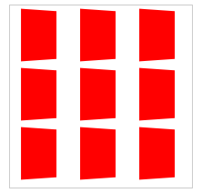

    #blue {
      perspective: 400px;
    }
    #blue figure {
      background: blue;
      transform: rotateY( 45deg );
    }

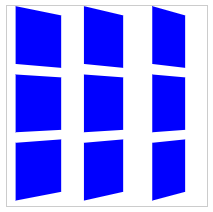

perspective的值决定3D效果的强度（intensity）。可以认为它是观察者到对象的距离。值越大，距离越大，视觉效果越小。`perspective: 2000;`产生较弱的3D效果，好像从很远观察物体。`perspective: 100;`产生巨大的3D效果，好像一个小昆虫观察大的物体。

3D空间的消失点（vanishing point，{{应该指透视金字塔的顶点}}）默认在中心。可以同通过`perspective-origin`属性改变消失点的位置：

	-webkit-perspective-origin: 25% 75%;

在线例子：http://desandro.github.io/3dtransforms/examples/perspective-03.html

### 3D变换函数

3D变换与2D变换一样使用`transform`属性。

    rotateX(angle)
    rotateY(angle)
    rotateZ(angle)
    translateZ(tz)
    scaleZ(sz)

`translateZ()`沿z轴移动物体。正值让元素靠近观察者，负值令其远离。

旋转函数使元素绕轴旋转。`rotateX(45deg)`让元素绕水平x轴旋转，元素顶边向后移动，底边靠近观察者。

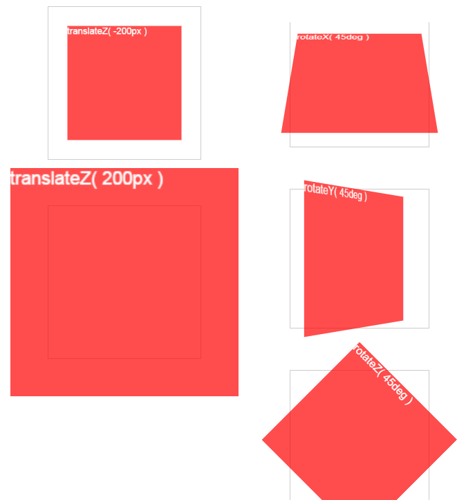

还有一种缩写形式：

    translate3d(tx,ty,tz)
    scale3d(sx,sy,sz)
    rotate3d(rx,ry,rz,angle)

这种形式还有一个好处可以触发Safari的硬件加速。

### 翻牌

    <section class="container">
      

        <figure class="front">1</figure>
        <figure class="back">2</figure>
      

    </section>

容器负责建立3D空间。`#card`作为3D对象的包装。纸牌的两面是两个独立的元素。**我推荐所有3D变换都使用此模式。**把3D空间元素和对象元素分开更清晰易懂。{{实践正面应遵循此模式否则可能会有一些问题。特别是，貌似绝对应该把`transform-style`和`perspective`两个属性分开！`perspective`放在容器上，`transform-style`放在容器**内**的3D对象上。}}

首先对父容器设定大小，并利用透视建立3D空间。

    .container {
      width: 200px;
      height: 260px;
      position: relative;
      -webkit-perspective: 800;
    }

`#card`可以在父容器的3D空间变换。设置`width: 100%;`和`height: 100%;`的目的是确保对象的`transform-origin`位于中心。

    #card {
      width: 100%;
      height: 100%;
      position: absolute;
      -webkit-transform-style: preserve-3d;
      -webkit-transition: -webkit-transform 1s;
    }

容器的透视只对直接后代生效，即`#card`。为了让后续后代继承父容器的透视，进入3D空间，使用`transform-style: preserve-3d`。Without 3-D transform-style, the faces of the card would be flattened with its parents and the back face’s rotation would be nullified.

设置`backface-visibility: hidden`，表示当一面反转到背后时，隐藏它：

    #card figure {
      display: block;
      position: absolute;
      width: 100%;
      height: 100%;
      -webkit-backface-visibility: hidden;
    }

首先，正面朝上时，它后面翻过去，为此设置`rotateY(180deg)`：

    #card .front {
      background: red;
    }
    #card .back {
      background: blue;
      -webkit-transform: rotateY(180deg);
    }

设置反面朝上时对的状态：

    #card.flipped {
      -webkit-transform: rotateY(180deg);
    }

现在我们有了一个3D对象。反面只要增删`flipped`类。

在线例子：http://desandro.github.com/3dtransforms/examples/card-01.html

### 滑动反转

上一节的反转的轴位于卡牌中心，反转时，靠近观察者的一边的上下两个角会超出容器。如下图左侧。如果不想超出容器，需要把轴放在卡牌的一边（靠近观察者的一边。见下图右侧。

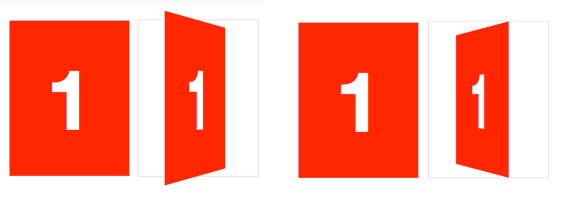

方法是设置`transform-origin`。

    #card { -webkit-transform-origin: right center; }

把轴移动后，为了包装反转后卡牌还是在容器内，不仅要反转，还要反向水平移动（注意与上一节的另一个例子时，现在是逆时针转动了——所以轴要在右边而不是左边）：

    #card.flipped {
      -webkit-transform: translateX(-100%) rotateY(-180deg);
    }

在线例子：http://desandro.github.com/3dtransforms/examples/card-02-slide-flip.html

### 立方体

需要6个元素表示六个面：

    <section class="container">
      

        <figure class="front">1</figure>
        <figure class="back">2</figure>
        <figure class="right">3</figure>
        <figure class="left">4</figure>
        <figure class="top">5</figure>
        <figure class="bottom">6</figure>
      

    </section>

3D空间建立和大小设置：

    .container {
      width: 200px;
      height: 200px;
      position: relative;
      -webkit-perspective: 1000;
    }
    #cube {
      width: 100%;
      height: 100%;
      position: absolute;
      -webkit-transform-style: preserve-3d;
    }
    #cube figure {
      width: 196px;
      height: 196px;
      display: block;
      position: absolute;
      border: 2px solid black;
    }

先把角度调对：

    #cube .front { -webkit-transform: rotateY(0deg); }
    #cube .back { -webkit-transform: rotateX(180deg); }
    #cube .right { -webkit-transform: rotateY(90deg); }
    #cube .left { -webkit-transform: rotateY(-90deg); }
    #cube .top { -webkit-transform: rotateX(90deg); }
    #cube .bottom { -webkit-transform: rotateX(-90deg); }

现在它们的中心还在同一点上。要把它们推到正确的位置。边长200px，于是边距离中心100px。于是都沿z轴移动100px。注意，由于**先做了旋转**，每个面的z轴朝向都已经变化。因此虽然都是z轴移动正100px。但对面的两个边实际向相反方向移动。

    #cube .front { -webkit-transform: rotateY(0deg) translateZ(100px); }
    #cube .back { -webkit-transform: rotateX(180deg) translateZ(100px); }
    #cube .right { -webkit-transform: rotateY(90deg) translateZ(100px); }
    #cube .left { -webkit-transform: rotateY(-90deg) translateZ(100px); }
    #cube .top { -webkit-transform: rotateX(90deg) translateZ(100px); }
    #cube .bottom { -webkit-transform: rotateX(-90deg) translateZ(100px); }

立方体已经就绪。但有另一个问题。For the sake of our users, our 3-D transforms should not distort the interface when the active panel is at its resting position. But once we start pushing elements off their Z-axis origin, distortion is inevitable.

In order to keep 3-D transforms snappy, Safari composites the element, then applies the transform. Consequently, anti-aliasing on text will remain whatever it was before the transform was applied. When transformed forward in 3-D space, significant pixelation can occur.

To resolve the distortion and restore pixel perfection to our #cube, we can push the 3-D object back, so that the front face will be positioned back to the Z-axis origin.

	#cube { -webkit-transform: translateZ(-100px); }

在线例子：http://desandro.github.com/3dtransforms/examples/cube-01-steps.html

旋转立方体通过旋转`#cube`（立方体对象）实现。注意到显示一个面使用的变换样式与这个面自己的样式正好相反。

    #cube.show-front { -webkit-transform: translateZ(-100px) rotateY(0deg); }
    #cube.show-back { -webkit-transform: translateZ(-100px) rotateX(-180deg); }
    #cube.show-right { -webkit-transform: translateZ(-100px) rotateY(-90deg); }
    #cube.show-left { -webkit-transform: translateZ(-100px) rotateY(90deg); }
    #cube.show-top { -webkit-transform: translateZ(-100px) rotateX(-90deg); }
    #cube.show-bottom { -webkit-transform: translateZ(-100px) rotateX(90deg); }

添加过场：

	#cube { -webkit-transition: -webkit-transform 1s; }

在线例子：http://desandro.github.com/3dtransforms/examples/cube-02-show-sides.html

### 不规则正方体

长宽高：300 pixels、200 pixels、100 pixels。

    .container {
      width: 300px;
      height: 200px;
      position: relative;
      -webkit-perspective: 1000;
    }
    #box {
      width: 100%;
      height: 100%;
      position: absolute;
      -webkit-transform-style: preserve-3d;
    }

Now to position the faces. Each set of faces will need their own sizes. The smaller faces (left, right, top and bottom) need to be positioned in the centre of the container, where they can be easily rotated and then shifted outward. The thinner left and right faces get positioned left: 100px ((300 − 100) ÷ 2), The stouter top and bottom faces get positioned top: 50px ((200 − 100) ÷ 2).

    #box figure {
      display: block;
      position: absolute;
      border: 2px solid black;
    }
    #box .front,
    #box .back {
      width: 296px;
      height: 196px;
    }
    #box .right,
    #box .left {
      width: 96px;
      height: 196px;
      left: 100px;
    }
    #box .top,
    #box .bottom {
      width: 296px;
      height: 96px;
      top: 50px;
    }

旋转角度与立方体没有差别，但平移位置不同：

    #box .front { -webkit-transform: rotateY(0deg) translateZ(50px); }
    #box .back { -webkit-transform: rotateX(180deg) translateZ(50px); }
    #box .right { -webkit-transform: rotateY(90deg) translateZ(150px); }
    #box .left { -webkit-transform: rotateY(-90deg) translateZ(150px); }
    #box .top { -webkit-transform: rotateX(90deg) translateZ(100px); }
    #box .bottom { -webkit-transform: rotateX(-90deg) translateZ(100px); }

在线例子：http://desandro.github.com/3dtransforms/examples/box-01-steps.html

Just like the cube example, to expose a face, the #box needs to have a style to reverse that face’s transform. Both the translateZ and rotate values are the opposites of the corresponding face.

    #box.show-front { -webkit-transform: translateZ(-50px) rotateY(0deg); }
    #box.show-back { -webkit-transform: translateZ(-50px) rotateX(-180deg); }
    #box.show-right { -webkit-transform: translateZ(-150px) rotateY(-90deg); }
    #box.show-left { -webkit-transform: translateZ(-150px) rotateY(90deg); }
    #box.show-top { -webkit-transform: translateZ(-100px) rotateX(-90deg); }
    #box.show-bottom { -webkit-transform: translateZ(-100px) rotateX(90deg); }

在线例子：http://desandro.github.com/3dtransforms/examples/box-02-show-sides.html

### 旋转木马

HTML与之前的例子都类似：

    

      

        <figure>1</figure>
        <figure>2</figure>
        <figure>3</figure>
        <figure>4</figure>
        <figure>5</figure>
        <figure>6</figure>
        <figure>7</figure>
        <figure>8</figure>
        <figure>9</figure>
      

    

Now, apply basic layout styles. Let’s give each panel of the #carousel 20 pixel gaps between one another, done here with left: 10px; and top: 10px;. The effective width of each panel is 210 pixels.

    .container {
      width: 210px;
      height: 140px;
      position: relative;
      -webkit-perspective: 1000;
    }
    #carousel {
      width: 100%;
      height: 100%;
      position: absolute;
      -webkit-transform-style: preserve-3d;
    }
    #carousel figure {
      display: block;
      position: absolute;
      width: 186px;
      height: 116px;
      left: 10px;
      top: 10px;
      border: 2px solid black;
    }

Next up: rotating the faces. This #carousel has nine panels. If each panel gets an equal distribution on the carousel, each panel would be rotated forty degrees from its neighbour (360 ÷ 9).

    #carousel figure:nth-child(1) { -webkit-transform: rotateY(0deg); }
    #carousel figure:nth-child(2) { -webkit-transform: rotateY(40deg); }
    #carousel figure:nth-child(3) { -webkit-transform: rotateY(80deg); }
    #carousel figure:nth-child(4) { -webkit-transform: rotateY(120deg); }
    #carousel figure:nth-child(5) { -webkit-transform: rotateY(160deg); }
    #carousel figure:nth-child(6) { -webkit-transform: rotateY(200deg); }
    #carousel figure:nth-child(7) { -webkit-transform: rotateY(240deg); }
    #carousel figure:nth-child(8) { -webkit-transform: rotateY(280deg); }
    #carousel figure:nth-child(9) { -webkit-transform: rotateY(320deg); }

Now, the outward shift. Back when we were creating the cube and box, the translate value was simple to calculate, as it was equal to one half the width, height or depth of the object. With this carousel, there is no size we can automatically use as a reference. We’ll have to calculate the distance of the shift by other means.

Drawing a diagram of the carousel, we can see that we know only two things: the width of each panel is 210 pixels; and the each panel is rotated forty degrees from the next. If we split one of these segments down its centre, we get a right-angled triangle, perfect for some trigonometry.

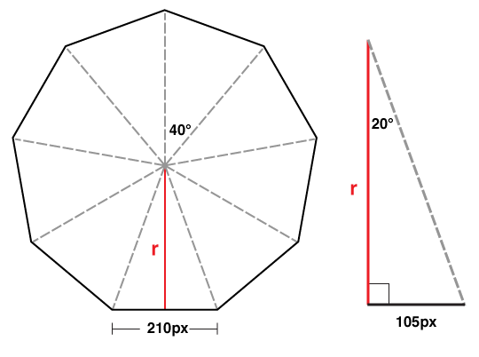

There you have it: the panels need to be translated 288 pixels in 3-D space.

    #carousel figure:nth-child(1) { -webkit-transform: rotateY(0deg) translateZ(288px); }
    #carousel figure:nth-child(2) { -webkit-transform: rotateY(40deg) translateZ(288px); }
    #carousel figure:nth-child(3) { -webkit-transform: rotateY(80deg) translateZ(288px); }
    #carousel figure:nth-child(4) { -webkit-transform: rotateY(120deg) translateZ(288px); }
    #carousel figure:nth-child(5) { -webkit-transform: rotateY(160deg) translateZ(288px); }
    #carousel figure:nth-child(6) { -webkit-transform: rotateY(200deg) translateZ(288px); }
    #carousel figure:nth-child(7) { -webkit-transform: rotateY(240deg) translateZ(288px); }
    #carousel figure:nth-child(8) { -webkit-transform: rotateY(280deg) translateZ(288px); }
    #carousel figure:nth-child(9) { -webkit-transform: rotateY(320deg) translateZ(288px); }

If we decide to change the width of the panel or the number of panels, we only need to plug in those two variables into our equation to get the appropriate translateZ value. In JavaScript terms, that equation would be:

    var tz = Math.round( ( panelSize / 2 ) / Math.tan( ( ( Math.PI * 2 ) / numberOfPanels ) / 2 ) );
    // or simplified to
    var tz = Math.round( ( panelSize / 2 ) / Math.tan( Math.PI / numberOfPanels ) );

Just like our previous 3-D objects, to show any one panel we need only apply the reverse transform on the carousel. Here’s the style to show the fifth panel:

	-webkit-transform: translateZ(-288px) rotateY(-160deg);

在线例子：http://desandro.github.com/3dtransforms/examples/carousel-01.html

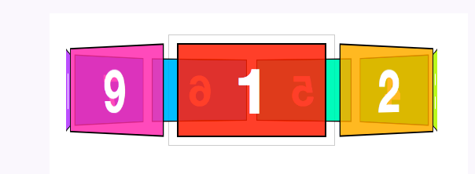

By now, you probably have two thoughts:

1. Rewriting transform styles for each panel looks tedious.
2. Why bother doing high school maths? Aren’t robots supposed to be doing all this work for us?

And you’re absolutely right. The repetitive nature of 3-D objects lends itself to scripting. We can offload all the monotonous transform styles to our dynamic script, which, if done correctly, will be more flexible than the hard-coded version.

在线例子：http://desandro.github.com/3dtransforms/examples/carousel-02-dynamic.html

