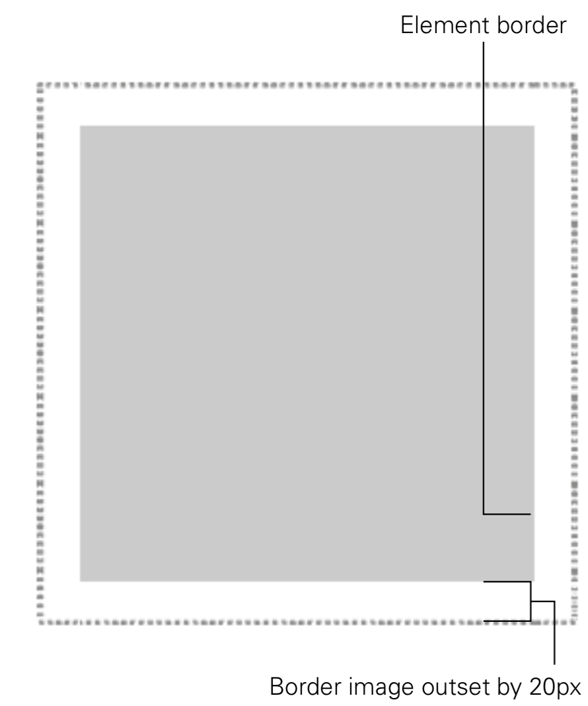

第五部分看的并不是很仔细。

[toc]

## 1. 理解CSS和现代Web

Although graceful degradation starts with modern browsers in mind first and then provides workarounds for older browsers later, progressive enhancement does the oppo- site: it starts with an older browser and then later adds new features for modern browsers.

## 2. 入门

## 3. 选择器

Child combinators are unsupported in Internet Explorer 6.

    aside > h3 {
        font-weight: bold;
    }

在元素之前或之后插入内容。Using `:before` and `:after`, add some quotation marks to the customer testimonials:

    blockquote p:before {
        content: “\201C”;
    }

## 4. 属性值

## 5. 样式

### 属性前缀

- `-webkit-` — Google Chrome and Apple Safari (they use the WebKit Layout Engine)
- `-moz-` — Mozilla Firefox
- `-ms-` — Microsoft Internet Explorer
- `-o-` — Opera

判断是否可用某个属性以及是否需要加前缀，参见 www.caniuse.com。

### 边框

#### border-width

初始值：`medium`。不继承。

For `border-width`, you can specify all values of length as well as the keywords thin, medium, and thick.

#### border-color

不继承。In the CSS2.1 specification, the initial value for `border-color` is the same as that of the `color` property. In CSS3, the initial value is the keyword `currentColor`, which achieves exactly the same—the `border-color` will be the same as the color. 可以显式使用`currentColor`关键字：

    body {
        color: red;
        border-color: currentColor;
    }

Although `currentColor` is a CSS3 keyword and may not work in older browsers, those older browsers will simply ignore it and just apply the same `color` value to the `border-color` property anyway, so it can be safely used across all browsers.

#### border-style

默认值：none。不继承。

The values you can use with the border-style property are `none`, `hidden`, `dotted`,
`dashed`, `solid`, `double`, `groove`, `ridge`, `inset`, and `outset`.

#### border（缩写）

	border: #ccc solid 1px;

分别制定四边。可以用到如

	border-top: #999 dotted 4px;
    border-top-color: #999;

#### border-radius

CSS3属性。初始值：0。不继承。
Applies to: All, except internal table elements when border-collapse is collapse
不加前缀的浏览器支持：IE 9+, Firefox 4+, Chrome 4+, Opera 10.5+, Safari 5+

`border-radius` is shorthand for `border-top-left-radius`, `border-top-right-radius`, `border-bottom-left-radius`, and `border-bottom-right-radius`.

    border-radius: 8px;
    border-radius: 8px 12px 16px 20px;

四个值分别是左上、右上、右下、左下。

角可以不是圆角。制定一个水平半径，一个垂直半径。

	border-top-right-radius: 8px 20px;

If you want this noncircular radius to apply to all corners, you can use the shorthand `border-radius` property, first specifying the four horizontal values, followed by a slash / and then the four vertical values, like so:

	border-radius: 8px 8px 8px 8px / 20px 20px 20px 20px;

Or, because those values are repeating, an even shorter way would be to write

	border-radius: 8px / 20px;

### 边框图片

Google Chrome has good support, Firefox partial, Internet Explorer versions 6–9 have no support at all, and other modern browsers support only the shorthand property `border-image`.

#### border-image-source

CSS3属性。初始值：`none`。不继承。
Applies to: All, except internal table elements when `border-collapse` is collapse
不加前缀的浏览器支持：Firefox 15+, Chrome 15+

	border-image-source: url(“../images/bdr-footer.png”);

`border-image-source`指定边框图像。即使只在一边使用边框图像，图像也要包含四个边。如下图：

#### border-image-slice

CSS3属性。初始值：100%。不继承。
Applies to: All, except internal table elements when `border-collapse` is collapse
不加前缀的浏览器支持：Chrome 15+

图片会被分成9部分：四个角、四个边和一个中心。分割方法取决于`border-image-slice`属性。

	border-image-slice: 4;

The `border-image-slice` property can be given up to four number values. Here, `border- image-slice: 4;` is the same as `border-image-slice: 4 4 4 4;`, the first value being the **top** and then working clockwise from there.

除非使用百分比值，否则`border-image-slice`的值不要加单位。This is because the values represent pixels when using a raster image and co-ordinates when using a vector image (a file ending with a .svg extension).

As shown in Figure 5-6, a `border-image-slice` of 4 will slice the raster image 4px from the edge of the image.

#### border-image-width

CSS3属性。初始值：1。不继承。
Applies to: All, except internal table elements when `border-collapse` is collapse
不加前缀的浏览器支持：Firefox 13+, Chrome 15+

`border-image-width` determines the width of the image applied to the border.

In most cases, you don’t need to specify a border-image-width because its initial value of 1 along with the use of the border-width property is usually adequate. The border already has a width of 4px, which you specified on the #footer element earlier, like so:

    #footer {
        background-color: #ccc;
        background-image: url(“../images/bg-footer.jpg”);
        border-top: #999 dotted 4px;
    }

The `border-image-width` can be either a percentage value (or four percentage values for the top, right, bottom, and left), which causes the border’s width to be a certain percentage of the element it is applied to, or a number (or four numbers for top, right, bottom, and left), which is a multiplication of the calculated `border-width`. If you specify a `border-image-width` of 4, the `border-image-width` is 16px = 4px × 4.

#### border-image-repeat

CSS3属性。初始值：`stretch`。不继承。
Applies to: All, except internal table elements when `border-collapse` is collapse
Unprefixed browser support: Firefox 15+, Chrome 15+

	border-image-repeat: repeat;

This tells the browser to take each of the nine slices and repeat them where necessary .

The Backgrounds and Borders module also describes two other values that can be used: `round` and `space`. Note that at present no browsers support these values. round repeats the image, but if the repeated tile does not fill the area using a whole number of tiles, it rescales the image so it does. space also repeats, but if the tile does not fill the area in the same way, the extra space is distributed around the tiles.

#### border-image-outset

CSS3属性。初始值：0。不继承。
Applies to: All, except internal table elements when `border-collapse` is collapse
Unprefixed browser support: Chrome 15+

Another option for border images is the outset, which specifies how far outside an element the border should be positioned:

	border-image-outset: 20px;

The `border-image-outset` can be any unit of length, and as with values for the other border image properties, you can specify up to four, representing the top, right, bottom, and left borders.

If you’re a fan of math, you can use a multiplication number too, just like the `border-image-width` number, which is a multiplication of the computed `border-width`.

#### border-image（缩写）

Unprefixed browser support: Firefox 15+, Opera 11+
Prefixed browser support: Firefox 3.5+, Chrome 7+, Opera 10.5+, Safari 3+

The shorthand property should take the following syntax:

	border-image: border-image-source border-image-slice border-image-width border-image-outset border-image-repeat

例如：

	-webkit-border-image: url(“../images/bdr-footer.png”) 4 repeat;

#### box-shadow

CSS3属性。初始值：`none`。不继承。
Applies to: All
Unprefixed browser support: IE 9+, Firefox 4+, Chrome 10+, Opera 10.5+, Safari 5.1+ Prefixed browser support: Firefox 3,5+, Chrome 1+, Safari 3+

	box-shadow: 0 3px 8px 0 #ccc;

第一个值表示水平偏移。阴影离右边的距离。负值相对于左边。上面的例子，没有偏移。第二个值是垂直偏移。正值使阴影位于元素下面。负值让阴影位于元素上面。第三个值是阴影的羽化值。The fourth value is the spread distance, which determines how far the shadow should spread on all sides of the element.

You also are able to make box shadows inset so the shadow appears inside the element:

	 box-shadow: -3px 3px 2px 0 #ccc inset;

It’s also possible to add more than one shadow to an element (see Figure 5-11), by separating shadows with a comma:

	box-shadow: 0 3px 8px 0 #ccc, 0 3px 8px 0 red inset;

### 背景

#### background-color

初始值：`transparent`。不继承。Applies to: All

#### background-image

初始值：`none`。不继承。Applies to: All

	background-image: url(“../images/bg-body.jpg”);

#### background-repeat

初始值：`repeat`。不继承。Applies to: All

其他值：`repeat-x`、`repeat-y`、`no-repeat`。

#### background-position

初始值：`0% 0%`。不继承。Applies to: All

两个百分比分别是水平和垂直位置。相对于元素左边和上面。When specifying a background-position value, you can use all the length unit types as described in Chapter 4, percentages, pixels, ems, and so on. You can also use the keywords `left`, `right`, `top`, `bottom`, and `center`.

	background-position: right top;

This declaration is the equivalent of `background-position: 100% 0%`.

If only one of the background-position values is specified, the missing value is assumed to be `center`.

#### background-attachment

初始值：`scroll`。不继承。Applies to: All

如果视口或元素能够滚动，背景图像默认随之滚动。

For example, giving the background image applied to the `<body>` element a declaration of `background-attachment: fixed` causes the background image to remain in place when you scroll the page.

#### 多个背景图片

Browser support: IE 9+, Firefox 3.6+, Chrome 1+, Opera 11+, Safari 1.3+

    background-image: url(“../images/icon-newsletter.png”),
        url(“../images/bg-newsletter.png”);
        background-repeat: no-repeat, repeat;
        background-position: 91% 2%, 0;

#### （未）背景渐变

#### background-clip

CSS3属性。初始值：`border-box`。不继承。Applies to: All
Browser support: IE 9+, Firefox 4+, Chrome 1+, Opera 10.5+, Safari 3+

`background-clip` determines the “painting area” of an element, the area of the element to which a background should be applied. By default, the `background-clip` value is `border-box`, which makes the painting area start from the edges of an element, where the border **starts**.

If you want the painting area to start inside the border, you can apply the following to the #newsletter rule set:

	background-clip: padding-box;

What if you want the painting area to be only the background of the content? In that case, you can use the final `background-clip` value, `content-box`.

Note that if you want to use multiple background images, as with the other background properties, you can separate multiple `background-clip` properties with a comma.

#### background-origin

CSS3属性。初始值：`padding-box`。不继承。Applies to: All
IE 9+, Firefox 4+, Chrome 1+, Opera 10.5+, Safari 3+

#### background-size

CSS3属性。初始值：`auto`。不继承。Applies to: All
Unprefixed browser support: IE 9+
Prefixed browser support: Firefox 3.6+, Chrome 1+, Opera 9.5+, Safari 3+

与`background-position`类似，可以使用所有值类型，包括百分比，像素，em等。百分比相对于背景定位区，这个概念在前面几节引入。

	background-size: 50% 100%;

若使用`background-size: 50%`，第二个值是`auto`。`auto`表示浏览器会自动计算高度以保持图片的长宽比。

You can also use two keyword values: `cover` and `contain`.

`background-size: contain` scales a background image to fit inside the background positioning area, making it as large as possible while respecting the image’s aspect ratio.

`background-size: cover`将图片缩放的最小大小，使得图片两边都覆盖图片定位区。同时保持长宽比。

#### background（缩写）

	background: background-image background-position background-size repeat-style attachment background-origin background-clip background-color

例子：
	background: url(“../images/icon-newsletter.png”) no-repeat 91% 2%,
    	url(“../images/bg-newsletter.png”) repeat 0 #00ACDF;

Finally, although you can have multiple background images, you can have only one background color, so you add `background-color` at the end of the last background layer.

### opacity

CSS3属性。初始值：`1`。不继承！Applies to: All
Browser support: IE 9+, Firefox 1+, Chrome 1+, Opera 9+, Safari 1.2+

The `opacity` property works in all modern browsers except for Internet Explorer versions 6, 7, and 8. However, as with gradients, these older versions of Internet Explorer support a `filter` property that achieves the same effect. For more information about the unofficial filter property, please see msdn.microsoft.com/en-us/library/ie/ms530752(v=vs.85).aspx.

### visibility

初始值：`visible`。继承：是！=Applies to: All

The `visibility` property can be given three values: `visible`, `hidden` and `collapse`.

### cursor

初始值：`auto`。继承：是！Applies to: All

The `cursor` property allows you to change the type of cursor displayed when hovering over an element. The initial value of auto means the user agent stylesheet determines the cursor.

The look of the cursors differs based on the operating system they are being viewed on. The following values can be used: crosshair, default, pointer, move, e-resize, ne-resize, nw-resize, n-resize, se-resize, sw-resize, s-resize, w-resize, text, wait, help, and progress.

If these cursors don’t take your fancy, you can also use the `url()` function (as you did with the background-image property) to use a custom cursor.

### outline（缩写）

Browser support: IE 8+, Firefox 1.5+, Chrome 1+, Opera 7+, Safari 1.2+

outline用于提高可访问性。当用户不能使用鼠标，只能使用键盘进行焦点操作时（如使用Tab键），元素需要有一个outline样式表示当前焦点在哪。

浏览器对数为该属性提供了自己的样式。若想定制，可以使用`outline-color`、`outline-style`和`outline-width`属性。They work in the exact same way as `border- color`, `border-style`, and `border-width`. You can use the shorthand `outline` in the same way as the shorthand `border` too!

可以对`:focus`伪类施加该属性。

### content

CSS3属性。初始值：`auto`。不继承。
应用于：只支持`:before`和`:after`
Browser support: IE 8+, Firefox 2+, Chrome 4+, Opera 9+, Safari 3.1+

## 6. 基本页面结构

### 结构类型

下面这种写法在响应式设计中很常见。让所有图片根据所在容器的宽度缩放。

    img {
        max-width: 100%;
    }

## 7. 空间与盒模型

### margin

初始值：0。不继承。
Applies to: All except elements with table display types other than table-caption, table, and inline-table

You also can use the `auto` keyword to make the browser determine the margin of an element based on the unused space around that element.

### padding

初始值：0。不继承。
Applies to: All except table-row-group, table-header-group, table- footer-group, table-row, table-column-group and table-column

You can’t use the `auto` keyword.

A percentage relative to the overall width of the newsletter box.

    #newsletter {
        ...
        padding: 6%;
    }

由于未设置`width`，默认是`auto`。`width`计算在`padding`之后，因此，得到的`width`是`88%`。The way in which the box model is calculated seems—to me at least—more difficult than it needs to be, and I expand on this issue shortly so it doesn’t catch you out.

### box-sizing

CSS3属性。初始值：`content-box`。不继承。
Applies to: All elements that accept width and height
Unprefixed browser support: IE 8+, Chrome 9+, Opera 7+, Safari 5.1+
Prefixed browser support: Firefox 1+, Chrome 1+, Safari 3+

As yet, **Firefox** does not support the unprefixed `box-sizing` property. If you are using Firefox as your development browser, please use `-moz-box-sizing: border-box;` instead.

Because not all browser vendors have implemented `padding-box`, and the W3C has suggested `padding-box` might be removed from the specification in the future.

## 8. 多列布局

CSS Level 3 sees the introduction of flexbox (www.w3.org/TR/css3-flexbox) and regions (www.w3.org/TR/css3-regions), modules that aim to improve how col- umns and content areas are created on a web page. Unfortunately, both of these mod- ules are in working draft and have little to no support in modern browsers, so they can’t be used on a working website.

### float

初始值：none。不继承。
Applies to: All unless display in none or position is absolute

### clear

初始值：none。不继承。
Applies to: Block-level elements

clear works in tandem with the float property and accepts the values left, right, both, and none.

清除浮动的方法：http://nicolasgallagher.com/micro-clearfix-hack.

## 9. 显示、位置、文档流

### display

初始值：`inline`。不继承。Applies to: All

The `display` property determines the type of box an element generates and has values such as block, inline, inline-block, list-item, none, and quite a few different values relating to the display of tables.

Note that Internet Explorer versions 6 and 7 don’t support `display: inline-block;`. However, they fortunately treat `display: inline;` in the same way that other browsers—that better support the CSS specification—treat `display: inline-block;`.

List items—the `<li>` elements that are placed within either ordered `<ol>` or unordered `<ul>` lists—have the declaration `display: list-item;` by default. When an element is a list-item, it generates a block box and a marker box—if that element has a visual representation of being a list item in the form of a bullet point or other graphical element.

### 定位

IE6不支持`position: fixed;`。多数手机浏览器也不支持`position: fixed;`。

### vertical-align与垂直居中技术

`vertical-align`实际只对内联元素和表格单元格有效。

**vertical-align**
初始值：`baseline`。不继承。
Applies to: inline-level and table-cell elements

`vertical-align`取值：

- The initial value for vertical-align is baseline, meaning the bottom of the speech bubble image vertically aligns with the baseline of the title.
- `middle` — Aligns the vertical midpoint of the inline element with the baseline and half of the x-height (the height of the lowercase x character). 在下图中，note that because the speech bubble image is 15 px tall, the browser doesn’t quite perfectly center the image.
- `sub` —Lowers the baseline of the inline element to meet the position for subscripts ``.
- super — Raises the baseline of the inline element to meet the position for superscripts ``.
- `text-top` — Aligns the top of the inline element with the top of the text.
- `text-bottom` — Aligns the bottom of the inline element with the bottom of the text.

If none of those values take your fancy and you want a little more control, you can also specify a unit of length or a percentage where 0 represents the same as baseline. A positive number raises the inline-level or table-cell element above the baseline, and a negative number lowers it.

> The `position: center;` declaration introduced in the CSS Level 3 Positioned layout module found at www.w3.org/TR/css3-positioning/ will, I hope, see the light of day and make vertical alignment easier in the future.

If you can’t go to the party, you can bring the party to you. You can use vertical-align only oninline-level and table-cell elements, so cheat and use `display: table-cell;` as follows:

    .button-cell {
        display: table-cell;
        vertical-align: middle;
        width: 148px;
    }

When you use `display: table-cell;` on an element, that element must be con tained in a table (or an element mimicking a table with the declaration `display: table;`).

Furthermore, `display: table-cell;` doesn’t work in Internet Explorer versions 6 and 7.

另一种居中技术，令top为50%。然后设置负margin为元素高度的一半：

	top: 50%;
    font-size: 1.6em;
    right: 2.1875em;
    margin-top: -26px;

### overflow

初始值：`visible`。不继承。Applies to: block elements

## 10. 字体

### font-family和字体栈

The CSS specification defines five generic font names to act as fallbacks: serif, sans-serif, cursive, fantasy, and monospace. These fallbacks don’t necessarily represent a specific font but should express particular characteristics.

- Serif — Characters tend to have finishing strokes, flared or tapering ends, or actual serifed endings.
- Sans-serif — Characters tend to have stroke endings that are plain.
- Cursive — Characters have either joining strokes or other cursive characteristics, resulting in a handwritten look.
- Fantasy — Characters are primarily decorative but still contain representations of characters.
- Monospace — All characters have the same fixed width, similar to a manual typewriter and often used to set samples of computer code.

font-family
初始值：取决于浏览器。继承：是！

### @font-face

Browser support: IE 4+, Firefox 3.5+, Chrome 4+, Opera 10+, Safari 3.1+

@font-face is a rule set of its own rather than a property, which allows you to specify a font to be downloaded from a particular source. Although @font-face appears only in the CSS3 Fonts module (www.w3.org/TR/css3-fonts/), it was actually a feature first implemented by Microsoft in Internet Explorer 4. This is good news, though; it means every browser in use today supports @font-face, but it isn’t without its caveats.

Fonts come in the following formats:
• .ttf (TrueType Font)
• .otf (OpenType Font)
• .eot (Embedded OpenType)
• .woff (Web Open Font Format)
• .svg (Scalable Vector Graphics)

When Internet Explorer 4 implemented @font-face, it supported only the **.eot** format, and the situation remained that way up to Internet Explorer 8. Because the .eot format is proprietary, belonging to Microsoft, no other browser supports it. The only format to be supported by all other browsers (including Internet Explorer 9) is **.woff**. So, when using @font-face, you should aim to have .eot and .woff formats of the same font.

If you have only one font type, numerous tools available online take that one format and convert it into the rest for you. My personal recommendation is Font Squirrel’s @font-face Generator, found at www.fontsquirrel.com/fontface/generator.

    @font-face {
        font-family: Average;
        src: url(“../fonts/Average-Regular.eot”);
        src: local(“Average”),
            url(“../fonts/Average-Regular.woff”);
    }

上述声明只是让浏览器知道字体名和它的位置，via the `src` declaration. Due to Internet Explorer 6, 7, and 8 supporting only .eot font formats; you specify two src properties. Internet Explorer 6, 7, and 8 read and apply the first property, but because they don’t understand the syntax of the second, they ignore it.

The second `src` property consists of two functions: `local()` and `url()`. By placing the local() function first, you tell the browser (those which aren’t Internet Explorer versions below 9) to check to see whether the device already has the font saved locally, and if not, to download it from the source specified in the url().

At a minimum, the `@font-face` rule must include `font-family` and `src` declarations; otherwise, it is ignored.

In the body rule set, modify the font-family declaration:

    font-family: Average, Georgia, serif;

## 11. 字体和文本样式

### 字体

#### font-style

初始值：normal。继承：是！

By using the `font-style` property, you can change the style of a font between `normal`, `italic`, and `oblique`. Fonts often have various styles, such as oblique and italic. 这两种样式都是斜的；但`oblique`是正常样式的拉伸版，`italic`自己是一种新样式，generally cursive in nature.

Assuming you declare a font-style of italic, a browser looks to see whether an italic version of a font is available. If not, it looks for an oblique version, and if that doesn’t exist either, the browser renders the normal style of font with a sloping transformation applied—making an oblique style.

#### font-variant

初始值：`normal`。继承：是！

The font-variant property simply takes the values `normal` or `small-caps`. When you set the value to small-caps, the font is changed to a variant that uses small-caps, meaning the lowercase letters look similar to the upper- case letters but with smaller proportions.

#### font-weight

初始值：`normal`。继承：是！

You can use these four keyword values: `normal`, `bold`, `bolder`, and `lighter`. You can also use the values `100` to `900` in 100-point increments that commonly correspond to these weight names:

• 100—Thin
• 200—Extra Light (Ultra Light)
• 300—Light
• 400—Normal (equivalent of the normal keyword)
• 500—Medium
• 600—Semi Bold (Demi Bold)
• 700—Bold (equivalent of the bold keyword)
• 800—Extra Bold (Ultra Bold)
• 900—Black (Heavy)

By using the bolder and lighter keywords, you declare the weight of the font should be bolder or lighter than the **inherited value**.

You will find that very few fonts support the complete range of weights; in this case, the browser uses the nearest weight to the one you specified.

#### font-size

初始值：`medium`。继承：是！

`font-size` can be changed using a series of keywords: xx-small, x-small, small, medium, large, x-large, and xx-large. Likewise, you can use the keywords `larger` and `smaller` to increase or decrease the font size relative to an element’s **inherited** font-size.

使用百分比值时，字体大小相对于父元素的字体大小，即相对于继承的字体大小。

Relative units are those such as em and ex. On the modern web, ems are the suggested unit for `font-size`. Much like percentages, font sizes that use relative units are calculated rela- tive to the parent element’s font size and can easily be scaled where necessary.

When you specify a font-size using percentages or ems, 1 em is the equivalent of 100%, 0.5 em is the equivalent of 50%, and so on. Ems and percentages work in the exact same way when applied to font-size. However, when used on other properties such as padding and margin, they differ.

Ems are always relative to an element’s font-size, whereas percentages are relative to another value, such as the height and width dimensions of an element.

#### line-height

初始值：`normal`。继承：是！

`line-height` specifies the minimal height of a line of text within an element. The initial value of `normal` means the line-height is the same value as the `font-size`. You also can specify a unit of length, percentage, or number. A number value is a multiplication of an element’s font size.

	line-height: 1.4em;

You can achieve the same effect by using the declarations `line-height: 140%;` or `line-height: 1.4;`.

#### font（缩写）

	font: font-style font-variant font-weight font-size/line-height font-family;

`font-size`和`font-family`是必须制定的。When specifying font-size and line-height, you separate the two with a forward slash (/).

### 文本样式

#### color

初始值：取决于浏览器。继承：是！

#### text-decoration

初始值：`none`。不继承。

The `text-decoration` property allows you to change the line decoration applied to text. You can use the values underline, overline, and line-through. The CSS2.1 specification also describes the value blink, but due to the accessibility concerns blinking text raises, the CSS3 Text module no longer lists this value and browsers do not support it.

The CSS3 Text module (www.w3.org/TR/css3-text/) shows that the `text-decoration` property will eventually become a shorthand for the properties `text-decoration-line`, which takes the same values as the current `text-decoration` (underline, overline, and line-through); `text-decoration-color`, which lets you change the color of the line; and `text-decoration-style`, which lets you change the style of the line to either solid, double, dotted, dashed, or wavy. However, only Mozilla Firefox version 6 and onward support these properties by adding the `–moz` prefix to each property. Until these properties get better support in browsers, you can only safely use text-decoration, which decorates text with a solid line the same color as the text.

#### text-transform

初始值：`none`。不继承。

text-transform takes the following values:
• none—Do not transform the text.
• uppercase—Change all the text to uppercase (capital letters).
• lowercase—Change all the text to lowercase.
• capitalize—Change the first letter of each word to uppercase.

#### text-shadow

CSS3属性。初始值：none。继承：是！
不加前缀支持：IE 10+, Firefox 3.5+, Chrome 2.1+, Opera 9.5+, Safari 1.1+

	text-shadow: 2px 2px 1px rgba(0, 0, 0, 0.2);

`text-shadow`取值：

- 第一个值表示水平偏移：阴影相对于文本右边的偏移，负值相对于左边。
- 第二个值表示垂直偏移。正值相对于底边，负值相对于顶边。
- 第三个值是羽化。若不指定，则没有羽化。
- 最后是可选的颜色值，默认为黑色。

As with box-shadow, you can use multiple shadows on text by separating each shadow with a comma:

	text-shadow: 2px 2px 1px rgba(0, 0, 0, 0.2),
                 4px 4px 2px rgba(0, 0, 0, 0.1);

#### letter-spacing

初始值：`normal`。继承：是！

The `letter-spacing` property allows you to control the amount of space between each individual character with the initial value of normal being the default amount.

	letter-spacing: 2px;

#### word-spacing

初始值：`normal`。继承：是！

Just like `letter-spacing`, the `word-spacing` property enables you to change the spacing between words. The initial value of normal represents the default space between words, and you can specify a length value to adjust this space as you see fit.

#### direction

初始值：`ltr`。继承：是！

The direction property determines the direction of text. The initial value ltr means left to right. The value rtl (right to left) can be used for Hebrew and Arabic text. Note however, that specifying the direction of text is normally done in the HTML using the dir attribute.

#### text-align

初始值：`start`。继承：是！

By using text-align, you can align content to the left, right, or center of its parent; in addition, you can make that content justified, meaning flush to both sides of the parent. The CSS2.1 specification describes the values `left`, `right`, `center`, and `justify` to be used with `text-align` and an initial “nameless” value that acts as left if the direction of text is left to right or right if the text direction is right to left (for languages such as Arabic and Hebrew).

For the sake of completeness CSS Level 3 introduces two new values, `start` and `end`, with start replacing the “nameless” initial value of text-align. start and end achieve the exact same results as `left` and `right` but make more sense when used in conjunction with differing directions of text, start being whatever side the text starts from and end being the opposite. However, `start` and `end` are currently supported only in Firefox, Chrome, and Safari. Until support improves, it’s best just to work with the CSS2.1 values: left, right, center, and justify.

#### text-indent

初始值：`0`。继承：是！

利用`text-indent`向文本第一行添加缩进。可以使用长度单位，如像素和em。百分比相对于容器的宽度。

#### white-space

初始值：`normal`。继承：是！

The `white-space` property determines how white space inside an element is handled.

With white-space set to its initial value of normal, white space is collapsed (meaning any space within this HTML does not take effect), and lines are wrapped (broken and pushed onto a new line) where necessary to fill the containing element.

You also can use the following values with white-space:

- `pre`：空格不收起，仅当在HTML中换行的地方才换行。
- `nowrap`：空格处理与`normal`一样，但行不自动换行。
- `pre-wrap`：空格不收起，但行按需换行，或在HTML换行处换行。
- `pre-line`：空格收起，但行按需换行，或在HTML换行处换行。

#### overflow-wrap和word-wrap

CSS3属性。初始值：`normal`。继承：是！

`word-wrap` is another of those properties that was introduced by Microsoft and was later added to the CSS3 specification. It has undergone a little bit of a makeover in the CSS3 Text module (www.w3.org/TR/css3-text/#overflow-wrap) and now has the new name `overflow-wrap`. However, because only CSS3 supporting browsers recognize `overflow-wrap`, you should use `word-wrap`, which both modern browsers and Internet Explorer versions 6, 7, and 8 support.

The initial value of `normal` means lines of text may break only between words. Usually, this is fine, but if a word is longer than the element it is contained within, it will overflow rather than break. Where this effect is undesirable, you can use the value `break-word` to force a word to break and wrap onto a new line instead.

### 列表样式

#### list-style-type

初始值：`disc`。继承：是！
作用于：`display: list-item`的元素。

The `list-style-type` property specifies the appearance of list item markers. When you declare `none`, a list has no markers.

You can use the following values to mark list items with glyphs: `disc`、`circle`、`square`。

The following values can be used to mark list items with numbers:
 decimal—Decimal numbers, beginning with 1
 decimal-leading-zero—Decimal numbers padded by initial zeros
 lower-roman—Lowercase Roman numerals
 upper-roman—Uppercase Roman numerals
 georgian—Traditional Georgian numbering
 armenian—Traditional uppercase Armenian numbering

The following values can be used to mark list items with alphabetic systems:
 lower-latin or lower-alpha—Lowercase ASCII letters
 upper-latin or upper-alpha—Uppercase ASCII letters
 lower-greek—Lowercase classical Greek alphabet

#### list-style-image

初始值：`none`。继承：是！作用于：`display: list-item`的元素。

If none of the list-style-type markers takes your fancy, you can use your own image as a marker using the `list-style-image` property and declaring a `url()` function as its value:

	list-style-image: url(“../images/check.png”);

Although a marker image takes the place of a basic marker determined by the `list-style-type`, it’s wise to specify a `list-style-type` along with a `list-style-image` just in case the browser can’t get the image.

#### list-style-position

初始值：`outside`。继承：是！作用于：`display: list-item`的元素。

`outside`和`inside`的区别：

#### list-style（缩写）

	list-style: list-style-type list-style-position list-style-image

## 12. 2D变换

### transform

The transform property also accepts the matrix() function, which allows for complex transformations. Because this is an advanced feature, it is not demonstrated in CSS3 Foundations, but if you want to learn more, I recommend reading Opera’s article, “Understanding the CSS Transforms Matrix,” available at http://dev.opera.com/ articles/view/understanding-the-css-transforms-matrix/.

### transform-origin

CSS3属性。初始值：`50% 50%`。不继承。
Unprefixed browser support: IE 10+, Firefox 16+, Opera 12.5+
Prefixed browser support: IE 9+, Firefox 3.5+, Chrome 12+, Opera 10.5+, Safari 3.1+

## 13. 3D变换

### perspective

CSS3属性。初始值：`none`。不继承。
Applies to: All elements with a display declaration relating to block, inline or table
Unprefixed browser support: IE 10+, Firefox 16+
Prefixed browser support: Firefox 10+, Chrome 12+, Safari 4+

Think of the `perspective` as being how far the viewer is from an object. You can give `perspective` any unit of length as a value.
`perspective`的值越小，视觉冲击越大，因为用户离屏幕上的元素越近。

### perspective-origin

CSS3属性。初始值：`50% 50%`。不继承。Applies to: All elements with a display declaration relating to block, inline or table
Unprefixed browser support: IE 10+, Firefox 16+
Prefixed browser support: Firefox 10+, Chrome 12+, Safari 4+

`perspective-origin` determines the appearance of the viewer’s position. The initial value of 50% 50% means the viewer will see a 3D element as if that viewer is looking at it straight on. The X and Y position will be in the middle.

`perspective-origin` takes two values, the X and Y positions, and can be given any length value; a percentage; or the keywords left, center, right, top, and bottom. A percentage value of `0% 0%` is the equivalent of left top, `100% 100%` is right bottom, and so on. If only one value is given, the second is assumed to be center.

### 3D变换函数

translateZ() 和 translate3d()
rotateX(), rotateY(), rotateZ(), and rotate3d()
scaleZ() and scale3d()

### transform-style

初始值：`flat`。不继承。
Applies to: All elements with a display declaration relating to block, inline or table
Unprefixed browser support: IE 10+, Firefox 16+
Prefixed browser support: Firefox 10+, Chrome 12+, Safari 4+

3D变换默认只影响直接后代（`flat`）。要想对所有后台生效，使用`transform-style: preserve-3d;`。

### backface-visibility

CSS3属性。初始值：`visible`。不继承。
Applies to: All elements with a display declaration relating to block, inline or table
Unprefixed browser support: IE 10+, Firefox 16+
Prefixed browser support: Firefox 10+, Chrome 12+, Safari 4+

