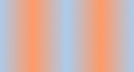
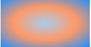
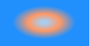
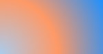

## CSS3渐变

http://www.w3cplus.com/node/44

CSS3 Gradient分为linear-gradient(线性渐变)和radial-gradient(径向渐变)。而我们今天主要是针对线性渐变来剖析其具体的用法。

### CSS3的线性渐变

#### Mozilla和Opera下

	-moz-linear-gradient( [<point> || <angle>,]? <stop>, <stop> [, <stop>]* )
	-o-linear-gradient([<point> || <angle>,]? <stop>, <stop> [, <stop>]);

其共有三个参数，第一个参数表示线性渐变的方向，top是从上到下、left是从左到右，如果定义成left top，那就是从左上角到右下角。还可以使用像素单位或百分比单位；水平方向可以使用使用left/center/right，在垂直方向上可以使用top/center/bottom。如果你不指定水平或垂直位置，它将默认为center。

第二个和第三个参数分别是起点颜色和终点颜色。你还可以在它们之间插入更多的参数，表示多种颜色的渐变。

例子：

	

    .example {
    	width: 150px;
        height: 80px;
    }

    .example1 {
       background: -moz-linear-gradient(top,#ccc,#000);
    }

#### 线性渐变在Webkit下的应用

最新发布书写语法

	-webkit-linear-gradient( [<point> || <angle>,]? <stop>, <stop> [, <stop>]* )

老式语法书写规则

	-webkit-gradient(<type>, <point> [, <radius>]?, <point> [, <radius>]? [, <stop>]*)

其中，type表示渐变类型，可以是linear（线性渐变）或者radial（径向渐变）。第二个参数和第三个参数，都是一对值，分别表示渐变起点和终点。这对值可以用坐标形式表示，也可以用关键值表示，比如 left top（左上角）和left bottom（左下角）。第四个和第五个参数，分别是两个color-stop函数。color-stop函数接受两个参数，第一个表示渐变的位置，0为起点，0.5为中点，1为结束点；第二个表示该点的颜色。

老式写法的例子：

	background: -webkit-gradient(linear, center top, center bottom, from(#ccc), to(#000));

新式写法的例子：

	-webkit-linear-gradient(top, #ccc, #000);

#### 线性渐变在IE下

	filter: progid:DXImageTransform.Microsoft.gradient(GradientType=0, startColorstr=#1471da, endColorstr=#1C85FB);/*IE<9>*/
    -ms-filter: "progid:DXImageTransform.Microsoft.gradient (GradientType=0, startColorstr=#1471da, endColorstr=#1C85FB)";/*IE8+*/

IE依靠滤镜实现渐变。startColorstr表示起点的颜色，endColorstr表示终点颜色。GradientType表示渐变类型，0为缺省值，表示垂直渐变，1表示水平渐变。

### 例子

从上到下：

    background: -moz-linear-gradient(top, #ace, #f96);
    background: -webkit-gradient(linear,top,from(#ace),to(#f96));
    background: -webkit-linear-gradient(top, #ace, #f96);
    background: -o-linear-gradient(top, #ace, #f96);

从左到右

    background: -moz-linear-gradient(left, #ace, #f96);
    background: -webkit-linear-gradient(left, #ace, #f96);
    background: -o-linear-gradient(left, #ace, #f96);

从左上角：

    background: -moz-linear-gradient(left top, #ace, #f96);
    background: -webkit-linear-gradient(left top, #ace, #f96);
    background: -o-linear-gradient(left top, #ace, #f96);

多个渐变色：

    background: -moz-linear-gradient(left, #ace, #f96, #ace, #f96, #ace);
    background: -webkit-gradient(linear, left top, right top, from(#ace), color-stop(0.25, #f96), color-stop(0.5, #ace), color-stop(0.75, #f96), to(#ace));
    background: -webkit-linear-gradient(left, #ace, #f96, #ace, #f96, #ace);
    background: -o-linear-gradient(left, #ace, #f96, #ace, #f96, #ace);

同时指定颜色位置（称为stop0：

     background: -moz-linear-gradient(left, #ace, #f96 5%, #ace, #f96 95%, #ace);
     background: -webkit-gradient(linear, left top, right top, from(#ace), color-stop(0.05, #f96), color-stop(0.5, #ace), color-stop(0.95, #f96), to(#ace)
     background: -webkit-linear-gradient(left, #ace, #f96 5%, #ace, #f96 95%, #ace);
     background: -o-linear-gradient(left, #ace, #f96 5%, #ace, #f96 95%, #ace);

### 角度

正如上面看到的示例，如果您不指定一个角度，它会根据起始位置自动定义。如果你想更多的控制渐变的方向，您不妨设置角度试试。例如，下面的两个渐变具有相同的起点left center，但是加上一个30度的角度。当指定的角度，请记住，它是一个由水平线与渐变线产生的的角度，逆时针方向。因此，使用0deg将产生一个左到右横向梯度，而90度将创建一个从底部到顶部的垂直渐变。

没有角度的示例代码：

    background: -moz-linear-gradient(left, #ace, #f96);
    background: -webkit-linear-gradient(left,#ace,#f96);
    background: -o-linear-gradient(left, #ace, #f96);

加上30度的角度代码：

    background: -moz-linear-gradient(left 30deg, #ace, #f96);
    background: -webkit-gradient(linear, 0 0, 100% 100%, from(#ace),to(#f96));
    background: -o-linear-gradient(30deg, #ace, #f96);

除了起始位置和角度，你应该指定起止颜色。起止颜色是沿着渐变线，将会在指定位置（以百分比或长度设定）含有指定颜色的点。色彩的起止数是无限的。如果您使用一个百分比位置，0％代表起点和100％是终点，但区域外的值可以被用来达到预期的效果。 这也是通过CSS3 Gradient制作渐变的一个关键所在，其直接影响了你的设计效果。

### 透明度变换

透明渐变。这对于制作一些特殊的效果是相当有用的，例如，当堆叠多个背景时。这里是两个背景的结合：一张图片，一个白色到透明的线性渐变。

    background: -moz-linear-gradient(right, rgba(255,255,255,0), rgba(255,255,255,1)), url(http://demos.hacks.mozilla.org/openweb/resources/images/patterns/flowers-pattern.jpg);
    background: -webkit-linear-gradient(right, rgba(255,255,255,0), rgba(255,255,255,1)), url(http://demos.hacks.mozilla.org/openweb/resources/images/patterns/flowers-pattern.jpg);
    background: -o-linear-gradient(right, rgba(255,255,255,0), rgba(255,255,255,1)), url(http://demos.hacks.mozilla.org/openweb/resources/images/patterns/flowers-pattern.jpg);

### 径向渐变

CSS3的径向渐变和其线性渐变是很相似的。我们首先来看其语法：

    -moz-radial-gradient([<bg-position> || <angle>,]? [<shape> || <size>,]? <color-stop>, <color-stop>[, <color-stop>]*);
    -webkit-radial-gradient([<bg-position> || <angle>,]? [<shape> || <size>,]? <color-stop>, <color-stop>[, <color-stop>]*);

除了您已经在线性渐变中看到的起始位置，方向，和颜色，径向梯度允许你指定渐变的形状（圆形或椭圆形）和大小（最近端，最近角，最远端，最远角，包含或覆盖 (closest-side, closest-corner, farthest-side, farthest-corner, contain or cover)）。 颜色起止(Color stops)：就像用线性渐变，你应该沿着渐变线定义渐变的起止颜色。下面为了更好的理解其具体的用法，我们主要通过不同的示例来对比CSS3径向渐变的具体用法。

    background: -moz-radial-gradient(#ace, #f96, #1E90FF);
    background: -webkit-radial-gradient(#ace, #f96, #1E90FF);

    background: -moz-radial-gradient(#ace 5%, #f96 25%, #1E90FF 50%);
    background: -webkit-radial-gradient(#ace 5%, #f96 25%, #1E90FF 50%);

    background: -moz-radial-gradient(bottom left, circle, #ace, #f96, #1E90FF);
    background: -webkit-radial-gradient(bottom left, circle, #ace, #f96, #1E90FF);

    background: -moz-radial-gradient(bottom left, ellipse, #ace, #f96, #1E90FF);
    background: -webkit-radial-gradient(bottom left, ellipse, #ace, #f96, #1E90FF);

