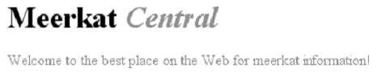

[toc]

## 3. 结构和层叠

继承（Inheritance）是从一个元素向其后代元素传递属性值所采用的机制。确定应当向一个元素应用哪些值时，浏览器不仅要考虑继承，还要考虑声明的特殊性和声明本身的来源。这个过程称为层叠（cascade）。

### 3.1 特殊性

如果多个选择符匹配相同元素，谁胜出？例如下面三组选择符，组内两个选择符选择相同元素。

	h1 {color: red;}
	body h1 {color: green;}

	h2.grape {color: purple;}
	h2 {color: silver;}

	html > body table tr[id="totals"] td ul > li {color: maroon;}
	li#answer {color: navy;}

特殊性高的胜出。特殊性由四个值构成。

- 选择符中指定id属性：0,1,0,0.
- 类选择符、属性选择符、伪类选择符：0,0,1,0.
- 元素和伪元素选择符：0,0,0,1。
- 结合符（Combinators）和通用选择符（universal selector）不对特殊性有任何贡献：0,0,0,0。

例子：

	h1 {color: red;}  /* specificity = 0,0,0,1 */
	p em {color: purple;}  /* specificity = 0,0,0,2 */
	.grape {color: purple;}  /* specificity = 0,0,1,0 */
	*.bright {color: yellow;}  /* specificity = 0,0,1,0 */
	p.bright em.dark {color: maroon;}  /* specificity = 0,0,2,2 */
	#id216 {color: blue;}  /* specificity = 0,1,0,0 */
	div#sidebar *[href] {color: silver;}  /* specificity = 0,1,1,1 */

**声明和特殊性**

若一条规则涉及多个属性，会分解成独立的规则，具有相同的特殊性。如

	h1 {color: silver; background: black;}

会分解成两条：

	h1 {color: silver;}
	h1 {background: black;}

**ID和属性选择器的特殊性**

id选择符和包含id的属性选择符的特殊性不同：

	#meadow {color: green;}  /* 0,1,0,0 */
	*[id="meadow"] {color: red;}  /* 0,0,1,0 */

__内联样式特殊性__

内联样式的特殊性为1,0,0,0。

为内联样式声明保留一位，是CSS2.1才新增的。但在CSS2中，内联样式声明的特殊性是1,0,0（CSS2特殊性包含3个值而非4个）。即在CSS2中它与ID选择器的特殊性相同，所以ID选择器很容易覆盖内联样式。

__!important__

`!important`放在分号前，只作用于一个属性。

	p.dark {color: #333 !important; background: white;}

若想作用多个属性，需要分别加。

	p.dark {color: #333 !important; background: white !important;}

重要声明与非重要声明是分开的两组。重要声明比非重要声明优先。重要声明的冲突会在重要声明__内部__解决。非重要声明的冲突通过特殊性解决。

### 3.2 继承

有些属性会被后代继承，有些不会，如大多数框模型属性（包括外边距、内边距、背景、边框）都不能继承。

继承的值没有特殊性，甚至连0特殊性都没有。**0特殊性比没有特殊性要强**。

	* {color: gray;}
	h1#page-title {color: black;}

	<h1 id="page-title">Meerkat <em>Central</em></h1>
	

	Welcome to the best place on the web for meerkat information!
	

斜体是灰色的，原因是通配选择符作用于它。

通配选择符的0特殊性有一种短路效果｛｛阻止继承｝｝。

### 3.3 层叠

CSS 2.1的层叠规则：

1. 按显式权重对所有声明排序。`!important`的权重最高。按来源排序。共有三种来源：创作人员（author）、读者（reader）、浏览器（user agent）。
2. 按特殊性排序。特殊性高的权重高。
3. 按出现顺序排序。后面的覆盖前面的。如果样式表中有导入的样式表，一般认为导入样式表的声明在前，主样式表的声明在后。

按权重和来源排序。5级权重：

1、读者的重要声明
2、创作人员的重要声明
3、创作人员的正常声明
4、读者的正常声明
5、浏览器声明

由于顺序问题，推荐按以下顺序声明链接样式。一般建议按`LVHA`顺序声明：

	:link {color: blue;}
	:visited {color: purple;}
	:hover {color: red;}
	:active {color: orange;}

它们的权重相同，因此按出现顺序排序。

如果按下面的顺序：

	:active {color: orange;}
	:hover {color: red;}
	:link {color: blue;}
	:visited {color: purple;}

按照这种顺序，任何链接都不会显示:hover或:active样式。所有链接要么是已访问的要么是未访问的。所以:link和:visited样式总会覆盖:hover规则。

