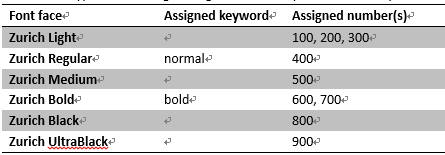
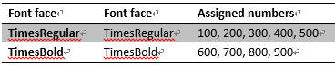
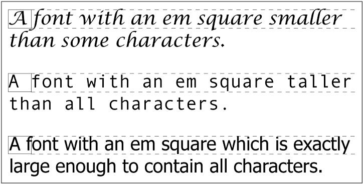
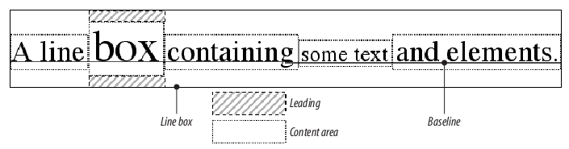
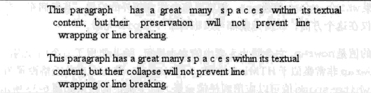
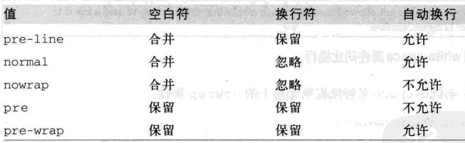

[toc]

## 5 字体

字体会被继承。

### 5.1 字体集

Times实际是一个字体集（font family），而不是单个字体。它包含TimesRegular, TimesBold, TimesItalic, TimesOblique, TimesBoldItalic, TimesBoldOblique等多个字体。Times的每个字体变形都是一个具体的**字体风格（font face）**。

除了具体的字体集（如Times, Verdana, Helvetica, or Arial），CSS定义了5个通用的字体集：

- Serif。成比例。如果字体中所有字符根据其不同大小有不同的宽度，则称该字体是成比例的。有衬线。代表字体：Times, Georgia, New Century Schoolbook。
- Sans–serif。成比例。无衬线。代表字体：Helvetica, Geneva, Verdana, Arial, Univers。
- Monospace。等宽字体。代表字体有：Courier, Courier New, Andale Mono。
- Cursive。手写字体。代表字体有Zapf Chancery, Author, Comic Sans。

理论上用户的任何字体都会落入上述某种通用系列中。

例子，在`font-family`中使用通用字体集，如`sans-serif`，而不关心具体是哪一种：

	body {font-family: sans-serif;}

使用特定字体的例子：

	h1 {font-family: Georgia;}

若指定字体找不到，将用浏览器默认字体。

更好的方式是具体字体集，再附加一个通用字体系列：

	h1 {font-family: Georgia, serif;}

多个字体用逗号分隔。

字体名如果有空格，或包含#或$之类的符号，要加**引号**（单引号或双引号均可）。

### 5.2 加粗（weight）

`font-weight`。继承：是！初始值：normal。取值：normal| bold| bolder| lighter | 100 | 200 | 300 | 400 | 500 | 600 | 700 | 800 | 900 | inherit

CSS加粗有**9级**加粗度。值分别为100到900。OpenType也有9级梯度。如果一个字体内置了这些加粗级别，那边数字就直接映射到预定义级别。

调整粗细后，字体看起来到底能不能变粗或变细。取决于字体集（Family）中是否有与`font-weight`对应的字体（Font Face）。例如，若字体是Times，当指定`b {font-weight: bold;}`时，会使用某种“加粗变形”的字体（Font face）显示：TimesBold。

CSS规范为规定这9级加粗的级别，只是要求每个数字至少与前一个数字加粗度相同。如100、200、300、400可能都映射到相同的粗细。

数字一般有等价的变形名。400等价于normal，700等价于bold。

如果字体系列中定义的加粗度小于9种，使用下面规则填补“空白”：

- 若未指定500的加粗度，与400相同。
- 若未指定300的加粗度，则用下一个比400更细的级别，如果没有这样一个级别，使用400的级别。200和100也适用这种情况。
- 如果未指定600的加粗度，则用下一个比400更粗的变形。若没有这样一个级别，使用500的级别。700、800、900也适用这种情况。

例子：

img/

将`font–weight`设置为bolder，根据从父元素继承的值，选择下一个更大的数。{{即，border和lighter相对于父元素。}}

### 5.3 字体大小

字体本身有一个em方框，它是没有行间距时字体基线间的距离。字体的高度可能超过这个框。`font–size`指定的是这个框的大小。

百分数值总是基于从父元素继承的大小来计算。`em`等价于百分数。对于字体大小1em等于100%。

例子：

	p {font-size: 12px;}
	em {font-size: 120%;}
	strong {font-size: 135%;}

	
This paragraph contains both<em>emphasis and <strong>strong
	emphasis</strong></em>, both of which are larger than the paragraph text. 

	
 12px <em>14.4px <strong> 19.44px </strong></em> 12px  

则strong元素的字体大小为：

	12 px × 120% × 135% = 19.44px (possibly rounded to 19px)

不过很多浏览器会做取整处理（跟连乘的结果不同）：

	12px × 120% = 14.4px [14.4px ≈ 14px]
	14px × 135% = 18.9px [18.9px ≈ 19px]

### 5.4 风格和变形

`font-style`。继承：是！初始值：`normal`。取值：italic | oblique | normal | inherit

`italic`和`oblique`完全不同。italic是一种单独的字体风格。oblique是对正常竖直文本做倾斜。标为Italic, Cursive和Kursiv的字体总是映射到italic关键字，而oblique总是对应到标为Oblique, Slanted和Incline的字体。

实际中的字体很少同时有italic和oblique版本。即便同时有，浏览器也很少能区别开。

如果没有italic字体，但有oblique字体，则在需要前者的地方使用后者。若反过来，则在需要oblique的地方浏览器根据竖直字体计算一个倾斜版本。

**字体变形**

`font-variant`。继承：是！初始值：`normal`。取值：small-caps | normal | inherit

small–caps是小型大写字母。他们是高度不同的大写字母。

### 5.5 拉伸和调整

`font–stretch`和`font–size–adjust`已从CSS2.1除去：很少有浏览器实现它们。

### 5.6 复合属性font

	font
	值：[[ <font-style> || <font-variant> || <font-weight> ]? <font-size> [ / <line-height> ]? <font-family>] | caption  | icon | menu | message-box | small-caption | status-bar | inherit
	继承：是
	Percentages: Calculated with respect to the parent element for <font-size> and with respect to the element’s <font-size> for <line-height>
	Computed value: See individual properties ( font-style, etc.)

**系统字体**：

- caption：有标题的控件，如按钮。
- icon：对于图标加标签。
- menu：菜单。
- message–box：对话框。
- small–caption：小控件标签。
- status–bar：窗口状态条。

## 6 文本属性

### 6.1 缩进和水平对齐

#### 缩进

`text-indent`：继承：是！初始值：0。百分比：相对于包含块的宽度。**适用于：块级元素**。取值：`<length> | <percentage> |inherit`。

例子：

	p {text-indent: -4em;}

**只能对块级元素使用**。`text–indent`不能对内联元素或可替换元素使用。

`text–indent`还可以接受负值，形成悬挂缩进。

百分数相对于缩进元素的父元素的宽度。

即使插入了行分隔符，也只缩进元素的第一行。｛｛div或p中若有` `则` `后的新行不会缩进。｝｝

#### 水平对齐

`text-align`：继承：是！适用于：**块级元素**。取值：`left | center | right | justify | inherit`。

`text–align`**只能用于块级元素**。

若使用justify，由浏览器决定如何拉伸，是增加单词间的空间还是字母间空间（不过CSS规范特别指出，如果`letter–spacing`属性指定了一个长度值，则浏览器不能进一步调整字符间空间）。
CSS也没有指定如何处理连字符。

### 6.2 垂直对齐

#### 行高

`line-height`：继承：是！初始值：normal。适用于：所有元素。取值：`<length> | <percentage> | <number> | normal | inherit`。
百分比：相对于元素的字体大小。

`line–height`指定的是文本行基线之间的距离。

若应用到块元素，`line-height`定义元素内文本基线的最小距离。注意它只是定义一个最小距离，不是绝对值，not an absolute value, and baselines of text can wind up being pushed further apart than the value of line-height. `line-height`不影响被替换元素的布局，但却是可以对这些元素使用该属性（详见第7章）。

**构造一行**

一个文本行内的每个元素都会产生一个内容区，由字体的大小决定。这个内容区会产生一个内联盒子，若没有其他因素，与内容区相同。`line-height`产生的leading（见下图）是导致内联盒子高度增加或降低的原因之一。

一行内容中所有的内联盒子都产生后，they are then considered in the construction of the line box. A line box is exactly as tall as needed to enclose the top of the tallest inline box and the bottom of the lowest inline box.

若不显式指定`line–height`，浏览器会根据字体计算，一般为字体大小的1.2倍。em和百分数值都相对于元素的`font–size`值计算。

**行高和继承**

	body {font-size: 10px;}
	div {line-height: 1em;}  /* computes to '10px' */
	p {font-size: 18px;}

p从div继承行高，继承来的值为10px，这可能不是想要的。

#### 垂直对齐文本

`vertical-align`：继承：不。初始值：baseline。适用于：内联元素和表格单元格。百分比：相对元素的行高。取值：`baseline | sub | super | top | text-top | middle | bottom | text-bottom | <percentage> | <length> | inherit`。

Note: When applied to table cells, only the values baseline, top, middle, and bottom are recognized

注意`vertical–align`只用于**内联元素和可替换元素（图像、表单）**。`vertical–align`不被继承。

> 记住！！`vertical-align`不影响块级元素捏的内容的对齐！！

**基线对齐**

baseline要求元素的基线**与父元素的**基线对齐。
如果元素没有基线（图像、表单控件），那么元素的**底端**与父元素基线对齐。

可能的问题：假设表单元格中只有一个图像，这个图像一般显示在基线上。一些浏览器会保留基线下的空白，另一些会让单元格仅仅包围图像。See my article [“Images, Tables, and Mysterious Gaps”](http://developer.mozilla.org/en/docs/Images,_Tables,_and_Mysterious_Gaps) for a more detailed explanation of gap behavior and ways to work around it. Chapter 7 also covers this aspect of **inline layout** in more detail.

**上标和下标**

sub（下标）使元素的基线相对于父元素基线降低。降低的距离因浏览器而异。super是上标。
注意sub和super不会改变元素的字体大小。

**底端对齐**

`vertical-align: bottom` aligns the bottom of the element’s inline box with the bottom of the line box.

**顶端对齐**

`vertical–align:top`的效果与bottom相反。

**居中对齐**

middle往往用于图像。`middle` aligns the middle of an inline element’s box with a point that is **0.5ex** **above the baseline** of the parent element, where 1ex is defined relative to the `font-size` for the parent element.

**百分数**

百分数使元素的基线（对于替换元素是底边）相对于**父元素的基线**升高或降低。百分比相对于行高。

	sub {vertical-align: -100%;}
	sup {vertical-align: 100%;}

**数值**

把元素升高或降低指定距离。

### 6.3 单词间隔和字母间距

**单词间隔**

	word-spacing
	Values: <length> | normal | inherit
	Initial value: normal
	Applies to: All elements
	Inherited: Yes
	Computed value: For normal, the absolute length 0; otherwise, the absolute length

默认值等价于0。

目前尚没有对单词的明确定义。

**字母间隔**

	letter-spacing
	Values: <length> | normal | inherit
	Initial value: normal
	Applies to: All elements
	Inherited: Yes

### 6.4 文本转换

	text-transform
	Values: uppercase | lowercase | capitalize | none | inherit
	Initial value: none
	Applies to: All elements
	Inherited: Yes

### 6.5 文本装饰

	text-decoration
	Values: none | [ underline || overline || line-through || blink ] | inherit
	Initial value: none
	Applies to: All elements
	Inherited: No
	Computed value: As specified

可以同时用多种装饰：

	a:link, a:visited {text-decoration: underline overline;}

text-decoration不能被继承。

### 6.6 文本阴影

text-shadow在CSS2.1被移除。

### 6.7 处理空白符

**white-space**

	Values: normal | nowrap | pre | pre-wrap | pre-line | inherit
	初始值：normal
	Applies to: All elements (CSS2.1); block-level elements (CSS1 and CSS2)
	Inherited: No
	Computed value: As specified

XHTML默认会将所有连续空白符合并为一个空格。例如下面的例子，单词之间只会有一个空格而且**忽略换行**。

	
This    paragraph   has     many
	spaces        in it.

可以用`p {white-space: normal;}`显式的使用这种行为。

pre将保留空白符。

nowrap将阻止文本换行，除非遇到一个br。

CSS2.1引入pre–wrap和pre–line。

如果元素被设为`pre-wrap`，then text within that element has whitespace sequences preserved, but text lines are wrapped normally. 即不论是源代码中的换行还是自动产生的换行（wrap）都会被尊重。`pre-line`与`pre-wrap`相反，空白符序列会被合并，但新行会被尊重。例子：

	

	This  paragraph      has  a  great   many   s p a c e s   within  its textual
	  content,   but their    preservation     will    not    prevent   line
	    wrapping or line breaking.
	

	

	This  paragraph      has  a  great   many   s p a c e s   within  its textual
	  content,   but their collapse  will    not    prevent   line
	    wrapping or line breaking.
	

总结：

