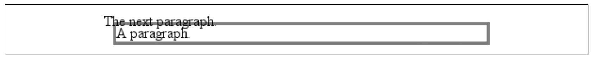

2015年03月15日 全新阅读，英文版

[toc]

## 7 基本视觉格式化

### 7.1 基本盒子

CSS假设每个元素产生一个或多个矩形盒子，称为元素盒子（element boxes）。（之后或许会允许非矩形的盒子，但现在一切都是矩形的。）每个元素盒子都有一个内容区。内容区可以被内补、边框和外补包围。

内容的背景也对内补有效。外补总是透明的，反映父元素的背景。内补不能未负值，但外补可以。

如不设置边框颜色，边框取前景色。如果边框的样式是带空隙的，那么元素的背景会透过这些空隙显示出来。即，边框与内容和内补一样具有相同的背景。边框宽度不能为负。

#### The Containing Block

所有元素的布局都相对于其包含块（containing block）{{包含块跟父容器不一样}}，即包含块是元素的布局上下文。CSS2.1定义了一系列确定元素包含块的规则。

对于位于正常（normal）文本流中的元素，包含块是最近的祖先（块级、表单元格、内联块）的内容边界。

#### 快速复习

- 正常（normal）流：从左到右、从上到下的布局。多数元素都在正常流中。除非浮动或被定位。
- 不可替换元素：元素的内容被包含在文档中。例如，段落是不可替换元素，因为它的文本内容位于其内部。
- 可替换元素：元素本身作为占位符。例如，img元素。多数表单元素也是可替换元素。
- 块级元素：在正常流中，这些元素在其前后产生“新行”，因此在正常流中，块级元素是垂直堆叠（stack）的。通过`display: block`可以令元素产生块级盒子。
- 内联元素：这些元素不会在其前后产生换行。通过`display: inline`可令元素产生内联级别的盒子。

### 7.2 块级元素

元素的宽度一般是左右内边（padding内边）的距离，高度是上下内边的距离。

#### 7.2.1 水平格式化

`width`设定的时元素内盒大小。

在普通流中一个块级元素盒子的水平组件（内容、内补、外补、边框）的和，等于父元素的`width`。

**水平属性**

水平格式化需要的7个属性是：margin-left, border-left, padding-left, width, padding-right, border-right, margin-right。

这7个属性加起来必须等于元素包含块的大小，一般为块级元素父元素的`width`值（块级元素的父元素一般总是块级元素）。只有元素`width`和左右外补可以设为`auto`。

> CSS允许浏览器为`width`设定一个最小值；this is the value below which a **block-level** element’s width cannot drop。

**auto**

若`width`、`margin-left`或`margin-right`三个属性中某个被设为`auto`，另外两个设为某个值，则设为`auto`的属性的值的大小，要满足元素盒子的宽度等于父元素的`width`。

如果这三个属性都为设为某个值，则成为过分受限，此时`margin-right`会被强制设为`auto`。

> `margin-right` is forced to be `auto` only for left-to-right languages such as English. In right-to-left languages, everything is reversed, so `margin-left` is forced to be `auto`, not `margin-right`.

如果左右margin被设为某个值，`width`设为`auto`，则`width`的值最终决定于宽度总和的要求。

**超过一个auto**

如果左右外补都被设为`auto`，它们会被分配相同的大小，因此效果是元素在父元素中居中。

将左右外补设为相同宽度是正确的居中元素的方式，不该用`text-align`。

如果某个外补为固定值，`width`和另一个外补都为auto，则后一个外补宽度实际为0（即宽度占据所有剩余空间）。

如果三个属性都设为auto，则两个外补实际宽度都为0，width占据所有空间。这是默认的情况。

由于水平外补不合并，父元素的内补、边框、外补会影响孩子。如，元素的外补等会导致子元素的偏移。

**负的外补**

元素的7个水平属性加起来要等于父元素的`width`。于是如果7个属性都为非负，则元素的宽度不能超过父元素的宽度。但如果外补为负，可能导致元素宽度超出父元素。

另一方面，若右margin设为auto，其实际值可能为负：由于总和的限制及前几个属性的总和超过父元素`width`。

**百分比**

百分比相对于包含块的宽度。

边框宽度不能使用百分比。

**可替换元素**

之前讨论的都是非替换块级元素的水平格式化。对于可替换的块级元素情况更简单，一个例外是，如果`width`取`auto`（默认），则元素宽度为其固有大小。

如果`width`和`height`中一个设置固定值，另一个不设（或`auto`），则等比例变换。

#### 7.2.2 垂直格式化

元素的默认高度由内容决定。在CSS中可以对任何块级元素设置显式的高度。其结果取决于几个因素。当实际内容高于设置值时的行为取决于`overflow`。

**垂直属性**

垂直方向上也有7个属性：margin-top, border-top, padding-top, height, padding-bottom, border-bottom, and margin-bottom。这7个值加起来必须等于容器块的高度。其一般未一个块级元素的父元素（块级元素的父元素一般总是块级元素）的`height`。

7个属性中只有`height`和上下外补可以被设为`auto`。

正常流中的一个块级元素的`margin-top`或`margin-bottom`若被设为`auto`，则实际求值结果是0。即设置上下外补为auto就相当于设为0。因此无法通过这种方式垂直居中元素。

> 对于定位元素，上下外补的处理方式不同。参见第10章。

**百分比高度**

正常流中块级元素的高度若取百分比，相对于包含块的高度。

若包含块的`height`未被显式声明，百分比高度会被计算成`auto`。

	

		
NOT half as tall; height reset to auto

	

**auto高度**

最简单的情况，正常流中得块级元素，`height: auto`渲染结果是，其高度恰好包围其内联内容的内联盒子。

如果正常流中得自动高度的块级元素只有块级的孩子，则其默认高度是，从最上面块级孩子的顶部边框外源，到最下面块级孩子的底部边框外缘之间的距离。子元素的外补将“进入”父元素。但如果块级元素有上下内补或边框，则高度要从外补外缘算起，而不是从边框外缘算起。

**合并垂直外补**

垂直外补可能发生合并。内补和边框一定不会合并。

如果包含块具有边框或内补，则子元素的垂直外补会被包含进入，即不合并。

**负的外补**

负的垂直外补影响外补的合并。If negative vertical margins are set, then the browser should take the absolute maximum of both margins. The absolute value of the negative margin is then subtracted from the positive margin. In other words, the negative is added to the positive, and the resulting value is the distance between the elements. Figure 7-21 provides two concrete examples.

注意负的外补具有“拉”的效果。

    p.neg {margin-top: -50px; margin-right: 10px;
    	margin-left: 10px; margin-bottom: 0;
    	border: 3px solid gray;}
    

        
A paragraph.

    	A div.
	

As you see in Figure 7-22, the paragraph has simply been pulled upward by its negative top margin. Note that the content of the div that follows the paragraph in the markup has also been pulled upward 50 pixels.

The negative bottom margin makes the paragraph look like it’s been pulled upward. Compare the following markup to the situation depicted in Figure 7-23:

    p.neg {margin-bottom: -50px; margin-right: 10px;
        margin-left: 10px; margin-top: 0;
        border: 3px solid gray;}
    

        
A paragraph.

    

    
The next paragraph.

上图中，div之后元素的位置根据div底部位置。As you can see, the end of the div is actually above the visual bottom of its child paragraph. The next element after the div is the appropriate distance from the bottom of the div. This is expected, given the rules you used.

Now let’s consider an example where the margins of a list item, an unordered list, and a paragraph are all collapsed. In this case, the unordered list and paragraph are assigned negative margins:

    li {margin-bottom: 20px;}
    ul {margin-bottom: -15px;}
    h1 {margin-top: -18px;}

The larger of the two negative margins (-18px) is added to the largest positive margin (20px), yielding 20px – 18px = 2px. Thus, there are only two pixels between the bottom of the list item’s content and the top of the h1’s content, as you can see in Figure 7-24.

One area of unresolved behavior is that if elements overlap each other due to negative margins, it’s hard to tell which elements are on top. You may also have noticed that none of the examples in this section use background colors. If they did, their content might be overwritten by the background color of a following element. This is expected behavior since browsers usually render elements in order from beginning to end, so a normal-flow element that comes later in the document can be expected to overwrite an earlier element, assuming the two end up overlapping.

#### 7.2.3 列表项

列表项前部的标记不属于列表项内容区。

> For a more detailed exploration of lists and how they can be styled, see Chapter 12.

The marker attached to a list item element can be either outside the content of the list item or treated as an inline marker at the beginning of the content, depending on the value of the property `list-style-position`.

### 7.3 内联元素

替换元素和不可替换元素在内联上下文中的表现并不相同。

#### 7.3.1 行布局

内联内容的布局比块级元素更复杂。

#### 7.3.2 基本术语和概念

- 匿名文本：指不在任何内联元素中的字符串。如`
 I'm <em>so</em> happy!
`中，`I’m `和` happy!`是匿名文本。注意空格也是文本的一部分。
- Em盒子：This is defined in the given font, otherwise known as the character box. Actual glyphs can be taller or shorter than their em boxes, as discussed in Chapter 5. 在CSS中`font-size`决定每个em盒子的高度。
- 内容区：对于非替换元素，内容区有两种，CSS2.1规范允许浏览器选择其一。The content area can be the box described by the em boxes of every character in the element strung together, or it can be the box described by the character glyphs in the element. 本书使用em盒子的定义。对于替换元素，内容区是元素的内在高度，加上内补、外补和边框。
- Leading：leading是`font-size`和`line-height`的差。这块差实际会被一除为二，分别作用域内容区的上面和下面，称为half-leading。Leading只适用于非替换元素。
- 内联盒子：leading加上内容区的范围。对于非替换元素，元素内联盒子的高度与`line-height`相等。对于可替换元素，元素的内联盒子的高度等于内容区（因为leading不对可替换元素起作用）。
- 行盒（Line box）：能够包裹行内所有内联盒子的最高和最低点得最小盒子{{一个行内可能有多个内联盒子}}。即，行盒的最上边位于最高的内联盒子的顶部，行盒的底部位于最低的内联盒子的底部。

CSS also contains a set of behaviors and useful concepts that emerge from the list of terms and definitions just described:

- 内容区与块级元素的内容盒子类似。
- 内联元素的背景作用于内容区和padding。
- Any border on an inline element surrounds the content area plus any padding and borders.
- 对于不可替换元素，内补、边框、外补不影响一个元素的内联孩子（和包含元素和行盒）。
- 对于可替换元素，外补和边框影响元素的内联盒子的高度，因此也影响所在行的行盒的高度。

在行内，内联盒子对齐依据`vertical-align`。

下面介绍构造一个行盒的过程，which you can use to see how the various pieces of the line fit together to determine its height:

1. 按以下步骤，决定行中每个元素的内联孩子的高度：
	1. 找出每个内联不可替换元素或匿名文本的`font-size`和`line-height`。相减计算盒子的*leading*。leading一分为二作用到em盒子的上下。
	2. 对于可替换元素，找到height, margin-top, margin-bottom, padding-top, padding-bottom, border-top-width, and border-bottom-width，然后相加。
2. 对每个内容区，决定有多少部分位于整行的基线之上，多少位于之下。并不好弄，需要知道每个元素（和匿名文本）的基线位置，及行自己的基线位置；then you must line them all up. 可替换元素的底边位于整行的基线上。
3. Determine the vertical offset of any elements that have been given a value for `vertical-align`. This will tell you how far up or down that element’s inline box will be moved, and will change how much of the element is above or below the baseline.
4. Now that you know where all of the inline boxes have come to rest, 计算最终的行盒的高度。To do so, just add the distance between the baseline and the highest inline box top to the distance between the baseline and the lowest inline box bottom.

下面详细解释整个过程。

#### 7.3.3 内联格式化

每个元素都有一个`line-height`，这个值非常影响内联元素如何显示。

行的高度（或行盒的高度）取决于内含元素的高度。要理解，`line-height`实际影响内联元素和其他内联内容，不影响块级元素（至少不直接影响）。可以对块级元素设置`line-height`，但它的影响只对元素中的内联内容起效。例如，下面这个空段落，

	

没有内容，`line-height`没有作用的对象。

如果对块级元素设置`line-height`，就不必未其中的每个内联元素显式声明`line-height`。
根据规范，在块级元素上声明`line-height`，设置的时元素内容的最小行盒（line-box）高度。因此`p.spacious {line-height: 24pt;}`表示每个行盒的最小高度是24点。

#### 7.3.4 内联不可替换元素

本节关注行内只包含不可替换元素（匿名文本）的构建。

##### 构造盒子

首先，对于内联不可替换元素和匿名文本，`font-size`的值决定内容区的高度。例如，若一个内联元素的`font-size`为15px，则内容区高度就是15，因为元素内所有em盒子都是15px高。

接下来要考虑`line-height`，及它与`font-size`的差值。若内联不可替换元素的`font-size`为15px，`line-height`为21px，差值6像素。浏览器将6像素一分为二分别放在内容区上下，即产生内联盒子。如下图。

下面的代码中，strong的字体大小与其他不同为24px。但与其他元素一样都继承了`line-height`为12px。对于字体和行高都是12px的元素，没有leading，因此它们的内联盒子也是12px高。但对于strong，`line-height`与`font-size`的差值为-12px。内容区加上负的leading（或者就是`line-height`）得到内联盒子为12px。12像素的内联盒子在24像素的元素内容中间，内联盒子小于内容区高度。

    

        This is text, <em>some of which is emphasized</em>, plus other text 
        which is <strong style="font-size: 24px;">strongly emphasized</strong> and which is 
        larger than the surrounding text.
    

虽然上例中，strong跟其他元素的内联盒子都是12px高，但它们的位置却不相同，这是由于文本按基线对齐导致的。由于整个行盒的高度取决于各个内联盒子的高度：行盒的顶部和底部分别是最高的内联盒子的顶部，及最低的内联盒子的底部。因此上例中，行盒的高度大于12px。

相邻行的顶部和底部相接。如下图所示。中间行比剩下两行高。

> 虽然中间行高，but it still isn’t big enough to contain all of the text within it. The anonymous text’s inline box determines the bottom of the line box, while the top of the strong element’s inline box sets the top of the line box. Because that inline box’s top is inside the element’s content area, the contents of the element spill outside the line box and actually overlap other line boxes. The result is that the lines of text look irregular. Later in the chapter, we’ll explore ways to cope with this behavior and methods for achieving consistent baseline spacing.

##### 垂直对齐

即使改变内联盒子的垂直对齐方式，高度决定的规则也是一样的。

    

    This is text, <em>some of which is emphasized</em>, plus other text 
    that is <strong style="font-size: 24px; vertical-align: 4px;">strongly emphasized</strong> and that is 
    larger than the surrounding text.
    

元素升高了4个像素，不仅抬高了内容区，也抬高了内联盒子。由于`strong`的内联盒子的顶部本已是行中最高的，因此行盒的顶部又抬高了4像素。如下图。

如果行内有另一个内联元素（“tall”文本），但对齐方式不是基线。请注意其对齐方式：

    

    this is text, <em>some of which is emphasized</em>, plus other text 
    that is <strong style="font-size: 24px;">strong</strong> and tall and that is 
    larger than the surrounding text.
    

文字“tall”的内联盒子的顶部对齐到行盒的顶部。由于“tall”的`font-size`和`line-height`相同，因此内容高度与内联盒子高度相同。

另一种情况，文字“tall”的`line-height`比`font-size`小，元素的内联盒子小于内容区。

    

    This is text, <em>some of which is emphasized</em>, plus other text 
    that is <strong style="font-size: 24px;">strong</strong> and tall
    and that is 
    larger than the surrounding text.
    

此时内联盒子仍要对齐到行盒顶部。于是：

再试试`line-height`大于`font-size`的情况。例如：

    

    This is text, <em>some of which is emphasized</em>, plus other text 
    that is <strong style="font-size: 24px;">strong</strong> and tall
    and that is 
    larger than the surrounding text.
    

各种对齐方式的含义再解释：

- `top`：元素内联盒子的顶部对齐到所在行盒的顶部。
- `bottom`：元素内联盒子的底部对齐所在行盒的底部。
- `text-top`：元素内联盒子的顶部对齐到父元素内容区的顶部。
- `text-bottom`：元素内联盒子的底部对齐到父元素内容区的底部。
- `middle`：元素内联盒子的垂直中点对齐到父元素基线上面半个ex的点
- `super`：Moves the content area and inline box of the element upward. The distance is not specified and may vary by user agent.
- `sub`：The same as super, except the element is moved downward instead of upward.
- `<percentage>`：Shifts the element up or down the distance defined by taking the declared percentage of the element’s value for `line-height`.

These values are explained in more detail in Chapter 6.

##### 管理line-height

上一节看到改变一个内联元素的`line-height`会导致行产生交叠。In each case, though, the changes were made to individual elements. So how can you affect the `line-height` of elements in a more general way to prevent content from overlapping?

One way is to use the `em` unit in conjunction with an element whose `font-size` has changed. For example:

    p {font-size: 14px; line-height: 1em;}
    big {font-size: 250%; line-height: 1em;}
    

    Not only does this paragraph have "normal" text, but it also 
    contains a line in which <big>some big text </big> is found. 
    This large text helps illustrate our point.
    

By setting a `line-height` for the big element, you increase the overall height of the line box, providing enough room to display the big element without overlapping any other text and without changing the `line-height` of all lines in the paragraph. You use a value of `1em` so that the `line-height` for the big element will be set to the same size as big’s `font-size`. 记住`line-height`相对于元素自己的`font-size`，而不是父元素的。效果如下：

下面代码与上述代码效果相同：

     p {font-size: 14px; line-height: 1;}
     big {font-size: 250%;}

Unless `line-height` values are inherited as scaling factors, both the p and big elements would have a `line-height` of 1. Thus, the height of the inline box would match the height of the content area.

用上边框后事情变得更复杂了：

	a:link {border: 5px solid blue;}

如果`line-height`不够大，可能导致行交叠。本例，可以让`line-height`比`font-size`大10像素。但如果不知道字体是多少像素就难办了。

另一种方法是，增加整个段落的`line-height`。影响其中每一行：

    p {font-size: 14px; line-height: 24px;}
    a:link {border: 5px solid blue;}

上面是一种简单情况：所有文本都是相同大小。如果行中某个元素会改变行盒高度：

    p {font-size: 14px; line-height: 24px;}
    a:link {border: 5px solid blue;}
    big {font-size: 150%; line-height: 1.5em;}

big的内联盒子的告诉是31.5(14 × 1.5 × 1.5)像素，这也是行盒的高度。如果想保持基线空间一致，必须让p元素的`line-height`大于等于32px。

The actual height of each line box depends on the way its component elements line up with one another. This alignment tends to depend very much on where the baseline falls within each element (or piece of anonymous text) because that location deter- mines how their inline boxes are arranged. The placement of the baseline within each em box is different for every font. This information is built into the font files and can- not be altered by any means other than directly editing the font files.

Thus, consistent baseline spacing tends to be more of an art than a science. If you declare all of your font sizes and line heights using a single unit, such as ems, then you have a reliable chance of consistent baseline spacing. If you mix units, however, that feat becomes a great deal more difficult, if not impossible.

##### 缩放行高

设置`line-height`的方式是设置成数字因子，and that factor is an inherited, not computed, value. 如设置文档中所有元素的`line-height`都等于其`font-size`的1.5倍：

	body {line-height: 1.5;}

##### 增加盒子属性

内补、外补和边框都可以用于内联非替换元素。这些属性根本不影响行盒的高度。If you were to apply some borders to a span element without any margins or padding, you’d get results such as those shown in Figure 7-40.

内联元素边框位置取决于`font-size`，而非`line-height`。比如，若一个span有`font-size`为12px，`line-height`为36px，则其内容区就为12px高，边框围绕内容区。

内补将在边框和文本之间产生距离：

	span {border: 1px solid black; padding: 4px;}

内补不影响内容高度、内联盒子的高度。边框也不会影响行盒的产生和布局。如下图所示：

CSS2.1进一步澄清：`margin-top`和`margin-bottom`可以用于除内联不可替换元素之外的任何元素。

内联元素可以看成先布局成一行然后再折行。对内联元素使用margin，出现的元素的开始和结束。内补也出现在两边（edges）。因此，尽管内补和外部（和边框）不影响行高，但影响水平位置。而且负的水平margin可以导致内联元素拉近甚至重叠。

内联元素有背景和内补时，可能导致背景与行重叠。例如：

     p {font-size: 15px; line-height: 1em;}
     p span {background: #999; padding-top: 10px; padding-bottom: 10px;}

CSS 2.1显式规定行盒按照文档顺序绘制。后面行的边框在之前行的边框和文本之上绘制。背景也是一样，如上图所示。CSS2, on the other hand, allowed user agents “to ‘clip’ the border and padding areas (i.e., not render them).” Therefore, the results may depend greatly on which specification the user agent follows.

##### Glyphs Versus Content Area

Even in cases where you try to prevent inline nonreplaced element backgrounds from overlapping, it can still happen, depending on which font is used. The problem lies in the difference between a font’s em box and its character glyphs. Most fonts, as it turns out, don’t have em boxes whose heights match the character glyphs.
That may sound very abstract, but it has practical consequences. In CSS2.1, we find the following: “The height of the content area should be based on the font, but this specification does not specify how. A user agent may...use the em box or the maximum ascender and descender of the font. (The latter would ensure that glyphs with parts above or below the em box still fall within the content area, but leads to differently sized boxes for different fonts.)”
In other words, the “painting area” of an inline nonreplaced element is left to the user agent. If a user agent takes the em box to be the height of the content area, then the background of an inline nonreplaced element will be equal to the height of the em box (which is the value of font-size). If a user agent uses the maximum ascender and descender of the font, then the background may be taller or shorter than the em box. Therefore, you could give an inline nonreplaced element a line-height of 1em and still have its background overlap the content of other lines.
There is no way to prevent this overlap in CSS2 or CSS2.1, but there are properties pro- posed for CSS3 that would let the author control the behavior of the user agent. Until these properties are widely implemented, truly precise typography is not possible with CSS.

#### 7.3.5 内联可替换元素

内联可替换元素有固有的高度和宽度。因此一个可替换元素可能增加行盒高度。但并不改变行中任何元素的`line-height`。行盒会足够高以容纳可替换元素（包括边框等）。可替换元素的内容、内补、边框和外补都影响元素的内联盒子。

例一

     p {font-size: 15px; line-height: 18px;}
     img {height: 30px; margin: 0; padding: 0; border: none;}

`line-height`对图片内联盒子无影响。由于上例中，图片没有边框、内补、外补，因此其内联盒子等于其内容区，这里是30像素高。

可替换元素的`line-height`影响垂直对齐。比如，`vertical-align`的百分比值相对于元素的`line-height`。因此：

    p {font-size: 15px; line-height: 18px;}
    img {vertical-align: 50%;}
    
The image in this sentence will be raised 9 pixels.

图片升高9个像素。Without a value for line-height, it wouldn’t be possible to perform percentage-value vertical alignments. 图片的高度与垂直对齐没有关系，关键是`line-height`。

However, for other replaced elements, it might be important to pass on a `line-height` value to descendant elements within that replaced element. One example is an SVG image, which uses CSS to style any text found within the image.

##### 添加盒子属性

After everything else, applying margins, borders, and padding to inline replaced elements almost seems simple.

内补和边框属于内联可替换元素内联盒子（与内联不可替换元素不同！），因此影响行盒的高度。

     img {height: 20px; width: 20px;}
     img.one {margin: 0; padding: 0; border: 1px dotted;}
     img.two {margin: 5px; padding: 3px; border: 1px solid;}

外补也属于行盒。正值让行盒更好，没什么说的。负值，减少可替换元素内联盒子的大小。如下图：

	img.two {margin-top: -10px;}

负的外补是唯一可以让内联可替换元素进入其他行的方式。

##### 可替换元素与基线

内联可替换元素位于基线上。向可替换元素添加底部的内补、外补、边框，内容区将上移。可替换元素自己没有基线，因此是其内联盒子的底部（外补的下边缘）对齐基线。

基线对齐导致的问题是，若单元格内只有图片：

    td {font-size: 12px;}
    <td></td>

在CSS内联格式化模型下，表格单元格将使12像素高，图片位于单元基线。因此图片下面可能有3个像素，上面有8个（实际值取决于字体的基线位置）。这种情况，在内联可替换元素是块级或表格单元格元素唯一后代时都会出现。例如，图片在div中坐基线上。

> As of this writing, many browsers actually ignore this CSS inline formatting model, but Gecko-based browsers act as the text describes when rendering XHTML and strict HTML documents. See my article “Images, Tables, and Mysterious Gaps” at http://developer.mozilla.org/en/docs/Images,_Tables,_and_Mysterious_Gaps for more information.

最简单的解决办法是让图片变成块级元素，不再产生行盒：

    td {font-size: 12px;}
    img.block {display: block;}
	<td></td>

Another possible fix is to make the font-size and line-height of the enclosing table cell 1px, which makes the line box only as tall as the one-pixel image within it.

Here’s another interesting effect of inline replaced elements sitting on the baseline: if you apply a negative bottom margin, the element will actually get pulled downward because the bottom of its inline box will be higher than the bottom of its content area. Thus, the following rule would have the result shown in Figure 7-48:

	p img {margin-bottom: -10px;}

> Some browsers simply place the bottom of the content area on the baseline and ignore any negative bottom margin.

### 7.4 修改元素显示方式

