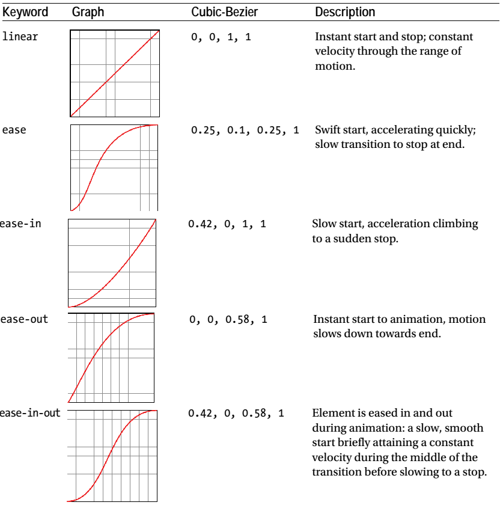
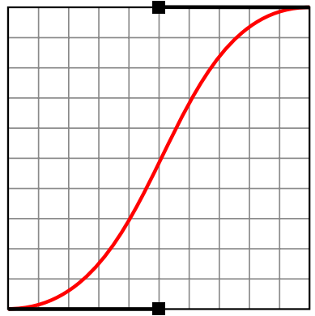
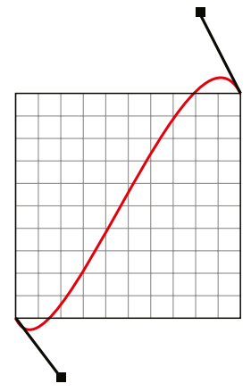
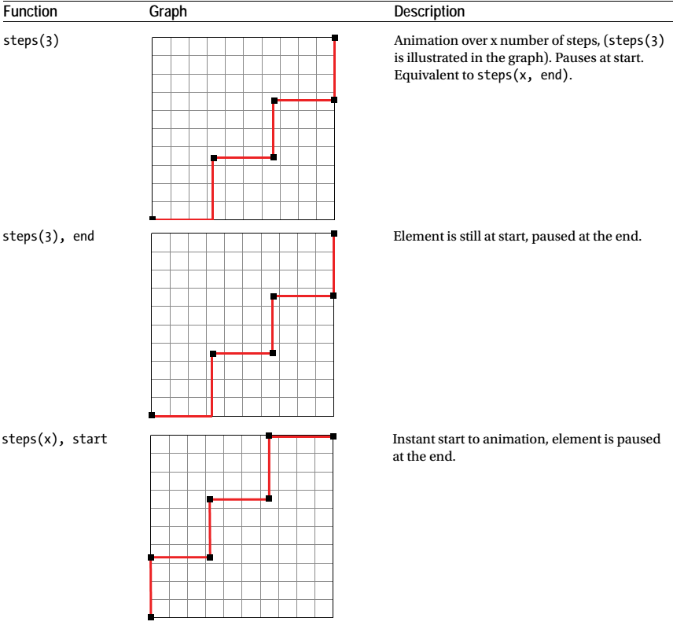

[toc]

## xxx 1. CSS3基础

## xxx2. CSS3 Transforms 和 Transitions

### xxx 2.2 CSS Transitions

### xxx 2.3 Delaying and Combining Transition Effects

#### Transition Timing Functions and Bezier Curves

linearand easeare just two forms of what are referred to as timing functions, . These timing functions may be graphed in a mathematical expression known as **Bezier curves**.

There are several keywords that can be used as a shortcut for common transition motions

As you can see, all easing curves have a mathematical equivalent in the form of a cubic-bezier expression: a number pair in which each set of floating-point digits describes a point in coordinate space, forming a line that creates a transition curve. (Note that the points at the termination of the curve on either end cannot be moved or defined).

For an ease-in-out curve,

Expressed in CSS,

	transition-timing-function: cubic-bezier(0.42, 0, 0.58, 1);

Understanding the cubic-bezier function allows you to create an almost infinite variety of custom easing curves for your CSS animations. It is even possible to give the points negative values or values greater than 1 to create extreme easing curves,

In CSS,

	transition: all 2000ms cubic-bezier(0.280, -0.315, 0.685, 1.390);

The use of such values creates animations with a “spring” or “bounce” to them, also known as push-pull animations. I will explore the uses of such animations in Chapter 4.

Ceaser (http://matthewlein.com/ceaser/), and Cubic (http://cssglue.com/cubic) are excellent tools for generating CSS easing code from graphically manipulated cubic-bezier curves. Both include a testing service to 
allow you to see the visual result of changes. Peter Beverloo’s resource (http://peter.sh/experiments/css3-transition-timing-functions/) is also useful, especially in visualizing the step function.

##### 步进动画

步进动画，而不是平滑的（就好像时钟秒针的移动）。

	h1 {
		font-family: Futura; "Arial Black", Arial, sans-serif;
		text-align: center;
	}
	h1:hover {
		-moz-transition: 4s all steps(3, end);
		-webkit-transition: 4s all steps(3, end);
		transition: 4s all steps(3, end);
		-moz-transform: translateX(400px);
		-webkit-transform: translateX(400px);
		transform: translateX(400px);
	}

The code in Listing 2-20 will animate all h1 elements in a series of three “jumps” over four seconds after a two-second delay, with no visible motion between each step. Other variations are possible:

## 3. CSS3 Transitions for Images