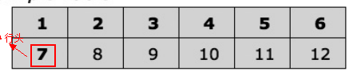
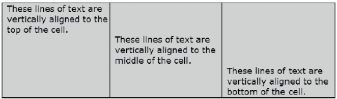
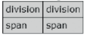

[toc]

## 15. 表格

### 15.1 表格

行可以有零个到多个行头。不管行头还是列头都用`<th>`表示。

利用`colspan`或`rowspan`特性让单元格跨多列或多行。

盒模型属性并不能完全用于所有表格元素：只有`background`对所有元素生效。`margin`只可对表格使用。`border`对表格和单元格有效！`padding`、`overflow`和`vertical-align`只对单元格有效。 `text-indent`、 `text-align` 或其他文字样式只对单元格生效，但可以从行、行组或表元素继承。`width`对表、单元格、列有效。

`height`对表、行和单元格有效。**但它只表示最小高度**。当内容过大时，单元格、行、表总是会扩展到容纳内容。（块元素不是这样，固定高度的块元素，当内容过大时，内容会**溢出而不是撑高**块。）对表格设置百分比高度，相对于表格的父容器的高度。对行或单元格设置百分比高度是无效的。

### 15.2 行组和列组

	<table class="example2">
		<colgroup>
        	<col class="col1" /><col class="col2"/><col class="col3" />
			<col class="col4" /><col class="col5" /><col class="col6"/>
        </colgroup>
		<tr> <td rowspan="2">1</td> <td colspan="5">2-6</td> </tr>
		<tr> <td>8</td> <td>9</td> <td> </td> <td>&nbsp;</td> <td>12</td></tr>
	</table>

三种行组：`<thead>`、`<tfoot>`、`<tbody>`。列组：`<colgroup>`。列：`<col>`。

三种行组中的行都允许任意使用`<th>`和`<td>`。一个表中可以有多个`<tbody>`。但只能有一个`<thead>`和一个`<tfoot>`。三个行组的在代码中出现顺序可以随意，渲染是总是头在最前面，脚在最后面。

单元格**从表格、行组，行继承文字样式，但不能从列组或列继承**。`visibility:hidden` 和 `display:none`可以用于表、行、行组、单元格，但不能用于列组和列。`background` 可以对所有元素使用。

表格的背景从后向前依次是：表格、列组、列、行组、行、单元格。{{背景对th生效，貌似只对th本身（表头单元格）生效，对同一列的td不生效}}

一个表格可以包含一个或多个列组（`<colgroup>`）。一个列组中可以有一个或多个列（`<col>`）。只有两个属性对列组和列是有效的：`background`和`width`。

### 15.3 表格选择符

### 15.4 分离的边框

对表格设置`border-collapse:separate`，表格和单元格之间、单元格之间的边框将分离。可以通过`border`属性设置表格或单元格的边框。通过`cellspacing`特性控制边框之间的距离。

	<table cellspacing="WIDTH">
		<tr> <td> CONTENT </td> </tr>
	</table>

对行、列、列组、行组设置边框是无效的。

分离边框之间的距离只能通过HTML特性`cellspacing`控制。因为IE7和之前的浏览器不支持`border-spacing`属性。

### 15.5 合并的边框

对表格施加`border-collapse:collapse`属性令表格和单元格边框合并。并且必须省略`cellspacing`特性或设置为0，防止IE7及更早版本出现BUG。

与分离边框不同的时，所有主流浏览器都会在空单元格周围渲染边框。

合并边框会发生冲突：在相邻单元格之间或表格与单元格之间。若相邻的边框更有不同的样式、宽度、颜色，则最可见的边框胜出。如宽的覆盖细的。边框样式的覆盖顺序是：double, solid, dashed, dotted, ridge, outset, groove, and inset。若颜色冲突，单元格颜色覆盖表格边框颜色。左边框覆盖右边框，上边框覆盖下边框。

### （未）15.6 给合并边框添加样式

### 15.7 隐藏、删除单元格

使用 `visibility:hidden` 隐藏单元格，单元格不会被渲染。但单元格的位置和空间会被保留。如果边框合并，隐藏单元格周围的边框仍会被渲染。但如果边框分离，隐藏单元格的边框不会被渲染。

使用 `display:none` 移除单元格。右边的单元格会向前移动！

In Opera and Internet Explorer, when you use `visibility:hidden` or `display:none` to hide cells, it will also hide the borders that don’t touch other cells. There are a few solutions for this problem. Hide the content by using `text-indent: -9999px` to shift the content off the page or wrap the content in a div and set `visibility:hidden` on the div instead.

This should be fixed when `empty-cell:show` is properly implemented, which tells the browser to render the background and border of an empty table cell as if it were there. However, at this time, it is extremely buggy and considered not supported.

When you hide a table with collapsed borders, the table’s outer borders are hidden and its contents are hidden, but its internal borders remain visible. To completely hide the table, you can assign `visibility:hidden` to the table and `border:none` to its cells. This is not necessary for tables with separate borders.

### 15.8 移除、隐藏行和列

要删除列，需要为列中**所有单元格**设置`display:none`。要删除行、行组，可以对`<tr>`, `<thead>`, `<tfoot>`, `<tbody>`设置`display:none`。被删除的元素不会被渲染。右边的列会移前。下面的行会移上。

可以用`visibility:hidden`隐藏行或列。会留下空白。

你或许会尝试通过`<colgroup>`或`<col />`删除或隐藏列。IE支持这样。但其他主流浏览器都不支持。You may also want to apply `visibility: collapse` to these elements, but this does not work in Internet Explorer 7 or Opera 9.

### 15.9 垂直对齐数据

`vertical-align`对单元格和内联元素起效。就像可以使用`vertical-align`使得内联元素偏离其基线，对单元格也是如此。

`top`是单元格的顶部，`middle`是单元格的中部，`bottom`是单元格的底部。（对于内联元素，`top`是行的顶部，`bottom`是行的底部，`middle`是行的粗略的中部。

单元格与内联元素的垂直对齐的差别是，用于单元格时，将单元格的全部内容（包含多行）对齐到单元格的顶部、底部或中间。但用于内联元素时，是一个内联元素对齐行内的另一个内联元素。

除了单元格，没有其他方式可以垂直的对齐多行。

### （未）15.10 Striped Tables

### 15.11 表格化、行化、单元格化

	

		

        	
division

            
division

        

    	
        	span
            span
        
    

    div, span { border:1px solid black; background-color:gold; padding:5px; }
    .tabled { display:table; border-collapse:collapse; }
    .rowed { display:table-row;}
    .celled { display:table-cell; }

可以把普通的内联元素或块元素渲染成表格、行、单元格：使用`display:table`、`display:table-row`、`display:table-cell`。HTML本身使用内联元素还是块元素不重要，内联元素也可以包围内联或块元素。

一般会在单元格化的元素外包围行化的元素，再外面包围表格化的元素。但可以单独渲染一个单元格化的元素，浏览器会自动创建行盒子和表格盒子。由于表格默认是收紧的（shrinkwrap），块默认是伸开的（stretch），因此把块单元格化可以让块收紧又不离开正常流。

IE7及之前的版本不支持该模式。很不幸这个模式非常有用。第16章将展示使用这种模式。

### 15.12 表格布局

    .auto-layout { table-layout:auto; }
    .fixed-layout { table-layout:fixed; }
    .shrinkwrapped { width:auto; }
    .sized { width:350px; }
    .stretched { width:100%; }

有四种表格：收紧的、指定大小的、拉开的和固定（fixed）表格。下一章将详细介绍这四种表格。

收紧的表格将表格收紧到各个列的宽度，且不会超出父容器。指定大小或伸开的表格，列的宽度可以是表格宽度的百分比，**可能会超出父容器宽度**。固定表格是指定大小或伸开表格的变体，布局列时不考虑内容宽度，于是可以加速渲染且不会让内容撑开列。

表格类型取决于`table-layout`和`width`两个属性。`table-layout`有`auto`（默认）和`fixed`两个值。`auto`布局基于单元格内容的最小和最大宽度及单元格设置的大小。`fixed`布局不考虑内容，只看**第一行**的单元格的设置的宽度。

设置列宽只需要设置第一行的单元格的宽度，对fixed和auto布局都有效，不需要`<colgroup>`和`<col>`元素。

