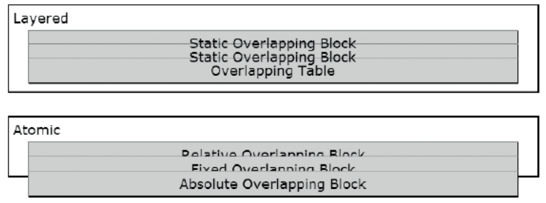

[toc]

## 7. 定位模型

### 定位模型

CSS提供6种定位模型：静态、绝对、fixed、相对、浮动和相对浮动。6个定位模型与6个盒模型相关，但不是一回事。静态定位可以定位内联、内联块、块盒和表格。

### 定位

利用`position:static`让元素不再定位（**unposition**），回到流中正常渲染。You can use `position:relative` to position an element at an offset from its location in the normal flow. You can use `position:absolute` to position an element at an offset from its location in the normal flow or from its nearest positioned ancestor. You can use `position:fixed` to position an element at an offset from the viewport.

IE6不支持固定定位。

已定位元素有三种：`position:relative`、`position:absolute`、`position:fixed`。浮动可以通过`position:relative`定位。

### 最近定位祖先

Positioned elements are positioned relative to their closest positioned ancestor. 若无，最终`<body>`作为定位祖先。

### 堆叠上下文（Stacking Context）

Static elements are stacked from back to front in document order. 已定位元素按z-index从小到大从后向前堆叠。`z-index`为负的定位元素位于静态元素和非定位浮动之后。`z-index`可以不连续。`z-index`的默认值是`auto`。

一个`z-index`的定位元素会创建一个局部的、自包含的堆叠（stacking）上下文。它的所有后代（静态、浮动、定位的）都在其中渲染。`z-index`为`auto`，或对非定位元素设置`z-index`都不会创建堆叠上下文。

堆叠上下文是原子的，不会允许祖先或兄弟的层插入到孩子中间。每个局部的堆叠上下文被赋予内部堆叠级别0，它的后代都相对于此堆叠。**即`z-index`不是全局的**。它相对于最近的带数字`z-index`的定位祖先{{即相对于它的堆叠上下文}}。根元素`<html>`创建根堆叠上下文。

一个堆叠上下文从后向前一层层的渲染：

1. 上下文元素的背景色、图片、边框
2. 后代中，定位元素，`z-index`为负。
3. 后代中，非定位块元素
4. 后代中，非定位的浮动
5. 后代中，非定位的内联元素
6. 后代中，定位元素，且`z-index:auto`或`z-index:0`。
7. 后代中，定位元素，且`z-index`为正。

其中，2, 6, 7递归渲染堆叠上下文，因为每个带数字`z-index`的定位元素都会创建局部堆叠上下文。

### 原子的

你想要内容在块内部渲染，而不是在块上面渲染。即，你想要文本和内联内容被原子的渲染于块内，于是，如果块之间重叠，内容也会重叠。

问题在于，浏览器将静态内联内容渲染在一个单独的层中，位于静态块的背景之上。当静态块彼此覆盖时，它们的背景边框会遮盖，但静态内容不会。原因是，按照上一节介绍的堆叠上下文绘制顺序，首先绘制**所有**块的背景边框，然后是**所有**的浮动，然后是内联内容和元素。

解决办法是令块都定位。定位元素是原子的。设为`overflow:scroll`的块也是原子的，因为内容现在位于块的可滚动区域。

    
Atomic
    
Relative Overlapping Block

    
Fixed Overlapping Block

    
Absolute Overlapping Block

    *.static { position:static; }
    *.overlap { margin-top:-22px; }
    *.relative { position:relative;}
    *.fixed { position:fixed;margin-top:-16px; }
    *.absolute { position:absolute;top:65px; }

`overflow` doesn’t consistently create atomicity in older browsers. Blocks set to `overflow:hidden` are atomic in Firefox 2.0 and Internet Explorer 7, but not in Internet Explorer 6 and other major browsers. Blocks set to `overflow:scroll` are atomic except for in Internet Explorer 6. `overflow` consistently creates atomicity in newer browsers.

All tables and sized blocks are atomic in Internet Explorer 7, but not in other major browsers. This is because Internet Explorer 7 and earlier versions use an internal feature and a proprietary DOM property called **hasLayout**, which is true when an element has layout. When an element has layout, it’s rendered in its own window with its own layout context. All of its children are rendered atomically inside its rectangular box. It can’t shrinkwrap, and external floats don’t affect the position of its inline content.

IE6的一些BUG可以通过触发**hasLayout**解决。利用`zoom:1`可以触发布局。

### 绝对的

绝对定位相对于最近定位祖先的**内边框**定位。

设置`width`和`height`时，**百分比相对于最近的定位祖先（而不是祖先）**。若`left`、`right`、`top`和`bottom`设为`auto`，则元素在其本来该在的位置上渲染。利用margin可以让元素边相对于最近的定位祖先的边偏移。

IE6会收紧绝对元素。IE7和早期版本不能居中绝对元素。

### 相对的

`z-index`对浮动或静态元素无效。但如果有定位元素覆盖了它们，可以通过相对定位让它们定位然后设置堆叠顺序。

可以使用top或left让相对元素相对于原来的位置偏移。不会影响流中其他元素的位置。left和top的默认值是auto。

Because of the way Internet Explorer 7 and earlier versions implement hasLayout, relative inline elements in a positioned block can’t be stacked on top of elements outside the block. Because of this, Internet Explorer 7 can’t render the relative inline span in the example in front of the absolute paragraph. This happens because the inline span is literally contained within the paragraph because the paragraph has layout. This problem doesn’t occur in other major browsers, and it doesn’t occur in Internet Explorer when the parent block doesn’t have layout, such as when it’s a static block. This problem has been resolved in Internet Explorer 8 and 9.

### 浮动

`float:left`或`float:right`将元素从正常流中移除，放入父元素padding区的内边。浮动元素位于自己的一层，位于块元素背景之上，与正常流中得内联元素相邻。左浮动令其右边的内容缩进，有浮动令其左边的内容缩进。浮动不会影响块盒的位置，只会影响其内联的内容。浮动影响其他浮动的位置，可能与相邻的浮动堆叠（stacked{{指上下堆叠}}）。浮动还可能吧其他浮动或内联内容推到下面。浮动的垂直和水平margin会令其相对于父元素或其他浮动偏移。浮动不会与其他浮动或内容交叠（除非浮动的margin为负）。

`clear:left`令一个块或浮动位于左边任何浮动元素之下。`clear:right`作用类似。`clear:both`令块或浮动元素位于左右浮动元素之下。`clear`对内联、绝对定位、固定定位无效。

弱项预测浮动元素的垂直位置，最好浮动**块**元素（而不是其他类型的元素）。浏览器将一个浮动块的上边放在它未浮动前本该在的位置。对于浮动的内联元素，其上边取决于它未浮动时在行内的位置。If at the beginning of a line, its top is aligned to the top of the line; otherwise, its top is aligned to the bottom of the line.

### 相对浮动

想要浮动元素相对于当前位置偏移，又不想影响其他元素，包括其他浮动和内联内容。或者想要控制浮动与其他浮动，浮动与其他定位元素的堆叠顺序。

可以用`position:relative`相对定位一个浮动。相对浮动仍在其正常流中，利用`left`和`top`可以令其偏移。相对浮动已定位层中渲染。which allows you to use z-index to control its stacking order in relation to floats and other positioned elements. 绝对定位的后代可以相对于它定位。

浮动元素只能被设为`position:relative`或`position:static`。不接受`position:absolute`或`position:fixed`，否则行为不定。

## 8. 定位：Indented, Offset, Aligned

本章介绍margin如何偏移（offset）或对齐（align）元素。

对于撑开的元素，缩进（indented）或悬挂缩进（outdented）意味着它的一个或多个边移动到容器内或外，元素的宽度或高度发生改变。

对于大小固定或收紧的元素，偏移（offset）表示整个元素发生移动，但其宽度或高度不发生变化。

对于大小固定或收紧的元素，可以对齐到容器的一边，并相对于容器边缘有一定偏移。宽度高度不变。

### 8.1 缩进

缩进指先拉伸元素到容器边让后相对于边偏移。缩进减少元素大小。悬挂缩进增加元素大小。各个边可以独立缩进。

正的margin使缩进，负的margin使悬挂缩进。可以用`left:0, right:0, top:0, bottom:0`让绝对元素的边对齐定位祖先的边，然后用margin进行缩进或悬挂缩进。

水平缩进绝对元素

	SELECTOR { position:absolute; width:auto; left:0; margin-left:±VALUE; right:0; margin-right:±VALUE; }

垂直缩进绝对元素

	SELECTOR { position:absolute; height:auto; top:0; margin-top:±VALUE; bottom:0; margin-bottom:±VALUE; }

无法垂直撑开和缩进静态元素、浮动和内联文本元素。**不能缩进使用`width:100%`或`height:100%`拉伸的元素**。

### 8.2 偏移或缩进静态表格

左右对称缩进（居中）一个撑开的表格：将表格宽度设为小于100%的某个百分比，设置左右margin为auto。由于浏览器的不兼容，只能通过`width:100%`将表格撑开容器宽度，没有办法在保持表格撑开的情况下左右不等的缩进。

但对于块元素，由于默认就会撑开到容器宽度，因此可以左右缩进不同大小。

左缩进一个收紧的静态表格或固定大小的静态表格

	SELECTOR { position:static; width:auto; margin-left:±VALUE; margin-right:auto; }
    SELECTOR { position:static; width:+VALUE; margin-left:±VALUE; margin-right:auto; }

Internet Explorer versions 6 and 7 have a bug that ignores `margin-left` when a shrinkwrapped table is a child of any element besides `<body>`.

### 8.3 偏移浮动

目标：控制浮动之间的距离，令它们相互远离或靠近。正的margin令相互远离。负的margin令拉近，甚至重叠。

浮动的位置影响相邻浮动或内联内容的位置。**Margin偏移浮动，而不是缩进浮动**，因为它们改变浮动的位置，而不是它们的大小。

### 8.4 偏移绝对和固定元素

想要绝对元素**相对于其原位置**偏移。不要设置left, right, top, bottom为一个数值，否则就不是相对于原位置，而是相对于定位祖先的边对齐；把它们设为`auto`或不设（默认就是auto）。

然后利用`margin-top`或`margin-left`可以令其相对于其在正常流中本来该在的位置偏移。同时，`width:auto`或`height:auto`可以令其收紧，`width:+VALUE`或`height:+VALUE`给予固定大小。

### 8.5 偏移相对元素

与绝对定位不同的是，相对定位保持元素原来的大小、形状。

相对元素是设置了`position:relative`的浮动或静态元素。它原来在普通或浮动流中。

可以使用top或left偏移元素。与margin不同的是，相对偏移不会影响其他元素的位置。

A relative element is rendered in a layer without leaving the flow. This allows you to overlap elements and control their stacking order using `z-index`.

### 8.6 对齐内联元素

目标：想要水平或垂直的对齐静态内联元素，想让它们相对于对齐点偏移。

使用`text-align`将内容水平对齐到终端块容器的边。

要让内联内容对齐行的垂直中心，设置`line-height`大于内容的高度，浏览器会垂直对齐每一行中的内容。如果有多行，这个方法无效。

要垂直定期内联内容，使用`vertical-align`。要想看到垂直对齐效果，行中的多个元素要有不同的高度或不同的垂直对齐方式。Vertical alignment does not persist between lines because a browser shrinkwraps and vertically centers the content of each line. Thus, inline vertical alignment is relative to the content actually present in a line.

### 8.7 对齐和偏移静态块

目的：想要静态块对齐父亲的左边、右边或中心，并从对齐位置偏移。

静态块无法水平收紧，只能是固定大小或拉伸的。1、大小固定的块可以相对于容器对齐并偏移。2、伸开的块，不能被对齐和偏移，只能被缩进。

左边对齐和偏移：

- margin-right:auto：使左对齐
- margin-left:+VALUE 或 margin-left:-VALUE：偏移

中心对齐：

- margin-left:auto 和 margin-right:auto

右对齐和偏移：

- margin-left:auto：使右对齐
- margin-right:+VALUE 或 margin-right：偏移

不能垂直对齐静态块，因为它总是对齐容器的上边，或上一个兄弟。

### 8.8 对齐和偏移静态表格

想要对齐一个收紧、拉伸、大小固定的表格，又不会把它从普通流中移除。

表格是**普通流中**唯一既可以收紧到内容宽度、又能固定大小的元素。块元素无法被收紧，除非它们是定位的或浮动的。内联元素不能被设定大小，除非它们是定位的或浮动的。

当表格被收紧或固定大小时，它能被对齐到左、右、中心。

左对齐表格：margin-left:0，margin-right:auto
右对齐表格：margin-left:auto，margin-right:0
中心对齐表格：margin-left:auto，margin-right:auto

偏移表格，只需要将margin设为非零值。

### 8.9 对齐和偏移绝对

可以将绝对定位元素对齐到定位祖先的上下左右。可以从对齐位置偏移。可以设定大小或收紧元素。

- 设置元素为大小固定：width:+VALUE，height:+VALUE
- 收紧：width:auto和height:auto

从左边偏移：

- 使用left:0和right:auto对齐元素到左边
- 使用margin-left:+VALUE、margin-left:-VALUE偏移

从右边偏移：

- 使用right:0和left:auto对齐元素到右边
- 使用margin-right:+VALUE和margin-right:-VALUE偏移

从上边偏移：

- 使用top:0和bottom:auto对齐元素到上边
- 使用margin-top:+VALUE和margin-top:-VALUE偏移

从底部偏移：

- 使用bottom:0和top:auto对齐元素到底部
- 使用margin-bottom:+VALUE或margin-bottom:-VALUE偏移

### 8.10 中央对齐绝对

把绝对定位元素定位到最近的定位祖先的水平/垂直中心。

水平居中：

- 使用 width:+VALUE 指定元素宽度。
- **left:0 和 right:0将元素对齐的左右边**。
- 使用 margin-left:auto 和 margin-right:auto 居中元素。

垂直对齐：

- 使用 height:+VALUE 指定元素高度。
- top:0 和 bottom:0将元素对齐的上下边。
- 使用margin-top:auto 和 margin-bottom:auto居中元素。

该模式不适用于IE7及更早版本，不支持同时对齐左右边，不支持同时对齐的上下边。

### 8.11 对齐外边

想让元素对齐容器的外边。例如，想让元素的左边对齐容器的右边。或者想让元素的底边对齐容器的上边。

可以对齐绝对定位元素到定位祖先的四个边。由于100%是容器的宽度，偏移100%就能让元素对齐外边。然后可以利用margin进一步偏移元素。外边对齐的绝对元素可以是大小固定的或收紧的。

静态块或浮动可以向外对齐父容器的左右边，但不能对齐上下边。它们必须是大小固定的。The technique described previously can align blocks and floats to the outside right, but not to the outside left. To align blocks and floats to the outside left, you need to put the negative of the element’s outer width in `margin-left`. The outer width is the inner width plus left and right padding and borders.

Sized Block Aligned Outside Left

	SELECTOR { width:INNER; margin-left:-OUTER; }

Sized Block Aligned Outside Right

	SELECTOR { width:INNER; margin-left:100%; }

Sized Float Aligned Outside Left

	SELECTOR { width:INNER; margin-left:-OUTER; float:left; }

Sized Float Aligned Outside Right

	SELECTOR { width:INNER; margin-left:100%; float:left; }

Absolute Aligned Outside Left

	SELECTOR { right:100%; margin-right:±OFFSET; position:absolute; }

Absolute Aligned Outside Right

	SELECTOR { left:100%; margin-left:±OFFSET; position:absolute; }

Absolute Aligned Outside Top

	SELECTOR { bottom:100%; margin-bottom:±OFFSET; position:absolute; }

Absolute Aligned Outside Bottom

	SELECTOR { top:100%; margin-top:±OFFSET; position:absolute; }

You cannot align inline elements to the outside of their containers. You cannot align static blocks or floats to the outside top or bottom of their containers. Internet Explorer 6 cannot outside-align static blocks and floats, but Internet Explorer 7 can.

## 9. 定位：高级

组合前两章的技术，创造12种设计模式，对齐和偏移静态与定位元素，同时拉伸、固定大小、收紧它们。本章只关注静态和绝对定位元素。

### 9.1 左对齐

将元素（及其内容）对齐的父亲或最近定位祖先的左边。

- 要对齐内容，对容器块施加text-align:left。
- 左对齐大小固定元素，先用width:+VALUE，用margin-left:0左对齐，用`margin-right:auto`防止右对齐。对于绝对元素，left:0左对齐，`right:auto`防止它右对齐。
- 左对齐拉伸元素，先用width:auto, margin-left:0, margin-right:0拉伸至容器宽度。用left:0和right:0拉伸到左右边。
- 左对齐收紧元素，用width:auto, right:auto, margin-right:auto收紧。用left:0和margin-left:0对齐到左边。

拉伸绝对元素不适用IE6。

### 9.2 左偏移

偏移元素或内容，相对于父亲或最近定位祖先的左边。

先左对齐，然后`margin-left`设为非零值。

Stretched Absolute patterns do not work in Internet Explorer 6. Inline text cannot extend outside a sized block in Internet Explorer version 6 or 7.

### 9.3 居中对齐

要中心对齐内容，对容器设置`text-align:center`。

要中心对齐大小固定元素，设置`margin-left:auto; margin-right:auto;`。For absolute elements, you can also use right:0 and left:0 to align the element to the left and right sides.

要中心对齐拉伸元素，设置`margin-left`和`margin-right`为一个相同的值。For absolute stretched elements, you can also use left:0 and right:0.

水平收紧的元素不能被居中对齐。IE6不能居中对齐绝对元素；IE7能居中对齐拉伸的绝对元素，但仍不能居中对齐大小固定的元素。

居中对齐大小固定的元素，宽度是常量，margin动态变化。居中对齐拉伸元素，宽度动态但margin是常量。对宽度和margin都可以使用百分比。

### 9.4 居中偏移

先居中对齐，再相对中心偏移。

To create a center-offset inline element, you can use margin-left:+VALUE to offset the element to the right and margin-left:-VALUE to offset it to the left. Also assign `text-align:center` to the containing block element.

To create a center-offset sized absolute element, you can use a positive value in left to offset to the right, and a negative value to offset to the left. You can also assign the following to the element: margin-left:auto;, margin-right:auto;, and right:0;, and set width:+VALUE to size the element.

To create a center-offset stretched element, set margin-left and margin-right to the same value. A larger value shrinks the element, and a smaller value grows it. To offset it to the left, subtract the desired offset from margin-left and add it to margin-right. To offset it to the right, add the desired offset to margin-left and subtract it from margin-right. For absolute stretched elements, you can also use left:0 and right:0.

A sized static block element cannot be center offset.
A shrinkwrapped absolute element cannot be center offset.

### 9.5 对齐顶部

To create a top-aligned sized element, you can use height:+VALUE to size it. You can use margin-top:0 to align it to the top. You can use margin-bottom:auto to prevent it from aligning to the bottom. 对于绝对元素可以使用top:0对齐顶部，用bottom:auto防止对齐底部。

To create a top-aligned shrinkwrapped element, you can use height:auto, bottom:auto, and margin-bottom:auto to shrinkwrap the height. You can use top:0 and margin-top:0 to align it to the top.

To create a top-aligned stretched element, you can use height:auto, margin-top:0, and margin-bottom:0 to stretch its height to the top and bottom of its container. For an absolute element, you can also use top:0 and bottom:0 to stretch it to the top and bottom.

Stretched Absolute does not work in Internet Explorer 6, but it does work in version 7.

### 9.6 顶部偏移

要顶部对齐然后偏移，可以给`margin-top`赋非零值。可正可负。This design pattern is symmetrical to the Bottom Offset pattern except content inside bottom-offset elements cannot be automatically aligned to the bottom.

Top-offset Sized Static Block

BLOCK-SELECTOR { position:static;       height:+VALUE;
margin-top:±VALUE; margin-bottom:auto; }
Top-offset Shrinkwrapped Static Block
BLOCK-SELECTOR { position:static;       height:auto;
margin-top:±VALUE; margin-bottom:0;    }
Top-offset Sized Absolute Element
SELECTOR { position:absolute;           height:+VALUE;
margin-top:±VALUE; margin-bottom:auto;
top:0;                       bottom:auto;  }
Top-offset Shrinkwrapped Absolute Element
SELECTOR { position:absolute;           height:auto;
margin-top:±VALUE; margin-bottom:auto;
top:0;                       bottom:auto;  }
Top-offset S tr etched Absolute Element
SELECTOR { position:absolute;           height:auto;
margin-top:±VALUE; margin-bottom:0;
top:0;                       bottom:0;     }

### 9.7 居中对齐

想要元素和内容对齐到最近的定位祖先的中间。

要居中对齐内联元素，将`line-height`设为与父容器相同的高度或百分比。此模式要求父元素是固定大小的。

要居中对齐固定大小的绝对元素，先设置height令其大小固定。设置`top:0`和`bottom:0`上下对齐。利用`margin-top:auto`和`margin-bottom:auto`重新对齐到中间。

要居中对齐拉伸的绝对元素，设置`margin-top`和`margin-bottom`为相同值。A negative value expands the element beyond the height of its container. You can use top:0 and bottom:0 to align the element to the top and bottom.

静态元素不能被居中对齐。**收紧的元素不能被居中对齐**。

IE6不能居中对齐绝对元素。IE7不能居中对齐拉伸的绝对元素，但能对齐大小固定的绝对元素。

There is no text-align property to align content to the middle. Instead, you need to wrap content in an inline element, absolutely position it, and align it to the middle. This technique only works with elements that are inside stretched or sized absolute elements.

### 9.8 Middle Offset

You want to align an element and its content to an offset from the vertical middle of its closest positioned ancestor.

To create a middle-offset sized absolute element, you can use the Middle aligned Sized Absolute Element pattern and set top to the desired offset and set bottom to the inverse of the desired offset.
To create a middle-offset stretched absolute element, you can use the Middle aligned Stretched Absolute Element pattern and add the desired offset to margin-top and subtract the desired offset from margin-bottom.
An inline element cannot be middle-offset.
A static element cannot be middle-offset.
A shrinkwrapped element cannot be middle-offset.

Internet Explorer 6 cannot middle-align absolute elements. Version 7 can middle-align stretched absolute elements, but not sized absolute elements.
