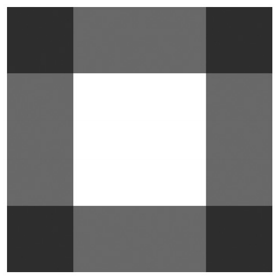

[toc]

## 未读章节

    1.1 What CSS3 Is and How It Came to Be
    2. 媒体查询
    7.3 列中内容
    9.3 多色边框
    11.4 Repeating Gradients in Firefox

## 已读章节

	1. CSS3介绍
	3. 选择符
    4. 伪类和伪元素
    6. 文本特效与排版
    7. 多列
	8. 背景图与其他装饰属性
    9. 边框与盒子特效
    11. 渐变

## 10. 颜色与透明

CSS Color Module (http://www.w3.org/TR/css3-color/)

The Color Module is a Proposed Recommendation and is pretty well implemented in every browser except Internet Explorer (at least up to version **8**).

### 10.1 opacity属性

The opacity property has the following syntax:

	E { opacity: number; }

取值0.0到1.0。0完全透明，1完全不透明。

The value of the opacity property is inherited by all of its child elements. 如果设置容器opacity值为0.5，则后代无论如何不透明度不可能更高。即后代只能比容器透明度更高，不能更低。

`opacity`属性目前被Firefox, WebKit, Opera支持。IE9计划支持。

### 10.2 新的颜色值和扩展的颜色值

CSS2.1支持三种指定颜色的方式：关键字（如`black`）、十六进制值（如`#000`）和RGB。CSS3新增两种方式。

#### alpha通道

CSS3 introduces Alpha as a value in the RGBA color model.

	E { color: rgba(red, green, blue, alpha); }

alpha取值0.0（透明）到1.0（不透明）。

Like `opacity`, RGBA color values are currently supported in Firefox, WebKit, and Opera, and are planned for inclusion with IE9.

为了兼容老的浏览器，需要指定两次颜色值：

    p {
        color: #F00;
        color: rgba(255,0,0,0.75);
    }

**Webkit中边界重叠问题**。目前在`border-color`属性上使用Alpha通道，角上会有叠加效果：

	div { border: 50px solid rgba(0,0,0,0.5); }

#### （未）Hue, Saturation, Lightness

HSL—which stands for Hue, Saturation, Lightness (sometimes called luminance)—is a cylindrical coordinate representation of RGB.

#### （未）HSLA

#### （未）The Color Variable: currentColor

### （未）10.3 Matching the Operating System’s Appearance

## 14. 3D Transformations

CSS 3D Transforms Module: http://www.w3.org/TR/css3-3d-transforms/.

需要浏览器支持硬件加速。

### 14.1 3D Elements in CSS

CSS中z轴取决于观察者：如果你觉得x轴是左右的，y轴是上下的，则z轴朝向你。即沿z轴移动元素距离为正，则靠近你；为负则远离你。

在2D的书中展示三维是困难的，因此推荐查看本书网站 http:/www.thebookofcss3.com/。推荐另一个测试页面：http://www.westciv.com/tools/3Dtransforms/。

### 14.2 Transform Style

第一个属性`transform-style`非常重要，如果不改变默认值，将不会看到三维的变换。

	E { transform-style: keyword; }

The keywordvalue can be either flat(the default) or preserve-3d. Explaining the difference is easier if I start with an example: First, I’ll create two 
elements that are identical except for the value given to transform-style:

	.div-1 { transform-style: flat; }
	.div-2 { transform-style: preserve-3d; }

## 15. 灵活的盒布局

Flexible Box Layout Module (http://www.w3.org/TR/css3-flexbox/x)基于Mozilla（包括Firefox）使用的一套语义。

在作为标准提出后，Flex Box被KHTML布局引擎（WebKit的核心）实现。Firefox的实现很老了，未能即使与标准同步。可能引发的问题我会尽量在本章中讲。IE9的预发布版也实现了该功能。需要`-ms-`前缀。

Flex Box makes elements more fluid, allowing them to resize or change position in relation to their parent or sibling elements without your needing to specify positioning or perform complex calculations. 现代Web社区期望灵活，因为必须面对多种屏幕尺寸。

### Triggering the Flexible Box Layout

## 16. 模板布局

The Template Layout Module (http://www.w3.org/TR/css3-layout/)允许我们声明列和行，就像HTML表格一样。

目前没有任何浏览器支持它。但可以通过Javascript模拟：http://code.google.com/p/css-template-layout/

### 准备Javascript

	
	

如果CSS直接潜在文档中，可以调用：

    

否则需要指出CSS文件的路径：

	

