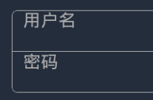

# CSS实战

## Android下input的placeholder位置问题

在Android下，input如果设置了`line-height`，占位字符的位置会出现问题。

	input {
		display: block;
		width: 80%;
		margin: 0 auto;
		outline: 0;
		height: 60px;
		padding: 0 15px;
		line-height: 60px;
		font-size: 26px;
		border: 1px solid #bbb;
		color: #EEE;
	}

解决办法是去掉`line-height`的设置。