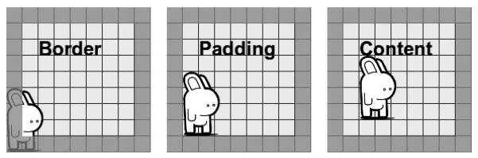
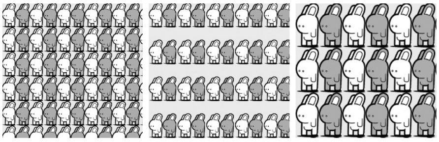
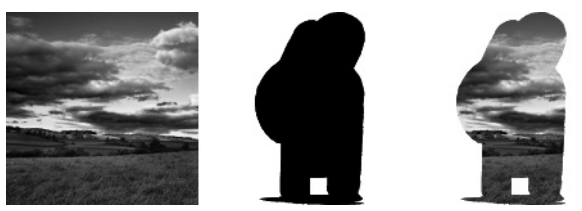
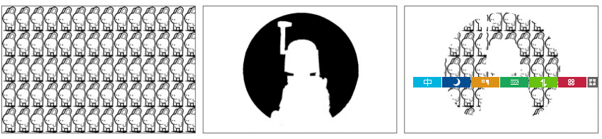

[toc]

## 背景

### 8.1 背景图像

Backgrounds and Borders Module (http://www.w3.org/TR/css3-background/).

#### 多个背景图片

现在`background-*`属性（`background-color`除外）基本都接受多个值，于是一个元素可以有多个背景图。多个值逗号分隔：

	E { background-image: value, value; }

图像列表中，先列出的图像最后绘制，或者说在最上面。

使用背景图片后，其他属性可能也需要多值，例如：

    h2 {
        background-image: url('bunny.png'), url('landscape.jpg');
        background-position: 95% 85%, 50% 50%;
        background-repeat: no-repeat;
    }

其中，95%、85%分别是水平位置和垂直位置。注意到`background-repeat`只有一个值。如果属性值比图片少，则图像使用同一属性值。

速记属性`background`也可以使用多个值。逗号分隔。

    h2 {
        background:
            url('bunny.png') no-repeat 95% 85%,
            url('landscape.jpg') no-repeat 50% 50%;
    }

`background-color`是唯一不支持多值的背景属性。颜色层总是在所有图像之下。如果使用速记属性`background`，颜色值必须放在最后一组图片前。

    h2 {
        background:
            url('bunny.png') no-repeat 95% 85%,
            #000 url('landscape.jpg') no-repeat 50% 50%;
    }

不支持多值的浏览器遇到多个的背景会忽略。为兼容，需要在多值背景前声明一个兼容背景：

    h2 {
        background: url('landscape.jpg') no-repeat 50% 50%;
        background:
            url('bunny.png') no-repeat 95% 85%,
            url('landscape.jpg') no-repeat 50% 50%;
    }

#### 图片大小

CSS3新添加的属性`background-size`可以控制图片大小。属性值可以是一对值，或单个值。

如100px宽，200px高：

	div { background-size: 100px 200px; }

长度单位可以是任意单位。如果是百分比，相对于容器尺寸而不是图片大小。若要保持图片大小，给值`auto`。

若只指定一个值，值会被解释为宽度，高度取默认值`auto`。因此下面两行等价：

    div { background-size: 100px auto; }
    div { background-size: 100px; }

`background-size`支持多个值：

    h2 {
    	background:
            url('bunny.png') no-repeat 95% 85%,
            url('bunny.png') no-repeat 70% 70%,
            url('bunny.png') no-repeat 10% 100%,
            url('landscape.jpg') no-repeat 50% 50%;
        background-size: auto, 5%, 50%, auto;
    }

规范说`background`属性中可以包含背景大小，只要位于`background-position`后。但目前没有浏览器支持。

还有两个关键字：`contain`和`cover`。`contain`表示尽可能放大图像（等比例），但高度和宽度都不要超过容器。cover表示缩放到容器的宽度或高度中较大的值。

#### 背景剪切（Clip）和原点

CSS2中，背景图像的位置相对于元素padding的外缘，and any overflow will extend underneath its border. CSS3能够进行更多控制。

`background-clip`设置盒模型的哪部分限制背景（颜色或图像）边界。

	E { background-clip: keyword; }

值有三个：border-box, content-box, padding-box。`border-box`是默认值，表示背景显示在边框后面（如果边框半透明，可以看到背景）。`padding-box`表示背景到边框为止。`content-box`表示背景到元素padding为止。{{默认不应该是`padding-box`吗？}}

This property is implemented correctly in Opera and should be in both Firefox 4 and IE9. 老版本的Firefox的实现不标准，它用`border`和`padding`替代`border-box`和`padding-box`，属性需要加`-moz-`前缀。

WebKit更复杂。老版本支持`border`和`padding`，以及`content`（对应`content-box`）。属性都要加`-webkit-`前缀。较新的版本使用`border-box`, `padding-box`, `content-box`；仍使用前缀。最新的版本，使用`border-box`和`padding-box`时不需要前缀，但用**content-box**时需要。如果你想兼容所有浏览器，需要这样写：

    h2[class$='-brdr'] {
     -moz-background-clip: border;
     -webkit-background-clip: border;
     -webkit-background-clip: border-box;
     background-clip: border-box;
    }
    h2[class$='-pddng'] {
     -moz-background-clip: padding;
     -webkit-background-clip: padding;
     -webkit-background-clip: padding-box;
     background-clip: padding-box;
    }
    h2[class$='-cntnt'] {
        -webkit-background-clip: content;
        -webkit-background-clip: content-box;
        background-clip: content-box;
    }

WebKit还支持一个非标准值：`text`。当文本背景透明时，文本将以背景图像填充。To make this work compatibly with non-WebKit browsers, we should use the `-webkit-text-fill-color` that was introduced back in Chapter 6. Here’s an example:

    h2 {
     background: url('landscape.jpg') no-repeat 50% 60%;
     -webkit-background-clip: text;
     -webkit-text-fill-color: transparent;
    }

CSS2规定背景位置的计算相对于padding。`background-origin`可以改变相对的位置。

	E { background-origin: keyword; }

`background-origin`接受的关键字与`background-clip`相同：border-box, content-box, padding-box. 例子：图片位置都是`0 100%`，即左下角，但左下角在哪里取决于`background-origin`的值。

    h2[class^='origin'] { background: url('bunny.png') no-repeat 0 100%;}
    h2[class$='-brdr'] { background-origin: border-box; }
    h2[class$='-cntnt'] { background-origin: content-box; }
    h2[class$='-pddng'] { background-origin: padding-box; }

如果`background-position`设为`fixed`，则`background-origin`无效。As with background-clip, Opera and the latest WebKit browsers have an implementation that is the same as the spec, and Firefox 4 and IE9 should have likewise. Older versions of Firefox and much older versions of WebKit have nonstandard versions of this property and have implemented the three possible values as border, content, and padding using the prefixed property, while older but pre-Safari 5 versions of WebKit require the correct values, also with the prefixed property. Therefore, to support every browser version the previous code example would have to be extended like so:

    h2[class$='-brdr'] {
     -moz-background-origin: border;
     -webkit-background-origin: border;
     -webkit-background-origin: border-box;
     background-origin: border-box;
    }
    h2[class$='-pddng'] {
     -moz-background-origin: padding;
     -webkit-background-origin: padding;
     -webkit-background-origin: padding-box;
     background-origin: padding-box;
    }
    h2[class$='-cntnt'] {
     -moz-background-origin: content;
     -webkit-background-origin: content;
     -webkit-background-origin: content-box;
     background-origin: content-box;
    }

在多背景的情况下，`background-clip`和`background-origin`都接受多个值，分别设置每个图像。

#### background-repeat

`background-repeat`之前有四个值：no-repeat, repeat, repeat-x, repeat-y。CSS3新增了两个值。

第一个是`space`，在保证图像完整的情况下背景图像尽量重复多次。多余的空间放在图片直接作为间隔。
第二个是`round`，它也是在保证图片完整的情况下尽量重复多次，然后缩放图像最终填满容器。

Although these new values are once again planned for inclusion in IE9, the only browser to implement them to date is Opera (version 10.5+), so I’ll provide an example using that browser:

    .bunny {
        background-image: url('bunny_sprite.png');
        background-repeat: repeat;
        background-size: 20%;
    }
    .space { background-repeat: space; }
    .round { background-repeat: round; }

WebKit recognizes these keywords, but treats them both incorrectly as no-repeat. Firefox ignores them and uses the previous cascaded or inherited value.

#### Background Image Clipping

CSS精灵。Mozilla has introduced a new proprietary property in Firefox 4 (Beta), which aims to get around those issues. Called `image-rect`, the syntax looks like this:

	E { background-image: -moz-image-rect(url, top, right, bottom, left); }

The W3C are considering providing a property to substitute the CSS sprites technique in a future revision of CSS3 (you can see the proposed syntax in Chapter 17), but as far as I’m aware, no final decision has yet been made on which syntax it will use.

### 8.2 Image Masks

过去几年Webkit团队创造了一些列新属性，可以归类为CSS特效。其中一些属性被W3C采纳，变成了Transform和动画。

但CSS Image Mask未被采纳。掩膜在背景之上添加一个图片层，背景以图片层的形状显示出现。如下图，三个图片分别是原背景，掩膜图像，和应用后的效果：

WebKit introduces a new set of properties that allows you to do this to any element. The syntax (which has the -webkit- prefix) is the same as the `background-*` set of properties and includes `-webkit-mask-image`, `-webkit-mask-position`, `-webkit-mask-repeat`, and so on.

例子：

    div {
        background: url('images/bunny.png');
        -webkit-background-size: 17px 30px;
        -webkit-mask-image: url('images/bw.png');
        -webkit-mask-position: 50% 50%;
        -webkit-mask-repeat: no-repeat;
        -webkit-mask-size: 100%;
    }

As with the `background-*` properties, there is also a shorthand property, `-webkit-mask`, which accepts values in exactly the same way.

    div {
        background: url('images/bunny.png');
        -webkit-background-size: 17px 30px;
        -webkit-mask: url('images/css3.png') no-repeat 50% 50%;
        -webkit-mask-size: 100%;
    }

One property that doesn’t have a `background-*` counterpart is `-webkit-maskbox-image`, which allows you to use a mask as a border. The syntax for this is based on the `border-image` property, which will be introduced in the next chapter and works in the same way. Note that here you can also use the CSS gradient syntax, which I’ll fully introduce in Chapter 11.

You can read more about the WebKit mask properties in the blog post that introduced them (http://webkit.org/blog/181/css-masks/).