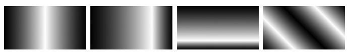
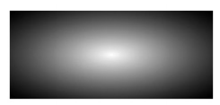
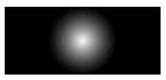
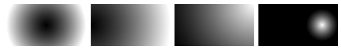
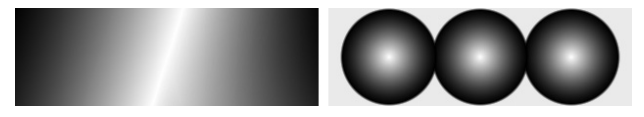

[toc]

## 渐变

属于Image Values Module (http://www.w3.org/TR/css3-images/)

Firefox与Webkit的实现有差别。其中Firefox的实现接近标准。Firefox的实现使用两个函数`-moz-lineargradient`和`-moz-radial-gradient`；而WebKit只使用一个函数`-webkit-gradient`加两组值。

Just as this book was going to print, the WebKit team implemented the W3C standard properties, with the `-webkit-` prefix: So although these properties are not in any browser as I write this, in the future you should use them. However, for the sake of backward compatibility, the current implementation that’s explained in this chapter will be kept in WebKit browsers for the foreseeable future.

### 11.1 线性渐变

#### Firefox的线性渐变

	E { background-image: -moz-linear-gradient(point or angle, from-stop, color-stop, to-stop); }

每个颜色值称为一个stop。最简单的有两个颜色，一个是fromt-stop另一个是to-stop。

例子：

	div { background-image: -moz-linear-gradient(white, black); }

上面的渐变从上到下，是由`point`值决定的。`point`是渐变开始的位置，取值类似于`background-position`；即可以是关键字（top, bottom, left, right, center）或百分比值。`point`需要两个参数（left center, top right, 0% 50%等）。但如果只指定一个，另一个默认为center（50%）。若不指定`point`值，默认为`top center`（`0% 50%`）。

    div { background-image: -moz-linear-gradient(center top, white, black); }
    div { background-image: -moz-linear-gradient(top, white, black); }
    div { background-image: -moz-linear-gradient(50% 0%, white, black); }

可以用`angle`替代`point`。Angles can be declared using a few different units: the Values and Units Module allows degrees, grads, radians, and turns. `angle`设置渐变的角度`0deg`（或`360deg`）从左到右，`45deg`从左下到右上，`90deg`从下到上等等。也可以使用负值，逆时针旋转。

	div { background-image: -moz-linear-gradient(270deg, white, black); }
	div { background-image: -moz-linear-gradient(-90deg, white, black); }

#### WebKit的线性渐变

    E { background-image: -webkit-gradient(type, start-point, end-point,
    	from(from-stop), color-stop(color-stop), to(to-stop); }

`type`取值`linear`或`radial`。起点和终点都必须指定。`from-stop`和`to-stop`通过函数`from()`和`to()`指定。

    div { background-image:
    	-webkit-gradient(linear, center top, center bottom, from(white), to(black));
    }

起点终点也可以通过百分比指定

    div { background-image:
 		-webkit-gradient(linear, 50% 0%, 50% 100%, from(white), to(black));
    }

#### 使用线性渐变

五个例子：

    .gradient-1 {
     background-image: -moz-linear-gradient(left, white, black);
     background-image: -webkit-gradient(linear, left center, right center, from(white), to(black));
    }
    .gradient-2 {
     background-image: -moz-linear-gradient(right, white, black);
     background-image: -webkit-gradient(linear, right center, left center, from(white), to(black));
    }
    .gradient-3 {
     background-image: -moz-linear-gradient(50% 100%, white, black);
     background-image: -webkit-gradient(linear, 50% 100%, 50% 0%, from(white), to(black));
    }
    .gradient-4 {
     background-image: -moz-linear-gradient(0% 100%, white, black);
     background-image: -webkit-gradient(linear, 0% 100%, 100% 0%, from(white), to(black));
    }
    .gradient-5 {
     background-image: -moz-linear-gradient(225deg, white, black);
     background-image: -webkit-gradient(linear, 100% 0%, 0% 100%, from(white), to(black));
    }

#### 添加更多的color-stop值

Firefox中只要在开始和结束颜色之间添加任意多个颜色（逗号分隔）：

	div { background-image: -moz-linear-gradient(left, black, white, black); }

The Firefox syntax will evenly distribute the color-stops along the length of the gradient unless otherwise specified.

WebKit中实现相同效果：

    div { background-image: -webkit-gradient(
     linear, left center, right center, from(black), color-stop(50%, white), to(black)
    );}

`color-stop()`函数不仅需要颜色值，也需要位置值：与Firefox不同的是，颜色分布方法不是自动计算的。

    .gradient-1 {
     background-image: -moz-linear-gradient(left, black, white, black);
     background-image: -webkit-gradient(linear, left center, right center,
    from(black), color-stop(50%,white), to(black));
    }
    .gradient-2 {
     background-image: -moz-linear-gradient(left, black, white 75%, black);
     background-image: -webkit-gradient(linear, left center, right center,
    from(black), color-stop(75%,white), to(black));
    }
    .gradient-3 {
     background-image: -moz-linear-gradient(bottom, black, white 20px, black);
     background-image: -webkit-gradient(linear, center bottom, center top,
    from(black), color-stop(0.2,white), to(black));
    }
    .gradient-4 {
     background-image: -moz-linear-gradient(45deg, black, white, black, white,
    black);
     background-image: -webkit-gradient(linear, left bottom, right top,
    from(black), color-stop(25%,white), color-stop(50%,black), colorstop(75%,white), to(black));
    }

Firefox允许使用像素指定位置。Webkit允许使用0.0到1.0之间的值替代百分比。

### 11.2 径向（Radial）渐变

从中心点向各个方向渐变。

#### Firefox的径向渐变

    E { background-image: -moz-radial-gradient(
     position or angle, shape or size, from-stop, color-stop, to-stop
    ); }

`position`、`angle`、`from-stop`、`to-stop`与`-moz-linear-gradient`使用相同。`shape`取两个关键字`circle`或`ellipse`（默认）。`size`接受6个关键字。

最简单的例子：

	div { background-image: -moz-radial-gradient(white, black); }

#### WebKit的径向渐变

    E { background-image: -webkit-gradient(
     type, inner-center, inner-radius, outer-center, outer-radius, from(fromstop), color-stop(color-stop), to(to-stop)
    );

`type`这里取`radial`。

Both inner-center and outer-center accept the same values, as do inner-radius and outer-radius. The values permitted for inner-center and outer-center are the same as those for start-point and end-point for a linear gradient—that is, a pair of values as keywords (center center) or percentages (50% 50%)—whereas inner-radius and outer-radius accept only an integer value that represents a length in pixels.

#### 使用径向渐变

Because you are required to set a limit on the outer radius, WebKit radial gradient syntax doesn’t allow you to create an elliptical gradient—they must all be circles.

    div { background-image:
     -webkit-gradient(radial, 50% 50%, 0, 50% 50%, 50, from(white), to(black));
    }

The inner gradient starts at the center of the element and has a radius value of 0, and the outer gradient starts at the same place but has a radius value of 50{{像素}}.

用Firefox重新上面的效果：

	div { background-image: -moz-radial-gradient(contain circle, white, black); }

Note two new keywords here. The first is `circle`, which is a value for the shape argument, and simply sets the gradient to be circular instead of elliptical. The next—`contain`—is a value for the size argument I mentioned earlier. The contain value means the gradient stops at the side of the box closest to its center. You can also use the keyword `closest-side` if you prefer, as these keywords are synonymous.

The other keyword constant values for the size argument are: cover, which stops the gradient at the corner of the element farthest from its center (you can also use the farthest-corner keyword, as this is synonymous with cover); closest-corner, which stops the gradient at the corner closest to its center; and farthest-side, which stops the gradient at the side farthest from its center. Pardon the tautologous definitions, but the keywords are pleasantly obvious!

You should be able to infer from this example the key difference between the two syntaxes: WebKit requires explicitly set limits, whereas in Firefox, the limits are defined by the dimensions of the element that the gradient is applied to.

    .gradient-1 {
     background-image: -moz-radial-gradient(circle farthest-side, black, white);
     background-image: -webkit-gradient(radial, center center, 0, center
    center, 95, from(black), to(white));
    }
    .gradient-2 {
     background-image: -moz-radial-gradient(left, circle farthest-side, black,
    white);
     background-image: -webkit-gradient(radial, left center, 0, left center,
    190, from(black), to(white));
    }
    .gradient-3 {
     background-image: -moz-radial-gradient(right top, circle farthest-corner,
    white, black);
     background-image: -webkit-gradient(radial, right top, 0, right top, 214.7,
    from(white), to(black));
    }
    .gradient-4 {
     background-image: -moz-radial-gradient(80% 50%, circle closest-side,
    white, black);
     background-image: -webkit-gradient(radial, 80% 50%, 0, 80% 50%, 38,
    from(white), to(black));
    }

### 11.3 多个渐变

将渐变用于background-image属性时，可以利用多个背景的能力施加多个渐变。例子：

    .linears {
        background-image:
        	-moz-linear-gradient(left top, black, white, transparent),
        	-moz-linear-gradient(right top, black, white, transparent);
        background-image:
        	-webkit-gradient(linear, left top, right bottom, from(black), colorstop(50%, white), to(transparent)),
        	-webkit-gradient(linear, right top, left bottom, from(black), colorstop(50%, white), to(transparent));
        }
    .radials {
        background-image:
        	-moz-radial-gradient(20% 50%, circle contain, white, black 95%, transparent),
        	-moz-radial-gradient(50% 50%, circle contain, white, black 95%, transparent),
        	-moz-radial-gradient(80% 50%,circle contain, white, black 95%, transparent);
        background-image:
            -webkit-gradient(radial, 20% 50%, 0, 20% 50%, 50, from(white), colorstop(95%, black), to(transparent)),
            -webkit-gradient(radial, 50% 50%, 0, 50% 50%, 50, from(white), colorstop(95%, black), to(transparent)),
            -webkit-gradient(radial, 80% 50%, 0, 80% 50%, 50, from(white), colorstop(95%, black), to(transparent));
    }

