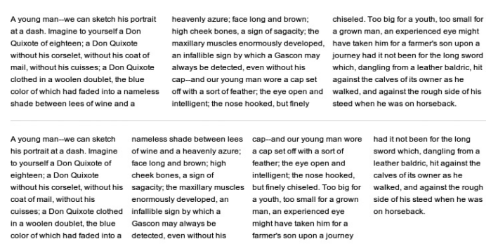
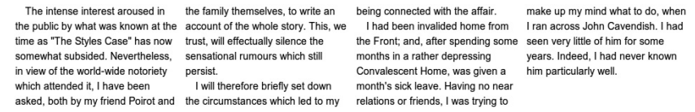
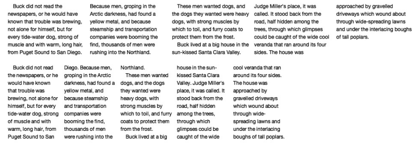
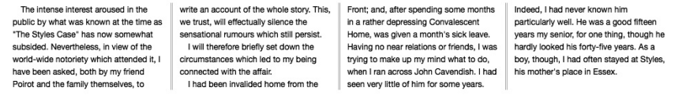

[toc]

## 多列布局

研究显示人们对过长的文本阅读困难。合适的长度大约为每行65到75个字符。

过去报纸和杂志都是多列布局。Now, with the advent of the Multi-column Layout Module in CSS3 (http://www.w3.org/TR/css3-multicol/), websites can take advantage of multiple columns, too. The Multi-column Layout Module currently has Candidate Recommendation status, meaning the module is considered pretty complete.

### 7.1 列布局方法

两种方法：设置列数，或指定列宽，让浏览器计算多少列适合父容器宽度。

#### column-count

将内容等分成多个列：

	E { column-count: columns; }

选择符E是内容的容器元素。`columns`是整数，即列数，如2列：

	div { column-count: 2; }

目前Firefox和Webkit都支持多列属性，但Firefox的实现不太标准。在渲染上二者都有差异。As these are still somewhat incomplete compared to the specification, both browsers use their proprietary prefixes.

#### column-width

	E { column-width: length; }

长度单位是像素、em或百分比。

	div { column-width: 100px; }

It uses the 100px as a minimum value and makes each column slightly wider (in this case, 105px) and the resulting gap between each column wider (in this case, a fraction over 15px) so the total width matches that of its parent.

#### Firefox和WebKit中不同的分布算法

Firefox和WebKit的分布算法不同。Firefox尽量让多数列具有相同的行数，最后一列比其他的长一点或短一点。WebKit让所有列行数尽量相等。下面分别是Firefox和Chrome的分布效果：

The W3C addressed this in later versions of the specification with the `column-fill` property:

	E { column-fill: keyword; }

关键字`auto`，效果如Firefox；`balance`效果如WebKit。默认值是`balance`。However, neither of the browsers actually implements this property yet, so until they do you’ll just have to be aware of the different approaches when working with columns.

#### 组合column-count和column-width

同时设置时，`column-count`作最大值使用。宽度按需调整以适应容器。

WebKit implements this rule incorrectly, however, and instead creates five columns of 100px each, leaving empty white space, as shown in Figure 7-8. The first example shows Firefox’s correct interpretation of the spec; the second example shows WebKit’s incorrect interpretation. As these properties use proprietary prefixes, however, there is an opportunity for this inconsistency to be corrected before the final implementation of the nonprefixed properties.

If you want to use these two properties together, a shorthand property is available:

	E { columns: column-width column-count; }

This property is currently only implemented in WebKit browsers (again, with its proprietary prefix), so if you use the values from Figure 7-8, the required code would be:

	div { -webkit-columns: 100px 5; }

### 7.2 列间空白与分割线

When using a prescriptive multi-column layout, 浏览器在列之间默认放1em间隔。(Remember that when using dynamic layouts, as in Figure 7-5, 1em is the minimum width.) 可以自己指定列间隔，通过`column-gap`和`column-rule`。

`column-gap`设置列间隔。单位可以是任意CSS单位。

	div { column-gap: 2em; }

`column-rule`在列之间绘制一条分割线。`column-rule`实际是三个属性的缩写：`column-rule-width`、`column-rule-style`和`column-rule-color`。这三个属性的取值与等价的`border-*`属性类似。

    E {
     column-rule-width: length;
     column-rule-style: border-style;
     column-rule-color: color;
     column-rule: length border-style color; /* Shorthand of previous 3 */
    }

例如：

    div {
     column-rule-color: red;
     column-rule-style: solid;
     column-rule-width: 1px;
    }

或：

	div { column-rule: 1px solid red; }

    .columns {
     column-count: 4;
     column-gap: 2em;
     column-rule: 0.3em double silver;
    }

两个列之间的距离为2.3em，即空白与分割线宽度和。

