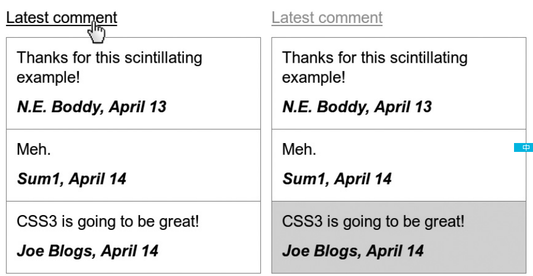

[toc]

## 选择符

CSS3增加了三个attribute选择符和一个combinator（a selector that joins other selectors together，如CSS2的child combinator (>)）。这些选择符定义在模块Selectors Level 3 Module (http://www.w3.org/TR/css3-selectors/)。

### 类型选择符

类型选择符，或称标签选择符，元素选择符。

CSS3中类型选择符允许带一个可选的命名空间前缀。This may be prepended to the element name separated by the namespace separator with a vertical bar. Here is an example:

    @namespace foo url(http://www.example.com); /* declaring a namespace */
     foo|h1 { color: blue } /* matches h1 in the "http://www.example.com" namespace */
     foo|* { color: yellow } /* matches all elements in the "http://www.example.com" namespace */
    |h1 { color: red } /* matches all h1 elements, no namespace */
     *|h1 { color: green } /* matches all h1 elements, with or without a namespace */
     h1 { color: green } /* similar as above*/

CSS3 also specifies a “universal selector” in the form of an asterisk, which represents the qualified name of any element type. It represents any single element in the document tree in any namespace (including those without a namespace) if no default namespace has been specified for selectors. If a universal selector is not the only component of a sequence of simple selectors or is immediately followed by a pseudo-element, then the * may be omitted and the universal selector’s presence implied.

`*[hreflang|=en]` and `[hreflang|=en]` are equivalent,
`*.warning` and `.warning` are equivalent,
`*#myid` and `#myid` are equivalent

### 后代选择符

后代（descendant）选择符。后代指身后各代孩子，包括儿子，孙子，重孙……多个选择符用空白符分隔。

要只选择后面一代，使用儿子（child）选择符。用**大于号**分隔。

### 兄妹选择符（Combinator）

General Sibling Combinator是CSS2的Adjacent Sibling Combinator扩展。

    E+ F{} /* Adjacent Sibling Combinator */
    E~ F{} /* General Sibling Combinator */

Adjacent Sibling selects any element (F) that is immediately preceded by element (E) on the same level of the document tree, but General Sibling selects any element (F) that is preceded by element (E) on the same level of the tree, regardless of whether it is immediately adjacent.

例子：

	h2 + p { font-weight: bolder; } /* Adjacent Sibling */
    h2 ~ p { font-style: italic; } /* General Sibling */
    (1)
Next we're going to discuss...

       <h2>Ren&eacute; Descartes</h2>
    (2)
A highly influential French philosopher...

    (3)
He once famously declared:

       <blockquote>
    (4)
I think, therefore I am.

       </blockquote>
    (5)
However, this presumes the existence of the speaker.

使用Adjacent Sibling Combinator，只能匹配到2，使用General Sibling Combinator将匹配到2、3和5。

### Attribute选择符

> 在HTML文件中，attribute selector是大小写不敏感的；对于XML文档，是大小写敏感的。

CSS2已定义了四个Attribute选择符：

1、特性存在选择符（Simple Attribute Selector）。匹配具有某个特性的元素。如`p[title]`匹配有title特性的p。特性可以有任意值，但不能为空，如`
`不匹配。

2、特性含有单词选择符（Partial Attribute Value Selector）。匹配特性中含有指定单词的元素。例如`p[title~="paragraph"]`匹配title特性中含有单词`paragraph`的元素。单词用空格分隔。例如可以匹配`
`。

3、特性值选择符（Exact Attribute Value Selector）。匹配特性的值为指定值的元素。须全部匹配，包括空白符。例如`p[title="#4   paragraph"]`匹配`p[title="#4   paragraph"]`。

4、语言特性选择符（Language Attribute Selector）。根据lang特性的值匹配。如`a[lang|='es']`能够匹配后两个：

    <li><a href="" lang="en-GB" rel="friend met">Peter</a></li>
    <li><a href="" lang="es-ES" rel="friend">Pedro</a></li>
    <li><a href="" lang="es-MX" rel="contact">Pancho</a></li>

CSS3定义的Attribute选择符：

1、匹配以某个字符串开头的特性（Beginning Substring Attribute Value Selector）：

	E[attr^='value'] {}

例子，向外链添加前缀图标：

	a[href^='http'] {
        background: url('link-go.png') no-repeat left center;
        display: inline-block;
        padding-left: 20px;
    }

2、匹配以某个字符串结尾的特性（Ending Substring Attribute Value Selector）：

	E[attr$='value'] {}

例子：给不同文件类型添加不同背景：

    a[href$='.pdf'] { background-image: url('pdf.png'); }
    a[href$='.doc'] { background-image: url('word.png'); }
    a[href$='.rss'] { background-image: url('feed.png'); }

匹配含有指定字符串的特性（Arbitrary Substring Attribute Value Selector）。注意与CSS2的整词匹配的区别。

	E[attr*='value'] {}

可以使用多个特性选择符，如`a[href="http://www.example.com"][target="_blank"]`。与类型选择符一样，特性选择符也支持命名空间。

IE6不支持特性选择符。IE7支持。

### 3.5 结构上的伪类

{{下面的选择符，一般组合使用，即前面会指定父元素是谁，如`.div .nth-child(2n)`}}

在此分类下CSS2只有一个`:first-child`伪类：

	E:first-child {}

CSS3添加了11个结构相关的伪类。

#### 3.5.1 `nth-*`伪类

基本结构是`E:nth-*(kn+a) {}`（这是结构，不是真的伪类）。`n`表示从0,1,2,...序列。`k`用作乘数，如`2n`表示2,4,6,...。a是正负数，如`2n+1`产生序列1,3,5...。`3n–1`产生序列2,5,8...。

    E:nth-*(n) {}
    E:nth-*(2n) {}
    E:nth-*(3n) {}
    E:nth-*(n+1) {}

第一个例子只使用`n`，相当于只使用`E`，即选择所有E元素。第二个例子每2个E选择一个，第三个每3个选择一个。

还有两个特殊的关键字：

    E:nth-*(even) {}
    E:nth-*(odd) {}

##### 3.5.1.1 `nth-child`和`nth-of-type`

其中最简单的是`nth-child`和`nth-of-type`。`nth-child`根据它是父元素的第几个孩子筛选。`nth-of-type`则基于父元素的某类孩子中的第几个。

    E:nth-child(n) {}
    E:nth-of-type(n) {}
    E:nth-child(2n) {}
    E:nth-of-type(2n) {}

例子：

    (1) p:nth-child(2n) { font-weight: bolder ; }
    (2) p:nth-of-type(2n) { font-weight: bolder; }

    

        <h2>The Picture of Dorian Gray</h2>
        
The artist is the creator...

        
To reveal art and conceal the artist...

        
The critic is he who can translate...

    

div元素有4个孩子，一个h2和三个p。`nth-child(2n)`选出第一个和第三个p。`nth-of-type(2n)`忽略h2，只考虑三个p，因此只有第二个p被选中。

例子：

    tbody tr:nth-of-type(even) { background-color: #DDD; }
    thead th, tbody td { text-align: center; }
    thead th:nth-child(-n+2), tbody td:first-of-type { text-align: left; }

负值`(-n)`产生负数序列：0,-1,-2,...。使用负序列时一般会加一个正值，如这里的`+2`，即只选择第一个和第二个元素。

##### 3.5.1.2 `nth-last-child`和`nth-last-of-type`

`nth-last-child`和`nth-last-of-type`伪类与`nth-child`和`nth-of-type`接受相同的参数,只是它们从最后一个元素向前算。

例如选择表格最后两行：

	tbody tr:nth-last-child(-n+2) { font-style: italic; }

#### 3.5.2 `first-of-type`, `last-child`, `last-of-type`

`first-of-type`与CSS2的`first-child`类似。In practice, however, they are as different as nth-child and nth-of-type.

`first-of-type` is more specific, applying only to the element that is the first child of the named type of its parent. A pair of counterpart pseudo-classes is also available, `last-child` and `last-of-type`, which—as you might have guessed—select the last child element or the last child element of that type, respectively, of the parent.

#### 3.5.3 `only-child`、`only-of-type`

These two pseudo-classes are used to select elements in the document tree that have a parent but either no sibling elements (`only-child`) or no siblings of the same element (`only-of-type`).

例子：

	p:only-of-type { font-style: italic; }
	p:only-child { text-decoration: underline; }

    <h2>On Intelligence</h2>
    
Arthur C. Clarke once said:

    <blockquote>
    	
It has yet to be proven that intelligence has any survival value.

    </blockquote>

### 3.6 其他伪类

#### 3.6.1 target

链接有时链接到页面的某个元素。如：

    <h4 id="my_id">Lorem ipsum</h4>
    <a href="http://www.example.com/page.html#my_id">Lorem</a>

`target`伪类allows you to apply styles to the element when the referring URI has been followed. 例如，若想在点击链接后向目标应用样式，可以{{就像在说，当`#my_id`成为链接的目标时应用如下样式}}：

	#my_id:target {}

另一个例子，如博客的评论：

    

     
Thanks for this scintillating example!

     
N.E. Boddy, April 13

    

有链接可以链接到评论：

	
<a href="#comment-02">Latest comment</a>

点击链接时，高亮目标：

	.comment:target { background-color: #DDD; }

下图战时效果。左边是链接点击前的效果。右边是链接点击后，目标改变背景色。

#### 3.6.2 empty

`empty`选择没有后代（包括文本）的元素。如：

    <tr>
        <td></td>
        <td>Lorem ipsum</td>
        <td></td>
    </tr>

	td:empty { background-color: red; }

第一个`td`会被选中。

#### 3.6.3 root

root伪类选择文档树中第一个元素，一般对XML用处较大——HTML中根元素总是html元素。在HTML中root的一点作用是，比单个html元素的选择性高一级，which could be useful if you need to override the simple type selector:

    html {} /* Specificity: 1; */
    html:root {} /* Specificity: 2; */

Let’s say you’re creating a base stylesheet and want to set a property on the html element, which shouldn’t be altered; in this case, you would use something like this:

	html:root { background-color: black; }

The higher specificity gives precedence over any other properties applied to the html element, such as:

	html { background-color: white; }

#### 3.6.4 not

选择所有元素，除了not参数指定的：

	E :not(F) {}

例如，选出div所有后代，p除外：

	div > :not(p) { color: red; }

再比如让除第一段之外的所有段落斜体：

    

     
Lorem ipsum dolor sit amet...

     
Nunc consectetur tempor justo...

     
Nunc porttitor malesuada cursus...

	

	p:not(:first-child) { font-style: italic; }

例子：

	a[href^="http://"]:not([href^="http://mysite.com"])

传入`not`的参数只能是单个选择符，因此combinators (such as `+` and `>`)和伪元素不能用。

一个选择符只能使用not一次，不能使用多次。如：

	a[href^="http://"]:not([href*="google.com"]):not([href="yahoo.com])

#### 3.6.5 UI元素状态

Although HTML5 proposes a new range of UI elements (such as `command`), HTML4中只有`form`元素可以拥有状态：

    <textarea disabled="disabled"></textarea>
    <input checked="checked" type="checkbox">

The textarea has a `disabled` attribute, and the input of type checkbox has a `checked` attribute. 不带`enabled`特性的元素默认未被禁用，即`enabled`, so an enabled pseudo-class is also available, giving you three user-state pseudo-class selectors:

    :checked {}
    :disabled {}
    :enabled {}

The specification notes that an idea is under consideration by the W3C to feature a fourth UI element state of indeterminate, which would be used in the occasional circumstance in which an element could be either enabled or disabled or has not yet been set into one of these states. At the time of writing, indeterminate is not an official part of the CSS3 specification.

### 3.7 伪元素

pseudo-elements go further and allow you to apply styles to elements that don’t exist in the tree at all.

CSS2有四个伪元素：`:first-line`和`:first-letter`选择文本节点中的子元素；`:after`和`:before`，向元素的开始和末尾添加样式。CSS3没有引入新的伪元素，但稍微修改了定义，引入了新的语法以区别伪类。

CSS3中伪元素前缀两个冒号`::`，如：

    ::first-line {}
    ::first-letter {}
    ::after {}
    ::before {}

为向后兼容，单冒号的版本仍然可用，但已不推荐使用。

#### selection伪元素

At one stage in the formation of the CSS3 Selectors module, a proposal was made for a selection pseudo-element, which could be used to apply rules to an element that the user had selected in the browser (for example, a portion of a text node):

	::selection {}

Only a limited number of properties can be applied with selection: color, background-color, and the background shorthand (although not background-image). Using selection, you can do something like this:

    p::selection {
        background-color: black;
        color: white;
    }

Although at the time of writing selection has been dropped from the specification and its future would appear to be unknown, Opera and WebKit have already implemented it, Firefox has implemented it with the `-moz` prefix, and it’s expected to appear in IE9—so despite it no longer being part of the specification, you can continue to use it.

