[toc]

## 文本

参考：

- https://msdn.microsoft.com/library/jj680149(v=vs.85)

CSS使用笛卡尔坐标系统。默认原点在左上角。有些CSS属性允许改原点位置。

### text-shadow

使用文本投影使文本醒目并给予文本深度。使用 text-shadow 添加对比度并改进图像或颜色背景上的文本的可读性。

```css
E { text-shadow: x y blur-radius color; }
```

x和y分别设置相对于文本的水平和垂直偏移。
阴影颜色可以省略，默认从父继承{{父元素的text-shadow继承，还是继承文字的颜色？}}。
可以指定羽化半径，或省略。若不指定默认是0。

在颜色参数前，羽化参数后，可选支持**扩散距离**（spread distance）参数。如果是正值，则阴影形状以指定半径向各个方向扩大。如果是负值，则阴影收缩。（请注意，可能不是所有浏览器都支持这个值。）

偏移可以是0或负数：

```css
.one { text-shadow: -3px -3px #BBB; }
.two { text-shadow: -5px 3px #BBB; }
.three { text-shadow: -5px 0 #BBB; }
```

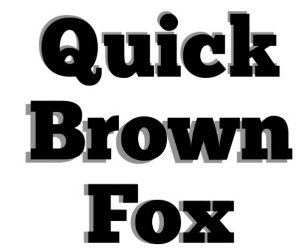

```css
.one { text-shadow: 3px 3px 3px #BBB; }
.two { text-shadow: 0 0 3px #000; }
```

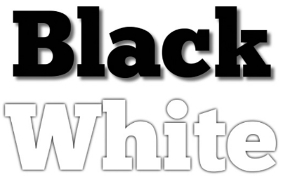

#### 扩散

效果例子：


具有正扩散距离的 text-shadow 属性的效果通常可以通过绘制足够的零扩散阴影进行模仿。

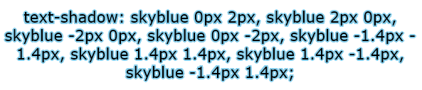

扩散参数使得完成此效果更为容易。当该参数使用负值时，你还可以使用该参数创建其他方式无法实现的效果，如下例所示：

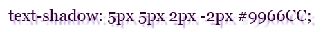

为兼容不支持扩散的浏览器，要多声明一个不用扩散的版本。

```css
.shadow7 {
    color: black;
    text-shadow: #99FFCC 0px 0px 10px; /* for browsers without spread support */
    text-shadow: #99FFCC 0px 0px 10px 10px; /* for browsers with spread support */
}
```

不支持和支持扩散的效果如下：


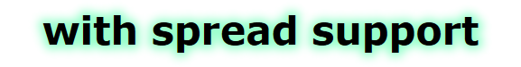

#### 多阴影

多个阴影逗号分隔。从前向后堆叠。

```css
E { text-shadow: value, value, value; }
```

例子：

```css
.one {
    text-shadow:
    0 -2px 3px #FFF,
    0 -4px 3px #AAA,
    0 -6px 6px #666,
    0 -8px 9px #000;
}
.two {
    color: #FFF;
    text-shadow:
    0 2px rgba(0,0,0,0.4),
    0 4px rgba(0,0,0,0.4),
    0 6px rgba(0,0,0,0.4),
    0 8px 0 rgba(0,0,0,0.4);
}
```
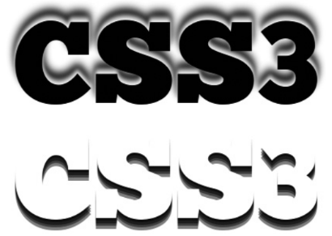

#### 文字内嵌特效

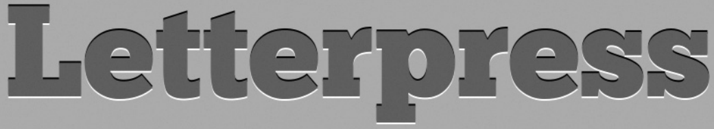

需要四种颜色明暗，假设四种颜色按从明到暗的顺序编号1234。则1和4用于阴影（高亮和暗部），3用于文字，2用于背景。

```css
body { background-color: #565656; }
h1 {
    color: #333;
    text-shadow: 0 1px 0 #777, 0 -1px 0 #000;
}
```

#### 更多效果

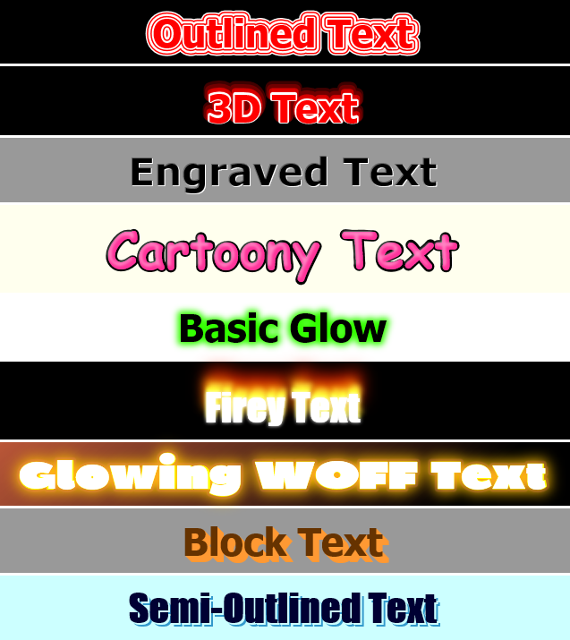

### 轮廓：text-outline 和 text-stroke

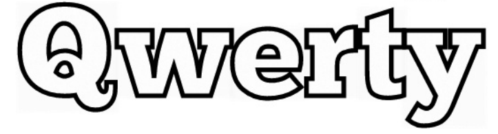

`text-outline`控制文字轮廓（描边，stroke）。

```css
E { text-outline: width blur-radius color; }
```

例子：

```css
h1 { text-outline: 2px 4px blue; }
```

目前没有任何浏览器实现`text-outline`。但WebKit提供了一个替代属性：`text-stroke`。

实际上有四个相关属性。`text-fill-color`控制填充。`text-stroke`是`text-stroke-width`和`text-stroke-color`的缩写。

```css
E {
    -webkit-text-fill-color: color;
    -webkit-text-stroke-color: color;
    -webkit-text-stroke-width: length;
    -webkit-text-stroke: stroke-width stroke-color;
}
```

`text-fill-color`目的是允许浏览器降级。若不指定该属性，文字将继承color或使用指定的color。例如，如果把color设为与背景相同色，用stroke令文字出现。但如果浏览器不支持`text-stroke`文字将不会显示。`text-fill-color`可以避免该问题（不要修改color）。

注意，过大的`text-stroke-width`会令文字难看。

### 其他属性

#### 限制溢出

有时需要限制文本单行、固定宽度。CSS3提供`text-overflow`属性：

	E { text-overflow: keyword; }

关键字可以是clip或ellipsis。默认值是clip，超出的文字被简单阶段。ellipsis，超出的部分阶段，之前加三个点。例子：

    p {
     overflow: hidden;
     text-overflow: ellipsis;
     white-space: nowrap;
    }

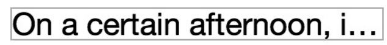

On this p element, I’ve set the overflow to hidden to prevent the content showing outside of the border, the white-space to nowrap to prevent the text from wrapping over multiple lines, and a value of ellipsis on the text-overflow property. You can see the result in Figure 6-9.

This property is already implemented in Internet Explorer and WebKit, and in Opera with the `-o-` prefix.

#### 调整元素大小

Although not actually in the Text Module, another new property is useful for elements whose contents are wider than their container. The resize property gives users control over an element’s dimensions, providing a handle with which a user can drag the element out to a different size.

The property has the following syntax:

	E { resize: keyword; }

The keyword values state in which direction the element can be dragged: `horizontal` or `vertical`, `both`, or `none`. In the following example, I’ll show a p element with the value of both on the resize property, using this code:

    p {
     overflow: hidden;
     resize: both;
    }

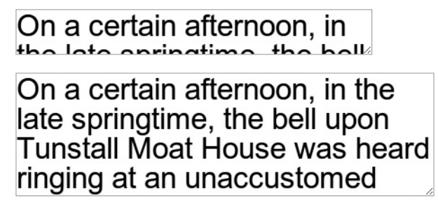

All WebKit browsers currently support resize, and it’s also planned for inclusion in Firefox 4. In supporting browsers it has the value both set on textarea elements by default.

#### Wrapping Text

##### word-wrap

`word-wrap`指定是否允许在单词中间换行，防止单词超出父元素。

	E { word-wrap: keyword; }

关键字可以是`normal`或`break-word`。前者只允许在单词之间换行。第二个允许在单词中间换行。二者对比如下：

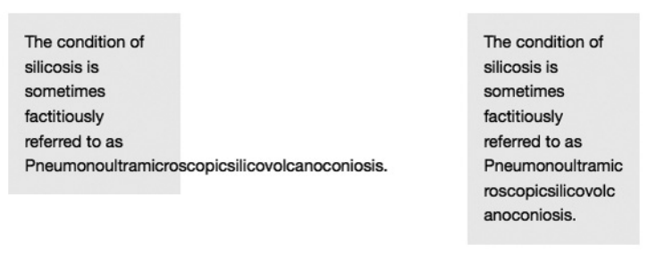

##### text-wrap

The `text-wrap` property functions in a similar way but sets wrapping preferences on **lines** of text rather than on single words. Here’s the syntax:

	E { text-wrap: keyword; }

接受四个关键字：normal, none, unrestricted, suppress。The default is normal, which means wrapping will occur at any regular break point, according to the particular browser’s layout algorithm, whereas none will prevent all wrapping. suppress will prevent wrapping unless there is no alternative; if no sibling elements are available with more convenient break points, then breaks are allowed to occur in the same way as the normal value. The final value is unrestricted, which means the line may break at any point without limitations.

If text-wrap is set to either normal or suppress, you can also apply the word-wrap property. For example, if you want no wrapping to occur but want to allow words to be broken if necessary, you’d use this combination:

    E {
     text-wrap: suppress;
     word-wrap: break-word;
    }

As of this writing, text-wrap remains unimplemented.


