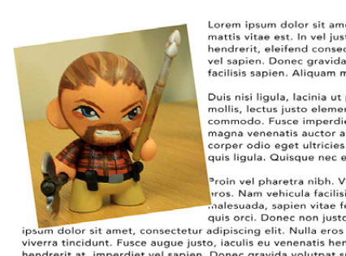

[toc]

动画/变换包括三个模块：CSS3 Transforms、CSS3 Transitions、CSS3 Animation。

WebGL is not CSS Animation. WebGL is a JavaScript 3D API that manipulates drawings in the `<canvas>` element.

## 2D变换

有四个主要的变换函数：translate, rotate, scale, skew。这些函数通过组合进`matrix`变换函数。

我们将要变换的页面：

	<!DOCTYPE html>
	<html>
	<head>
	<title > Simple CSS3 Transformation</title>
	</head>
	<body>
	
  Lorem ipsum dolor sit amet, consectetur adipiscing elit. Suspendisse eu mi tellus. Vestibulum tortor erat, facilisis in auctor semper, pharetra quis mi...

	</body>
	</html>

### 原点

用`transform-origin`可以改变变换的原点。默认在中心。其取值与`background-position`类似。两个值分别表示水平和垂直偏移。可以使用关键字和数值，可以使用关键字(top, center, bottom, left, right)。位置可以位于元素之外！如：

例如，原点放在左上角，可以表述为等价的三种形式：

	transform-origin: left top;
	transform-origin: 0 0; // 像素
	transform-origin: 0% 0%;

### 旋转

旋转图片。可以是浮点数。正负值分别表示顺时针和逆时针变换。

	

单位：

- `deg`： 360度，如`rotate(90deg)`。
- `grad`：用于简化计算：一圈算400grad。如`rotate(100grad)`。
- `rad`： 一圈2π。如`rotate(1.57rad)`。
- `turn`：表示一圈。如`rotate(.25turn)`。

使用`rotate`一些注意问题：

- 页面上的其他内容的布局不受变换影响。因此可能出现交叠。
- DOM不受影响。被变换的元素的属性值（如`offsetWidth`）保持不变。
- CSS transformations本质上对变换元素进行相对定位；元素原来位置保持不动。
- 如果`overflow`设为`scroll`或`auto`，因变换导致的溢出会导致滚动条出现。
- 其他CSS规则在变换前施加，特效会随着旋转。
- 值总是要带单位，即使是0。

若需要绕右上角转到，需要设置`transform-origin`：

	img.tilt {
		width: 300px; height: 300px; float: left;
		transform-origin: right top;
		transform: rotate(−10deg);
	}

**Webkit CSS3 Transform 反锯齿问题**

早起版本的Chrome和Safari（到5.1）有一个渲染的BUG：变换一些元素时，浏览器不会对旋转或斜切（**skewed**）后的HTML 内容的边缘进行抗锯齿处理。于是图像边缘会有锯齿。解决改问题的办法有：

- 在元素周围加1像素白边。
- 对元素应用`webkit-backface-visibility: hidden;`
- 向元素应用其他的变换，如`-webkit-transform: rotate(−10deg) translateZ(0);`.

### 缩放

`scale`函数的参数是乘数。如`scale(2)`长宽放大2倍。`scale(.5)`长宽缩小一倍。

利用负值可以反转图像。例如左右反转：

	

水平和垂直方向可以独立缩放，例如：

	transform: scale(.5,2);

或者使用独立的函数：`scaleX`用于水平缩放、`scaleY`用于垂直缩放。

### 平移

`translate(x, y)`沿水平和垂直方向移动元素。`translateX()`沿水平移动；`translateY()`垂直移动。

	img.tilt {
		width: 300px; height: 300px; float: left;
		transform: translate(50px, -4em);
	}

例如，在一些UI设计中，当用户点击按钮时，按钮向左下方轻微移动，模拟现实中按钮被按下的样子。利用`translate`函数作用于`:active`状态：

	.button:active {
		translate(1px, 2px);
	}

CSS3还提供了两个独立的函数`translateX`和`translateY`。

### 斜切（Skew）

`transform: skewX(21deg)`设置元素的左右两边相对垂线偏移21度，即整个元素向右斜切。

	img.tilt {
		width: 300px; height: 300px; float: left;
		transform: skewX(21deg);
	}

> Visit http://westciv.com/tools/transforms/index.html to play with an online tool for visualizing CSS transforms

拉伸也有两个独立的函数：`skewX`和`skewY`。

### 组合Transformations

两种组合方式：`transform`属性中空格分隔多个函数；或作为matrix属性的值。

空格分隔的多个`transform`属性值：

	img.tilt { width: 300px; height: 300px; float: left;
		transform: translate(50px, -4em) rotate(15deg); }

The process for merging transformations as values for a` matrix` property is significantly more complicated. Matrix transformations are a little beyond the scope of this book; it’s easiest to use a tool to generate the code. The Useragentman Matrix Construction Set (www.useragentman.com/matrix/) and CSS3 Transform Matrix Calculator (www.leeourand.com/test/transform/test/ransform.html) offer two ways of doing so. An explanation of matrix transformations can be found at The CSS Matrix Transform for the Mathematically Challenged (www.useragentman.com/blog/2011/01/07/css3-matrix-transform-for-the-mathematically-challenged/) and at the Opera Web Developer site (http://dev.opera.com/articles/view/understanding-the-css transforms-matrix). While they have the advantage of being shorter and more efficient, matrix transforms are not human-readable, so I won’t use them for the examples in this book.

写多个`transform`属性不会组合变换！最后一个变换声明会覆盖前面的。

	img.tilt { width: 300px; height: 300px; float: left;
		transform: translate(50px, -4em);
		transform: rotate(15deg); }

## 3D变换

拥有3D背景的设计者最好不要抱太高期望：标准未涉及光源、摄像机、着色器（shader）。3D导航非常有限，旋转视口是不可能的。

透视是观察者距离屏幕的距离。对父容器设置了perspective后。子元素的translateZ值越小，子元素大小越小（离观察者相对远）；translateZ值越大元素大小越大。当translateZ值非常接近perspective，该元素的大小就会撑满整个屏幕。但当translateZ继续增加后，元素就看不到了！

### 资料

For a short introduction to 3D transforms, visit http://coding.smashingmagazine.com/2012/01/06/adventures-in-thethird-dimension-css-3-d-transforms/ and http://blogs.msdn.com/b/ie/archive/2012/02/02/css3-3d-transforms-in-ie10.aspx. To see some great examples of 3D transforms in action, visit these sites:

- One of the first examples of the power of 3D Transformations, Apple’s Morphing Power Cubes page (www.webkit.org/blog-files/3d-transforms/morphing-cubes.html) demonstrates a rotating cube, which you can change into a rotating set of tiles.
- Another great demo from Apple, the Horizontal 3D picture gallery (https://developer.apple.com/safaridemos/showcase/gallery/) lets you flip, carousel-like, through a series of photos.
- Snow Stack: Use left and right arrow keys to send an endless gallery of photos shooting by: http://www.satine.org/research/webkit/snowleopard/snowstack.html.
- The 2011 BeerCamp website (http://2011.beercamp.com) provides an innovative way to navigate by moving pages “forward” and “backward” through space.

## Transition

CSS Transitions 是最简单形式的动画：从一个可视状态变换到另一个可视状态。如果需要更多状态，需要使用关键帧动画。

例子：鼠标以上后，图片旋转。

	img.tilt:hover {
		transform: rotate(7.5deg);
		transition: 2s all;
	}

值顺序不重要。可以是`2s all`或`all 2s`。若时间需要精确到毫秒，可以使用小数加秒`transition: 2.35s all;`的形式，或毫秒形式`transition: 2350ms all;`。

当鼠标移出时，元素**立即**回到了其初始状态。但有时你期望恢复初始状态也有平滑的动画。方法是将`:hover`中`transition`声明移到默认样式中，`:hover`中**只**保留`transform`部分的声明。不再有`transition`声明。背后的原理是，将一个属性放入默认样式，不管进出状态，transition都生效。

	img.tilt {
		width: 300px; height: 300px; float: left;
        transition: 2s all;
	}
	img.tilt:hover {
		transform: rotate(7.5deg);
	}

如果在动画过程中鼠标移出或移入，transition会被打断，会平滑的反转。这个特性非常好！

`transition`中可以只指定时间：

	img.tilt {
		width: 300px; height: 300px; float: left;
		transition: 2s; }
	img.tilt:hover {
		transform: rotate(7.5deg);
	}

一般会把CSS属性`transition`放入默认样式（如`.navButto`）而不是最终样式（如`.navButton:hover`）。但对于下拉菜单，下列也可以缓慢动画，但收起最好非常快的完成，为此，可以在默认样式中使用

	transition-delay: 5s;

但在最终样式（:hover）覆盖：

	transition-delay: 0;

只要CSS属性改变都可以触发CSS transitions，包括通过Javascript改变CSS属性。参见：www.netmagazine.com/tutorials/get-more-out-your-css-transitions-jquery。

**不是所有的CSS属性都可以参与动画**。可以参与的属性包括，上一节到transformations；color, background-color, border-color, border-width, font-size, height, width, letterspacing, line-height, margin, opacity, padding, word-spacing; 定位属性，top, left, right, and bottom。You can find a complete list at **www.w3.org/TR/css3-transitions/#animatable-properties**.

> You don’t need an `-m` svendor prefix for Internet Explorer since IE 9 and earlier don’t understand transitions, and IE 10 understands the non-prefixed versions of the transition properties.

CSS transitions包含四个控制属性，分别控制参与动画的属性、动画时间、动画类型、延迟时间（可选）。例子，在两个颜色间动画：

	.navButton {
		background-color: orange;
		transition-property: background-color;
		transition-duration: 1s;
	}
	.navButton:hover {
		background-color: blue;
	}

`transition-property`指定参与动画的属性。多个属性逗号风格。值`all`表示动画所有改变的CSS属性。

	transition-property: color, background-color, border-color;

`transition-duration`属性指定动画时间。单位可以是秒或毫秒。

	transition-duration: .5s;
	transition-duration: 500ms;

每个属性的动画时间可以不同。为此，需要对应使用`transition-duration`和`transition-property`（逗号分隔），如：

	transition-property: color, background-color, border-color;
	transition-duration: .25s, .75s, 2s;

### 延时

通过向`transition`添加延时可以延迟一个transition，或者把延迟时间直接加到`transition`后面：

	transition: 2s 4s;

演示不仅对动画开始有效，对动画反转回到起点也有效。例如上面的代码，鼠标移到图片上后，动画会延迟4秒后开始；结束后会延迟4秒后再回到起始状态。（注意，鼠标在图片上停留至少4秒动画才会开始。{{因为一旦移出，进入反转动画状态。}}）

	transition-delay: .5s;

有时不想让所有属性都延时触发，可以为每个属性分别指定延时：

	transition-property: color, background-color, border-color;
	transition-duration: 1s, 1s, .5s;
	transition-delay: 0, 0, 1s;

### 动画多个属性

例如下面的例子，transform和opacity属性都会参与动画：

	img.tilt {
		width: 300px; height: 300px; float: left;
		transition: 2s;
	}
	img.tilt:hover {
    	transform: rotate(15deg);
		opacity: .3;
	}

属性的动画时间可以不同。利用`transition-duration`和`transition-property`。例子。设置`position: relative;`使得可以利用`left`偏移一个元素。

	img.tilt {
		width: 300px; height: 300px; float: left; position: relative;
		transition-property: opacity, left;
		transition-duration: 2s, 4s;
	}
	img.tilt:hover {
		opacity: .2; left: 60px;
	}

在某些浏览器中左右移动的动画可能不够流畅。使用translateX替代left，会更流畅，适合移动绝对或相对定位的元素（注意transition-property中出现的时`translateX`，不是`transform`）：

	

### Easing函数

之前的动画有渐入渐出（ease in/ease out）效果：先加速、再匀速、最后减速。现实世界中的事物运动多是如此。

CSS3动画默认使用`ease`。可以使用其他缓动，如`linear`：

	img.tilt {
		width: 300px; height: 300px; float: left;
		transform: rotate(7.5deg);
		transition: 2s transform linear;
	}

独立的属性是`transition-timing-function`。改属性可以取五个值：linear, ease, ease-in, ease-out, ease-in-out. 若不指定该属性，默认使用`ease`。

	transition-timing-function: ease-in-out;

It’s a lot easier to see the different timing functions than to describe them. Visit **www.the-art-of-web.com/css/timing-function/** to see an excellent side-by-side comparison of the five timing methods.

You can also use what’s called a cubic-bezier value for the `transition-timing-function` property. The Bezier curve plots the progress of the animation over time (see Figure 10-8). By adjusting two control points you can control how the line curves: the steeper the line, the faster the animation, the flatter the line, the slower. For example, the Bezier curve pictured in Figure 10-8 starts off steep (the animation begins quickly), then flattens in the middle (the animation slows down), and then grows steep again (the animation rapidly progresses to its final state). To create this kind of animation, add this line of code:

	transition-timing-function: cubic-bezier(.20, .96, .74, .07);

Cubic Bezier curves aren’t something you can come up with off the top of your head. You’re better off using one of the many online tools for creating and testing different timing functions. Mathew Lein’s Ceasar tool is one of the best: http://matthewlein.com/ceaser/

与`transition-duration`属性类似，可以对不同的属性施加不同的timing函数。

### Transition速记

四个属性`transition-property`、`transition-duration`、`transition-timing-function`、`transition-duration`可以被合并成一个`transition`属性。空格分隔，分别列出要动画的属性、时常、时间函数、延时：

	transition: all 1s ease-in .5s;

时间函数和延时可不设

	transition: all 1s;
	transition: background-color 1s;

属性位置只能填`all`或单个CSS属性。如果要动画多个属性，需要每个属性一个完整配置，逗号分隔。

	transition: color 1s, background-color 1s, border-color .5s 1s;

## 动画

可以让动画重复，可以在鼠标移上时暂停，或动画结束后反转。

与Transition不同，CSS3动画不需要触发就能开始。虽然仍可以向`:hover`状态添加一个动画，在鼠标以上时播放。但也可以让动画在页面加载后就开始。

动画的基础是一组关键帧。可以认为Transition只支持两个关键帧，而动画支持多个关键帧。

### 定义关键帧

    @keyframes animationName {
	    from {
        	/* list CSS properties here */
        }
    	to {
        	/* list CSS properties here */
        }
    }

`@keyframes`不是一个CSS属性，它是一个规则（rule）。其他CSS规则如`@import`、`@media`。

至少得有两个关键帧。可以使用关键字`from`和`to`创建开始帧的结束帧。例如，让元素渐现的动画：

    @keyframes fadeIn {
    	from {
        	opacity: 0;
        }
        to {
	        opacity: 1;
        }
    }

可以使用百分比创建多个帧。The percentage represents where in the overall length of the animation the change should occur. 关键字`from`和`to`也可以分别用`0%`和`100%`代替。

    @keyframes backgroundGlow {
        from {
	        background-color: yellow;
        }
        50% {
    	    background-color: blue;
        }
        to {
        	background-color: red;
        }
    }

每个帧内可以放多个属性：

    @keyframes growAndGlow {
        from {
	        background-color: yellow;
        }
        50% {
	        transform: scale(1.5);
    	    background-color: blue;
        }
        to {
            transform: scale(3);
            background-color: red;
        }
    }

若多个百分比使用同一组属性（帧）则可以造成暂停的效果。例如下面的例子，从25%到75%（即一半的时间）一直停在蓝色上：

    @keyframes glow {
	    from {
        	background-color: yellow;
        }
	    25%, 75% {
        	background-color: blue;
        }
	    to {
        	background-color: red;
        }
    }

如果多个时刻的关键帧相同，可以将它们列在一起。例如，20%的时候蓝色，40%的时候橙色，60%的时候再回到蓝色……

    @keyframes glow {
    	from {
        	background-color: yellow;
        }
        20%, 60% {
        	background-color: blue;
        }
        40%, 80% {
        	background-color: orange;
        }
        to {
        	background-color: red;
        }
    }

厂商特定前缀版：

	@-webkit-keyframes fadeIn {
    @-moz-keyframes fadeIn {
    @-o-keyframes fadeIn {
    @keyframes fadeIn {

不必使用`-ms-`前缀。因为IE9不支持动画。而IE10不需要前缀。

### 施加动画

对元素施加动画，在页面加载后立即指定动画。利用这点可以实现介绍性的动画。

还可以对伪类施加（`:hover`、`:active`、`:target`、`:focus`）。**或者施加到一个CSS类上**，然后通过Javascript动态的将CSS类应用到某个元素上。

CSS3提供了一些动画相关的属性，控制动画播放的方式和时间。最少需要指定动画名和持续时间：

    @keyframes fadeIn {
    	from { opacity: 0; }
        to { opacity: 1; }
    }

    .announcement {
    	animation-name: fadeIn;
    	animation-duration: 1s;
    }

> 将动画名放在引号内，不是必须的，但可以防止与CSS关键字冲突。

可以同时施加多个动画，如fadeIn和blink；指定不同的持续时间：

	animation-name: fadeIn, blink;
	animation-duration: 1s, 3s;

与transitions一样，时间单位可以是秒（s）或毫秒（ms）。

### 动画调速

与transitions一样，可以通过`animation-timing-function`控制动画速度。可以使用cubic-Bezier curve，或内建的关键字（linear, ease, ease-in, ease-out, ease-in-out）。这些与`transition-timing-function`是一样的。

调速函数可以控制整个动画或特定帧。

    .announcement {
        animation-name: fadeIn;
        animation-duration: 1s;
        animation-timing-function: ease-out;
    }

控制帧速度：

    @keyframes growAndGlow {
        from {
	        background-color: yellow;
    	    animation-timing-function: cubic-bezier(1, .03, 1, .115);
        }
        50% {
            transform: scale(1.5);
            background-color: blue;
            animation-timing-function: linear;
        }
        to {
            transform: scale(3);
            background-color: red;
        }
    }

利用`animation-delay`延迟动画开始：

    .announcement {
    	animation-name: fadeIn;
        animation-duration: 1s;
        animation-delay: 1s;
    }

### 重复、方向、结束状态

控制动画播放次数：

	animation-iteration-count: 10;

`animation-iteration-count: infinite`会导致动画持续播放。

若动画播放超过一次，默认下一次动画开始时会重头播放。如果想让动画正一次，反一次，利用`animation-direction: alternate`。（默认是`normal`）

    .fade {
        animation-name: fadeOut;
        animation-duration: 2s;
        animation-iteration-count: 2;
        animation-direction: alternate;
    }

动画完成后（如果动画持续多次，指多次重复都结束后，即“最后的最后”），默认元素回到动画开始前的状态。例如若动画放大按钮，动画结束后，按钮默认缩小的原来的状态。如果要让元素停在动画结束的状态，设置属性`animation-fill-mode: forwards`。

### 速记写法

`animation`属性组合了以下属性：animation-name, animation-duration, animation-timing-function, animation-iteration-count, animation-direction, animation-delay, animation-fill-mode。

例如：

    .fade {
        animation-name: fadeOut;
        animation-duration: 2s;
        animation-timing-function: ease-in-out;
        animation-iteration-count: 2;
        animation-direction: alternate;
        animation-delay: 5s;
        animation-fill-mode: forwards;
    }

可以简写成：

    .fade {
	    animation: fadeOut 2s ease-in-out 2 alternate 5s forwards;
    }

若要对元素施加多个动画，只需要逗号分隔多个列表。如施加`fadeOut`和`glow`：

    .fade {
    	animation: fadeOut 2s ease-in-out 2 alternate 5s forwards,
    		glow 5s;
    }

### 暂停动画

属性`animation-play-state`控制动画的重放。它接收两个关键字`running`或`paused`。后者暂停动画。

## 例子

## 已参考

http://www.zhangxinxu.com/wordpress/2010/11/css3-transitions-transforms%E5%92%8Canimation%E4%BD%BF%E7%94%A8%E7%AE%80%E4%BB%8B%E4%B8%8E%E5%BA%94%E7%94%A8%E5%B1%95%E7%A4%BA/

http://www.zhangxinxu.com/wordpress/2012/09/css3-3d-transform-perspective-animate-transition/

## 未参考

http://www.creativebloq.com/css3/20-stunning-examples-css-3d-transforms-11112759

