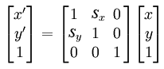

[toc]

## Canvas

参考：

- http://www.html5canvastutorials.com/

### `canvas`元素和上下文

```
    <canvas width="500" height="500">
    	<!-- Insert fallback content here -->
    </canvas>
```

若不设置尺寸，将使用默认宽度和高度，分别是300和150像素。

IE9之前可以使用ExplorerCanvas支持Canvas。

绘图发生在2D渲染上下文。

原点在左上角。向右x值增加，向下y值增加。
坐标系统中一个单位通常相当于屏幕的1个像素，**在一些高分辨率屏上可能相当于2个像素**。

访问2D渲染上下文

```js
var canvas = $("#myCanvas");
var context = canvas.get(0).getContext("2d");
```

绘制：

```js
context.fillRect(40, 40, 100, 100);
```

将显示黑色矩形，因为绘制默认颜色是黑色。

擦除。调用`clearRect`，分别指定原点（左上角）、宽度、高度：

```js
context.clearRect(230, 90, 50, 50);
```

### 直线

To draw a line using HTML5 Canvas, we can use the `beginPath()`, moveTo(), lineTo(), and stroke() methods.

```js
context.beginPath();
context.moveTo(100, 150);
context.lineTo(450, 50);
context.stroke();
```

### 圆弧

圆弧绘制：

```js
context.arc(x, y, radius, startAngle, endAngle, anticlockwise);
```

x和y是圆心。radius是半径。圆弧中角单位是弧度。`anticlockwise`为true则逆时针，默认为false。0度在x轴正方形。

例子：


```js
var x = canvas.width / 2;
var y = canvas.height / 2;
var radius = 75;
var startAngle = 1.1 * Math.PI;
var endAngle = 1.9 * Math.PI;
var counterClockwise = false; // 顺时针

context.beginPath();
context.arc(x, y, radius, startAngle, endAngle, counterClockwise);
context.lineWidth = 15;

// line color
context.strokeStyle = 'black';
context.stroke();
```

**二次曲线**

利用`quadraticCurveTo()`方法绘制二次曲线。二次曲线由上下文点、控制点和结束点定义。上下文点由`moveTo()`方法决定。控制点决定二次曲线的曲率by creating two imaginary tangential lines 。控制点离上下文点和终点越远，曲线越尖刻。


```js
context.beginPath();
context.moveTo(188, 150);
context.quadraticCurveTo(288, 0, 388, 150);
context.lineWidth = 10;

// line color
context.strokeStyle = 'black';
context.stroke();
```

**Bezier曲线**

To create a Bezier curve with HTML5 Canvas, we can use the `bezierCurveTo()` method. Bezier curves are defined with the context point, two control points, and an ending point.


```js
context.beginPath();
context.moveTo(188, 130);
context.bezierCurveTo(140, 10, 388, 10, 388, 170);
context.lineWidth = 10;

// line color
context.strokeStyle = 'black';
context.stroke();
```

### 路径

To create a path with HTML5 Canvas, we can connect multiple subpaths.  The ending point of each new subpath becomes the new context point.  We can use the `lineTo()`, `arcTo()`, `quadraticCurveTo()`, and `bezierCurveTo()` methods to construct each subpath which makes up our path.  We can also use the `beginPath()` method each time we want to start drawing a new path.

#### 连接点

To set the line join style of an HTML5 Canvas path, we can set the `lineJoin` context property. Paths can have one of three line joins: `miter`, `round`, or `bevel`.  Unless otherwise specified, the HTML5 Canvas line join property is defaulted with the `miter` style.

Note: If your lines are fairly thin and don't connect at steep angles, it may be difficult to distinguish different line joins.


```js
context.beginPath();
context.moveTo(239, 150);
context.lineTo(289, 50);
context.lineTo(339, 150);
context.lineJoin = 'round';
context.stroke();
```

#### 圆角

To created rounded corners using HTML5 Canvas, we can use the arcTo() method which is defined by a control point, an ending point, and a radius.


```js
var rectWidth = 200;
var rectHeight = 100;
var rectX = 189;
var rectY = 50;
var cornerRadius = 50;

context.beginPath();
context.moveTo(rectX, rectY);
context.lineTo(rectX + rectWidth - cornerRadius, rectY);
context.arcTo(rectX + rectWidth, rectY, rectX + rectWidth, rectY + cornerRadius, cornerRadius);
context.lineTo(rectX + rectWidth, rectY + rectHeight);
context.lineWidth = 5;
context.stroke();
```

### 形状

#### 自定义形状

To create a custom shape with HTML5 Canvas, we can create a path and then close it using the `closePath()` method.  We can use the lineTo(), arcTo(), quadraticCurveTo(), or bezierCurveTo() methods to construct each subpath which makes up our shape.


```js
// begin custom shape
context.beginPath();
context.moveTo(170, 80);
context.bezierCurveTo(130, 100, 130, 150, 230, 150);
context.bezierCurveTo(250, 180, 320, 180, 340, 150);
context.bezierCurveTo(420, 150, 420, 120, 390, 100);
context.bezierCurveTo(430, 40, 370, 30, 340, 50);
context.bezierCurveTo(320, 5, 250, 20, 250, 50);
context.bezierCurveTo(200, 5, 150, 20, 170, 80);

// complete custom shape
context.closePath();
context.lineWidth = 5;
context.strokeStyle = 'blue';
context.stroke();
```

#### 矩形

To create a rectangle using HTML5 Canvas, we can use the `rect()` method. An HTML5 Canvas rectangle is positioned with x and y parameters, and is sized with width and height parameters. The rectangle is positioned about its top left corner.

```js
context.beginPath();
context.rect(188, 50, 200, 100);
context.fillStyle = 'yellow';
context.fill();
context.lineWidth = 7;
context.strokeStyle = 'black';
context.stroke();
```


### 样式

可以设置填充颜色（`fillStyle`）、线条颜色（`strokeStyle`）、线宽（`lineWidth`）、线帽（`lineCap`）。

#### 颜色

通过设置上下文的`fillStyle`属性，设置形状和路径的**填充颜色**。值可以是`"rgb(255,0,0)"`或十六进制色值如`#FF0000`，或单词如`red`。设置后，后续绘制均使用该颜色，直到被设为其他颜色。

```js
context.fillStyle = "rgb(255, 0, 0)";
context.fillRect(40, 40, 100, 100);
```

至于描边颜色，应通过`strokeStyle`设置：

```js
context.strokeStyle = "rgb(255, 0, 0)";
context.strokeRect(40, 40, 100, 100); // Red square
```

#### 线宽度

`lineWidth`可以修改线宽。默认为1。

```js
context.lineWidth = 5; // Make lines thick
context.strokeStyle = "rgb(255, 0, 0)";
context.beginPath();
context.moveTo(40, 180);
context.lineTo(420, 180); // Red line
context.closePath();
context.stroke();
```

#### 线帽

To add a cap to an HTML5 Canvas line, we can use the `lineCap` property. 取值如下：`butt`、`round`、`square`。默认取`butt`。The `lineCap` property must be set before calling `stroke()`.

三者的区别：


#### 模式

To create a pattern with the HTML5 Canvas, we can use the `createPattern()` method of the canvas context which returns a pattern object, set the `fillStyle` property to the pattern object, and then fill the shape using `fill()`. The `createPattern()` method requires an `image` object and a `repeat` option, which can be `repeat`, `repeat-x`, `repeat-y`, or `no-repeat`.  Unless otherwise specified, the repeat option is defaulted to `repeat`.


```js
var imageObj = new Image();
imageObj.onload = function() {
    var pattern = context.createPattern(imageObj, 'repeat');
    context.rect(0, 0, canvas.width, canvas.height);
    context.fillStyle = pattern;
    context.fill();
};
imageObj.src = 'http://www.html5canvastutorials.com/demos/assets/wood-pattern.png';
```

### 文本

使用Canvas显示文本有一些问题：Canvas中的文本按图像绘制，这意味着无法像普通文字一样通过光标选取。因此应该使用普通HTML元素来创建文本，然后用CSS定位到Canvas上面。

绘制**填充**文本和**描边**文本，分别用`fillText`和`strokeText`。

```js
var text = "Hello, World!";
context.fillText(text, 40, 40);

context.font = "italic 60px serif";
context.strokeText(text, 40, 100);
```

第二和第三个参数是文本原点（**左下角**）。

默认字体字号是`10px sans-serif`。`font`属性与CSS的font属性取值相同，取样式、大小和字体家族。样式可以取`normal`、`italic`、`bold`。

```js
var text = "Hello, World!";
context.font = "italic 30px serif";
context.fillText(text, 40, 40);
```


颜色使用`fillStyle`或`strokeStyle`设置。

To align HTML5 Canvas text, we can use the `textAlign` property of the canvas context, which can be set to start, end, left, center, or right. The alignment is relative to an imaginary vertical line at the x position of the text defind by fillText() or strokeText().

To vertically align text with HTML5 Canvas, we can use the `textBaseline` property of the canvas context. textBaseline can be set with one of the following values: top, hanging, middle, alphabetic, ideographic, and bottom. Unless otherwise specified, the textBaseline property is defaulted to alphabetic.

要获取一段文本的尺寸，调用`measureText()`方法，传入一个字符串，返回当字体、字号等设置下的尺寸对象。

Note: Since the height of the text in pixels is equal to the font size in pts when the font is defined with the font property of the canvas context, the metrics object returned from `measureText()` does not provide a height metric.

要实现自动换行，我们需要定义一个自定义的函数。利用`measureText()`计算文字宽度，与最大行宽比较，决定自动换行。

```js
function wrapText(context, text, x, y, maxWidth, lineHeight) {
    var words = text.split(' ');
    var line = '';
	for(var n = 0; n < words.length; n++) {
		var testLine = line + words[n] + ' ';
		var metrics = context.measureText(testLine);
		var testWidth = metrics.width;
		if (testWidth > maxWidth && n > 0) {
			context.fillText(line, x, y);
			line = words[n] + ' ';
			y += lineHeight;
		} else {
        	line = testLine;
        }
    }
    context.fillText(line, x, y);
}

var canvas = document.getElementById('myCanvas');
var context = canvas.getContext('2d');
var maxWidth = 400;
var lineHeight = 25;
var x = (canvas.width - maxWidth) / 2;
var y = 60;
var text = 'All the world \'s a stage, and all the men and women merely players. They have their exits and their entrances; And one man in his time plays many parts.';

context.font = '16pt Calibri';
context.fillStyle = '#333';

wrapText(context, text, x, y, maxWidth, lineHeight);
```

### 保存和恢复绘图状态

绘图状态是某一时刻、绘图上下文的所有属性，从颜色值到变换矩阵等等。这些属性有：the transformation matrix, the clipping region, globalAlpha, globalCompositeOperation, strokeStyle, fillStyle, lineWidth, lineCap, lineJoin, miterLimit, shadowOffsetX, shadowOffsetY, shadowBlur, shadowColor, font, textAlign, and textBaseline.

状态会被保存到状态栈中，即可以同时保存多个状态。保存绘图状态只需要调用`save`方法（入栈）。

```js
var canvas = $("#myCanvas");
var context = canvas.get(0).getContext("2d");
context.fillStyle = "rgb(255, 0, 0)";
context.save(); // Save the canvas state
context.fillRect(50, 50, 100, 100); // Red square
```

恢复（出栈）调用`restore`方法：

```js
context.fillStyle = "rgb(0, 0, 255)";
context.fillRect(200, 50, 100, 100); // Blue square
context.restore(); // Restore the canvas state
context.fillRect(350, 50, 100, 100); // Red square
```

保存和恢复可以被调用多次，遵循入栈和出栈的标准效果。

### 变换

执行变换操作的顺序是重要的。

#### 平移

平移，移动的是上下文原点而不是绘制的对象。原点原来在(0,0)。平移影响其后绘制的所有元素。

```js
context.translate(150, 150);
```

如果此时再绘制`context.fillRect(150, 150, 100, 100);`。则矩形原点在(150+150, 150+150)的位置。

#### 缩放

如下面的矩形会变成原来的两倍，位置也会变。

```js
context.scale(2, 2);
context.fillRect(150, 150, 100, 100);
```

椭圆可以通过先缩放，再绘制原型

#### 旋转

将**绘图上下文**旋转指定角度（单位弧度）。旋转绕上下文原点：

```js
context.rotate(0.7854); // Rotate 45 degrees (Math.PI/4)
context.fillRect(150, 150, 100, 100);
```

#### 变换矩阵

To apply a custom transformation matrix to the HTML5 Canvas, we can use the `transform()` method.  This method requires six components of a 3 x 3 matrix according to the following convention:


```js
var rectWidth = 150;
var rectHeight = 75;

// translation matrix:
//  1  0  tx
//  0  1  ty
//  0  0  1
var tx = canvas.width / 2;
var ty = canvas.height / 2;

// apply custom transform
context.transform(1, 0, 0, 1, tx, ty);

context.fillStyle = 'blue';
context.fillRect(rectWidth / -2, rectHeight / -2, rectWidth, rectHeight);
```

#### 剪变

To shear the HTML5 canvas, we can use the `transform()` method with the transformation matrix below. `sx` defines the horizontal shear and `sy` defines the vertical shear.



```js
var rectWidth = 150;
var rectHeight = 75;

// shear matrix:
//  1  sx  0
//  sy  1  0
//  0  0  1

var sx = 0.75;
// .75 horizontal shear
var sy = 0;
// no vertical shear

// translate context to center of canvas
context.translate(canvas.width / 2, canvas.height / 2);

// apply custom transform
context.transform(1, sy, sx, 1, 0, 0);

context.fillStyle = 'blue';
context.fillRect(-rectWidth / 2, rectHeight / -2, rectWidth, rectHeight);
```


#### 镜像

利用负的缩放实现**Canvas的**镜像，we can apply a negative scale in the x direction to flip the context horizontally, or we can apply a negative scale in the y direction to flip the context vertically.

```js
// translate context to center of canvas
context.translate(canvas.width / 2, canvas.height / 2);

// flip context horizontally
context.scale(-1, 1);

context.font = '30pt Calibri';
context.textAlign = 'center';
context.fillStyle = 'blue';
context.fillText('Hello World!', 0, 0);
```

#### 重置

To reset the HTML5 Canvas transformation matrix, we can use the `setTransform()` method to set the transformation matrix to its default state using the following convention:


### 合成（Compositing）

画布中所有绘制都一定会被合成。即正在绘制的会与已经绘制的组合在一起。默认是基本合成，即一个叠在另一个上面。首先看最简单的合成，`globalAlpha`。

#### 全局阿尔法值

对象绘制在画布前，先要应用一个阿尔法值。`globalAlpha`影响将要绘制的对象的透明度。`globalAlpha`取值`0.0`（透明）到`1.0`（不透明）之间，默认1.0。

例如绘制蓝色矩形。然后设置全局阿尔法值。绘制粉色矩形。由于只有粉色矩形受影响，结果蓝色矩形部分从粉色矩形中透出来。

```js
context.fillStyle = "rgb(63, 169, 245)";
context.fillRect(50, 50, 100, 100);
context.globalAlpha = 0.5;
context.fillStyle = "rgb(255, 123, 172)";
context.fillRect(100, 100, 100, 100);
```

通过给`fillStyle`设置一个rgba值也能达到相同效果。只是`globalAlpha`会影响后续rgba的使用。例如`globalAlpha`是0.5，设置`fillStyle`的rgba中阿尔法值是0.5，则最终的阿尔法值是0.25。

#### globalCompositeOperation


To perform a composite operation with HTML5 Canvas, we can use the `globalCompositeOperation` property of the canvas context. This property defines the composite operation between the source and destination states of the canvas. destination is defined as the canvas state preceding a composite operation. source is defined as the canvas state following a composite operation.

We can perform one of twelve composite operations including `source-atop`, `source-in`, `source-out`, `source-over`, `destination-atop`, `destination-in`, `destination-out`, `destination-over`, `lighter`, `xor`, and `copy`. Unless otherwise specified, the default composite operation is `source-over`.

注意，一个Canvas上下文在其一生中只支持一种组合（composite）操作。如果我们需要使用多种组合操作，需要用一个隐藏的canvas绘制，然后将结果拷贝到可见的canvas。就像下面的例子。

```
    <canvas id="myCanvas" width="578" height="430"></canvas>
    <canvas id="tempCanvas" width="578" height="430" style="display:none;"></canvas>
    <script>
      var canvas = document.getElementById('myCanvas');
      var context = canvas.getContext('2d');
      var tempCanvas = document.getElementById('tempCanvas');
      var tempContext = tempCanvas.getContext('2d');

      var squareWidth = 55;
      var circleRadius = 35;
      var shapeOffset = 50;
      var operationOffset = 150;
      var arr = [];

      arr.push('source-atop');
      arr.push('source-in');
      arr.push('source-out');
      arr.push('source-over');
      arr.push('destination-atop');
      arr.push('destination-in');
      arr.push('destination-out');
      arr.push('destination-over');
      arr.push('lighter');
      arr.push('darker');
      arr.push('xor');
      arr.push('copy');

      // translate context to add 10px padding
      context.translate(10, 10);

      // draw each of the operations
      for(var n = 0; n < arr.length; n++) {
        var thisOperation = arr[n];

        tempContext.save();

        // clear temp context
        tempContext.clearRect(0, 0, canvas.width, canvas.height);

        // draw rectangle (destination)
        tempContext.beginPath();
        tempContext.rect(0, 0, squareWidth, squareWidth);
        tempContext.fillStyle = 'blue';
        tempContext.fill();

        // set global composite
        tempContext.globalCompositeOperation = thisOperation;

        // draw circle (source)
        tempContext.beginPath();
        tempContext.arc(shapeOffset, shapeOffset, circleRadius, 0, 2 * Math.PI, false);
        tempContext.fillStyle = 'red';
        tempContext.fill();
        tempContext.restore();

        // draw text
        tempContext.font = '10pt Verdana';
        tempContext.fillStyle = 'black';
        tempContext.fillText(thisOperation, 0, squareWidth + 45);

        // translate visible context so operation is drawn in the right place
        if(n > 0) {
          if(n % 4 === 0) {
            context.translate(operationOffset * -3, operationOffset);
          }
          else {
            context.translate(operationOffset, 0);
          }
        }

        // copy drawing from tempCanvas onto visible canvas
        context.drawImage(tempCanvas, 0, 0);
      }
    </script>
```

### 阴影

阴影通过四个属性控制：`shadowBlur`、`shadowOffsetX`、`shadowOffsetY`、`shadowColor`。默认`shadowBlur`、`shadowOffsetX`、`shadowOffsetY`为0，`shadowColor`为透明黑色。

例如，颜色设为黑色不透明，加模糊：

```js
context.shadowBlur = 20;
context.shadowColor = "rgb(0, 0, 0)";
context.fillRect(50, 50, 100, 100);
```


例二：

```js
context.shadowBlur = 0;
context.shadowOffsetX = 10;
context.shadowOffsetY = 10;
context.shadowColor = "rgba(100, 100, 100, 0.5)";
context.fillRect(200, 50, 100, 100);
```


原型等路径形成的形状也支持阴影。

### 渐变

`fillStyle`和`strokeStyle`都接受以`CanvasGradient`表示的渐变色。

有两种类型的渐变：线性渐变和放射渐变。分别用上下文的`createLinearGradient`和`createRadialGradient`方法创建。两个方法都返回`CanvasGradient`对象。对象的`addColorStop`方法可以进一步操纵渐变。

```js
var gradient = context.createLinearGradient(0, 0, 0, canvas.height());
gradient.addColorStop(0, "rgb(0, 0, 0)");
gradient.addColorStop(1, "rgb(255, 255, 255)");
context.fillStyle = gradient;
context.fillRect(0, 0, canvas.width(), canvas.height());
```

`createLinearGradient`的四个参数分别描述渐变起点和终点的坐标。

放射渐变目前则不同浏览器上的效果可能不同。`createRadialGradient`方法需要6个参数。前三个描述开始圆，后三个描述结束圆。三参数分别是圆心左边和半径。

```js
createRadialGradient(x0, y0, r0, x1, y1, r1);
```

实际的渐变是一个与两个圆相切的圆锥。开始圆之前的圆锥显示偏移值为0的颜色，结束圆之后的圆锥显示偏移值为1的颜色。


```js
var gradient = context.createRadialGradient(300, 300, 10, 100, 100, 50);
gradient.addColorStop(0, "rgb(0, 0, 0)");
gradient.addColorStop(1, "rgb(150, 150, 150)");
context.fillStyle = gradient;
context.fillRect(0, 0, canvas.width(), canvas.height());
```


实现下面的效果，只需要两个圆的圆心相同即可：


```js
var canvasCentreX = canvas.width()/2;
var canvasCentreY = canvas.height()/2;
var gradient = context.createRadialGradient(canvasCentreX, canvasCentreY, 0, canvasCentreX, canvasCentreY, 250);
gradient.addColorStop(0, "rgb(0, 0, 0)");
gradient.addColorStop(1, "rgb(150, 150, 150)");
context.fillStyle = gradient;
context.fillRect(0, 0, canvas.width(), canvas.height());
```

> 如果仅是当背景，考虑使用CSS渐变

### 图片

利用`drawImage()`绘制图像。必须先等图像加载完后再绘制。

```js
var imageObj = new Image();
imageObj.onload = function() {
	context.drawImage(imageObj, 69, 50);
};
imageObj.src = 'http://www.html5canvastutorials.com/demos/assets/darth-vader.jpg';
```

要指定图片大小，可以传入两个附加的参数。

```js
var x = 188;
var y = 30;
var width = 200;
var height = 137;
var imageObj = new Image();

imageObj.onload = function() {
	context.drawImage(imageObj, x, y, width, height);
};
imageObj.src = 'http://www.html5canvastutorials.com/demos/assets/darth-vader.jpg';
```

若需要裁切图片，`drawImage()`需要6个附加的参数，`sourceX`、 `sourceY`、 `sourceWidth`、 `sourceHeight`、 `destWidth`和`destHeight`。


```js
var imageObj = new Image();
imageObj.onload = function() {
    // draw cropped image
    var sourceX = 150;
    var sourceY = 0;
    var sourceWidth = 150;
    var sourceHeight = 150;
    var destWidth = sourceWidth;
    var destHeight = sourceHeight;
    var destX = canvas.width / 2 - destWidth / 2;
    var destY = canvas.height / 2 - destHeight / 2;

    context.drawImage(imageObj, sourceX, sourceY, sourceWidth, sourceHeight, destX, destY, destWidth, destHeight);
};
imageObj.src = 'http://www.html5canvastutorials.com/demos/assets/darth-vader.jpg';
```

### 图像数据和URL

#### 获取Canvas上一块区域的图像信息

要获取Canvas上一块矩形区域每个像素的信息，可以调用上下文的 `getImageData()` 方法，返回的对象的 `data` 属性包含每个像素的信息。每个像素包含四个组件，红绿蓝和透明度。读取方法见下面的例子。

Note: The `getImageData()` method requires that the image is hosted on a web server with the same domain as the code executing it.  If this condition is not met, a `SECURITY_ERR` exception will be thrown.

```js
function drawImage(imageObj) {
	var canvas = document.getElementById('myCanvas');
    var context = canvas.getContext('2d');
    var imageX = 69;
    var imageY = 50;
    var imageWidth = imageObj.width;
    var imageHeight = imageObj.height;

	context.drawImage(imageObj, imageX, imageY);

    var imageData = context.getImageData(imageX, imageY, imageWidth, imageHeight);
    var data = imageData.data;

    // iterate over all pixels
    for(var i = 0, n = data.length; i < n; i += 4) {
        var red = data[i];
        var green = data[i + 1];
        var blue = data[i + 2];
        var alpha = data[i + 3];
    }

    // pick out pixel data from x, y coordinate
    var x = 20;
    var y = 20;
    var red = data[((imageWidth * y) + x) * 4];
    var green = data[((imageWidth * y) + x) * 4 + 1];
    var blue = data[((imageWidth * y) + x) * 4 + 2];
    var alpha = data[((imageWidth * y) + x) * 4 + 3];

    // iterate over all pixels based on x and y coordinates
    for(var y = 0; y < imageHeight; y++) {
        // loop through each column
        for(var x = 0; x < imageWidth; x++) {
            var red = data[((imageWidth * y) + x) * 4];
            var green = data[((imageWidth * y) + x) * 4 + 1];
            var blue = data[((imageWidth * y) + x) * 4 + 2];
            var alpha = data[((imageWidth * y) + x) * 4 + 3];
        }
	}
}
var imageObj = new Image();
imageObj.onload = function() {
	drawImage(this);
};
imageObj.src = 'http://www.html5canvastutorials.com/demos/assets/darth-vader.jpg';
```

#### 反色

To invert the colors of an image with HTML5 Canvas, we can iterate over all of the pixels in the image and invert the red, green, and blue components by subtracting each component from the max color value, 255. Next, we can redraw the inverted image using the updated image data with the `putImageData()` method, which requires an image data array and a position.

Note: The `getImageData()` method requires that the image is hosted on a web server with the same domain as the code executing it.  If this condition is not met, a `SECURITY_ERR` exception will be thrown.

```js
function drawImage(imageObj) {
    var canvas = document.getElementById('myCanvas');
    var context = canvas.getContext('2d');
    var x = 69;
    var y = 50;

    context.drawImage(imageObj, x, y);

    var imageData = context.getImageData(x, y, imageObj.width, imageObj.height);
    var data = imageData.data;

    for(var i = 0; i < data.length; i += 4) {
        // red
        data[i] = 255 - data[i];
        // green
        data[i + 1] = 255 - data[i + 1];
        // blue
        data[i + 2] = 255 - data[i + 2];
    }

    // overwrite original image
    context.putImageData(imageData, x, y);
}

var imageObj = new Image();
imageObj.onload = function() {
    drawImage(this);
};
imageObj.src = 'http://www.html5canvastutorials.com/demos/assets/darth-vader.jpg';
```

#### 灰度图

To grayscale the colors of an image with HTML5 Canvas, we can iterate over all of the pixels in the image, calculate the brightness of each, and then set the red, green, and blue components equal to the brightness.

Note: The getImageData() method requires that the image is hosted on a web server with the same domain as the code executing it.  If this condition is not met, a SECURITY_ERR exception will be thrown.

```js
    function drawImage(imageObj) {
    var canvas = document.getElementById('myCanvas');
    var context = canvas.getContext('2d');
    var x = 69;
    var y = 50;

    context.drawImage(imageObj, x, y);

    var imageData = context.getImageData(x, y, imageObj.width, imageObj.height);
    var data = imageData.data;

    for(var i = 0; i < data.length; i += 4) {
        var brightness = 0.34 * data[i] + 0.5 * data[i + 1] + 0.16 * data[i + 2];
        // red
        data[i] = brightness;
        // green
        data[i + 1] = brightness;
        // blue
        data[i + 2] = brightness;
    }

    // overwrite original image
    context.putImageData(imageData, x, y);
}

var imageObj = new Image();
imageObj.onload = function() {
    drawImage(this);
};
imageObj.src = 'http://www.html5canvastutorials.com/demos/assets/darth-vader.jpg';
```

#### toDataURL()

To get the image data URL of the canvas, we can use the `toDataURL()` method of the canvas object which converts the canvas drawing into a 64 bit encoded PNG URL.  If you'd like for the image data URL to be in the jpeg format, you can pass `image/jpeg` as the first argument in the `toDataURL()` method. If you'd like to control the image quality for a jpeg image, you can pass in a number from 0 to 1 as the second argument to the `toDataURL()` method.

Note: The `toDataURL()` method requires that any images drawn onto the canvas are hosted on a web server with the same domain as the code executing it.  If this condition is not met, a `SECURITY_ERR` exception is thrown.


```js
// draw cloud
context.beginPath();
context.moveTo(170, 80);
context.bezierCurveTo(130, 100, 130, 150, 230, 150);
context.bezierCurveTo(250, 180, 320, 180, 340, 150);
context.bezierCurveTo(420, 150, 420, 120, 390, 100);
context.bezierCurveTo(430, 40, 370, 30, 340, 50);
context.bezierCurveTo(320, 5, 250, 20, 250, 50);
context.bezierCurveTo(200, 5, 150, 20, 170, 80);
context.closePath();
context.lineWidth = 5;
context.fillStyle = '#8ED6FF';
context.fill();
context.strokeStyle = '#0000ff';
context.stroke();

// save canvas image as data url (png format by default)
var dataURL = canvas.toDataURL();
```

#### Ajax获取图像

To load the canvas with an image data URL, we can make an AJAX call to get **a data URL**, create an image object with the URL, and then draw the image onto the canvas with the drawImage() method of the canvas context.

```js
function loadCanvas(dataURL) {
    var canvas = document.getElementById('myCanvas');
    var context = canvas.getContext('2d');

    // load image from data url
    var imageObj = new Image();
    imageObj.onload = function() {
    	context.drawImage(this, 0, 0);
    };

    imageObj.src = dataURL;
}

// make ajax call to get image data url
var request = new XMLHttpRequest();
request.open('GET', 'http://www.html5canvastutorials.com/demos/assets/dataURL.txt', true);
request.onreadystatechange = function() {
    // Makes sure the document is ready to parse.
    if(request.readyState == 4) {
    	// Makes sure it's found the file.
        if(request.status == 200) {
            loadCanvas(request.responseText);
        }
    }
};
request.send(null);
```

#### 将绘制保存为图片`toDataURL()`

To save the canvas drawing as an image, we can set the source of an image object to the image data URL. From there, a user can right click on the image to save it to their local computer. Alternatively, we could also open up a new browser window with the image data url directly and the user could save it from there.

Note: The toDataURL() method requires that any images drawn onto the canvas are hosted on a web server with the same domain as the code executing it.  If this condition is not met, a SECURITY_ERR exception is thrown.

```js
var canvas = document.getElementById('myCanvas');
var context = canvas.getContext('2d');

// draw cloud
context.beginPath();
context.moveTo(170, 80);
context.bezierCurveTo(130, 100, 130, 150, 230, 150);
context.bezierCurveTo(250, 180, 320, 180, 340, 150);
context.bezierCurveTo(420, 150, 420, 120, 390, 100);
context.bezierCurveTo(430, 40, 370, 30, 340, 50);
context.bezierCurveTo(320, 5, 250, 20, 250, 50);
context.bezierCurveTo(200, 5, 150, 20, 170, 80);
context.closePath();
context.lineWidth = 5;
context.fillStyle = '#8ED6FF';
context.fill();
context.strokeStyle = '#0000ff';
context.stroke();

// save canvas image as data url (png format by default)
var dataURL = canvas.toDataURL();

// set canvasImg image src to dataURL
// so it can be saved as an image
document.getElementById('canvasImg').src = dataURL;
```


### 裁剪

```js
var x = canvas.width / 2;
var y = canvas.height / 2;
var radius = 75;
var offset = 50;

/*
* save() allows us to save the canvas context before
* defining the clipping region so that we can return
* to the default state later on
*/
context.save();
context.beginPath();
context.arc(x, y, radius, 0, 2 * Math.PI, false);
context.clip();

// draw blue circle inside clipping region
context.beginPath();
context.arc(x - offset, y - offset, radius, 0, 2 * Math.PI, false);
context.fillStyle = 'blue';
context.fill();

// draw yellow circle inside clipping region
context.beginPath();
context.arc(x + offset, y, radius, 0, 2 * Math.PI, false);
context.fillStyle = 'yellow';
context.fill();

// draw red circle inside clipping region
context.beginPath();
context.arc(x, y + offset, radius, 0, 2 * Math.PI, false);
context.fillStyle = 'red';
context.fill();

/*
* restore() restores the canvas context to its original state
* before we defined the clipping region
*/
context.restore();
context.beginPath();
context.arc(x, y, radius, 0, 2 * Math.PI, false);
context.lineWidth = 10;
context.strokeStyle = 'blue';
context.stroke();
```


To define a clipping region using HTML5 canvas, we can draw a path and then use the `clip()` method of the canvas context. Everything drawn afterwards will be bound inside the clipping region. Once we are done drawing things inside the clipping region, we can return the canvas context to its original state with the `restore()` method so that further drawings are not bound to the clipping region.

In this tutorial, we'll define a circular clipping region by drawing a circle and then using `clip()`, and then we'll draw a few circles which are clipped inside the circular path.  Next, we'll restore the canvas context to its original state with the `restore()` method, and then draw a ring around the original clipping region.

### 动画

To create an animation using HTML5 Canvas, we can use the `requestAnimFrame` shim which enables the browser to determine the optimal FPS for our animation. For each animation frame, we can update the elements on the canvas, clear the canvas, redraw the canvas, and then request another animation frame.

```js
window.requestAnimFrame = (function(callback) {
	return window.requestAnimationFrame || window.webkitRequestAnimationFrame ||
    	window.mozRequestAnimationFrame || window.oRequestAnimationFrame ||
        window.msRequestAnimationFrame ||
        function(callback) {
        	window.setTimeout(callback, 1000 / 60);
        };
    })();

function drawRectangle(myRectangle, context) {
    context.beginPath();
    context.rect(myRectangle.x, myRectangle.y, myRectangle.width, myRectangle.height);
    context.fillStyle = '#8ED6FF';
    context.fill();
    context.lineWidth = myRectangle.borderWidth;
    context.strokeStyle = 'black';
    context.stroke();
}
function animate(myRectangle, canvas, context, startTime) {
    // update
    var time = (new Date()).getTime() - startTime;

    var linearSpeed = 100;
    // pixels / second
    var newX = linearSpeed * time / 1000;

    if(newX < canvas.width - myRectangle.width - myRectangle.borderWidth / 2) {
        myRectangle.x = newX;
    }

    // clear
    context.clearRect(0, 0, canvas.width, canvas.height);

    drawRectangle(myRectangle, context);

    // request new frame
    requestAnimFrame(function() {
        animate(myRectangle, canvas, context, startTime);
    });
}
var canvas = document.getElementById('myCanvas');
var context = canvas.getContext('2d');

var myRectangle = {
    x: 0,
    y: 75,
    width: 100,
    height: 50,
    borderWidth: 5
};

drawRectangle(myRectangle, context);

// wait one second before starting animation
setTimeout(function() {
    var startTime = (new Date()).getTime();
    animate(myRectangle, canvas, context, startTime);
}, 1000);
```

### 鼠标

To get the mouse coordinates relative to an HTML5 Canvas, we can create a `getMousePos()` method which returns the mouse coordinates based on the position of the client mouse and the position of the canvas obtained from the `getBoundingClientRect()` method of the window object.

```js
function writeMessage(canvas, message) {
    var context = canvas.getContext('2d');
    context.clearRect(0, 0, canvas.width, canvas.height);
    context.font = '18pt Calibri';
    context.fillStyle = 'black';
    context.fillText(message, 10, 25);
}
function getMousePos(canvas, evt) {
    var rect = canvas.getBoundingClientRect();
    return {
        x: evt.clientX - rect.left,
        y: evt.clientY - rect.top
    };
}
var canvas = document.getElementById('myCanvas');
var context = canvas.getContext('2d');

canvas.addEventListener('mousemove', function(evt) {
    var mousePos = getMousePos(canvas, evt);
    var message = 'Mouse position: ' + mousePos.x + ',' + mousePos.y;
    writeMessage(canvas, message);
}, false);
```