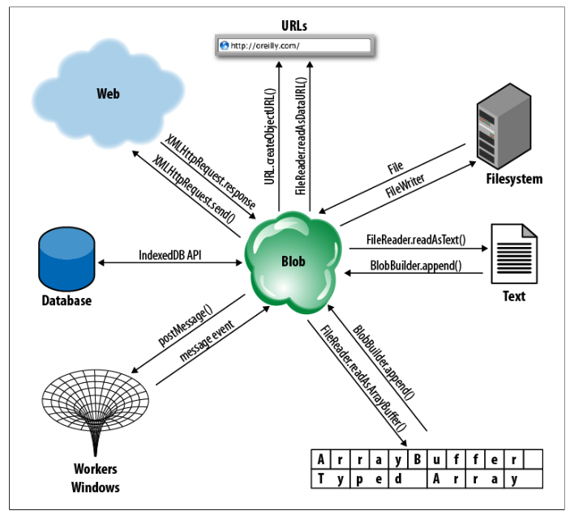

[toc]

## Blob和File

---

要点：

- File是Blob的子类。
- 利用File API，现在可以读取用户指定的（通过`<input>`或拖放）文件的内容。
- 要显示用户选择的图片，需要用到FileReader。将用户选择的File的内容转化为URL编码（`readAsDataURL`）方法。

---

参考：

- 《javascript权威指南》 22.6 Blobs
- http://www.html5rocks.com/zh/tutorials/file/dndfiles/
- https://developer.mozilla.org/en-US/docs/Using_files_from_web_applications#Handling_the_upload_process_for_a_file.2C_asynchronously

一个Blob是到一块数据的引用或句柄。一般是二进制数据。可以很大也可以很小。Blob能做的事情不多：获取字节大小、获取MIME类型，或分割成小块：

```js
    var blob = ...
    blob.size
    blob.type
	var subblob = blob.slice(0, 1024, "text/plain"); // First 1K of the Blob as text
    var last = blob.slice(blob.size - 1024, 1024); // Last 1K of the Blob, untyped
```

浏览器可以将Blob存储在内存中或磁盘上。Blob可以表示非常大的数据，如视频文件。因为Blob可能很大，需要磁盘访问，因此其API是异步的（还有一个同步版本，供工作线程使用）。

大量Javascript接口通过Blob交换二进制数据。下图展示了再多种场景下、各种方法都会用到Blob。



下面列出了获取Blob的各种方式：

- 结构化克隆算法（structured clone algorithm）支持Blob。通过消息事件，可以从另一个创建或线程获取一个Blob。见《Javascript权威指南》 §22.3 和 §22.4。
- Blob可以从客户端数据库中获取，见《Javascript权威指南》§22.8。
- 使用**XHR2**的新特性，Blob可以从网上下载。见《Javascript权威指南》§22.6.2。
- 可以自己构建blob。利用`BlobBuilder`对象，可以从字符串、`ArrayBuffer`对象或其他Blob构建。
- `File`对象是**Blob**的子类型：在它的基础上增加名字和修改日期属性。`File`对象可以从`<input type="file">`元素或拖放API中获取。或通过**Filesystem** API获取。

### 切块

见：https://developer.mozilla.org/zh-CN/docs/Web/API/Blob/slice

### File、FileList

`<input type="file">`元素的`files`属性是一个`FileList`对象。它是一个类似数组的对象，包含零个或多个`File`对象。`File`是`Blob`的子类，并增加`name`和`lastModifiedDate`属性：

```
    <script>
    // Log information about a list of selected
    function fileinfo(files) {
        for(var i = 0; i < files.length; i++) {
            var f = files[i];
            console.log(f.name, // 只有名字，没有路径！
                        f.size, f.type, // 二者都是Blob的属性
                        f.lastModifiedDate);
            }
    }
    </script>
    <input type="file" accept="image/*" multiple onchange="fileinfo(this.files)"/>
```

类似的，从事件对象中取：

```
    <input type="file" id="files" name="files[]" multiple />

    <script>
    function handleFileSelect(evt) {
    	var files = evt.target.files; // FileList object
    	var output = [];
    	for (var i = 0, f; f = files[i]; i++) {
    		// ...
    	}
    }

	// 监听change事件
    document.getElementById('files')
    .addEventListener('change', handleFileSelect, false);
    </script>
```

还可以通过拖放的方式让脚本访问到本地文件。当应用收到drop事件，事件对象的`dataTransfer.files`属性是一个`FileList`。

```
    <div id="drop_zone">Drop files here</div>
    <output id="list"></output>

    <script>
      function handleFileSelect(evt) {
        evt.stopPropagation();
        evt.preventDefault();

        var files = evt.dataTransfer.files; // FileList object.
        // files is a FileList of File objects.
        var output = [];
        for (var i = 0, f; f = files[i]; i++) {
        	// ...
        }
      }

      function handleDragOver(evt) {
        evt.stopPropagation();
        evt.preventDefault();
        evt.dataTransfer.dropEffect = 'copy';
        // Explicitly show this is a copy.
      }

      // Setup the dnd listeners.
      var dropZone = document.getElementById('drop_zone');
      dropZone.addEventListener('dragover', handleDragOver, false);
      dropZone.addEventListener('drop', handleFileSelect, false);
    </script>
```

### 上传Blob、文件

利用FileReader，利用`readAsBinaryString`。

例子。

```js
    function FileUpload(img, file) {
      var reader = new FileReader();
      this.ctrl = createThrobber(img);
      var xhr = new XMLHttpRequest();
      this.xhr = xhr;

      var self = this;
      this.xhr.upload.addEventListener("progress", function(e) {
            if (e.lengthComputable) {
              var percentage = Math.round((e.loaded * 100) / e.total);
              self.ctrl.update(percentage);
            }
          }, false);

      xhr.upload.addEventListener("load", function(e){
              self.ctrl.update(100);
              var canvas = self.ctrl.ctx.canvas;
              canvas.parentNode.removeChild(canvas);
          }, false);
      xhr.open("POST", "http://demos.hacks.mozilla.org/paul/demos/resources/webservices/devnull.php");
      xhr.overrideMimeType('text/plain; charset=x-user-defined-binary');
      reader.onload = function(evt) {
        xhr.sendAsBinary(evt.target.result);
        // sendAsBinary已不推荐使用，使用标准的send(Blob data)方法
      };
      reader.readAsBinaryString(file);
    }
```

### 下载Blob

XHR2定义了一种方式：将URL的内容下载到一个Blob，**但目前没有一个浏览器实现**。下面的代码只是意思意思。

```js
	// GET the contents of the url as a Blob and pass it to the specified callback.
    function getBlob(url, callback) {
        var xhr = new XMLHttpRequest();
        xhr.open("GET", url);
        xhr.responseType = "blob"
        xhr.onload = function() { // onload is easier than onreadystatechange
            callback(xhr.response); // Note .response, not .responseText
        }
        xhr.send(null); // Send the request now
    }
```

如果要下载的Blob过大，可以边下边处理，you can use an `onprogress` event handler, along with the Blob reading techniques demonstrated in §22.6.5.

### 构建Blob

使用`BlobBuilder`自己构建一个Blob：

```js
	// Create a new BlobBuilder
	var bb = new BlobBuilder();
	// Append a string to the blob, and mark the end of the string with a NUL char
    bb.append("This blob contains this text and 10 big-endian 32-bit signed ints.");
    bb.append("\0"); // NUL-terminate the string to mark its end
    // Store some data into an ArrayBuffer
    var ab = new ArrayBuffer(4 * 10);
    var dv = new DataView(ab);
    for(var i = 0; i < 10; i++)
    	dv.setInt32(i * 4, i);
	// Append the ArrayBuffer to the Blob
    bb.append(ab);
    // Now get the blob from the builder, specifying a made-up MIME type
    var blob = bb.getBlob("x-optional/mime-type-here");
```

Blob的`slice()`方法可以把Blob拆开。`BlobBuilder`的`append()`方法可以将它们再拼起来。

### Blob URL

创建一个URL引用一个Blob。这个URL可以在任何普通URL出现的地方使用。

向`createObjectURL()`函数传入一个Blob，函数返回一个字符串，表示一个URL。该URL以`blob://`开头。注意这种URL与`data://` URL非常不同。Blob URL仅仅是一个引用。`blob://` URLs are also quite different from `file://` URLs, which refer directly to a file in the local filesystem, exposing the path of the file, allowing directory browsing, and otherwise raising security issues.

目前，函数`createObjectURL()`，草案和Firefox 4将其放在全局对象`URL`下。Chrome放在全局对象`webkitURL`下。早期实现直接将该方法放在`Window`对象下。下面是兼容的写法：

```js
	var getBlobURL = (window.URL && URL.createObjectURL.bind(URL))
    	|| (window.webkitURL && webkitURL.createObjectURL.bind(webkitURL))
        || window.createObjectURL;
```

Web workers are also allowed to use this API and have access to these same functions, in the same `URL` (or `webkitURL`) object.

下面的例子展示了如何用拖放获取文件，然后用`createObjectURL()`获取一个URL，并将其显示在``元素。

    <!DOCTYPE html>
    <html>
    <head>
    <script>
        var getBlobURL = (window.URL && URL.createObjectURL.bind(URL)) ||
            (window.webkitURL && webkitURL.createObjectURL.bind(webkitURL)) ||
            window.createObjectURL;
        var revokeBlobURL = (window.URL && URL.revokeObjectURL.bind(URL)) ||
            (window.webkitURL && webkitURL.revokeObjectURL.bind(webkitURL)) ||
            window.revokeObjectURL;
        // When the document is loaded, add event handlers to the droptarget element
        // so that it can handle drops of files
        window.onload = function() {
            var droptarget = document.getElementById("droptarget");
            // When the user starts dragging files over the droptarget, highlight it.
            droptarget.ondragenter = function(e) {
                // If the drag is something other than files, ignore it.
                // The HTML5 dropzone attribute will simplify this when implemented.
                var types = e.dataTransfer.types;
                if (!types ||
                    (types.contains && types.contains("Files")) ||
                    (types.indexOf && types.indexOf("Files") != -1)) {
                        droptarget.classList.add("active"); // Highlight droptarget
                        return false; // We're interested in the drag
                }
            };
            // Unhighlight the drop zone if the user moves out of it
            droptarget.ondragleave = function() {
                droptarget.classList.remove("active");
            };
            // This handler just tells the browser to keep sending notifications
            droptarget.ondragover = function(e) { return false; };
            // When the user drops files on us, get their URLs and display thumbnails.
            droptarget.ondrop = function(e) {
                var files = e.dataTransfer.files;
                for(var i = 0; i < files.length; i++) {
                    var type = files[i].type;
                    if (type.substring(0,6) !== "image/")
                        continue;
                    var img = document.createElement("img");
                    img.src = getBlobURL(files[i]);
                    img.onload = function() {
                        this.width = 100;
                        document.body.appendChild(this);
                        revokeBlobURL(this.src);
                    }
                }
                droptarget.classList.remove("active");
                return false;
            }
        };
    </script>
    </head>
    <body>
    <!-- The document starts off with just the file drop target -->
    <div id="droptarget">Drop Image Files Here</div>
    </body>
    </html>

Blob URLs have the same origin (§13.6.2) as the script that creates them. This makes them much more versatile than `file://` URLs, which have a distinct origin and are therefore difficult to use within a web application. A Blob URL is only valid in documents of the same origin. If, for example, you passed a Blob URL via `postMessage()` to a window with a different origin, the URL would be meaningless to that window.

Blob URLs are not permanent. A Blob URL is no longer valid once the user has closed or navigated away from the document whose script created the URL. It is not possible, for example, to save a Blob URL to local storage and then reuse it when the user begins a new session with a web application.

It is also possible to manually “revoke” the validity of a Blob URL by calling `URL.revokeObjectURL()` (or `webkitURL.revokeObjectURL()`) and you may have noticed that Example 22-10 does this. This is a memory management issue. 图像显示后，Blob不再需要，因此它应该允许被垃圾收集。But if the web browser is maintaining a mapping from the Blob URL we’ve created to the Blob, that Blob cannot be garbage collected even if we’re not using it. The JavaScript interpreter cannot track the usage of strings, and if the URL is still valid, it has to assume that it might still be used. This means that it cannot garbage collect the Blob until the URL has been revoked. Example 22-10 uses local files that don’t require any cleanup, but you can imagine a more serious memory management issue if the Blob in question were one that had been built in memory with a BlobBuilder or one that had been downloaded with XMLHttpRequest and stored in a temporary file.

The blob:// URL scheme is explicitly designed to work like a simplified http:// URL, and browsers are required to act like mini HTTP servers when blob:// URLs are requested. If a Blob URL that is no longer valid is requested, the browser must send a 404 Not Found status code. If a Blob URL from a different origin is requested, the browser must respond with 403 Not Allowed. Blob URLs only work with GET requests, and when one is successfully requested, the browser sends an HTTP 200 OK status code and also sends a Content-Type header that uses the type property of the Blob. Because Blob URLs work like simple HTTP URLs, you can “download” their content with XMLHttpRequest. (As we’ll see in the next section, however, you can read the content of a Blob more directly using a FileReader object.)

### 读取Blob：FileReader

（`FileReader`更好的名字是`BlobReader`，因为它处理的是Blob不是File）。

`FileReader`对象允许我们访问Blob中的字符或字节。你可以将其看做`BlobBuilder`的反向。读取操作是异步的。对于工作线程，还可以使用同步的版本`FileReaderSync`。

要使用`FileReader`，先通过构造器`FileReader()`创建一个实例。然后定义事件回调。一般会对三个事件感兴趣：**load**、**error**和**progress**。可以通过标准方法`addEventListener()`注册`onload`, `onerror`和`onprogress`。`FileReader`还会触发`loadstart`、`loadend`、`abort` 三个事件。

创建好`FileReader`并注册号事件处理器后，将Blob传入以下四个方法之一：

- FileReader.readAsBinaryString(Blob|File) - result 属性将包含二进制字符串形式的数据。每个字节均由一个 [0..255] 范围内的整数表示。
- FileReader.readAsText(Blob|File, opt_encoding) - result 属性将包含文本字符串形式的数据。该字符串在默认情况下采用“UTF-8”编码。使用可选编码参数可指定其他格式。
- FileReader.readAsDataURL(Blob|File) - result 属性将包含编码为数据网址的数据。
- FileReader.readAsArrayBuffer(Blob|File) - result 属性将包含 ArrayBuffer 对象形式的数据。

As the `FileReader` reads the Blob you’ve specified, it updates its `readyState` property. The value starts off at 0, indicating that nothing has been read. It changes to 1 when some data is available, and changes to 2 when the read has completed. The `result` property holds a partial or complete result as a string or ArrayBuffer. You do not normally poll the state and result properties, but instead use them from your `onprogress` or `onload` event handler.

Example 22-11 demonstrates how to use the `readAsText()` method to read local text files that the user selects.

Example 22-11. Reading text files with FileReader

```js
	// Read the specified text file and display it in the <pre> element below
	function readfile(f) {
		var reader = new FileReader();
        reader.readAsText(f);
        reader.onload = function() {
			var text = reader.result;
            var out = document.getElementById("output");
            out.innerHTML = "";
            out.appendChild(document.createTextNode(text));
		}
		reader.onerror = function(e) { // If anything goes wrong
			console.log("Error", e); // Just log it
        };
    }
```

Select the file to display:

	<input type="file" onchange="readfile(this.files[0])"></input>
    <pre id="output"></pre>

The `readAsArrayBuffer()` method is similar to `readAsText()`, except that it generally takes a little more effort to make use of an `ArrayBuffer` result than a string result. Example 22-12 is an example that uses `readAsArrayBuffer()` to read the first four bytes of a file as a big-endian integer.

Example 22-12. Reading the first four bytes of a file

    <script>
    // Examine the first 4 bytes of the specified blob. If this "magic number"
    // identifies the type of the file, asynchronously set a property on the Blob.
    function typefile(file) {
        var slice = file.slice(0, 4); // Only read the start of the file
        var reader = new FileReader();
        reader.readAsArrayBuffer(slice);
        reader.onload = function(e) {
            var buffer = reader.result;
            var view = new DataView(buffer);
            var magic = view.getUint32(0, false); // Read 4 bytes, big-endian
            switch(magic) {
            case 0x504b0304: file.verified_type ="image/png"; break;
            case 0x89504E47: file.verified_type = "image/gif"; break;
            case 0x47494638: file.verified_type = "application/pdf"; break;
            case 0x25504446: file.verified_type = "application/zip"; break;
            }
            console.log(file.name, file.verified_type);
        };
    }
    </script>

    <input type="file" onchange="typefile(this.files[0])"></input>

In worker threads, you can use `FileReaderSync` instead of `FileReader`. The synchronous API defines the same `readAsText()` and `readAsArrayBuffer()` methods that take the same arguments as the asynchronous methods. The difference is that the synchronous methods block until the operation is complete and return the resulting string or ArrayBuffer directly, with no need for event handlers. Example 22-14 below uses `FileReaderSync`.