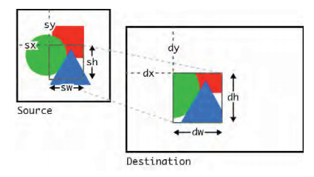

[toc]

## （未）1. HTML5简介

## （未）2. Javascript基础

## xxx 3. Canvas基础

## xxx 4. Canvas高级功能

4.1 保存和恢复绘图状态
4.2 变形
4.3 合成（Compositing）
4.4 阴影
4.5 渐变

#### （未）4.2.4 变换矩阵

#### （未）4.3.2 合成操作

### （未）4.6 复杂路径

### （未）4.7 将画布导出为图像

## 5. 处理图像和视频

### 5.1 加载图像

> 画布本身也是作为图像处理的。因此不仅图像，画布上的所有内容都可以使用本章介绍的方法处理。

drawImage方法至少三个参数，分别是图像，位置。The image argument can be a HTML **img** element, a HTML5 **canvas** element, or a HTML5 **video** element. The fact that you re not limited to basic images makes this feature of canvas very interesting.

	context.drawImage(image, x, y);

    var image = new Image();
    image.src = "example.jpg";
    $(image).load(function() {
    	context.drawImage(image, 0, 0);
    });

注意到等图像加载完成后再绘制。

### 5.2 调整和裁剪图像

三参数的drawImage会按完整尺寸绘制。还有两种方法可以调整图像大小或控制剪裁。

调整图像大小

	context.drawImage(image, x, y, width, height);

裁剪并调整：

	context.drawImage(image, sx, sy, sw, sh, dx, dy, dw, dh);

9个参数分别是：源图像，源图像的裁剪区域原点、宽度、高度，画布哈桑目标的原点、宽度、高度。

注意，目前在Webkit下，仅调整尺寸时阴影能很好显示，但如果既裁剪又缩放，阴影效果可能会完全小时。

    context.shadowBlur = 20;
    context.shadowColor = "rgb(0, 0, 0)";
    var image = new Image();
    image.src = "example.jpg";
    $(image).load(function() {
    	context.drawImage(image, 50, 50, 300, 200);
    });

    context.shadowBlur = 20;
    context.shadowColor = "rgb(0, 0, 0)";
    var image = new Image();
    image.src = "example.jpg";
    $(image).load(function() {
    	context.drawImage(image, 0, 0, 250, 250, 50, 50, 250, 250);
    });

### 5.3 图像变形

