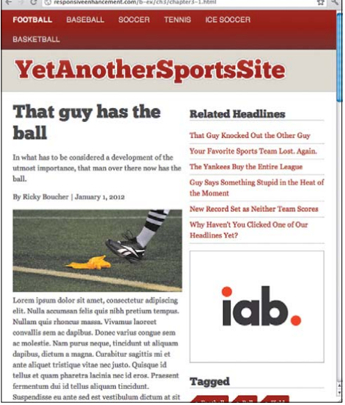
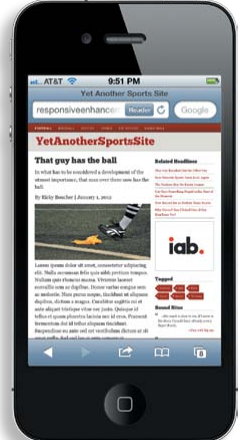
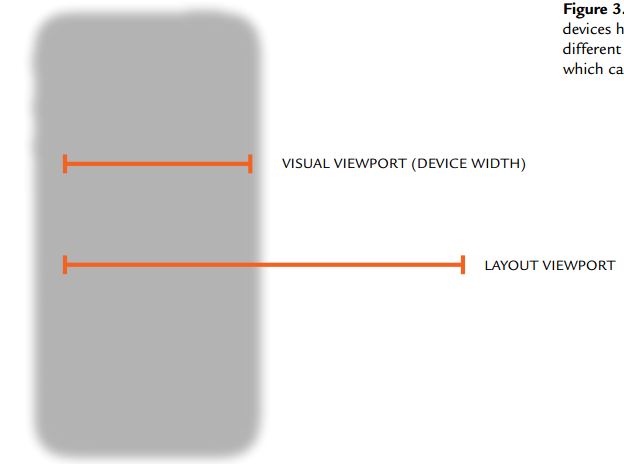
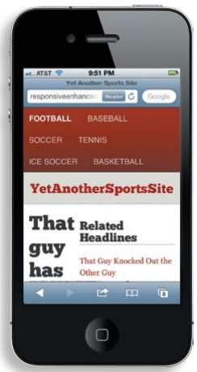
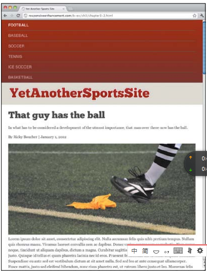
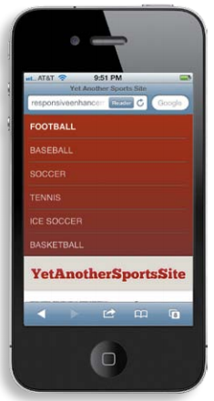
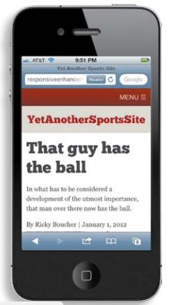

[toc]

本书源代码在 http://implementingresponsivedesign.com

# 1 Web无处不在

# 2 流动布局

## 2.1 布局选项

在 Flexible Web Design 一书中定义了四种布局：固定宽度、liquid (or fluid)、弹性（elastic）、混合。

- 固定宽度：最流行的是960px。960px比其他宽度对网格布局更友好。但在太大太小的显示器下显示都不好。
- 流动布局：大小的单位是百分比，不是像素。光靠流动布局自身并不能确保美观的设计，因为宽度可能变得过于小或过于大。但它是响应式设计的基础（再加上媒体查询等策略）。它比其他布局更适合响应式设计：需要解决的问题更少，需要的CSS也更少。
- 弹性（Elastic）布局：弹性布局与流动布局类似，except that their constraints are determined by the type size—一般用 `em`。`1em` 等于当前定义的字体大小。例如若body文本设定 `font-size` 为16px。则1em等于16px，2em等于32px。
    Elastic layouts provide strong typographic control. 研究表明一行45到70个字符可读性是良好的。在弹性布局中，可以定义容器宽度为 `55em`。另一好处是，当用户增加或减小字体大小时，使用弹性宽度定义的元素能随之增大缩小。
    不幸的是，弹性布局也会导致水平滚动条。如果字体大小是16px，而容器宽度为55em，则宽度小于 880px 的屏幕将出现滚动条。这个问题比固定布局更加难以预测。如果用户放大了字体大小，容器会变得更大。

哪种布局是最具响应性的？取决于特定工程。每种布局都有优缺点。
多数情况，答案是流动、弹性或混合布局。它们比固定宽度布局都更加对未来友好。

使用媒体查询，固定宽度能够在几种宽度切换。但这种方式，只有在设定的那几个宽度是非常美观的，但在设定值之间的中间值不够好。用户的体验取决于他们的屏幕宽度是否恰好与你的设定相同。

利用媒体查询，可以消除弹性或流动布局的重要问题。注意，主要工作还是流动布局做的，媒体查询只是在此基础上做调整。这种方式更少断点，需要写的CSS更少。

## 2.2 字体大小

三个主要的字体单位：像素、百分比、em。

像素字体的问题。像素是不能级联的（cascade），即父元素的字体大小设置不影响子元素的字体大小。
第二问题，浏览器会允许用户缩放。有两种方式，一种是页面所有元素都缩放。二是，只文字缩放，其他元素不缩放。
IE9之前的IE不支持像素字体的缩放。

使用像素对未来不友好。不同设备具有不同的大小和像素密度（densities）。

1em等于当前字体大小。如果body文本大小未16px，则1em等于16px。

em可被缩放。也级联（cascade）。级联也会带来问题，如：

```html
<body>
	<div id=”main”>
	<h1>Question One <span>Please choose an answer from below.</span></h1>
```
```css
body {
	font-size: 16px; /* base font size set in pixels */
}
h1 {
	font-size: 1.5em; /* 24px / 16px */
}
```

设置body的字体大小是16px。在h1中，上下文的字体大小是16px。1.5em是24px。在span中上下文字体大小变成了24px。此时1em为24px而不是16px。

若用百分比设置字体，与em一样是可调整大小的、可级联（cascade）的。与em一样，如果基准 `font-size` 是16px，则100%等于16px，200%等于32px。

虽然二者没有太大区别，现在一般更倾向于使用em而不是百分比。这不是由于技术，而是由于em是专门为文字设计的单位。

但在IE中，设置文档的基准 `font-size` 时若使用em会导致问题。IE增加了字体大小被调整的幅度。例如，若基准 `font-size` 是 `1em`，设置h1的 `font-size` 为2em。在IE中，h1实际会比2倍大。使用百分比设置基准字体可以解决该问题。

```css
body {
	font-size:	100%;
}
```

### 默认字体大小

在桌面浏览器上一般都是 `16px`。So if you set the font-size on the body to 100%, you get a consistently sized font.

但在移动设备上默认字体大小往往更大。因为它们的像素分辨率往往更大，于是16px看起来过于小。移动设备解决此问题的主要方式是向浏览器报告一个较低的分辨率。如iPhone 4的分辨率是640x960，但它向浏览器报告320x480。另一些设备，向浏览器提供真实大小，但使用更大的默认字体大小。

最终关键的不是实际的像素大小：实体的可读性是关键。设置基础 `font-size` 为100%，但记住字体的像素可能不是 16px。

### rem

rem与em类似。但它总是相对于**根元素（html）**的字体大小。即它不级联。

但它的浏览器支持不够好。一般需要提供兼容选项。如：

```css
span {
	font-size:	16px;
	font-size:	1rem;
}
```

### 哪种方式最具响应性

本书后半部分，都将在body上使用百分比，在后面使用 `em`。

## 2.3 网格布局

在**Ordering Disorder: Grid Principles for Web Design**一书中提出了网格（grid）设计的四个注意优点：

- 网格增加了秩序、创造力、协调
- 网格使得读者可以预测信息出现的位置。
- Grids make it easier to add new content in a manner consistent with the overall vision of the original presentation.
- Grids facilitate collaboration on the design of a single solution without compromising the overall vision of the solution.

## 2.4 混用固定宽度和流动宽度

两列。右列宽度固定。左列占据全部剩余空间。不能使用浮动实现。这里使用 CSS 表格实现。

表格布局比CSS布局的好处是简化了多列布局。可以混合使用固定和流动宽度。

通过 `display` 属性指定像表格的容器。下面是与表格相关的 `display` 的值：`table`、 `table-column`、 `table-row`、 `table-column-group`、 `table-row-group`、 `table-cell`、 `table-header-group`、 `table-caption`、`table-footer-group`。

设置列的 `display` 属性是 `table-cell` 就能是实现混合固定和流动宽度的列：

```css
.main {
	display:table-cell;
}
aside {
	display:table-cell;
	width: 300px;
}
```

右列保持 300px，左列填充剩余空间。

两列之间加分隔的方式是：

```css
.main {
	display:table-cell;
	padding-right: 2.5316456%; /* 24px / 948px */
}
```

解决IE8之前不兼容的问题，使用条件注释：

```html
<!—[if lt IE 8]>
<link rel=”stylesheet” href=”/css/ie.css” media=”all”>
<![endif]-->
```

使用表格布局有一些问题。The first is that you can’t absolutely position something contained within an element set to `display:table-cell`. If you need absolute positioning, you’ll have to either insert another div within the table cell or bypass the `display:table` approach.

第二，表格布局是固定的。不像浮动，当宽度不够时，可以自动移到下一行。


# 3 媒体查询

我们现在有一个页面，两列。主列是流动布局，侧边栏是固定宽度。在桌面浏览器上，当我们缩小浏览器宽度，主列会变得很窄。同时注意到顶部导航，后面元素已经下移。



但在移动设备上，虽然浏览器宽度也很小，但很意外，整个页面都被显示了出来，像在宽屏幕上一样，只是所有内容被缩小了。为理解此问题，需要先理解像素。



## 3.1 视口

### 两种像素和两种视口

两种像素：CSS像素和设备像素。

一般，一个CSS像素等于一个设备像素。但在一些高分辨率的屏幕上，如iphone的Retina屏，一个CSS像素等于两个设备像素。

当用户缩放屏幕时，设备像素是不变的，但CSS像素会变化。

两种视口：可视（visual）视口和布局（layout）视口。

布局视口与设备视口类似，它的大小是不变的——不论如何缩放或改变朝向。但可视视口会变化。This is the part of the page that’s actually shown on the screen at any given point. 如下图：



在手机上，为了达到“full web”的体验，很多设备返回的布局视口很大。例如iPhone的布局视口宽980px，Opera Mobile返回850px，Android WebKit返回800px。如果你再iPhone放一个320px的元素，它只占屏幕1/3大小。

### 视口标签和属性

视口标签允许我们控制缩放和设备的 **布局视口**。

```html
<meta name=”viewport” content=”directive, directive” />
```

**width**

利用 `width` 指令将视口设为某个宽度，或等于设备宽度：

```html
<meta name=”viewport” content=”width=device-width” />
```

使用 `device-width` 是最佳方案。此时屏幕的布局视口将等于屏幕（设备像素）。

若指定了一个宽度，如240px，但设备不是这个宽度，如设备屏幕宽320px，则页面会被放大1.33 (320/240)倍。因此，一般不会给 `width` 设置一个绝对值。一般总是设为 `device-width`。

**height**

```html
<meta name=”viewport” content=”height=468px” />
```

This sets the viewport height to 468px. Again, as with the `width` declarative, a more fool proof method is to set the height equal to `device-height`:

```html
<meta name=”viewport” content=”height=device-height” />
```

实际中一般不会用到 `height`。The only time it’s handy is if you don’t want to let the page scroll vertically, which doesn’t happen that often.

**user-scalable**

`user-scalable` 控制是否允许用户缩放页面：

```html
<meta name=”viewport” content=”user-scalable=no” />
```

若不设置默认是yes。

**initial-scale**

`initial-scale`控制页面初始缩放。取值0.1 (10%)到10.0 (1000%)。

```html
<meta name=”viewport” content=”initial-scale=.5, width=device-width” />
```

所有内容缩小到一半。如在320px宽的设备，页面将显示640px。

**maximum-scale**

定义用户可以放大的最大大小。In mobile Safari, the default is 1.6 (160%), but you can pass any number between 0.1 (10%) and 10.0 (1000%).

若设置 `maximum-scale` 为 1.0，将禁止用户放大。

**minimum-scale**

The `minimum-scale` clarative tells the browser how much the user can zoom out on a page. In mobile Safari, the default is 0.25 (25%). As with `maximum-scale`, you can pass any number between 0.1 (10%) and 10.0 (1000%).

If you set the `minimum-scale` declarative to 1.0 (100%), you disable to the ability to zoom out.

**修复视口问题**

要解决页面被缩小的问题，让手机使用设备宽度做约束，设置 `width` 等于 `device-width`：

```html
<meta name=”viewport” content=”width=device-width” />
```

现在当页面显示在手机时，与我们缩小桌面上的浏览器后的结果相同。现在手机实际大小就是可见视口。现在我们把移动浏览器拉回到了桌面浏览器的方式。



> 通过CSS表达 `@viewport`，此项特性尚未得到广泛实现。

## 3.2 媒体查询结构

一般语法：

```css
@media [not|only] type [and] (expr) {
	rules
}
```

一个媒体查询由四部分组成：

- 媒体类型：是屏幕、打印还是投影仪等
- 媒体表达式：测试某个特性，返回true或false
- 逻辑关键字：and, or, not, only
- Rules: basic styles that adjust the display

### 媒体类型

如all、print、projection、screen、tv。

```css
@media print {}
```

或者使用media特性：

```html
<link rel=”stylesheet” href=”print.css” media=”print” />
```

每个台媒体查询都必须包含媒体类型。若不设定，默认是 `all`，but the actual behavior varies from browser to browser.

### 媒体表达式

```css
@media screen and (min-width: 320px) {
}
```

- `width`：设备显示区域宽度。取值如320。
- `height`：设备显示区域高度。取值如600。
- `device-width`：describes the width of the rendering surface of the device. 取值如320。
- `device-height`：取值如600。
- `resolution`：像素密度。resolution may be expressed in dots per inch [dpi] or dots per centimeter [dpcm]) (e.g., 118dpcm)
- `aspect-ratio`：`width` 和 `height` 的比。取值如 `16/9`。
- `device-aspect-ratio`：`device-width` 和 `device-height`的比。取值如 `16/9`。

上面几个特性可以加前缀 `min-` 或 `max-`。

- `orientation`：`portrait` 还是 `landscape`。

其他：`color`、`color-index`、`monochrome`、`scan`。

### 逻辑关键字

You can use `and` to test against more than one expression:

```css
@media screen and (color)
```

`not` 作用于整个表达式，而不是一部分：

```css
@media not screen and (color) {...} // equates to not (screen and (color))
```

You can’t use the `not` keyword to negate a single test—it must precede the rest of the query.

实际没有 `or` 关键字。逗号起**或**的作用。

```css
@media screen and (color), projection and (color)
```

Many older browsers support media types, but not media queries. This sometimes results in the browser attempting to download styles that you don’t want the user to see. The `only` keyword can be used to hide media queries from older browsers, as they won’t recognize it. Browsers that do support the `only` keyword process the media query as if the `only` keyword wasn’t present. This is generally a very good idea.

```css
@media only screen and (color)
```

If a device doesn’t support media queries, it ignores the query above entirely. If it does support them, it evaluates the query the same way it would evaluate the following:

```css
@media screen and (color)
```

### 规则

就是普通的CSS规则，如：

```css
@media only screen and (min-width: 320px) {
	a {
		color: blue;
	}
}
```

## 3.3 嵌入的还是外部的

媒体查询可以嵌入主样式表，或者放入link元素的media特性，条件加载外部样式表。

嵌入的方式：

```css
a {
	text-decoration:none;
}
@media screen and (min-width: 1300px) {
	a {
		text-decoration: underline;
	}
}
```

外部的方式：

```html
<link href=”style.css” media=”only screen and (min-width: 1300px)” />
```

建议用用嵌入式的。

## 3.4 媒体查询顺序

两种开发顺序，桌面优先，再考虑手机；或反过来。

### 从桌面到手机

默认布局针对桌面浏览器设计。然后使用一组媒体查询，为小屏幕设计。

```css
/* base styles */
@media all and (max-width: 768px) {
	...
}
@media all and (max-width: 320px) {
	...
}
```

注意使用的是 `max-`。

这种设计的问题是，有些移动设备，如 BlackBerry (pre-version 6.0), Windows Phone 7，不支持媒体查询。在这些设备上，将按桌面显示。

### 从手机到桌面

先从移动设备出发，然后用媒体查询为更大的屏幕设计。这样在不支持媒体查询的小屏幕设备上也能正确显示。桌面设备上唯一需要考虑的是IE。IE9之前不支持媒体查询。但解决方法很简单（后面讲）。

```css
/* base styles, for the small-screen experience, go here */
@media all and (min-width: 320px) {
	...
}
@media all and (min-width: 768px) {
	...
}
```

注意使用的是 `min-`。

先为手机设计的另一个好处是，降低CSS的复杂性。考虑两列的例子。在大屏上通过`display:table-cell` 设置边栏。在小屏上，边栏最好在主列下面。如果先为桌面设计，CSS会是：

```css
aside {
	display:table-cell;
	width: 300px;
}
@media all and (max-width: 320px) {
	aside {
		display:block;
		width: 100%;
	}
}
```

但如果先为手机设计，CSS：

```css
@media all and (min-width: 320px) {
	aside {
		display:table-cell;
		width: 300px;
	}
}
```

## 3.5 先从核心体验开始

核心体验是一个简单的、单列布局。



## 3.6 选取断点

选取断点一般的方式使用一些标准宽度：320px（iPhone等手机）、768px (iPad)和1024px。

这种方式的问题是，中间的设备会被忽略，如当iphone横屏时宽度是480px。而且这种方式对未来不友好。

### （未）遵循内容

先把屏幕缩小到约300px。然后逐渐放大。观察内容在哪个宽度适合设个断点，调整布局。详见书。

### （未）更大的屏幕

屏幕很大时，行宽过大，不利于阅读。用CSS3的多列布局解决。

### 媒体查询使用em

浏览器可能被用户缩放。在 Firefox 和 Opera 上问题不大：基于像素的媒体查询会被重新计算，考虑缩放。但在其他浏览器中，精确设置的像素的端点会导致问题。Suddenly things start to float in awkward ways and our ideal line length is mercilessly thrown out the window. 相同的问题还可能由于设备采用不同的默认字体大小，如Kindle使用26px 。解决这些问题，同时让我们网站更灵活的方法是媒体查询使用em。

As we also discussed in Chapter 2, converting pixel-based measurements to ems is as simple as dividing the target (the breakpoint) by the context (in this case, 16px, the body font size):

```css
/* 600px/16px = 37.5em */
@media all and (min-width: 37.5em) {
	...
}
/* 860px/16px = 53.75em */
@media all and (min-width: 53.75em) {
	...
}
/* 940px/16px = 58.75em */
@media all and (min-width: 58.75em) {
	...
}
/* 1300px/16px = 81.25em */
@media all and (min-width: 81.25em) {
	...
}
```

## 3.7 导航

顶部导航在移动设备屏幕上占据了太多空间。



解决方法是，提供一个菜单按钮，触发弹出菜单：



## 3.8 支持IE

IE9才支持媒体查询。解决方法是使用条件注释为IE9之前的IE引入另一个样式表。

```html
<!--[if	(lt	IE9) & (!IEMobile)]>
<link rel=”stylesheet” href=””/css/ie.css” media=”all”>
<![endif]-->
```

# 4 响应式媒体

## 4.1 什么问题

1. 有些图片在小屏就没必要显示了。如大的装饰类的抬头，在小屏上会占据过多空间。一些为大屏设计的图片，在手机上并无多少吸引力。
2. 应根据屏幕尺寸下载不同大小的图片。提高性能。
3. 当图片尺寸变小时，一些细节会变得模糊。因此小屏的图片跟大屏的图片可能不是同一张——小屏的图片可能是大屏图片的一部分——突然重点的部分。

## 4.2 在手机上省略一些图片

不能使用 `display:none`。虽然图片不显示，但它还是会被下载。正确方法是，首先为手机设计，去掉不重要的图片。然后利用Javascript媒体查询，在大屏上有选择的加载更多的图片。例如：

```html
<ul class=”slats”>
	<li data-src=”images/ball.jpg” class=”group”>
		<a href=”#”>
			<h3>Kicker connects on record 13 field goals</h3>
		</a>
	</li>
```

`matchMedia()` 方法是一个原生的JavaScript方法，向它传入CSS媒体查询，返回是否匹配。
函数返回实际是一个 `MediaQueryList` 对象。这个对象有两个属性： `matches` 和 `media`。`matches` 属性返回true（如果媒体查询匹配）或false。`media` 属性返回你刚传入的媒体查询。例如，`window.matchMedia(“(min-width: 200px)”)` 的 `media` 属性返回`(min-width: 200px)`。

支持 `matchMedia()` 的浏览器有Chrome, Safari 5.1+, Firefox 9, Android 3+, iOS5+。其他浏览器可以使用 https://github.com/paulirish/matchMedia.js。

```js
if (window.matchMedia(“(min-width: 37.5em)”).matches) {
 	 //load in the images
 	 var lazy = Utils.q(‘[data-src]’);
 	 for (var i = 0; i < lazy.length; i++) {
 	 	 var source = lazy[i].getAttribute(‘data-src’);
 	 	 //create the image
 	 	 var img = new Image();
 	 	 img.src = source;
 	 	 //insert it inside of the link
 	 	 lazy[i].insertBefore(img, lazy[i].firstChild);
 	 };
}
```


