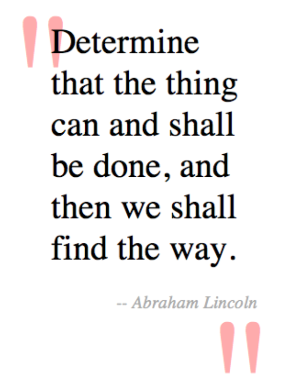

[toc]

## R2. 引用

    blockquote:before {
    	content: open-quote;
        position: absolute;
        z-index: 1;
        top: -30px;
        left: 10px;
        font-size: 12em;
        color: #FAA;
        font-family: serif;
    }
    blockquote:after {
    	content: close-quote;
        position: absolute;
        z-index: 1;
        bottom: 80px;
        left: 225px;
		font-size: 12em;
		color: #FAA;
		font-family: serif;
    }

实现小三角：

    blockquote:after {
    	content: "";
        position: absolute;
        z-index: 1;
        bottom: -50px;
        left: 40px;
        border-width: 0 15px 50px 0px;
        border-style: solid;
        border-color: transparent #faa;
        display: block;
        width: 0;
    }

制作小三角只需要设置边框。设置上下左右四个边厚度不同即可实现。设置上限边框颜色未透明，左右有色。

