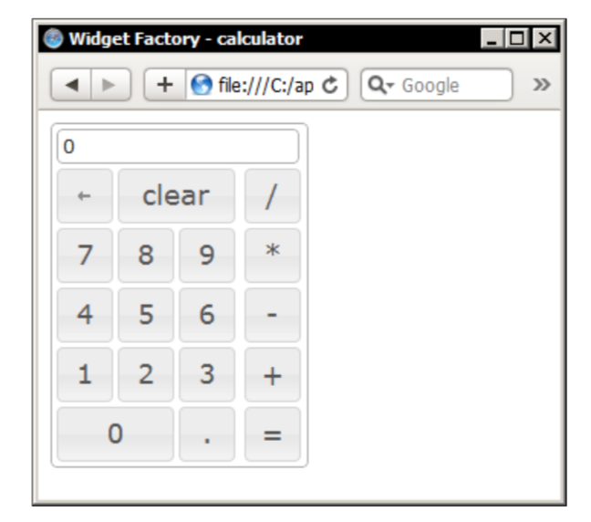

[toc]

## 1. 介绍

### （未）1.3 库结构

### （未）1.4 ThemeRoller

### 1.5 组件分类

三类组件：

1. 底层的交互帮助：主要处理鼠标事件
2. Widgets：产生页面上的可视对象
3. 核心组件：components that other parts of the library rely on.

核心组件包括：Core、Widget、Mouse、Position

The `core` file sets up the construct that all components use to function, and adds some core functionality which is shared by all of the library components, such as keyboard mappings, parent-scrolling, and a z-index manager. This file isn't designed to be used standalone, and exposes no functionality that can be used outside of another component.

交互帮助由以下组件组成：Draggable、Droppable、Resizable、Selectable、Sortable

高层的Widget包含：Accordion、Autocomplete、Button、Datepicker、Dialog、Progressbar、Slider、Tabs

The widget factory literally creates the basis for all of the visible widgets exposed by the library. It implements the shared API common to all widgets, 如创建和销毁方法，提供事件回调逻辑。它还能让我们创建自定义的jQuery UI widgets，继承共享的API。

### 1.9 API介绍

API方法分成三类：

- plugin方法：This method is used to initialize the component and is simply the name of the component, followed by parentheses. I will refer to this throughout the book as the plugin method or widget method.
- 共享的API方法：The `destroy` method can be used with any of the components, to completely disable the widget being used and in most cases, returns the underlying HTML to its original state. 在**组件初始化完成后**，`option`方法用户读取或设置配置选项。The `enable` and `disable` methods are used by most library components to enable or disable the component. The `widget` method, exposed by all widgets, returns a reference to the current widget.
- 组件特有的方法。

所有组件的方法调用方式是一样的。调用组件的`plugin`方法，传入要调用的方法名（字符串），然后是参数。例如，若要调用accordion组件的`destroy`方法：

	$("#someElement").accordion("destroy");

利用`option`方法读取值，例如获取`navigation`选项的值：

	$("#someElement").accordion("option", "navigation");

利用`option`方法设置值：

    $("#someElement").accordion("option", "navigation", true);

还可以传入一个hash，同时设置多个值：

    $("#someElement").accordion("option", {
         navigation: true,
         autoHeight: false
    });

#### 事件与回调

组件的API还包含一个事件模型。

有两种处理jQuery UI事件的方式。一种是通过配置选项注册事件回调函数。例如，若要处理tabs的select事件（选项卡选中时触发），可以：

    var config = {
         select: function() {
         }
    };

第二种方式是用jQuery的`bind()`方法。To use events in this way, we simply specify the name of the component followed by the name of the event:

    $("#someElement").bind("tabsselect", function() {
    });

多数情况下（但不是总是！），使用`bind()`注册的回调在事件触发后执行，而通过配置选项指定的回调在事件触发前执行。

回调执行的上下文对象是触发事件的DOMElement。

jQuery UI组件触发的事件，部分是可以取消的，即阻止默认行为。例如阻止对话框关闭，只要在`beforeclose`事件的回调函数中返回false：

    beforeclose: function() {
        if (readyToClose === false) {
          return false
        }

回调函数有两个实参，第一个是事件对象，第二是组件提供的一些信息，因组件而已：

    select: function(e, ui) {
	    e.target
    	ui.index
    }

## 2. CSS框架与其他工具

Version 1.7 of jQuery UI was an exciting release because it introduced the comprehensive new CSS framework. All widgets are effectively and consistently themed by the framework. There are many helper classes that we can use in our own code, even if we aren't using any of the library components.

In this chapter we'll be covering the following subjects:

• The files that make up the framework
• How to use the classes exposed by the framework
• How to switch themes quickly and easily
• Overriding the theme
• Using the position utility

### 2.1 框架的组成文件

框架使用CSS文件位于两个目录下。

- `css`目录：This folder holds the complete CSS framework, including the theme that was selected when the download package was built. All the necessary CSS has been placed in a single, lean, and mean style sheet. The CSS file is stored in a directory, named after the theme selected on the download builder.
- `themes`目录：Another version of the framework exists within the `development-bundle\themes` folder. Two themes are provided in this folder—the **base** theme and whichever theme that was selected when the library was downloaded. The base theme is a grey, neutral theme which is visually identical to smoothness theme.
Within each of these theme folders are all the individual files that make up the framework. Each of the different components of the framework is split into its own respective files.

- **jquery.ui.all.css**：All the required files for a theme can be linked by using this file in development. It consists of **@import** directives that pull in the **ui.base.css** and the **ui.theme.css** files.
- **jquery.ui.base.css**：This file is used by **ui.all.css**. It also contains `@import` directives that pull in the **ui.core.css** file, as well as in each of the widget CSS files. However, it contains none of the theme styles that control each widget's appearance.
- **jquery.ui.core.css**：This file provides core framework styles such as the `clear-fix` helper and a `generic` overlay.
- 组件的CSS，包括：
  - jquery.ui.accordion.css
  - jquery.ui.datepicker.css
  - jquery.ui.dialog.css
  - jquery.ui.progressbar.css
  - jquery.ui.resizable.css
  - jquery.ui.slider.css
  - jquery.ui.tabs.css

- **jquery.ui.theme.css**：This file contains the complete visual theme and targets of all the visual elements that make up each widget in the library.

#### jquery.ui.all.css

**jquery.ui.all.css**利用两个`@import`引入两个文件：**jquery.ui.base.css** 和**jquery.ui.theme.css**。

#### jquery.ui.base.css

**jquery.ui.base.css**文件也是只有`@import`。

#### jquery.ui.core.css

The jquery.ui.core.css file provides generic styles for the framework that are used by all components. It contains the following classes:

**.ui-helper-hidden**
Hides elements with `display:none`.

**.ui-helper-hidden-accessible**
Hides elements by clipping them, so that the element remains fully accessible. The element is not hidden or positioned off-screen at all.

**.ui-helper-reset**
This is the reset mechanism for jQuery UI (it doesn't use a separate reset style sheet), which neutralizes the margins, padding, and other common default styles applied to common elements by browsers.

**.ui-helper-clearfix:after **
**.ui-helper-clearfix**
**.ui-helper-clearfix**
*** html .ui-helper-clearfix**
These classes provide a cross-browser solution for automatically clearing floats. Whenever an element is floated, the **.ui-helper-clearfix** class is added to the floated element's container. The **.ui-helper-clearfix:after** styles are added after the parent container (it uses the content style to insert new content) to automatically clear the float.
The .ui-helper-clearfix styles are applied to the container itself, and the * hack is used to target older versions of Internet Explorer.

**.ui-helper-zfix**
The **.ui-helper-zfix** class provides rules that are applied to `<iframe>` elements, in order to fix z-index issues when overlays are used.

**.ui-state-disabled**
This class sets the cursor to default for disabled elements and uses the !important directive to ensure that it is not overridden.

**.ui-icon**
This rule is the library's method of replacing the text content of an element with a background image. The responsibility of setting the background images for the different icons found in the library is delegated to the **jquery.ui.theme.css** file.

**.ui-widget-overlay**
This class sets the basic style properties of the overlay that is applied to the page when dialogs and other modal pop ups are shown. As images are used by the overlay, some styles for this class are also found in the theme file.

#### jquery.ui.theme.css

This file will be customized to the theme that was selected or created with ThemeRoller and it sets all of the visual properties (colors, images, and so on) for the different elements that make up each widget.

Within the jquery.ui.reset.css file, there are many comments that contain descriptive labels, enclosed within curly braces. These are called placeholders and the CSS styles that precede them are updated by ThemeRoller automatically when the theme is generated.

Each widget is constructed from a set of common elements. For example, the outer container of each widget has the class named ui-widget, while any content within the widget will be held in a container with the class named ui-widget-content. It is this consistent layout and classing convention that makes the framework so effective.

The jQuery UI documentation features an extensive overview of the theming API at: http://docs.jquery.com/UI/Theming/API.

### 2.2 引入需要的CSS文件

开发环境，通过jquery.ui.all.css可以一次性引入所有独立文件：

    <link rel="stylesheet"
    	href="development-bundle/themes/smoothness/jquery.ui.all.css">

分开引入时，要注意以下顺序：core.css, the widget's CSS file, and the theme.css file.

In a production environment of course, we'd use the super-efficient combined file to minimize the number of HTTP requests for CSS files. We need to link to the combined jquery-ui-x.x.x.css style sheet found in the css/themename/ directory:

	<link rel="stylesheet"
    	href="css/smoothness/jquery-ui-x.x.x.custom.css">

### 2.4 容器

Containers are recommended because it means that widgets or plugins that we write, will be ThemeRoller-ready and easier for end-developers to theme and customize. Let's look at how easy it is to use the framework with our own elements. 例子：

    <!DOCTYPE html>
    <html>
    <head>
        <meta charset="utf-8">
        <title>CSS Framework - Containers</title>
        <link rel="stylesheet" href="development-bundle/themes/base/jquery.ui.all.css">
    </head>
    <body>
        

            

                <h2>This is a .ui-widget-header container</h2>
            

            

                
This is a .ui-widget-content container

            

        

    </body>
    </html>

We use only a couple of elements in this example. Our outer container is given the class name **ui-widget**. If we were making a custom widget, we'd also want to put a custom class name on this element. For example, if we were making a content scroller, we might add the class **ui-widget-scroller**.

Within the outer container, we have two other containers—one is the `ui-widget- heading` container and the other is the `ui-widget-content` container. We also give these elements variants of the corner-rounding classes—`ui-corner-top` and `ui-corner-bottom` respectively.

### （未）2.5 交互

### （未）2.6 图标

### （未）2.7 交互提示

### （未）2.9 覆盖主题

### 2.10 定位工具

定位工具是一个强大的独立工具。可以用于定位任何元素，相对于窗口、文档或特定元素、或鼠标指针。
它与其他组件不同的是，不必依赖**jquery.ui.core.js**或**jquery.effects.core.js**。

除了`position()`方法她它没有暴露其他特有的方法，也不触发任何事件。
下面是它的一些配置选项：

- `at`：指定对其元素的哪些边，格式字符串，如`left bottom`。
- `collision`：Move the positioned element to an alternative position when the positioned element overflows its container.
- `my`：Specify the edges of the element being positioned that are expected to be aligned to the element being positioned against, for example `right top`.
- `of`：Specify the element to position against the positioned element. When a selector or jQuery object is provided, the first matched element is used. When an event object is provided, the pageX and pageY properties are used
- `offset`：Move the positioned element to the specified number of pixels. Formatted as, for example, `10, 20` with the value for the horizontal axis appearing first, then the vertical.
- `using`：Accepts a function, which actually positions the positioned element. This function receives an object containing the top and left values of the new position.

例子：

    <!DOCTYPE html>
    <html>
    <head>
    	<meta charset="utf-8">
    	<title>Position Utility - position</title>
    	<link rel="stylesheet" href="css/position.css">
    </head>
    <body>
        

        	I am being positioned against
        

        

        	I am being positioned
        

        
        
        
    </body>
    </html>

    .ui-positioning-element {
    	width:200px; height:200px; border:1px solid #000;
    }
    .ui-positioned-element {
    	width:100px; height:100px; border:1px solid #ff0000;
    }

第二个div将水平和垂直居中在第一个div中。

例二，对其右下角：

    $(".ui-positioned-element").position({
        of: ".ui-positioning-element",
        my: "right bottom",
        at: "right bottom"
    });

At the time of writing, there appears to be an issue in Webkit browsers that causes the positioning to be reversed. This is due to the default value of `flip` being applied even when no collision occurs. We can work around this issue by setting the collision option to none (see the Collision avoidance, section below).

### 2.11 （未）Collision avoidance

### 2.12 （未）Positioning with a function

### 2.13 widget factory

This is the jquery.ui.widget.js file and we can use it to create our very own jQuery UI plugins with ease. Like jQuery itself, which provides the `fn.extend()` method for easily creating plugins, jQuery UI also provides mechanisms to make plugin creation easier, and to ensure that the common API functionality is retained in new plugins.

作为例子，本节将创建一个计算器。

### （未）2.14 Creating the widget

### （未）2.15 _create 函数

### （未）2.16 The common API methods

### （未）2.17 Adding custom methods

### （未）2.18 widget样式表

### （未）2.19 使用widget

