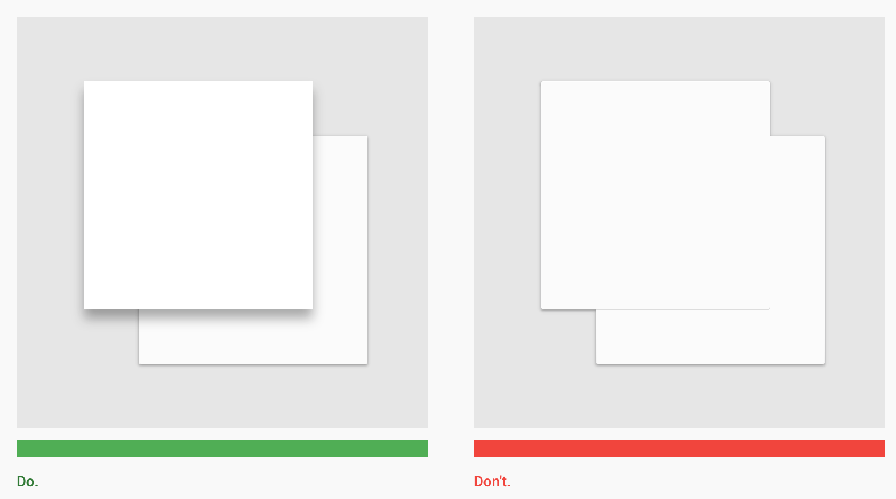
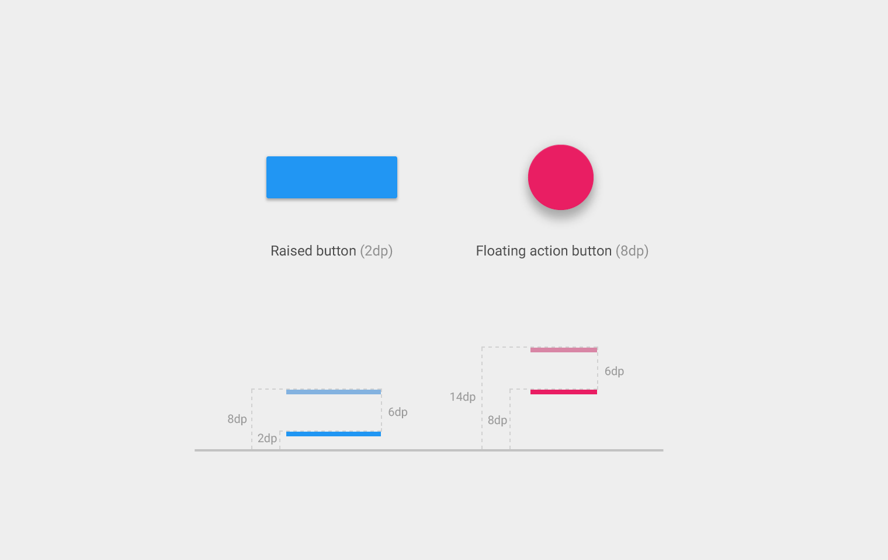

[toc]

http://www.google.com/design/spec/material-design/introduction.html

Material Design

## 1. 介绍

This spec is a living document that will be updated as we continue to develop the tenets and specifics of material design.

**目标**

- Create a visual language that synthesizes classic principles of good design with the innovation and possibility of technology and science.
- Develop a single underlying system that allows for a unified experience across platforms and device sizes. Mobile precepts are fundamental, but touch, voice, mouse, and keyboard are all first-class input methods.

**原则**

- **材料是隐喻**（Material is the metaphor）
    A material metaphor is the unifying theory of a rationalized space and a system of motion. The material is grounded in tactile reality, inspired by the study of paper and ink, yet technologically advanced and open to imagination and magic.
    Surfaces and edges of the material provide visual cues that are grounded in reality. The use of familiar tactile attributes helps users quickly understand affordances. Yet the flexibility of the material creates new affordances that supercede those in the physical world, without breaking the rules of physics.
    The fundamentals of light, surface, and movement are key to conveying how objects move, interact, and exist in space and in relation to each other. Realistic lighting shows seams, divides space, and indicates moving parts.
- **Bold, graphic, intentional**
	The foundational elements of print-based design—typography, grids, space, scale, color, and use of imagery—guide visual treatments. These elements do far more than please the eye. 它们创造了层级（hierarchy）、含义（meaning）和焦点（focus）。Deliberate color choices, edge-to-edge imagery, large-scale typography, and intentional white space create a bold and graphic interface that immerse the user in the experience.
	An emphasis on user actions makes core functionality immediately apparent and provides waypoints for the user.
- **Motion provides meaning**
	Motion respects and reinforces the user as the prime mover. Primary user actions are inflection points that initiate motion, transforming the whole design.
	All action takes place in a single environment. Objects are presented to the user without breaking the continuity of experience even as they transform and reorganize.
	Motion is meaningful and appropriate, serving to focus attention and maintain continuity. Feedback is subtle yet clear. Transitions are efficient yet coherent.

## 2. 什么是材料

### 2.1 环境

**3D世界**

材料所处的环境是一个3D的空间，即有x, y, z三维坐标。z轴垂直于显示平面，正轴朝向观察者。Every sheet of material occupies a single position along the z-axis and has a standard 1dp thickness.

**光与影**

Within the material environment, virtual lights illuminate the scene and allow objects to cast shadows. 主光源（key light）制造方向性的（directional）阴影，环绕光（ambient）制造一致的、各个角度的软阴影。

All shadows in the material environment are cast by these two light sources. Shadows are the absence of light resulting from the occlusion of these light sources by sheets of material at various positions along the z-axis.

Shadow cast by key light

Shadow cast by ambient light

Combined shadow from key and ambient lights

### 2.2 材料属性

Material has certain immutable characteristics and inherent behaviors. Understanding these qualities will help you manipulate material in a way that’s consistent with the vision of material design.

**物理属性**

Material has varying x & y dimensions (measured in dps) and a uniform thickness (1dp). 材料的厚度永远不会是0。

Material casts shadows. Shadows result naturally from the relative elevation (z-position) between material elements.

Content is displayed on material, in any shape and color. Content does not add thickness to material.

Content behavior can be decoupled from the behavior of material. However, the bounds of the material can limit the display of the content.

Material is solid. Input events cannot pass through material.

Multiple material elements cannot occupy the same point in space simultaneously.

Material cannot pass through other material. For example, one sheet of material cannot pass through another sheet of material when changing elevation.

**材料的变形**

Material can change shape.

Material grows and shrinks along only its plane.

Material never bends or folds.

Sheets of material can join together to become a single sheet of material.

When split, material can heal. For example, if you remove a portion of material from a sheet of material, the sheet of material will become a whole sheet again.

**材料的移动**

Material can be spontaneously generated or destroyed anywhere in the environment.

Material can move along any axis.

Z-axis motion is typically a result of user interaction with material.

### 2.3 3D空间中得对象

There are parallels between organizing objects in the physical world and arranging objects in space in material design. In the physical world, objects can be stacked or affixed to one another, but cannot pass through one another. 对象投下阴影，发射光。

These qualities apply to objects in material design and help create a spatial model that can be consistently applied across apps in ways that are familiar to users.

#### 海拔（Elevation）

Elevation is the relative position of an object along its parent’s z-axis. Elevation is the relative value between parent and child objects.

Elevation is measured in the same units as the x and y axes, typically in density independent pixels (dps). Since material has a standard 1dp thickness, all elevation distances are measured from one top surface to another top surface.

**Resting elevation**

All material objects have a resting elevation, whether the object is a small component or a sheet that spans the entire display.

Examples of typical resting elevations for components.

In the static state, the resting elevation for an object does not change. It is constant throughout an app. If an object changes elevation, it should return to its resting elevation as soon as possible.

The resting elevation for a given component type is consistent across apps throughout a platform. However, that same component type may have different resting elevations from platform to platform depending on the depth of the environment (e.g., TV has a greater depth than mobile or desktop).

**Responsive elevation and dynamic elevation offsets**

Certain component types have responsive elevation, which means they change their elevation in response to user input or system events. Different component states (e.g., normal, focused, pressed) may result in varying elevation changes, which are consistently implemented using dynamic elevation offsets.

Dynamic elevation offsets are relative to the resting state of the component, and act as the goal or target elevation for the component to move towards for a given component state. They also ensure that elevation changes for a given action are consistent across a component type. For example, all components that lift on press have the same elevation change, relative to their current/resting elevation.

Once the input event is completed or cancelled, the component will return to its resting elevation.

**功能性的阴影**

阴影为对象在空间中的排布提供了一些重要的视觉线索。Shadows are the only visual affordance indicating the amount of separation between surfaces. The elevation of an object determines the visual appearance of its shadow.

In motion, shadows also provide cues about an object’s direction of movement. This is another useful tool to indicate whether the distance between surfaces is increasing or decreasing.

#### 对象关系

How you organize objects in an app determines how objects or collections of objects move in relation to one another. Objects can move independently of each other, or their movement can be constrained to, and dependent upon, their container. Containers and the objects they contain have a parent-child relationship. Every object has a single parent, and may or may not have one or more children.

Children inherit transformation properties from their parent, such as position, rotation, scale, and elevation. For example, in the case of a scrolling card collection where all cards move together, the cards are siblings and they are all children of the card collection container that handles the scrolling movement.

The hierarchy of parents and children determines how objects and groups of objects interact with one another. For example, child objects have minimal z-axis separation from their parent; other objects do not get inserted between parents and children.

## 3. 动画

### 3.1 Authentic motion

Perceiving an object’s tangible form helps us understand how to manipulate it. Observing an object’s motion tells us whether it is light or heavy, flexible or rigid, small or large. Motion in the world of material design is not only beautiful, it builds meaning about the spatial relationships, functionality, and intention of the system.

**Mass and weight**

Physical objects have mass and move only when forces are applied to them. Consequently, objects can’t start or stop instantaneously. Animation with abrupt starts and stops or rapid changes in direction appears unnatural and can be an unexpected and unpleasant disruption for the user.

A critical aspect of motion for material design is to retain the feeling of physicality without sacrificing elegance, simplicity, beauty, and the magic of a seamless user experience.

