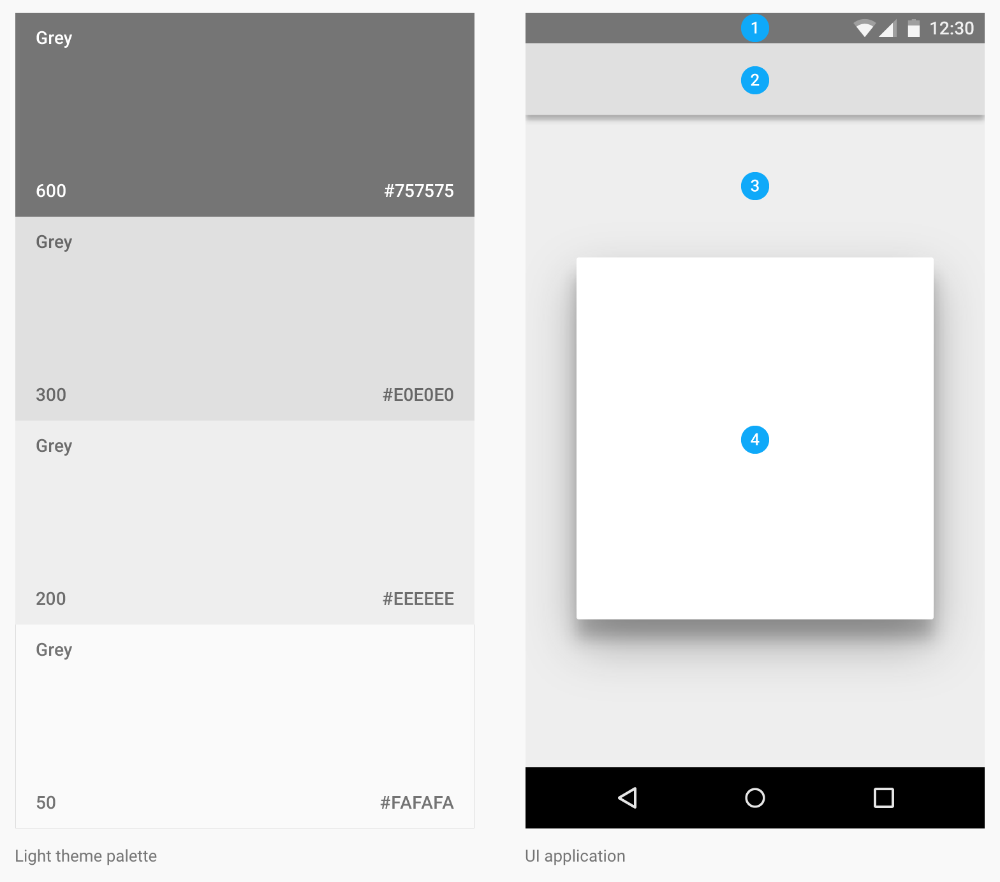

[toc]

### 4.1 颜色

材料设计中的颜色受到以下事物的启发：大胆的色调并用，柔和的环境、deep shadows、明亮的高亮（bold hues juxtaposed with muted environments, deep shadows, and bright highlights）。材料从当代建筑、路标、马路画家（pavement marking tape）、运动场汲取灵感。颜色应该是意外的（unexpected）、鲜明的（vibrant）。

#### 色盘（Color palette）

该色盘包含主色和强调（accent）色，可以用于展示（illustration）或用于设计你的品牌主色。它们被设计成彼此和谐（harmonious）。

该色盘从主色开始，然后填充色谱以创建一个完整可用的色盘。Google建议在你的APP中使用500颜色作为主色，其他颜色作为强调色（accents colors）。

[Download color swatches](http://material-design.storage.googleapis.com/publish/material_v_3/material_ext_publish/0B0J8hsRkk91LSGx6b0w3WWpMQ1k/color_swatches.zip)

#### 界面颜色应用

**Choose your palette**

限制选择的颜色，从主色板中选择三个色调（hues），从次色板中选择一个强调（accent）色（accent）。

**文本、图标、分割线使用透明度**

You can change the opacity of text to convey how important certain information is relative to other text.

- 暗文字在亮背景上：对于亮背景上的暗文字，最重要的文本的不透明度为87%。在视觉层级上低一些的次要文本，不透明度54%。文字暗示（hints），如文本框中的占位字符和标签，视觉重要度更低，不透明度26%。
- 暗背景上的白文字：主要文本、次要文本、暗示文本的不透明度分别为100%、70%、30%。
- 在彩色背景上的文字。对于彩色背景上的白色或黑色文本，参见上一节的色盘。
- Other elements, such as icons and dividers, benefit from having a hex value of black or white so that they work on backgrounds of any color.

**工具条与状态栏**

应用中，工具栏和更大的色块应该用主色的500色。状态栏应该是主色的更暗的700 tint。

鼓励在大的区域上大胆使用颜色。Different elements in the UI can take on different parts of your color theme.

**强调（Accent）色**

在主要功能按钮、开关按钮、滑块等组建上使用强调（accent）色。

**Fallback accent colors**

若你的强调色对于背景来说太亮或太暗了，选择强调色的更暗或更亮的颜色（tint）。若你的强调色根本无法用，则可以在白色背景上使用你的主色的500版本。若你的背景色是你主色的500版本，使用100%白或54%黑。

#### 主题

Themes let you apply a consistent tone to an app. The theme specifies the darkness of the surfaces, level of shadow, and appropriate opacity of ink elements. To promote greater consistency between apps, light and dark themes are available to choose from.

[下载主题](http://material-design.storage.googleapis.com/publish/material_v_3/material_ext_publish/0B0J8hsRkk91LOGV6Y3V2WFhhemM/stickersheet_uielements.ai)

主题包含状态条、App bar、背景、卡片/对话框。

