[toc]

## 8. GPIO 基础

### 8.1. Finding Your Way Around the GPIO Connector

视频参见：http://razzpisampler.oreilly.com。

下面是各个版本的 GPIO 脚布局。The quick way to tell the boards apart is that if you have an older revision 1 board, it has a black audio socket. The revision 2 boards have a blue audio socket.

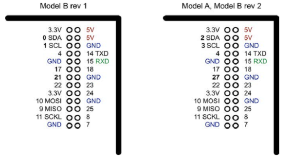

There were three changes to the GPIO connector between revision 1 and revision 2. These are highlighted in bold in Figure 8-1. First, the I2C port was swapped. The two pins SDA and SCL are still SDA and SCL but use a different internal I2C interface. This means that if you’re using the pins as GPIO rather than I2C, then you will refer to them as 2 and 3 on a revision 2 board. Also, GPIO 21 was replaced by GPIO 27 on revision 2.

顶部是 3.3V 和 5V 的供电。**GPIO 的输入输出都是3.3V**。所有旁边有数字的脚可以作为 GPIO 脚。其他有特殊名字的脚有特殊用途：14 TXD 和 15 RXD 是串口收发脚。SDA 和 SCL 组成了 I2C 接口，MOSI, MISO, SCKL 组成 SPI 接口。

GPIO 脚可以被用于数字输入或输出。Pi不支持模拟输入。要使用模拟输入，需要使用外部的模数转换（ADC），或使用接口板（如Gertboard），或使用 Arduino，或 aLaMode 板，参见第14章。

使用ADC参见12.4节。

### 8.2. 安全使用GPIO

使用GPIO的安全规则：

- 对任何GPIO脚，不要加超过 3.3V 的电压。
- 每个输出不要获取超过 3mA 电流。获取更多电流会减少Pi的寿命。3mA 足以点亮 470Ω 的**红**LED。
- 给Pi供电不要超过5V
- 从 3.3V **供电脚**上获取的**总**电流不要超过 50mA。
- 从 5V **供电脚**上获取的**总**电流不要超过 250mA。

### 8.3 安装 RPi.GPIO

使用Python读写GPIO脚。下载安装Python库 RPi.GPIO。此库是Python包裹的C代码。

    $ sudo apt-get install python-dev
    $ sudo apt-get install python-rpi.gpio

RPi.GPIO 的替代是 WiringPi。You can find out more about the library at Gordons Projects.

### 8.4. 准备 I2C

Pi与I2C设备交互。

If you are using Adafruit Occidentalis 0.2 or later, then there is nothing to do. The distribution is preconfigured with I2C support. Newer versions of the distributions may make these steps unneccessary. But in any case, this will ensure that you get the latest version.

若使用 Raspbian，需要改变一些配置。编辑`/etc/modules`文件，在尾部添加：

    i2c-bcm2708
    i2c-dev

还需要编辑`/etc/modprobe.d/raspi-blacklist.conf`，将下面注释掉：

	blacklist i2c-bcm2708
即
	#blacklist i2c-bcm2708

安装 Python I2C 库：

	$ sudo apt-get install python-smbus

Reboot your Pi and it will be ready for I2C.

利用I2C模块是与Pi交互的好方法。只需要四根连线。有很多可用的I2C模块。

注意计算I2C模块使用的总电流，不要超过8.2节的规范。

下面是Adafruit提供的I2C模块：LED矩阵、四角七段LED、16通道PWM/伺服控制器、实时时钟模块。

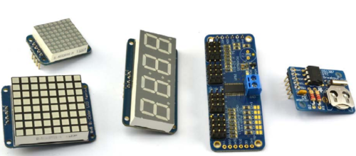

Other I2C modules available include FM radio transmitters, ultrasonic rangefinders, OLED displays, and various types of sensors.

See some of the I2C recipes in this book: Recipes 10.2, 13.1, 13.2, and 13.4.

### 8.5. 使用 I2C 工具

想要检查I2C设备是否已连接到Pi，想获取它的 I2C 地址。安装**i2c-tools**。

    $ sudo apt-get install i2c-tools

检查设备：

	$ sudo i2cdetect -y 1

Note that if you are using an older revision 1 board, you need to change 1 to 0 in the preceding code line.

If I2C is available, you will see some output like that shown in Figure 8-3. This shows that two I2C addresses are in use—0x40 and 0x70.

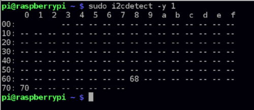

### 8.6. 准备 SPI

You have an SPI (serial peripheral interface) bus that you want to use with your Raspberry Pi.

If you are using Adafruit Occidentalis 0.2 or later, there is nothing to do. The distribution is preconfigured with SPI support. If you are using Raspbian, there are a couple of configuration changes you need to make.

Edit the file `/etc/modules` and add the following line to the end of it:

	spidev

You may also need to edit the file `/etc/modprobe.d/raspi-blacklist.conf` and comment out the line:

    blacklist spi-bcm2708

安装Python库：

    $ cd ~
    $ sudo apt-get install python-dev
    $ git clone git://github.com/doceme/py-spidev
    $ cd py-spidev/
    $ sudo python setup.py install

Reboot your Pi and it will be ready for SPI.

SPI allows serial transfer of data between the Raspberry Pi and peripheral devices, such as analog-to-digital converter (ADC) and 端口扩展芯片等。You may come across some examples of interfacing to SPI that do not use the SPI interface but instead use an approach called *bit banging*, where the RPi.GPIO library is used to interface with the four GPIO pins used by the SPI interface.

12.3节介绍一个 SPI ADC 芯片。

### 8.7. 解放串口

You want to use the serial port (Rx and Tx pins) on the Raspberry Pi for your own projects, but it is in use by Linux as a console connection.

By default, the serial port acts as a console, through which you can connect to the Raspberry Pi using a special serial lead (see Recipe 2.6).

To disable this so that you can use the serial port to connect to peripherals such as GPS (Recipe 11.10), comment out a line in `/etc/inittab`:

	$ sudo nano /etc/inittab

注释掉下面这行

	T0:23:respawn:/sbin/getty -L ttyAMA0 115200 vt100

需要重启`reboot`。

You will need to use this technique in recipes that connect hardware to the serial port, such as Recipe 11.10 and many of the recipes in Chapter 14 that communicate with an Arduino using the serial port.

### 8.8. 安装 PySerial 访问串口

You want to use the serial port (Rx and Tx pins) on the Raspberry Pi using Python.

安装 PySerial 库：

	$ sudo apt-get install python-serial

Before you can use the library for your own Python serial projects, you need to disable the Raspberry Pi’s serial console by following Recipe 8.7.

库很好用。创建新连接：

	ser = serial.Serial(DEVICE, BAUD)

`DEVICE`是串口设备`/dev/ttyAMA0`，`BAUD`的波特率。如：

	ser = serial.Serial('/dev/ttyAMA0', 9600)

连接建立后，可以发送数据：

	ser.write('some text')

Listening for a response normally involves a loop that reads and prints, as illustrated in this example:

    while True:
		print(ser.read())

### （未）8.9. Installing Minicom to Test the Serial Port

### 8.10. Using a Breadboard with Jumper Leads

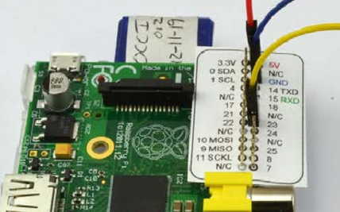

### 8.11. Using a Breadboard with a Pi Cobbler

### 8.12. 将5V的信号变为3.3V

将5V的**输出**连接到3.3V的GPIO脚。利用两个电阻分压。一个270欧，一个470欧。

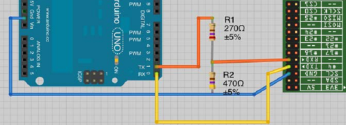

电阻要消耗6mA。考虑到Pi使用相对较大的500mA的电流，这点损失不是很明显。如果想减少电阻消耗的电流，可以**等比例扩大电阻**，如27kΩ和47kΩ，只消耗60µA。

Pi的TXD是3.3V输出。但可以直接连接到Arduino的5V输入。因为Arduino将大于2.5V的都认作高电平。

If you have multiple signals to convert between 3.3V and 5V, then it’s probably best to use a multichannel level converter module—see Recipe 8.13.

### 8.13. 利用电平转换模块转换5V到3.3V

需要将多个5V数字脚连接到GPIO脚。Use a bidirectional level converter module, such as one shown in Figure 8-8. 这种模块非常易用。One side has the power supply at one voltage and a number of channels that can be either inputs or outputs at that voltage. The pins on the other side of the module have a power pin at the second voltage and all the inputs and outputs on that side are automatically converted to the voltage level for that side.

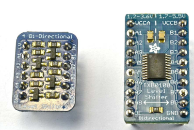

### 8.14. 电池供电

Pi严格需要5V。大于小于都不行。可行的方法是利用高电压电池，如9V，如6个AA充电电池。加稳压器。如下图，注意连接到是GPIO 5V引脚。

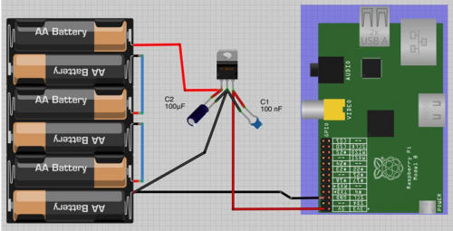

7805稳压器会变得很热。如果过热它的热保护会开启，电压会下降，可能导致Pi重启。可以加散热器。7805要求输入电压至少有7V。还可以使用低压差（low dropout (LDO)）的稳压器，如LM2940。LM2940与7805的管脚布局相同，但只需要输入电压比5V大0.5V。注意1.5V AA电池很快就会降到1.2V。因此4块不够，得用6块。

### （未）8.15. LiPo电池供电

You want to attach your Raspberry Pi to a robot and power it from a 3.7V LiPo battery.

Use a boost regulator module (Figure 8-10).

### （未）8.16. PiFace Digital Interface Board

### （未）8.17. Gertboard

### （未）8.18. RaspiRobot Board

https://github.com/simonmonk/raspirobotboard2

### （未）8.19. Using a Humble Pi Prototyping Board

### （未）8.20. Using a Pi Plate Prototyping Board

### （未）8.21. Using a Paddle Terminal Breakout Board

## 9. 控制硬件

### 9.1. 连接 LED

参考本节视频：http://razzpisampler.oreilly.com

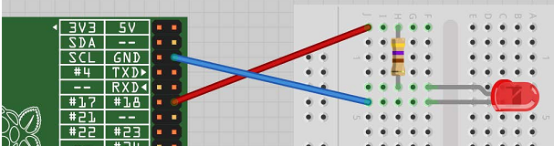

用 470Ω 或 1kΩ 电阻限制电流。把LED连接到大于1.7V的电压源，将产生非常大的电流。会损毁LED和板子。

运行需要sudo！

    $ sudo python
    >>> import RPi.GPIO as GPIO
    >>> GPIO.setmode(GPIO.BCM)
    >>> GPIO.setup(18, GPIO.OUT)
    >>> GPIO.output(18, True)
    >>> GPIO.output(18, False)

GPIO脚大约能提供3mA电流。LED点亮需要大于1 mA。但更大的电流会让它更亮。利用下表，根据LED类型选择电阻。下标还给出了从 GPIO 脚获取电流的大致值。

|LED type|Resistor|Current (mA)|
|--------|--------|------------|
|Red     |470Ω    | 3.5|
|Red     | 1kΩ    | 1.5|
|Orange, yellow, green| 470Ω| 2|
|Orange, yellow, green| 1kΩ| 1|
|Blue, white| 100Ω| 3|
|Blue, white| 270Ω| 1|

从上表可以看出，各种情况下使用470Ω电阻均是安全的。

让LED闪烁：

    import RPi.GPIO as GPIO
    import time
    GPIO.setmode(GPIO.BCM)
    GPIO.setup(18, GPIO.OUT)
    while (True):
        GPIO.output(18, True)
        time.sleep(0.5)
        GPIO.output(18, False)
        time.sleep(0.5)

### 9.2. 控制LED亮度

RPi.GPIO库支持PWM。

    import RPi.GPIO as GPIO
    led_pin = 18
    GPIO.setmode(GPIO.BCM)
    GPIO.setup(led_pin, GPIO.OUT)
    pwm_led = GPIO.PWM(led_pin, 500)
    pwm_led.start(100)
    while True:
        duty_s = raw_input("Enter Brightness (0 to 100):")
        duty = int(duty_s)
        pwm_led.ChangeDutyCycle(duty)

若使用Python 3，`raw_input`应改为`input`。

运行：

    pi@raspberrypi ~ $ sudo python led_brightness.py
    Enter Brightness (0 to 100):0
    Enter Brightness (0 to 100):20
    Enter Brightness (0 to 100):10
    Enter Brightness (0 to 100):5
    Enter Brightness (0 to 100):1
    Enter Brightness (0 to 100):90

You can exit the program by pressing Ctrl-C.

PWM可以变换脉冲长度。但频率须是恒定的。

At high frequencies, the measured PWM frequency varies somewhat from the frequency supplied as an argument. This may be something that changes in later versions of the PWM feature of RPi.GPIO.

可以修改PWM的频率：

	pwm_led = GPIO.PWM(led_pin, 500)

单位是Hz。这里是500Hz。下面比较了，设置的频率与示波器显示的实际频率的差异：

|Requested frequency|Measured frequency|
|-------------------|------------------|
|50 Hz              | 50 Hz|
|100 Hz             | 98.7 Hz|
|200 Hz             | 195 Hz|
|500 Hz             | 470 Hz|
|1 kHz              | 890 Hz|
|10 kHz             | 4.4 kHz|

随着频率增加，稳定性下降。特别的，PWM功能不适合用于音频。

### （未）9.3. Make a Buzzing Sound

### 9.4. 利用晶体管开关高功率DC设备

需要控制高功率低电压DC设备（如12V LED）的供电。

这些高功率的LED使用的电流比GPIO脚的大很多。而且它需要12V而不是3.3V。需要一个高功率三极管：MOSFET。能承受20A电流。这里使用的是FQP30N06。

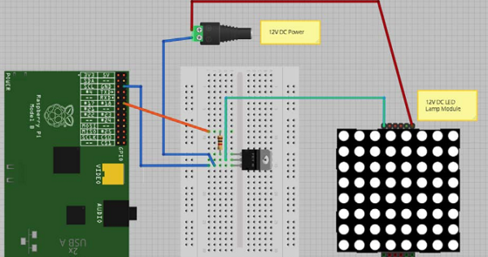

需要12V直流适配器提供LED的电流。

电阻是1kΩ。电阻是必需的：确保在MOSFET开关状态切换时，电流不会过载GPIO脚。MOSFET开关LED的负极，因此正电源与LED的正极直接相连。LED的负极用于MOSFET的漏极（drain）相连。MOSFET的源极（source）接地，MOSFET的门极（gatep）控制漏极到源极的电流。如果门极电压超过2V，MOSFET将开通，电流进入LED。此电路可以控制其他低压DC设备；除了电机和继电器（relay），它们需要特殊处理（见10.3）。

### 9.5. 利用继电器开关高功率设备

某些设备不适合用MOSFET开关。则可以使用继电器和晶体管。

器件：1kΩ电阻，晶体管2N3904，二极管1N4001，5V继电器，万用表。

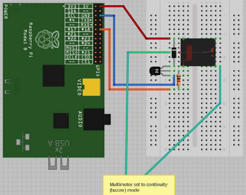

You can use the same LED blink program that you used in Recipe 9.1. 由于继电器是慢速机械设备，不要使用PWM。否则会损坏继电器。

若继电器的触点使用超过额定，会减少继电器的寿命：可能发生电弧，触点可能最终融化在一起。或继电器非常热。

继电器很慢。不能用PWM控制它们。在使用几千次后寿命会结束。

继电器中的线圈需要大约 50 mA 才能闭合连接。由于GPIO引脚只能提供大约 3 mA，需要一个小的晶体管做开关。不需要上节使用的高功率 MOSFET。基极连接到GPIO脚，中间有一个1kΩ电阻，用于限制电流。发射极接地，集电极连接到集电极一端。继电器的另一边连接到GPIO的5V脚。二极管用于平抑高电压脉冲，当三极管occur when the transistor rapidly switches the power to the relay’s coil.

### 9.6. 控制高电压AC设备

想要开关110或240V AC设备。

Use a PowerSwitch Tail II (see “Modules”on page  381). This handy device makes it really easy to switch AC equipment on and off from a Raspberry Pi. It has an AC socket on one end and a plug on the other, like an extension cable; the only difference is that the control box in the middle of the lead has three screw terminals. By attaching terminal
2 to GND and terminal 1 to a GPIO pin, the device acts like a switch to turn the appliance on and off.

You can use the same Python code as you did in Recipe 9.1 to use the PowerSwitch Tail, as shown in Figure 9-7.

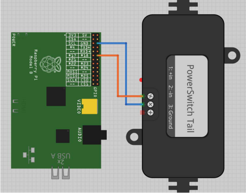

The PowerSwitch Tail uses a relay, but to switch the relay, it uses a component called an opto-isolator that has an LED shining onto a photo-TRIAC (a high-voltage, light sensitive switch); when the LED is illuminated, the photo-TRIAC conducts, supplying current to the relay coil.
The LED inside the opto-isolator has its current limited by a resistor, so that only 3 mA flows through it when you supply it with 3.3V from a GPIO pin.

### （未）9.7. Making a User Interface to Turn Things On and Off

### （未）9.8. Making a User Interface to Control PWM Power for LEDs and Motors

### （未）9.9. Changing the Color of an RGB LED

### （未）9.10. Using Lots of LEDs (Charlieplexing)

### 9.11. 使用模拟电压表

Assuming you have a 5V volt meter, you can use a PWM output to drive the meter directly, connecting the negative side of the meter to ground and the positive side to a GPIO pin. However, if the meter is the common 5V kind, you’ll only be able to display voltages up to 3.3V.

If you want to use almost the full range of a 5V volt meter, you will need a transistor to act as a switch for the PWM signal and a 1kΩ resistor to limit the current to the base of the transistor.

To make this recipe, you will need:

- 5V panel meter (“Miscellaneous” on page 382)
- Breadboard and jumper wires (see “Prototyping Equipment” on page 380)
- Two 1kΩ resistors (see “Resistors and Capacitors” on page 380)
- Transistor 2N3904 (see “Transistors and Diodes” on page 381)

The breadboard layout for this is shown in Figure 9-15.

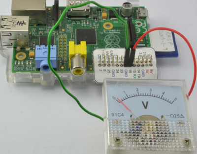

To test the volt meter, use the same program as you did for controlling the brightness of the LED in Recipe 9.2.

You will probably notice that the needle gives a steady reading at either end of the scale, but everywhere else jitters a bit. This is a side effect of the way the PWM signals are generated. For a steadier result, you can use external PWM hardware like the 16-channel module used in Recipe 10.2.

### （未）9.12. 中断

### （未）9.13. Controlling GPIO Outputs Using a Web Interface

## 10. 电机

### 10.1. 控制伺服电机

利用Pi控制伺服电机的位置。

使用PWM控制到伺服电机的脉冲宽度，尽管可行，但由于产生的PWM不稳定，因此电机会抖动。

电机应使用独立的5V供电。因为负载电流的峰值会损坏Pi。

需要：5V伺服电机、1kΩ电阻、5V 1A供电或4.8V电池包。

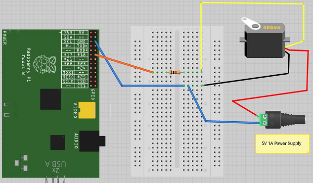

1kΩ电阻不是必须的，目的是为保护GPIO脚不被大电流损坏。一般电机的5V线是红的，底线绿，控制线橙色。4.8V电池组是可以的。如果允许，6V电池也是可以的。

The user interface for setting the angle of the servo is based on the  gui_slider.py program intended for controlling the brightness of an LED (Recipe 9.2). However, you can modify it so that the slider sets the angle, between 0 and 180 degrees.

sudo python servo.py:

    from Tkinter import *
    import RPi.GPIO as GPIO
    import time
    GPIO.setmode(GPIO.BCM)
    GPIO.setup(18, GPIO.OUT)
    pwm = GPIO.PWM(18, 100)
    pwm.start(5)
    class App:
    def __init__(self, master):
    frame = Frame(master)
    frame.pack()
    scale = Scale(frame, from_=0, to=180,
    orient=HORIZONTAL, command=self.update)
    scale.grid(row=0)
    def update(self, angle):
    duty = float(angle) / 10.0 + 2.5
    pwm.ChangeDutyCycle(duty)
    root = Tk()
    root.wm_title('Servo Control')
    app = App(root)
    root.geometry("200x50+0+0")
    root.mainloop()

多数伺服电机不是连续的；即只能转180度脚。

伺服电机的位置取决于脉冲的长度。伺服电机要求脉冲周期最大20毫秒。如果脉冲高一毫秒，则角度为零，如果1.5毫秒，将位于中心位置，如果是2毫秒，则180度。

The example program sets the PWM frequency to 100 Hz, which will send a pulse to the servo every 10 milliseconds. The angle is converted into a duty cycle between 0 and 100. This actually produces pulses shorter than the 1 millisecond expected minimum value and longer than 2 milliseconds maximum.

Adafruit has developed another method of servo control.

### 10.2. 控制大量伺服电机

You want to control a number of servos, and you need high-quality positioning of the servo motor.

Use a servo controller module like this one from Adafruit: http://www.adafruit.com/products/815.

这个模块允许你控制至多16个电机或PWM信道，使用Pi的I2C接口。

需要：多个5V伺服电机；Adafruit 12-bit PWM/servo driver—I2C interface (see “Modules” on page 381)；5V power supply or 4.8V battery pack (see “Miscellaneous” on page 382)

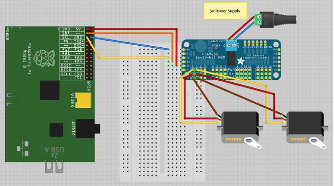

Power is supplied to the logic circuits of the module from the 3.3V connection of the Raspberry Pi. This is entirely separate from the power supply for the servo motors, which comes from an external 5V power adapter.

To use the Adafruit software for this module, you will need to install Git (Recipe 3.19) and also set up I2C on the Raspberry Pi (Recipe 8.4). Follow both of these recipes before you go any further.

The Adafruit library isn’t really a proper library that contains an installation script, but rather just a directory that contains a number of files. So, when using it, you need to be in the directory to which they are downloaded or your program will not find them.

To download all the Adafruit software library for Raspberry Pi, enter the following:

    $ git clone https://github.com/adafruit/Adafruit-Raspberry-Pi-Python-Code.git
    $ cd Adafruit-Raspberry-Pi-Python-Code
    $ cd Adafruit_PWM_Servo_Driver

The last two lines set the current directory to the directory containing the code for PWM as well as an example program supplied by Adafruit, which you can run with the command:

	$ sudo python Servo_Example.py

An alternative example next modifies the example program from Recipe 10.2 so that you can use a slider to set the servo position between 0 and 180 degrees. The program file must be saved in the `Adafruit_PWM_Servo_Driver` directory. The slider will change the servo positions of both channels 0 and 1 at the same time, so the two servos should move in the same way when you adjust the slider.

Open an editor (nano or IDLE) and paste in the following code. As with all the program examples in this book, you can also download the program from the Code section of the Raspberry Pi Cookbook website, where it is called servo_module.py. Note that this program uses a graphical user interface, so you can’t run it from SSH. You must run it from the windowing environment on the Pi itself or via remote control using VNC (Recipe 2.8).

    from Tkinter import *
    from Adafruit_PWM_Servo_Driver import PWM
    import time
    pwm = PWM(0x40)
    pwm.setPWMFreq(50)
    class App:
    	def __init__(self, master):
            frame = Frame(master)
            frame.pack()
            scale = Scale(frame, from_=0, to=180,
            	orient=HORIZONTAL, command=self.update)
            scale.grid(row=0)
    	def update(self, angle):
            pulse_len = int(float(angle) * 500.0 / 180.0) + 110
            pwm.setPWM(0, 0, pulse_len)
            pwm.setPWM(1, 0, pulse_len)
    root = Tk()
    root.wm_title('Servo Control')
    app = App(root)
    root.geometry("200x50+0+0")
    root.mainloop()

The first line after the import creates a new instance of PWM using the I2C address specified as its argument—in this case, 0x40. The module has solder pad connections that allow you to change the I2C address if this conflicts with another I2C device you are using, or you want to use more than one of these modules.

The next line sets the PWM frequency to 50 Hz, which will provide an update pulse every 20 milliseconds.

The line that actually sets the PWM for a particular channel is:

	pwm.setPWM(0, 0, pulse_len)

The first argument is the PWM channel whose duty cycle is to be changed. Each cycle of PWM is divided into 4,096 ticks, and the second argument is the tick at which the pulse should start. This will always be 0. The third argument is the tick at which the pulse should end. The constants of 500.0 and 110 in the following line were tweaked with a little trial and error to provide a standard servo with as close to 180 degrees of movement as possible:

    pulse_len = int(float(angle) * 500.0 / 180.0) + 110

When selecting a power supply for this module, remember that a standard remote control servo can easily draw 400 mA while it’s moving, and more if it’s under load. So if you plan to have a lot of large servos moving at the same time, you will need a big power adapter.

### 10.3. 控制直流电机速度

You can use the same design as Recipe 9.4. It is, however, a good idea to place a diode across the motor to prevent voltage spikes from damaging the transistor or even the Raspberry Pi (Figure 10-5). The 1N4001 is a suitable diode for this (see  “Transistors and Diodes” on page  381). The diode has a stripe at one end, so make sure that this is the
right way around.

对于小功率电机（小于200mA），you can base the design on the one used for a relay in Recipe 9.5. You will need:

- 3V 到 12V 直流电机
- 1kΩ电阻
- Transistor 2N3904 (see “Transistors and Diodes” on page 381)
- Diode 1N4001 (see “Transistors and Diodes” on page 381)
- Power supply with voltage to match the motor

If you are only using a low-power DC motor (less than 200 mA), you can use a smaller (and cheaper) transistor (Figure 10-6). You can probably get away with powering a small motor from the 5V supply line on the GPIO connector. If you find that the Raspberry Pi crashes, use an external power supply, as shown in Figure 10-5.

控制高功率直流电机：

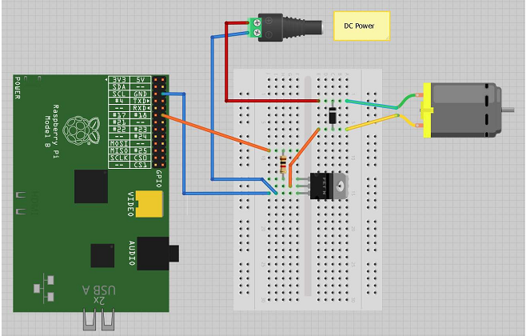

控制小功率直流电机：

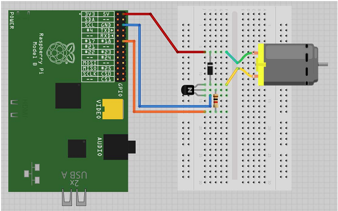

To control the speed of the motor, you can use the program from Recipe 9.8 (gui_slider.py). You can also download the program from the Code section of http://www.raspberrypicookbook.com, where it is called [gui_slider.py](http://).

This is actually the same circuit as you used to switch a relay in Recipe 9.5, except with the motor in place of the relay coil. See Recipe 9.4 for a description of how it works.

### 10.4. 控制直流电机的速度和方向

使用H-Bridge芯片或模块。

有两种方法可选。第一种，DIY，使用 L293D 芯片和面包版。第二种方法使用装好的 H-Bridge模块（来自SparkFun）。

L293D和SparkFun模块都能驱动两个电机。

选项1：L293D芯片

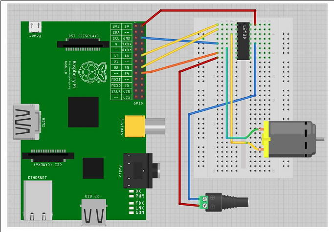

选项2：电机控制模块

If you decide to use the SparkFun motor controller, or a similar motor controller module, you will need the following:

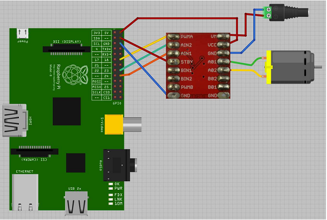

如果想要驱动轮子，一般需要使用齿轮箱降低转速提高扭矩。

软件：

不管使用什么硬件，都可以使用相同的程序控制电机。This allows you to enter a letter for r and then a single digit between 0 and 9. The motor will then either go forward or backward, at a speed specified by the digit—0 for stopped, 9 for full speed.

    $ sudo python motor_control.py
    Command, f/r 0..9, E.g. f5 :f5
    Command, f/r 0..9, E.g. f5 :f1
    Command, f/r 0..9, E.g. f5 :f2
    Command, f/r 0..9, E.g. f5 :r2

motor_control.py. If you’re using Python 3, change the command `raw_inputto` just `input`.

    import RPi.GPIO as GPIO
    import time
    enable_pin = 18
    in1_pin = 23
    in2_pin =24
    GPIO.setmode(GPIO.BCM)
    GPIO.setup(enable_pin, GPIO.OUT)
    GPIO.setup(in1_pin, GPIO.OUT)
    GPIO.setup(in2_pin, GPIO.OUT)
    pwm = GPIO.PWM(enable_pin, 500)
    pwm.start(0)
    def clockwise():
    GPIO.output(in1_pin, True)
    GPIO.output(in2_pin, False)
    def counter_clockwise():
    GPIO.output(in1_pin, False)
    GPIO.output(in2_pin, True)
    while True:
    cmd = raw_input("Command, f/r 0..9, E.g. f5 :")
    direction = cmd[0]
    if direction == "f":
    clockwise()
    else:
    counter_clockwise()
    speed = int(cmd[1]) * 10
    pwm.ChangeDutyCycle(speed)

一个L293D有两个H桥。可以控制两个电机。每个控制信道有3个引脚。The `Enable` pin just enables or disables the channel as a whole. In the example program, this is connected to a PWM output to control the speed of the motor. The other two pins (IN1 and IN2) control the direction in which the motor will be driven. You can see the use of these two control pins in the functions `clockwis` eand `counter_clockwise`:

    def clockwise():
        GPIO.output(in1_pin, True)
        GPIO.output(in2_pin, False)
        def counter_clockwise():
        GPIO.output(in1_pin, False)
        GPIO.output(in2_pin, True)

If IN1 is high and IN2 is low, the motor will turn in one direction. If those two pins are reversed, the motor will turn in the opposite direction.

In Recipe 10.8, you see the use of the L293D in a Raspberry Pi interface board, the RaspiRobot Board.

### 10.5. 单极性步进电机

You want to drive a five-lead unipolar stepper motor using a Raspberry Pi.

Use a ULN2803 Darlington driver chip.

步进电机介于直流电机和伺服电机之间。它们可以连续旋转，也可以通过一步步移动精确定位它们。

需要：

- 5V, five-pin unipolar stepper motor (see “Miscellaneous” on page 382)
- ULN2803 Darlington driver IC (see “Integrated Circuits” on page 381)

芯片可以用于驱动两个电机。To drive a second stepper motor, you will need to connect four more control pins from the GPIO connector to pins 5 to 8 of the ULN2803 and connect the second motor’s four pins to pins 11 to 14 of the ULN2803.

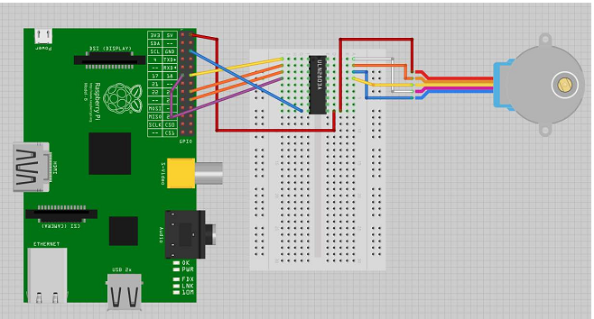

The 5V supply from the GPIO connector may work OK with a small stepper motor. If you experience problems with the Raspberry Pi crashing or need to use a bigger stepper motor, then use a separate supply for the power to the motor (pin 10 of the ULN2803).

stepper.py. If you’re using Python 3, change the command `raw_input` to just `input`:

    import RPi.GPIO as GPIO
    import time
    GPIO.setmode(GPIO.BCM)
    coil_A_1_pin = 18
    coil_A_2_pin = 23
    coil_B_1_pin = 24
    coil_B_2_pin = 17
    GPIO.setup(coil_A_1_pin, GPIO.OUT)
    GPIO.setup(coil_A_2_pin, GPIO.OUT)
    GPIO.setup(coil_B_1_pin, GPIO.OUT)
    GPIO.setup(coil_B_2_pin, GPIO.OUT)
    forward_seq = ['1010', '0110', '0101', '1001']
    reverse_seq = list(forward_seq) # to copy the list
    reverse_seq.reverse()
    def forward(delay, steps):
    for i in range(steps):
    for step in forward_seq:
    set_step(step)
    time.sleep(delay)
    def backwards(delay, steps):
    for i in range(steps):
    for step in reverse_seq:
    set_step(step)
    time.sleep(delay)
    def set_step(step):
    GPIO.output(coil_A_1_pin, step[0] == '1')
    GPIO.output(coil_A_2_pin, step[1] == '1')
    GPIO.output(coil_B_1_pin, step[2] == '1')
    GPIO.output(coil_B_2_pin, step[3] == '1')
    while True:
    set_step('0000')
    delay = raw_input("Delay between steps (milliseconds)?")
    steps = raw_input("How many steps forward? ")
    forward(int(delay) / 1000.0, int(steps))
    set_step('0000')
    steps = raw_input("How many steps backwards? ")
    backwards(int(delay) / 1000.0, int(steps))

When you run the program, you will be prompted for a delay between steps. This should be two or more. You will then be prompted for the number of steps in each direction:

    $ sudo python stepper.py
    Delay between steps (milliseconds)?2
    How many steps forward? 100
    How many steps backwards? 100
    Delay between steps (milliseconds)?10
    How many steps forward? 50
    How many steps backwards? 50
    Delay between steps (milliseconds)?

Stepper motors use a cogged rotor and electromagnets to nudge the wheel around a step at a time (Figure 10-12). Note that the colors of the leads will vary.

Energizing the coils in a certain order drives the motor around. The number of steps that the stepper motor has in a 360-degree rotation is actually the number of teeth on the rotor.

The example program uses a list of strings to represent each of the four energization stages that make up a single step:

	forward_seq = ['1010', '0110', '0101', '1001']

The sequence for rotating the motor in the opposite direction is just the reverse of the sequence for moving forward.

You can use the `forward` and `backward` functions in your programs to step the motor back and forth. The first argument to either function is the delay in milliseconds between each part of the step sequence. This minimum value for this depends on the motor you use. If it’s too small, the motor will not turn. Typically, two milliseconds or more will be fine. The second parameter is the number of steps to take.

    def forward(delay, steps):
    	for i in range(steps):
    		for step in forward_seq:
    			set_step(step)
    			time.sleep(delay)

The forward function has two nested for loops. The outer one repeats for the number of steps and the inner one iterates over the sequence of motor activations, calling `setStep` for each in sequence.

    def set_step(step):
        GPIO.output(coil_A_1_pin, step[0] == '1')
        GPIO.output(coil_A_2_pin, step[1] == '1')
        GPIO.output(coil_B_1_pin, step[2] == '1')
        GPIO.output(coil_B_2_pin, step[3] == '1')

The `set_step` function sets each of the control pins to high or low, depending on the pattern supplied as its argument.

The main loop sets the step to 0000 between moving forward and backward, to set the outputs all to zero when the motor is not actually turning. Otherwise, one of the coils may be left on, causing the motor to draw current unnecessarily.

If the type of stepper motor you have is a four-wire bipolar stepper motor, see Recipe 10.6.

