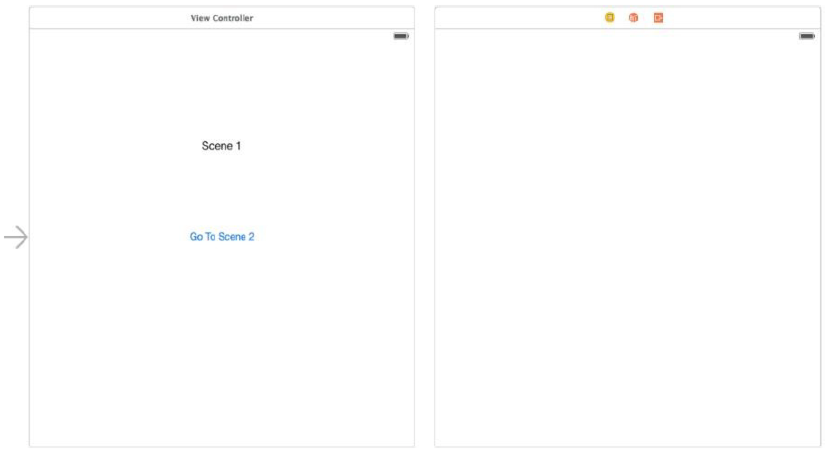
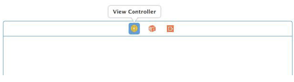
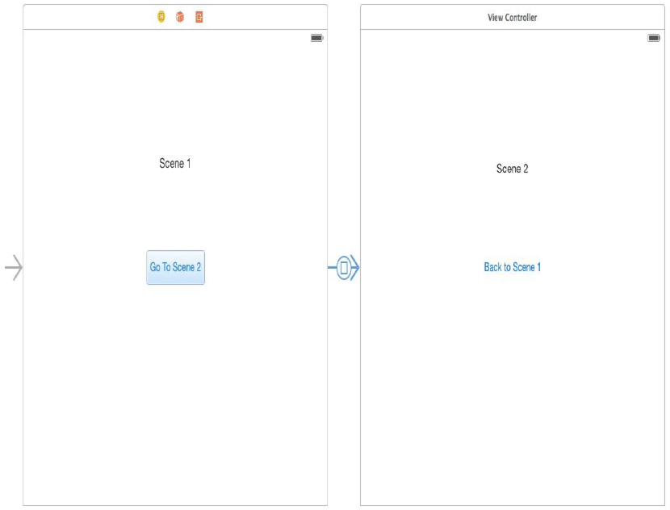
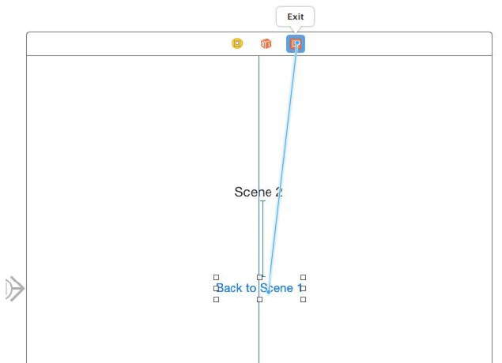

[toc]

# 故事板

通过 Interface Builder，可以方便的拖放视图和导航控制器到画布。

一个应用一般只有一个故事板。但不限制有多个。

新创建的工程会自动创建一个故事板，文件是**Main.storyboard**。

随着场景的增多，很难看到全部，双击画布可以在放大和缩小画布直接转换。按住 Ctrl 点击画布会出现一个菜单配置缩放级别。

## 初始试图控制器

左边的箭头表示它是**初始试图控制器** —— 启动应用后第一个显示的视图。要改变初始视图控制器，只要将该箭头拖到其他视图控制器。

## 向故事板添加场景

要添加场景到故事板，从 Object Library 面板拖一个视图控制器到画布。




## 视图控制器类与场景关联

打开故事板，在场景中选中视图控制器的图标（在上部），如下图：



打开 Identity Inspector，修改 **Class** ，选中需要的视图控制器的类名。

## 场景间跳转

### 配置Segues

segue 是故事板中一个场景到另一个场景的转场。按住Ctrl单击场景1中的按钮，拖放到场景2。



默认使用 Cover Vertical：新场景从底部自下而上出现。要修改专场，选中相应的 segue 线，打开 Attributes Inspector，修改 Transition。

### 在场景间传递数据

在场景之间传递数据，或任何其他需要在转场之前发生的事情，实现视图控制器的 `prepareForSegue` 方法。此方法会被传递一个 segue 对象，用其获得下一个视图控制器的引用。

向 Scene2ViewController.swift 增加一个变量，用于存储转场到此场景后标签显示的字符串。

```swift
import UIKit
class Scene2ViewController: UIViewController {
    @IBOutlet weak var scene2Label: UILabel!
    var labelText: String?
    ...

    override func viewDidLoad() {
        super.viewDidLoad()
        scene2Label.text = labelText
    }
```

ViewController.swift 实现 `prepareForSegue` 方法：

```swift
    override func prepareForSegue(segue: UIStoryboardSegue, sender: AnyObject?) {
        let destination = segue.destinationViewController as Scene2ViewController
        destination.labelText = "Arrived from Scene 1"
    }
```

获得到下一个视图控制器的引用，然后修改其属性。

### Unwinding Storyboard Segues

下面配置点击场景2按钮回到场景1。如果使用之前的方法，返回场景1并不是返回原来的视图控制器，而是一个新的实例。

正确做法是利用故事板的 unwind 功能。第一步，打开 ViewController.swift 实现 unwind segue 调用的 action 方法：

```swift
@IBAction func returned(segue: UIStoryboardSegue) {
	scene1Label.text = "Returned from Scene 2"
}
```

第二步，建立 unwind segue。在场景2中，Ctrl拖动退出按钮到顶部工具栏的退出按钮。Release the line and select the `returned` method from the resulting menu:




### 编程方法触发 Segue

为 segue 设置一个标示符，然后就可以通过视图控制器的 `performSegueWithIdentifier` 方法触发了。

要设置 segue 的标示符，在画布中选中它，打开 Attributes Inspector，设置 **Identifier** 字段为 **SegueToScene1**，然后在代码里可以触发：

```swift
self.performSegueWithIdentifier("SegueToScene1", sender: self)
```


