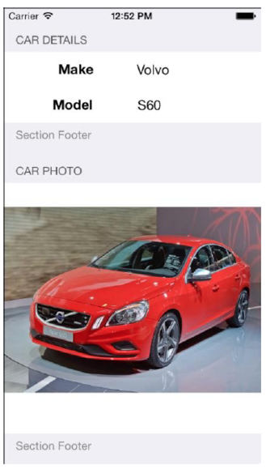
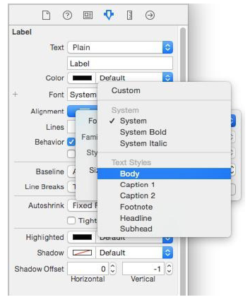
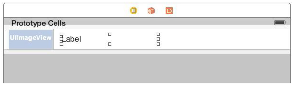
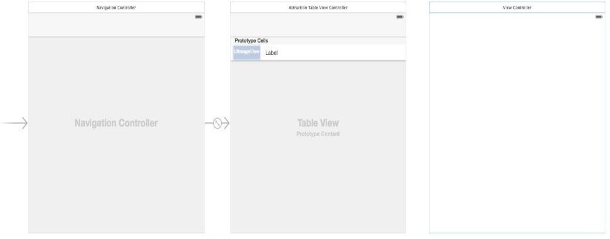
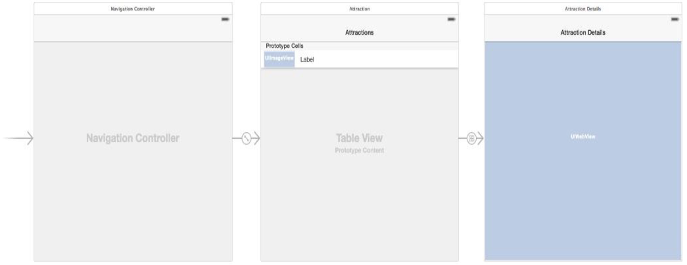

[toc]

# 表格视图

表格视图是很多 iOS 应用的导航的基础，如 Settings。表格视图由 `UITableView` 类表示。单元格由 `UITableViewCell` 实现。默认，每个单元格可以显示一个文本（`textLabel`）、一个子标题（`detailedTextLabel`）和一个图片（`imageView`）。更复杂的单元格可以通过添加子视图，或子类化 `UITableViewCell` 实现。

表格分静态表格和动态表格（称为基于原型的表格）。在故事板中，可以设计一个“原型单元格”，用于构建动态表格。

每个表格视图需要一个代理和一个数据源（静态表格不需要数据源）。数据源实现 `UITableViewDataSource` 协议。代理实现 `UITableViewDelegate` 协议，可以对表格视图的外观和功能进行更多控制，包括检测用户触摸某一行，定制行高的缩进，实现行的删除和编辑。

表格视图可以用普通或分组两种样式。分组样式下，表格分成几节，每节可以用头和尾。



Table Views using plain style can also be **indexed**, whereby rows are organized into groups according to specified criteria, such as alphabetical or numerical sorting.

**Self-Sizing 单元格**

iOS 8 引入新特性 “self-sizing” 单元格。With self-sizing, 表格每行的大小取决于单元格的内容；基于对单元格内容施加的自动布局约束。

**Dynamic Type**

iOS 7 允许用户选择期望的字体大小{{称为 Dynamic Type}}。iOS 8 的表格视图也支持 Dynamic Type。单元格中任何标签都可以设定期望的文字样式。iOS定义的文字样式包括 标题、子标题、正文、captions 和 footnotes。标签使用的文本样式可以通过 Interface Builder 或代码配置。

要在 Interface Builder 配置，选中标签，显示 Attributes Inspector，点击字体设置旁的 T 按钮。在对话框中，从 Font 菜单中选择一个样式：



The preferred font is configured in code by setting the `preferredFontForTextStyle` property to one of the following pre-configured text style values:

- UIFontTextStyleHeadline
- UIFontTextStyleSubheadline
- UIFontTextStyleBody
- UIFontTextStyleFootnote
- UIFontTextStyleCaption1
- UIFontTextStyleCaption2

The following code, for example, sets a dynamic type font on a label using the headline font style:

```swift
cell.myLabel.font = UIFont.preferredFontForTextStyle(UIFontTextStyleHeadline)
```

Clearly, the text size selected by a user will dictate the size of any cells containing labels that use dynamic type, hence the importance of using **self-sizing** to ensure the table rows are displayed using an appropriate height.

**单元格样式**

每个单元格可以使用不同的样式。iOS 8 SDK 目前支持四种不同的样式。：

- `UITableViewCellStyleDefault` – 只有 `labelText`，黑色，左对齐。
- `UITableViewCellStyleSubtitle` – `labelText` 黑色、左对齐；`detailLabelText` 位于下方，字体小些，灰色背景。
- `UITableViewCellStyleValue1` – `labelText` 黑色、左对齐；`detailLabelText` 小些、蓝色，在同一行，右对齐。
- `UITableViewCellStyleValue2` – `labelText` 蓝色，在单元格左边，右对齐；`detailedLabelText` 在单元格右边，左对齐，黑色。

**单元格的重用**

代码一般不会直接创建单元格的实例，原因是性能和内存。而是，向表格视图注册单元格使用的类，同时注册重用分配给类的标示符。若单元格类写在代码里，注册方法是 `UITableView` 的 `registerClass` 方法。如：

```swift
self.tableView.registerClass(AttractionTableViewCell.self,
	forCellReuseIdentifier: "MyTableCell")
```

若单元格在 NIB 文件里，则使用 `registerNib` 方法。

如果单元格在故事板里通过原型创建，则不要注册。

当表格视图初始化时，它会先调用数据源的 `cellForRowAtIndexPath` 方法。该方法会调用表格视图对象的 `dequeueReusableCellWithReuseIdentifier` 方法，传入 index path 和之前注册的重用ID，查看队列中是否有可用单元格。若无，创建一个新的并返回。`cellForCellAtIndexPath` 的典型实现如下：

```swift
override func tableView(tableView: UITableView,
	cellForRowAtIndexPath indexPath: NSIndexPath) -> UITableViewCell {
	let cell = tableView.dequeueReusableCellWithIdentifier("MyTableCell", forIndexPath: indexPath) as MyTableViewCell	// Configure the cell here
	return cell
}
```

随着表格视图的滚动，一些单元格离开界面，放入重用队列。当有新单元格进入界面时，会再调用 `cellForRowAtIndexPath`。

## 使用故事板，利用原型单元格构建动态的表格视图

可视化的设计单元格中的UI元素。

创建空工程。删除自动创建的视图控制器，包括删除故事板中的场景和删除 ViewController.swift 文件。

向故事板添加 TableView 控制器。选中 Main.storyboard 文件，拖一个 Table View Controller 对象到画布。在故事板中选中该控制器，在 Attributes Inspector 中启用 *Is initial View Controller*。

**创建 UITableViewController 和 UITableViewCell 的子类**

现在故事板中除了一个表格视图控制器，还有一个自动创建原型单元格。它们的类型分别是 `UITableViewCell` 和 `UITableViewController`。为了添加定制化的功能，我们需要创建它们的子类。

创建类 `AttractionTableViewController`。新建文件。类名和父类分别是 `AttractionTableViewController` 和 `UITableViewController`。不要创建 XIB 文件。

创建单元格类。新建文件，类名和父类名分别是 `AttractionTableViewCell` 和 `UITableViewCell`。

下面，配置故事板使用这两个类。在故事板中选中 Table View Controller 场景，在Identity Inspector，修改 *Class* 为 `AttractionTableViewController`。选中故事板中的原型单元格，修改类为 `AttractionTableViewCell`。

**声明单元格重用标示符**

在故事板中选择原型单元格，在 Attributes Inspector 中将 *Identifier* 字段改为 *AttractionTableCell*。

**在故事板中设计原型单元格**

每个单元格显示一个图片和标签。与其他 Interface Builder 布局一样，组件可以从 Object Library 面板拖到故事板。但仅在故事板处于放大状态（zoomed in）可用。

拖一个 Label 和一个 Image View 到原型单元格。如下图。让标签右边对齐单元格中间。



选中 Image View，在 Auto Layout Pin 菜单中，对上左下设置 *Spacing to nearest neighbor constraints*，关闭 *Constrain to margins*。打开 *Width* 约束。

选中 Label，在 Auto Layout Align 菜单中，添加 *Vertical Center in Container* 约束。在 Pin 菜单，对左边启用 *Spacing to nearest neighbor*，关闭 *Constrain to margins*。

**修改 AttractionTableViewCell 类**

为了操纵标签和图片，需要建立两个 outlet。目标 AttractionTableViewCell.swift 文件。图片的 outlet 名为 `attractionImage`。标签的 outlet 名为 `attractionLabel`。

**创建表格视图的数据源**

动态的表格视图需要一个数据源。Xcode 默认将 `AttractionTableViewController` 作为表格视图的数据源。因此我们的数据就放这个类中。首先，声明部分属性：

```swift
import UIKit
class AttractionTableViewController: UITableViewController {
    var attractionImages = [String]()
    var attractionNames = [String]()
    var webAddresses = [String]()

    override func viewDidLoad() {
        super.viewDidLoad()
        attractionNames = ["Buckingham Palace",
            "The Eiffel Tower",
            "The Grand Canyon",
            "Windsor Castle",
            "Empire State Building"]
        webAddresses = ["http://en.wikipedia.org/wiki/Buckingham_Palace",
            "http://en.wikipedia.org/wiki/Eiffel_Tower",
            "http://en.wikipedia.org/wiki/Grand_Canyon",
            "http://en.wikipedia.org/wiki/Windsor_Castle",
            "http://en.wikipedia.org/wiki/Empire_State_Building"]
        attractionImages = ["buckingham_palace.jpg",
            "eiffel_tower.jpg",
            "grand_canyon.jpg",
            "windsor_castle.jpg",
            "empire_state_building.jpg"]
        tableView.estimatedRowHeight = 50
	}
```

上面代码还设置了预估的行高。This will prevent the row heights from collapsing when table view navigation is added later in the tutorial and also improves the performance of the table rendering.

作为数据源还要实现一些方法。作为 `UITableViewController` 的子类，Xcode 会为这些方法创建一些模板。

第一个方法，返回表格选中的数量：

```swift
override func numberOfSectionsInTableView(tableView: UITableView!) -> Int {
	return 1
}
```

第二个方法，返回表格行数：

```swift
override func tableView(tableView: UITableView, numberOfRowsInSection section: Int) -> Int {
	return attractionNames.count
}
```

下一个方法是 `cellForRowAtIndexPath`。该方法会返回一个 `AttractionTableViewCell`，根据索引选择正确的标签和图片值，然后设置到响应 outlet。

```swift
override func tableView(tableView: UITableView, cellForRowAtIndexPath indexPath: NSIndexPath) -> UITableViewCell {
	let cell = self.tableView.dequeueReusableCellWithIdentifier("AttractionTableCell", forIndexPath: indexPath) as AttractionTableViewCell
	let row = indexPath.row
	cell.attractionLabel.font = UIFont.preferredFontForTextStyle(UIFontTextStyleHeadline)
	cell.attractionLabel.text = attractionNames[row]
	cell.attractionImage.image = UIImage(named: attractionImages[row])
	return cell
}
```

**运行模拟器**

Note that the new self-sizing rows feature of iOS 8 has caused the rows to automatically size to accommodate the attraction images.

As a final step, verify that the preferred font size code is working by running the app on a physical iOS device, displaying Settings -> Display & Brightness -> Text Size and dragging the slider to change the font size. Stop and restart the application and note that the attraction names are now displayed using the
newly selected font size.

## 实现表格导航

扩展上一章的例子，选择一行，打开第二个场景。

**理解导航控制器**

基于导航的应用，一般包括一个导航条（`UINavigationBar`）和一系列基于表格的视图（`UITableView`）。选中表格中一项，打开关联视图。导航条显示当前视图的标题，提供一个按钮返回上一视图。

核心组件是**导航控制器**。此外，每个场景有自己的视图和视图控制器。导航控制器有一个栈，新视图显示时入栈，称为当前活跃的控制器。导航控制器会自动显示导航条，包括返回按钮。当用户点返回时，当前视图控制器出栈。

应用启动时出现的、表格视图的视图控制器，称为根视图控制器。

**向故事板添加新场景**

添加一个新的视图控制器作为第二个场景。创建 `UIViewController` 子类。名为 `AttractionDetailViewController`。不要创建 XIB 文件。

选中故事板画布，拖一个 View Controller 到当前表格视图控制器右边。修改该视图控制器的类为 `AttractionDetailViewController`。

**添加一个导航控制器**

在故事板中选中 Attraction Table View Controller，然后选中菜单 *Editor -> Embed In -> Navigation Controller*。



**建立Segue**

用户选择表格一行，要触发一个 segue，显示 attraction detail view controller。为此，Ctrl点击原型单元格，拖到 Attraction Detail View Controller 场景，在弹出的菜单中选择 *show*。

下面给 segue 一个标示符以方便代码引用。点击 segue，在 Attributes Inspector 中修改 *Identifier* 为 `ShowAttractionDetails`。

两个场景都需要一个**工具条**。双击 Attraction Table View Controller 的工具条，修改为 “Attractions”。从对象库中拖一个 **Navigation Item** 到 Attraction Detail View Controller 的工具条上。双击 `Title`，修改为 “Attraction Details”：



测试运行。

**修改 AttractionDetailViewController 类**

详情页显示一个Web视图。网址设置在 `AttractionDetailViewController`：

```swift
import UIKit
class AttractionDetailViewController: UIViewController {
	var webSite: String?
	...
```

拖一个 Web View 到 Attraction Detail 场景。调整大小使其填充。

将Web视图拖到 AttractionDetailViewController.swift，产生一个 outlet，名为 `webView`。

当详情页出现时，Web视图加载 `webSite` 指定的网页。在 `AttractionDetailViewController.swift` 中：

```swift
override func viewDidLoad() {
    super.viewDidLoad()
    if let address = webSite {
        let webURL = NSURL(string: address)
        let urlRequest = NSURLRequest(URL: webURL!)
        webView.loadRequest(urlRequest)
    }
}
```

**利用 prepareForSegue 在场景之间传递数据**

修改 `AttractionTableViewController.swift`：

```swift
override func prepareForSegue(segue: UIStoryboardSegue, sender: AnyObject?) {
    if segue.identifier == "ShowAttractionDetails" {
        let detailViewController = segue.destinationViewController         as AttractionDetailViewController
        let myIndexPath = self.tableView.indexPathForSelectedRow()
        let row = myIndexPath?.row
        detailViewController.webSite = webAddresses[row!]
    }
}
```

测试运行。
