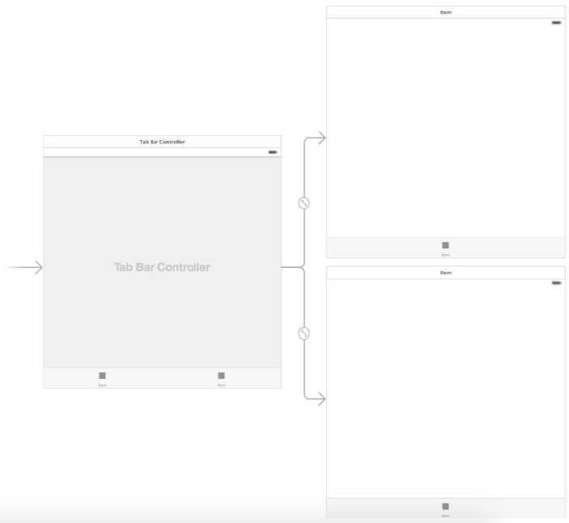

[toc]

# 视图控制器

**多视图控制器**

多视图的应用，除了每个视图有自己的控制器，还有一个额外的控制器。需要有UI让用户可以在多个内容视图之间切换，一般通过标签页或导航条。这些组件也是视图因此也需要视图控制器。它们称为**根**控制器。可以通过创建 `UIViewController` 的子类自定义控制器。也可以使用 UIKit 的 `UITabBarController` 或 `UINavigationController`。

## UITabBarController

标签栏一般位于屏幕底部。含有文字和可选的图标。

创建新工程时，模板可选 **Tabbed Application**。但为了掩饰记录，下面仍从 **Single View Application** 模板开始。删掉自动创建的 ViewController.swift。

示例打算做两个标签页。我们先为这两个标签页创建试图控制器。一个类名是 `Tab1ViewController`， 子类取 `UIViewController`，禁用 **Also create XIB file**。同样创建 `Tab2ViewController`。

关联场景和控制器。选中 Main.storyboard 文件，选择系统自动生成的场景，打开 Identity Inspector 面板。将 **Class** 字段改为 `Tab1ViewController`。第二个场景需要自建。将类设为 `Tab2ViewController`。

添加 Tab Bar 控制器。选中 Main.storyboard，在故事板中选中 **Tab1ViewController** ，选择菜单 **Editor -> Embed In -> Tab Bar Controller**：


下面建立 Tab2ViewController 与标签控制器的关系。在故事板中按住 Ctrl 并选中 Tab Bar Controller，拖到 Tab2ViewController 场景。在出现的菜单中选择 **Relationship Segue -> view controllers**。如下图。`Tab2ViewController` 会被添加到标签控制器的 `viewControllers` 属性。


目前状态：



让两个视图去看上去有区别，自行装饰下，然后测试运行。

## UISplitViewController

当 iPad 或 iPhone 6 Plus 处于横屏模式，`UISplitViewController` 将屏幕分成左右两半，实现一个主从（master-detail）模型。左边一般是一个列表，右边一般根据左边选择显示详情信息。

当 iPad 或 iPhone 6 Plus 竖屏时，Split View Controller 让主从屏都占据整个屏幕。在 “split view” 模式下，有一个按钮可以隐藏主视图，使详情视图可以占据全屏。

在更小的屏幕下，split view 始终以竖屏模式显示。

`UISplitterViewController` 作为容器，容纳两个子视图控制器。

下面的例子，左边是网址列表，右边是网页。新建工程。选择模板 **Master-Detail Application**。

自动创建的代码，会在 `AppDelegate` 中定义方法 `didFinishLaunchingWithOptions`。

Main.storyboard 目前有以下元素：

- 一个 UISplitViewController
- 一个 DetailViewController
- 一个 MasterViewController
- 两个导航控制器

修改主面板的标题为 “Favorite Web Sites”。

主视图控制器是 `UITableView` 的子类。修改 `MasterViewController.swift` 文件：

```swift
import UIKit
class MasterViewController: UITableViewController {
    var siteNames: [String]?
    var siteAddresses: [String]?
    var detailViewController: DetailViewController? = nil
    var objects = NSMutableArray()

    override func viewDidLoad() {
        super.viewDidLoad()
        siteNames = ["Yahoo", "Google", "Apple", "eBookFrenzy"]
        siteAddresses = ["http://www.yahoo.com", "http://www.google.com", "http://www.apple.com", "http://www.ebookfrenzy.com"]
        if let split = splitViewController {
            let controllers = split.viewControllers
            detailViewController = controllers[controllers.count-1].topViewController as? DetailViewController
        }
    }

    override func tableView(tableView: UITableView, numberOfRowsInSection section: Int) -> Int {
        return siteNames!.count
    }

    override func tableView(tableView: UITableView, cellForRowAtIndexPath indexPath: NSIndexPath) -> UITableViewCell {
        let cell = tableView.dequeueReusableCellWithIdentifier("Cell", forIndexPath: indexPath) as UITableViewCell
        cell.textLabel.text = siteNames![indexPath.row]
        return cell
    }
```


配置详情页控制器。在故事板里，找到 DetailViewController 场景，删除占位标签。拖一个 `UIWebView` 到画布。按住Ctrl点击拖动它到 DetailViewController.swift，做一个 outlet，名叫 `webView`。

处理选择。用户选择表格中的一项后，会触发主视图控制器的 `prepareForSegue` 方法。找到 MasterViewController.swift 文件，修改：

```swift
override func prepareForSegue(segue: UIStoryboardSegue, sender: AnyObject?) {
    if segue.identifier == "showDetail" {
        if let indexPath = self.tableView.indexPathForSelectedRow() {
            let urlString = siteAddresses?[indexPath.row]
            let controller = (segue.destinationViewController as UINavigationController).topViewController as DetailViewController
            controller.detailItem = urlString
            controller.navigationItem.leftBarButtonItem = splitViewController?.displayModeButtonItem()
            controller.navigationItem.leftItemsSupplementBackButton = true
        }
    }
}
```

代码的最后向详情页导航条添加了一个按钮：`UISplitViewController` 的 “display mode” 按钮。该按钮用于展开详情页布满整个屏幕，因此主界面。

修改 DetailViewController.swift，

```swift
func configureView() {
    // Update the user interface for the detail item.
    if let detail: AnyObject = detailItem {
        if let myWebview = webView {
            let url = NSURL(string: detailItem as String)
            let request = NSURLRequest(URL: url!)
            myWebview.scalesPageToFit = true
            myWebview.loadRequest(request)
        }
    }
}
```

Note that in order to make the web page scale to fit the detail view area the `scalePagesToFit` property of the `UIWebView` object is set to true.

测试运行。

