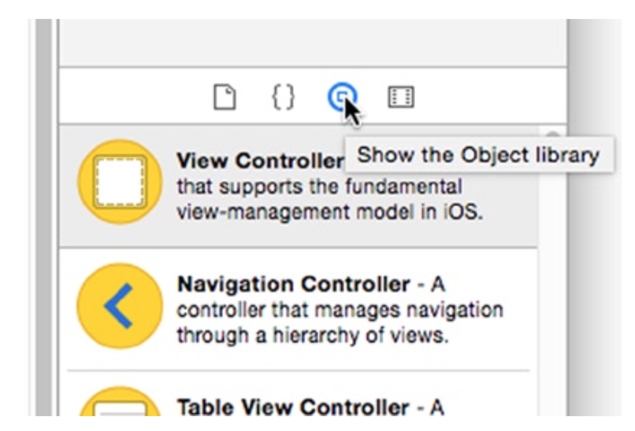
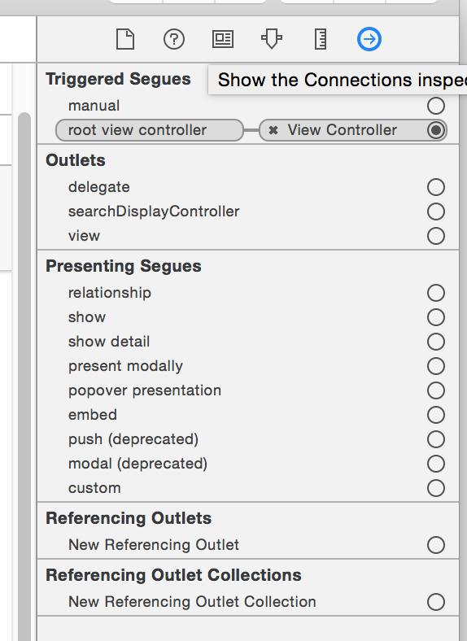

[toc]

本书主要使用Swift。

## 1. 工具

The examples in this book were developed for iOS 8.0, built using Xcode 6.1, running on OS X 10.10 (Yosemite).

Xcode and iOS can seamlessly mix Swift, Objective-C, C++, and C in the same project.

## （未）2. 第一个APP

- Use Xcode’s Interface Builder to design your app
- 向APP添加对象
- 连接对象
- 向工程添加资源文件
- Use storyboards to create segues
- Control the layout of visual elements using constraints

本节不需要写一行代码。

创建工程，选择最简单的模板，Single View Application template。工程名为Surrealist。

这个项目不允许横屏使用。因此，在导航窗口点击项目名，进入项目属性设置。选General。滚动到Deployment Info一节。Uncheck the Landscape Left and Landscape Right boxes in Device Orientation so that only the Portrait orientation is checked.

### 构建UI

Click the `Main.storyboard` file in the project navigator. Xcode’s Interface Builder editor appears in the edit area.

You can define most of the visual elements of your app in Interface Builder. Interface Builder edits storyboard, **xib**, and (legacy) **nib** files.

> Modern Interface Builder files have extensions of `.xib` or `.storyboard`. Legacy Interface Builder files have a `.nib` (pronounced “nib”) extension, and you’ll still hear programmers refer to all of them generically as “nib” files. The NIB acronym stands for Next Interface Builder because the roots of Xcode, Interface Builder, and the Cocoa Touch framework stretch all the way back to Steve Job’s “other” company, NeXT. Later in this book, you’ll see a lot of class names that begin with NS, which is an abbreviation for NeXTStep, the name of NeXT’s operating system.

Interface Builder有两个视图。左边将对象组成成层级列表，称为outline。右边称为canvas。Only visual objects (such as buttons, labels, images, and so on) appear in the canvas.

#### 添加对象

You get new objects from the library. Choose the View ➤ Utilities ➤ Show Object Library command.

To add an object to your app, drag it from the library and drop it into the Interface Builder editor. Your app needs a navigation controller object. Drag the navigation controller object from the library into the canvas and drop it anywhere in the blank space.

#### 删除和连接对象

The library’s navigation controller object is really a cluster of objects. A navigation controller, as the name implies, manages how a user moves between multiple screens, each screen being controlled by a single view controller object. The navigation controller is connected to the view controller of the first screen that will appear, called its root view controller. Don’t worry about the details; you’ll learn more about navigation controllers in upcoming chapters.

For your convenience, the navigation controller in the library creates both a navigation controller object and the root view controller that it starts with. This root view controller happens to be a table view controller. This is a popular choice; navigation controllers and table views go together like bread and butter. Your project, however, doesn’t need a table view controller. Instead, you want this navigation controller to use the no-frills view controller you already have.

Start by discarding the superfluous table view controller. Select just the table view controller that’s connected to the navigation controller on the right, as shown in Figure 2-7. Press the Delete key.

Now you need to connect your new navigation controller to the plain-vanilla view controller your project came with. Drag the original view controller and position it to the right of the navigation controller.

The unconnected arrow attached to the view controller indicates the initial view controller for your app. You want to make the navigation controller the first controller, so drag the arrow away from the original view controller and drop it into the navigation view controller.

The last step is to reestablish the navigation controller’s connection with its root view controller. There are numerous ways of making connections in Interface Builder. I’ll show you the two most popular. Right-click the navigation controller (or hold down the Control key and click) and then drag a line from it to the view controller.

When you release the mouse, a pop-up menu will appear listing all of the possible connections between these two objects. Click the *root view controller connection*. Now the navigation controller will present this view controller as the first screen when your app starts.

The second method is to use the **connections inspector** in the utility area. Choose View > Utilities > Show Connections Inspector, or click the little arrow icon in the utilities pane.

To use the inspector, first choose an object. In this case, choose the navigation controller. The connections inspector will show all of the connections for that object. Find the connection labeled root view controller. To the right of each connection is a little circle. To set a connection, click and drag that circle to the object you want it connected to—in this case, the view controller. To clear (or “break”) a connection, click the small x next to the connection.

#### Adding Views to a View

添加四个按钮。

The view controller object is not a single object; it’s a bag of objects. I said earlier that some objects may contain other objects; view controllers and views are two such objects. Click in the center of the view controller to select its root view object—every view controller has a single root view object. You can confirm that you’ve selected the desired object in the outline.

In the object library, find the **Button** object. Grab a button object and drag it into the view object, as shown in Figure 2-11.

Repeat this three more times so you have four button objects inside the view, approximately. Now you want to resize these buttons so that each one approximately fills one-quarter of the screen.

#### 编辑对象属性

Now it’s time to customize your buttons. Select all four buttons—click one button and then, while holding down the Shift key, click once on each of the other three. Choose View 》 Utilities 》 Show Attributes Inspector, or click the small control icon in the inspector pane.

The attributes inspector is used to change various properties about an object (or objects). The properties in the inspector will change depending on what kind of object you have selected. If you select multiple objects, the inspector will present just those properties that all of those objects have in common.

With the four buttons selected, make the following changes using the attributes inspector:

- Change Type to Custom.
- Click the Font attribute and set it to System Bold 18.0.
- Click the Text Color pop-up menu and choose White Color.
- Find the Control group and select the bottom vertical alignment icon.

The next step is to add an image and a label to each one, individually. To do that, you’re going to need to add some resources to your project.

#### 添加资源

