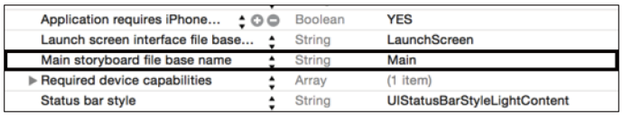
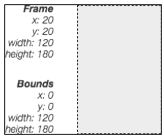
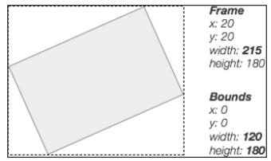

[toc]

# 1 UI 基础

## 1.1 窗口

窗口是 `UIWindow` 类的实例。窗口的一个主要作用是递送触摸事件到底层的视图。

在 info.plist 文件中，键 **Main storyboard filebase name** 默认值是 **Main**。该键值对表示应用从故事板启动，更准确的说，从故事板的 initial view controller 启动。



## 1.2 视图

Another way to change the visibility of a view is using the `hidden` property, which can be set to true or false.

将 `userInteractionEnabled` 设为 `false` 禁用视图，忽略用户事件。

几个尺寸相关类：

```swift
// Define a point
let point = CGPoint(x: 20, y: 10)
// Define a size
let size = CGSize(width: 20, height: 10)
// Define a rect using size and point
let rect_A = CGRect(origin: point, size: size)
// Define a rect using x, y, width and height data
let rect_B = CGRect(x: 15, y: 10, width: 100, height: 30)
```

Let's start with the `bounds` property. It is a CGRect property that defines information (size and origin) locally to the view. On the other hand, the `frame` property defines how a view is placed inside the hierarchy. It's a `CGRect` property similar to `bounds`, but its `origin` value determines
how the view is placed inside its **parent** view.




This indicates that after a rotation, the same view maintains the bounds, while the frame changes significantly.

{{修改视图的 `center` 可以立即移动视图。}}

## 1.3 UI层级和视图层级

A view can access its parent from the `superview` property. 若视图尚未被添加到层级中，返回 `nil`。

In a similar way, the `subviews` property returns an array of UIView instances that are the children of the view.

The `addSubview:` function pushes a view as the child of the caller, as follows:

```swift
containerView.addSubview(childView)
```

添加的时候可以指定位置（绘制顺序），可以以绝对或相对的方式。

`insertSubview:atIndex` 在特定位置上插入，若指定位置已有视图，先将它们**向后**移动（增加index），

```swift
containerView.insertSubview(childView, atIndex: 2)
```

可以以某个视图作参考，在它上面或下面插入视图：

```swift
containerView.insertSubview(childView, aboveSubview: anotherView)
containerView.insertSubview(childView, belowSubview: anotherView)
```

利用 `removeFromSuperview` 删除视图自己。要删除一个视图的所有子视图，可以遍历：

```swift
for subview in container.subviews {
	subview.removeFromSuperview()
}
```

父视图的 `clipToBounds` 属性决定它的子视图超过它的边界的部分是否可见。`true` 表示不可见。

Changes on the hierarchy can be intercepted and managed through callbacks called on the parent and child views.

When a view is attached to a superview, the `didMoveToSuperview` function is called. If we want to perform a task after this event is triggered, we have to override this function with a `UIView` subclass by executing the following code:

```swift
class CustomView: UIView {
	override func didMoveToSuperview() {
		println("I have a superview!")
	}
}
```

In the same way, the event can be intercepted by the superview overriding the
`didAddSubview:subview` function, as follows:

```swift
override func didAddSubview(subview: UIView) {
	println("The subview \(subview) has been added")
}
```

The view will be added to a hierarchy that has a window as root. At this point, the `didMoveToWindow` event is called. After the event is triggered, the `window` property of the view instance becomes a reference to the root window; this turns out to be a handy way to check whether a view has reached the screen. 若 `window` 属性为 nil，可以确信视图未被添加到窗口层级，因此视图不可见。

Another important method that responds to hierarchy changes is `layoutSubviews`. This function is called as soon as a subview is added to or removed from the hierarchy and every time the bounds of the view change.

应用启动后，通过 Xcode 可以查看当前视图层级的 3D 表示。**Debug -> View Debugging -> Capture View Hierarchy**。

iOS 绘制视图后创建一个快照。在下次需要重绘前一直使用这个快照提高绘制性能。The UIView content can be invalidated by calling the `setNeedsDisplay:` or `setNeedsDisplayInRect:` function. Later, during the next run loop, the system asks the view to redraw.
