[toc]

# 2 UI Components Overview - UIKit

## 2.1 文本元素

There are different ways to display text in iOS. You can draw strings directly in a graphic context through NSString or NSAttributedString or take advantage of the power of **Text Kit**, a framework dedicated to text drawing that is involved in all the controls we'll see in the next paragraphs. UIKit 提供了一些帮助方法，简化 Text Kit 的使用。

### 2.1.1 UILabel

指定文本通过 `text` 和 `attributedText` 属性。前者是 `NSString`，显示纯文本。后者是 `NSAttributedString`，可以包含样式，如加粗、斜体、颜色、字体。

`textColor` 用于控制纯文本的颜色。`highlightedTextColor` 定义 `highlighted` 属性为 true 时的文本的颜色。（如该 Label 在一个高亮的表格行中。）

`textAlignment` 定义对齐方式。取 `NSTextAlignment` 的值，如 `Center`、 `Left`、 `Justified` 扥个。

`shadowColor`、 `shadowOffset` 可以给标签添加阴影。

标签默认只显示在一行。如要允许显示多行，需要配合使用 `numberOfLines` 和 `lineBreakMode` 属性。

不同的 `lineBreakMode` 效果：

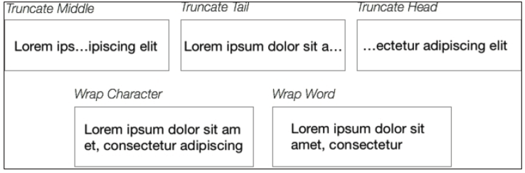

Starting with iOS8, the width of a multiline label can be automatically calculated through Auto Layout and defined by the `preferredMaxLayoutWidth` property. If you are supporting previous versions of iOS, you might need to define an explicit value for this property.

标签的默认字体是 **system font**，通过 `font` 属性可以改变。

有时，例如当你通过 `preferredMaxLayoutWidth` 显示定义了宽度，标签的大小可能不能容纳完整的文本。`adjustsFontSizeToFitWidth` 属性可以控制让字号减小以使所有文字可见。`minimumScaleFactor` 定义一个比例，减小字号以完整显示文字，直到这个比例。例如字体是24，`minimumScaleFactor` 是 0.5，则最小可以减小到字号12。

### 2.1.2 UITextField

选中文本框后，它成为 **first responder**，系统键盘自动弹出。

用户输入完成后，你可以调用文本框的 `resignFirstResponder()`，键盘将自动释放。The selection of a text field can be forced through the `becomeFirstResponder()` function, which moves the focus on the text field **when a user selects it**.

`UITextfield` 很多属性与标签相同，如 `text`、`attributedText`、`textColor`、`font`、`textAlignment`。

文本框单行绘制。可以是纯文本或带样式的。If the `allowsEditingTextAttributes` property is set to true, a contextual menu with bold, italic, and underline styles selection is presented after a long press:

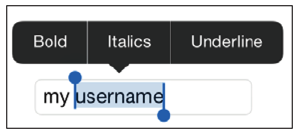

`placeholder` 属性定义占位符。默认颜色是浅灰。若想定制占位符，可以使用 `attributedPlaceholder` 属性。

文本框的外观可以通过 `borderStyle` 属性设置，取值 `UITextFieldBorderStyle` 的值，如 `.None`、`.Line`、`.Bezel` 和 `.RoundRect`。若选择 `.None`，你可以提供两张图片，通过 `background` 和 `disabledBackground` 属性，作为文本框背景。

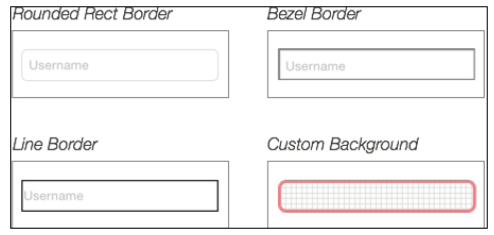

通过 `leftView` 和 `rightView` 属性可以为文本框添加描述性或功能性的界面元素。`leftViewMode` 和 `rightViewMode` 属性控制它们的显示方式，取值 `UITextFieldViewMode`，可以不显示（`.Never`）、总是显示（`.Always`）、在用户编辑或不编辑时显示（`.WhileEditing`、 `.UnlessEditing`）。

类似的，通过 `clearViewMode` 属性，可以在文本框右侧显示一个清除按钮：

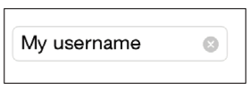

### 2.1.3 多行文本 UITextView

`UITextView` 是 `UIScrollview` 的子类，用于编辑和显示多行文本。

When a text view is selected, it becomes the **first responder**, and the keyboard is automatically shown, 就像 `UITextField` 一样。设置 `editable` 属性为 `false` 可以禁止编辑。设置 `selectable` 属性为 `false` 可以禁止选择。

`UITextView` 中的文本，像 links, addresses, phone numbers, or events 的，可以自动转换成可操作的元素。例如用户触摸一个电话号码，会弹出对话框询问用户是否拨号等。长按数字，会弹出对话框询问用户是否拨号、创建联系人、发短信等等。You can choose which of these formats should be detected in the text view with the `dataDetectorTypes` property. Just note that in this case, the text view should be selectable but not editable.

With the help of the Text Kit framework, we can perform some really complex
operations on the text displayed in a text view. 例如我们可以在文本视图中添加一个图片，让当前文本框包围图片。An easy way to implement this layout is using the image frame to define an area that cannot contain text.

```swift
var image = UIImageView(image: UIImage(named:"Image"))
self.textView.addSubview(image)
let exclusionPath = UIBezierPath(rect: image.frame)
self.textView.textContainer.exclusionPaths = [exclusionPath]
```


### 2.1.4 关于键盘

键盘是一个独立的窗口。独立于你的UI。键盘弹出时会遮盖你的UI，不会自动调整你的UI。需要你自己根据键盘弹出，更新UI，让相应元素在屏幕上可见。你可能马上会想到，一个文本框被键盘遮住可能是很常见的情况。解决办法有几个。最简单的或许是将UI放入一个 `UIScrollView`，并在键盘弹出后，改变滚动视图的大小。参见第4章。

You can subscribe to some useful notifications triggered by the system to be notified of keyboard events.

- `UIKeyboardWillShowNotification`、`UIKeyboardDidShowNotification`：These notifications are posted just before (and after) the keyboard is presented on screen. From the notification's `userInfo` dictionary, you can get useful information about the keyboard. Using the `UIKeyboardFrameEndUserInfoKey`
key, for example, you can retrieve the end frame of the keyboard in the screen
coordinates.
- `UIKeyboardWillHideNotification`、`UIKeyboardDidHideNotification`：These notifications are posted just before (and after) the keyboard is dismissed.
- `UIKeyboardWillChangeFrameNotification`、`UIKeyboardDidChangeFrameNotification`：These notifications are posted just before (and after) the keyboard frame changes. An example might be when a user drags the undocked keyboard up and down on iPad.

To help users type any input, the keyboard can be configured to better fit the kind of data the text field expects. As both UITextField and UITextView implement the `UITextInputTraits` protocol, you can define some properties that adjust the keyboard behavior and its appearance. You can also completely change the type of the keyboard with the `keyboardType` property that receives a `UIKeyboardType` value, such as `NumberPad`, `URL`, `EmailAddress`, and even `Twitter`.

Other useful configurations are `keyboardAppearance`, which alters the color of the keyboard (you have only two choices here: `dark` or `light`), and `returnType`, which helps you set the label of the return type by picking one among the available options such as `Go`, `Done`, `Next`, and `Google`.

## 2.2 按钮和选项

本节多数UI组件基于 `UIControl`。它的主要功能是将用户触摸转换为操作或选项。

### 2.2.1 UIButton

`UIButton` 类。通过类函数 `buttonWithType` 创建不同类型的按钮（取值 `UIButtonType`）。`System` 按钮在被按下后会自动高亮，而 `Custom` 按钮被按下后默认没有任何交互提示。

A short list of built-in buttons with predefined images is at your disposal to help you build standard user interfaces.

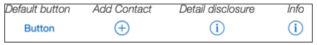

按钮允许定义标题、标题颜色、带样式的标题、标题阴影、图片和背景（背景可以是图片或颜色）。这些属性是带状态的：`UIControlState`。有三个状态 `.Normal`、 `.Highlighted` 和 `.Disabled`。当 `state` 改变后自动采用对应状态的属性。设置这些属性时需要指明状态：

```swift
button.setTitle("The Title", forState: .Normal)
```

通过 `current<propertyName>` 访问当期状态的属性，如 `currentTitle`。

按钮在背后通过 `UILabel` 和 `UIImageView` 绘制它的标题和图片。虽然不能修改它们本身，但可以修改它们的属性，以进一步定制标签和图片。

```swift
button.titleLabel?.font = UIFont.systemFontOfSize(12)
```

`UIControl` 使用 target-action 模式，调用另一个对象（target）的函数（action）以响应一个事件。连接一个按钮和 action 一般通过故事板。但也可以通过代码，调用函数`addTarget:action:forControlEvent`，

```swift
button.addTarget(self, action: "buttonPressed:", forControlEvents: .TouchUpInside)
```

事件定义在结构 `UIControlEvent`。

`buttonPressed` 函数定义在控制器中，如：

```swift
func buttonPressed(sender:UIButton) {
	var title = sender.titleForState(.Normal)!
	print("\(title) button pressed!")
}
```

### 2.2.2 布尔选择：UISwitch

开关有两个状态：开和关。状态改变后立即触发 `UIControlEventValueChanged:` 事件。

```swift
// Set the target-action
aSwitch.addTarget(self, action: "valueChanged:", forControlEvents: .ValueChanged)
...
func switchValueChanged(aSwitch: UISwitch) {
	print("value is \(aSwitch.on)")
}
```

开关的当前状态通过布尔属性 `on` 获得。If you want to set the on state by performing an animation, you can call the `setOn(_:animated:)` function.

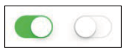

For the `UISwitch` instances, we can set `onTintColor:` to define the background of the switch when the value is "on", use `tint` to set the border color of the control when value is "off", and fiddle with `thumbTintColor` to colorize the thumb element.

### 2.2.3 选择值：UISlider

滑块可以选择一个 `Float` 值，默认的从 `0.0` 到 `1.0`，可以改，正负都行。

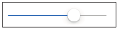

当前值可以通过 `value` 属性获取。值改变后，触发 `UIControlEventValueChanged` 事件。设置 `continuous` 属性为 false，则仅当用户手指离开滑块后才触发事件；否则连续触发。

```swift
func sliderValueChanged(slider: UISlider) {
	var roundedValue = Int(slider.value + 0.5)
	slider.value = Float(roundedValue)
	println("Slider value \(slider.value)")
}
```

可以通过 `tintColor` 属性定义轨道颜色。设置可以分别设置滑块左右两边的轨道的颜色：`minimumTrackTintColor` 和 `maximumTrackTintColor`。滑块可以通过 `thumbTintColor` 属性定制。

还可以使用图片定制滑块和导轨的外观，`setMinimum/MaximumTrackImage(_:forState:)` 和 `setThumbImage(_:forState:)`。还有两个图片可以放在 UISlider 的左右两边，`minimum/maximumValueImage`.

### 2.2.4 UISegmentedControl

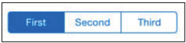

通过 `numberOfSegments` 属性获取项数。通过 `setTitle:forSegmentAtIndex:` 设置某项的标题，通过 `setImage:forSegmentAtIndex:` 设置某项的图片。若 `apportionsSegmentWidthsByContent` 为 `false`，则每项宽度相等；否则宽度区域内容。或者可以强制设置某项的宽度 `setWidth:forSegmentAtIndex:`。

用户选择某项后默认会保持。You can change this behavior by setting the `momentary` property to `true`. The segment tapped by user will now be highlighted for a short time, and then it will be automatically deselected.

选择某项后触发 `UIControlEventValueChanged` 事件。`selectedSegmentIndex` 属性返回选中的索引，第一项是0。若没有选中的，返回值等于 `UISegmentedControlNoSegment`。

可以通过故事板控制有哪些项。或者可以在运行时改变项数， `insertSegmentWith<Title/Image>:atIndex:animated:`、 `removeSegmentAtIndex:animated:`、 `removeAllSegments`。

主色通过 `tintColor` 定义；主色作为边框和选中内容的颜色。

You can also change the style of the segment more dramatically using custom images. As the segmented control is dependent on bar metrics (the bars have different sizes on iPhone with landscape orientation), you can define the images for each metric.

The images you can customize are the background for the segments and the dividers for each combination of states. The following example gives you an idea of what you can do:

```swift
// Background for Normal and Selected state
segment.setBackgroundImage(bg, forState: UIControlState.Normal, barMetrics: .Default)
segment.setBackgroundImage(bg_sel, forState: UIControlState.Selected, barMetrics: .Default)
// Dividers for some combination of states
segment.setDividerImage(div_nor_nor, forLeftSegmentState: .Normal, rightSegmentState: .Normal, barMetrics: .Default)
segment.setDividerImage(div_nor_sel, forLeftSegmentState: .Normal, rightSegmentState: .Selected, barMetrics: .Default)
segment.setDividerImage(div_sel_nor, forLeftSegmentState: .Selected, rightSegmentState: .Normal, barMetrics: .Default)
```

Here, you can see the result of this code and the single images used for the
background and state combinations:

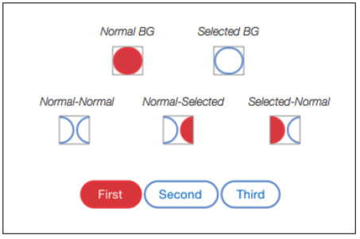

### 2.2.5 UIPickerView 和 UIDatePicker

Pickers are UI elements that are useful to display long lists of choices grouped in one or more spinning wheels, also called **components**.

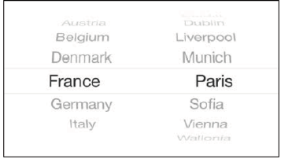

As we've discussed previously, a picker view consists of different components
(the wheels). 每个滚轮有一个索引，最左边的是0。其中的元素有一行或多行，每一行也有索引，从0开始。

定义 picker 的结构，需要数据源（`UIPickerViewDataSource`）和代理（`UIPickerViewDelegate`），分别用于提供数据和响应事件。

数据源的方法：

- `numberOfComponentsInPickerView:`： 返回一个整数，定义组件/轮子的数量。The only parameter of this function is the current picker view that.
- `pickerView:numberOfRowsInComponent:`：This defines the number of rows that each wheel has to show. With this function, you receive the current picker and, obviously, the component for which you are defining the number of rows.

代理的方法：

- `pickerView:<content>ForRow:forComponent:`：(Where <content> can be `title`,
`attributedString` or `view`) 在特定组件+行上显示的内容。You can easily define it with String or AttributedString. In this case, a label displayed in the system font is automatically created for each row. You can customize the look of the rows by defining content with a totally custom view.
- `pickerView:didSelectRow:inComponent:`：选中一行后调用该函数。To be even more precise, it is called as soon as a wheel stops moving and the user's touch event ends.
- `pickerView:widthForComponent:`：建议每个组件的宽度。Depending on the configuration and content, the final result may vary from the value that you return here. 注意 picker 的高度是固定的，and you can assign only one value: 162, 180, or 216.
- `pickerView:rowHeightForComponent:`：Here, you can pass the height of the rows for each component to the picker.

`UIDatePicker` 内部使用 picker。`datePickerMode` 属性决定显示时间、日期或时间与日期的选择（`Time`、`Date`、`DateAndTime`），或显示一个倒计时（`CountDownTimer`）。The order and value of the wheels are defined by `datePickerMode` and the date localization, which can be set with the `calendar` and `locale` properties.

当期日期通过 `date` 属性获取，and as you don't set a delegate on a date picker, if you need to intercept the "value changed" trigger, you have to add an observer on the `UIControlEventValueChanged` event.

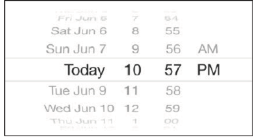

A date picker cannot be customized at all; you cannot even change the font used by the rows. The only way to obtain a custom date picker is to work with a default picker view and implement all the date/time logics yourself.

### 2.2.6 UIStepper

stepper 用于增减数字。默认界面只有两个按钮，显示加减号。

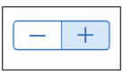

当前值通过 `value` 属性读写。若 `autorepeat` 属性为 true，则按住加减按钮不懂可以连续的增减。步长由 `stepValue` 属性决定。

`minimumValue` 和 `maximumValue` 值定义允许范围，是 `Double` 值。当 `wrap` 属性为 true，则到达最大或最小值时，当前值自动取到最大或最小值。

If you want to intercept the "value changed" event, you have to register for the `UIControlEventValueChanged` event, just as for the other controls.

The stepper can be customized with functions that are really similar to those used to customize the segmented control.

The background for the buttons can be defined with the `setBackgroundImage:forState:` function by setting images for the possible
`UIControlState` values, such as `Normal` and `Highlighted`. The divider image
between the two buttons can be customized with the `setDividerImage:forLeftSegmentState:rightSegmentState:` function. You can also set custom images for the plus and minus symbols, depending on the current state, by calling the `set<Decrement/Increment>ImageForState:` functions.

## 2.3 基于视图的组件

下面的视图一般用于显示不可交互的信息，或作为容器。

### 2.3.1 进度：UIProgressView

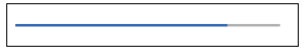

进度属性 `progress` 取值 `0.0` 到 `1.0`。You can perform a simple animation if you set the progress value using the `setProgress:animated:` function and passing `true` for the `animated` parameter.

导轨可以通过颜色或图片定制： `trackTintColor:`、 `trackImage:`。精度条可以通过 `progressTintColor:` 和 `progressImage:` 定制。

### 2.3.2 UIActivityIndicatorView

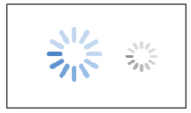

The animation of the wheel can be handled by the `startAnimating` and `stopAnimating` functions, and you can automatically hide the wheel when the animation is stopped by setting the `hidesWhenStopped` property.

You can define the wheel tint with the `color` property or set the style of the wheel with the `activityIndicatorViewStyle` property that accepts these predefined styles: `WhiteLarge`, `White`, and `Gray`.

### 2.3.3 UIImageView 和 UIImage 介绍

`UIImageView` 是静态或动画图片的容器。它与 `UIImage` 类一起工作。支持 JPEG, PNG, TIFF, GIF, DIB, a Windows icon, a Windows cursor, and a XWindow
bitmap。图片可以从 application bundle 读取，通过名字初始化：`init(named:)`；或从远程下载数据，通过 `init(data:)` 转换为图像；等。

Different versions of the same images should be provided to fit different screen pixel densities. You can address the images for a specific screen by using suffixes in their filenames. For instance, with @2x, you assign a `scale` property of 2.0 (suited to standard Retina displays), and with @3x, the `scale` property is 3.0 (suitable for 5.5-inch screens, such as that of iPhone 6 Plus).

A handy way to manage different image versions is using an asset catalog (by default, Xcode creates the **images.xcassets** catalog for every new project), in which you only need to drag and drop images with the right resolutions. There are dedicated slots for the 1x, 2x, and 3x versions and even more options if you want to target specific devices, such as iPad or Apple Watch, or specific orientations:

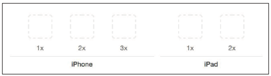

An asset catalog handles different image sizes using **trait collections**. You'll learn more about traits in Chapter 5, Adaptive User Interfaces; for now, it suffices to say that the `UIImageAsset` class stores all the image versions provided by the asset catalog and returns the best image format, depending on the current device type and orientation.

`UIImage` 属性可以改变图片的绘制。`imageWithRenderingMode:` 方法可以设置图片的渲染模式：`AlwaysOriginal`、 `AlwaysTemplate`。后者主要用于单色图片，可以改变其色调。The `AlwaysOriginal` mode, instead, forces the image to be drawn without drawing modifications in the system.

Another interesting feature that alters the way an image is drawn is related to **cap insets**. The `resizableImageWithCapInsets:` initializer returns an image that can be easily resized by keeping the corners of the image fixed in their state and creating resizable areas that can be seamlessly repeated along the entire image's width or length. Here is an example to show you how the cap insets work:

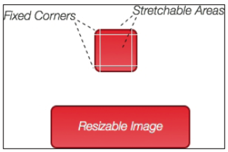

通过 `init(image:highlightedImage:)` 函数指定两张图片。当 `highlighted` 属性为true时显示第二张。

`UIImageView` 从 `UIView` 继承的属性中有两个重要的：`clipToBounds`、 `contentMode`。默认图片会缩放到填充 bound（`scaleToFill`），该选项不会维持图片的长宽比。可以选择缩放但维持长宽比：`scaleAspectFill` 或 `scaleAspectFit`。或按图片原大小居中绘制：`center`。

### 2.3.4 UIScrollView 介绍

控件负责处理用户的滚动和缩放操作。Under the hood, the origin of the content is adjusted in response to the user's gestures, and it is subsequently moved inside the container by updating `contentOffset`. The container then clips the content, which remains outside its frame.

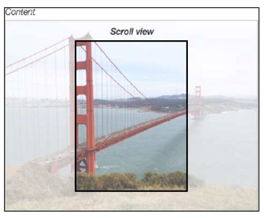

滚动视图需要知道内容的大小。Sometimes, the content you want to put inside a scroll view is composed of different elements, so it's not easy to identify an accurate content size. 此时较为简单的方法是将内容都放在一个父视图内，然后利用 Auto Layout, set width, height, and constraints to place it inside the scroll view.

It is important to know that in order to calculate the scroll area, a scroll view needs all of its four sides to be tied to valid constraints. Moving further with our approach, we can just tie the four sides of the parent view to the four sides of the scroll view (you'll learn all you need to know
about Auto Layout in Chapter 4, Auto Layout).

用户开始滚动后，会显示水平、垂直的滚动条。You can hide these elements with the `show<Horizontal/Vertical>ScrollIndicator:` properties or change their styles (black or white) by setting `indicatorStyle`. You can even temporarily disable scrolling with the `scrollEnabled` property.

An interesting way to interact with a scroll view is implementing the `UIScrollViewDelegate` protocol. With this protocol, you can intercept a lot of information about user interactions, similar to `scrollViewDidScroll:`, when the scrolling is finished, or `scrollViewWillBeginDecelerating:`, when the user lifts his/her finger after scrolling and the deceleration of the scroll view starts.

其他重要属性与缩放有关。If you want to allow users to perform content zoom with a pinch gesture, you need to set `minimumZoomScale` and `maximumZoomScale` in order to define the range within which the scroll view contents will be scaled. At this point, you have to implement the `viewForZoomingInScrollView:` delegate method, which returns the view that you want to zoom.

Considering that you'll typically want to zoom the entire scroll view's content, if you implement the content structure with a single parent view as we suggested before, you should return this view. Every time a user performs a pinch over the scroll view, the content will be scaled by a value that is proportional to the pinch distance and stored in the `zoomScale` property.

## 2.4 结构数据

### 2.4.1 UITableView 介绍

垂直可滚动。可以分节。可以有头尾。

`UITableView` 是 `UIScrollView` 的子类。

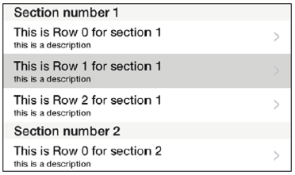

单元格用 `UITableViewCell` 对象表示。如果你只是想展示简单的信息，可以用系统提供的单元格类型：basic, right detail, left detail, and subtitle。Alternatively, you can build your own cell styles so that they can accommodate any type of information your data may need.

The cell drawing process is heavily optimized through a cell registration/de-queuing procedure. Cell classes are registered through the `registerClass:forCellReuseIdentifier:` function that connects a reuse identifier to a `UITableViewCell` subclass. From now on, before creating a new cell, you can use the `dequeueReusableCellWithIdentifier:forIndexPath:` function to check whether a cell with the same reuse identifier is available in the current reuse queue and use this cell instead of creating a new one.

Cells that are removed from screen are candidates for the reuse queue.

When you define a table cell using the Storyboard, you can set up a reuse identifier that will be automatically registered without the need to call the `registerNib:forCellReuseIdentifier:` or `registerClass:forCellReuseIdentifier:` function.

表格中的数据通过数据源提供。数据源对象实现 `UITableViewDataSource`。必须实现的方法有：

- `tableView:numberOfRowsInSection:`：返回一个整数，表示某一节的行数。
- `numberOfSectionsInTableView:`：返回节数。默认值1。
- `tableView:cellForRowAtIndexPath:` This method is responsible for building and returning a cell for a specific index path. 索引路径是一个 `NSIndexPath` 对象，它有 `row` 和 `section` 两个属性。

实现数据源协议的示例对象：

```swift
func tableView(tableView: UITableView,
	numberOfRowsInSection section: Int) -> Int {
	return 10
}
func tableView(tableView: UITableView,
	cellForRowAtIndexPath indexPath: NSIndexPath) -> UITableViewCell {
	var cell = tableView.dequeueReusableCellWithIdentifier("MyCell") as!MYCustomTableViewCell
	cell.customTitle = "Row \(indexPath.row)"
	return cell
}
```

A table view can also interact with a delegate object that implements the
`UITableViewDelegate` protocol to handle cell selections, intercept table edit events, and configure headers and footers. The delegate object might implement the `tableView:didSelectRowAtIndexPath:` function, which includes all the logics needed to present the next view with details regarding the selected object.

### 2.4.2 UICollectionView 介绍

The other control you might want to adopt to display long lists of items is the collection view. 集合视图比表格视图定制显示的能力更强。可以实现类似于表格的布局，或完全不同的布局。

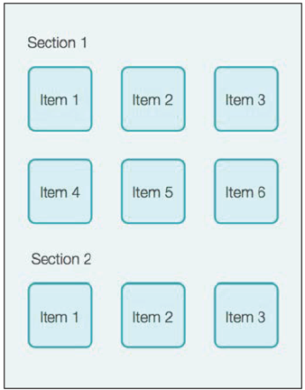

结合视图中每项的视图是 `UICollectionViewCell` 对象。它们可以分节。

In addition to cells, a collection view might present two other kinds of views: the decoration view and the supplementary view. 前者与内容无关（例如可以用于北京），后者而用于绘制节头、节尾灯元素。

`UICollectionViewDataSource` 负责提供要显示的数据。通过诸如 `collectionView:numberOfItemsInSection:` 和 `collectionView:cellForItemAtIndexPath:` 等方法。

Cells and supplementary views are subclasses of `UICollectionReusableView`, and the collection view presents these kinds of views with the registration and de-queuing process we saw before. You can register the class or a nib using `registerClass:forCellWithReuseIdentifier:` /  `registerNib:forCellWithReuseIdentifier:` (or their supplementary view versions), and then, rather then creating a new instance for these views every time, you can use `dequeueReusableCellWithReuseIdentifier:forIndexPath:` to retrieve a cell that was previously queued (for example, after a cell goes offscreen)—same as with table views.

A delegate object that implements the `UICollectionViewDelegate` protocol can
handle useful events triggered by the collection view, such as the selection of a cell (`collectionView:didSelectItemAtIndexPath:`).

If you create a collection view using a Storyboard, `UICollectionViewFlowLayout` is used as the layout of the collection by default. This layout shows the items in a grid that can be customized through parameters such as `itemSize`, `minimumLineSpacing`, and `minimumInteritemSpacing`. This is a good choice that is suitable for many use
cases, but what makes a collection view so interesting is the fact that you can create a heavily customized layout by subclassing `UICollectionViewLayout`.

## 2.5 UIAppearance 协议

通过 `UIAppearance` 协议，通过几行代码就可以定制视图的外观。利用 **appearance proxy**，forwards the customizations to all the instances of a specific class. The appearance proxy for a class can be retrieved using the `appearance` function, and as it returns `instancetype`, its properties can be easily accessed.

例子，设置应用中所有 `UISwitch` 对象的 `onTintColor`：

```swift
UISwitch.appearance().onTintColor = UIColor.redColor()
```

The properties that take part in the `UIAppearance` protocol and can therefore be modified through the appearance proxy must be marked with the `UI_APPEARANCE_SELECTOR` tag. This portion of the original definition of the `onTintColor` property from the `UISwitch.h` file confirms this:

```objc
... UIColor *onTintColor UI_APPEARANCE_SELECTOR;
```

You can also specify which of the instances for the class will receive the customization using refined versions of the `appearance` function: `appearanceWhenContainedIn:` allows you to get only the instances that are contained within a specific container, such as `UINavigationBar` or `UIToolBar`, while `appearanceForTraitCollection:` returns the appearance proxy for the specified trait collection.

You'll learn how to customize the `UISlider` class using custom images and the `UIAppearance` proxy. The final result will be a `UISlider` class that is completely customized, similar to the following:

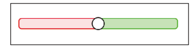

Open the Start project for **Chapter 2, UI Components Overview – UIKit**. Select **Images.xcassets** to create the needed images. The catalog asset should already contain one asset called AppIcon. Create a new asset by clicking on the + symbol and select **New Image Asset**. A new empty image asset will be created. Double-click on the new asset to rename it `minTrack`. At this point, if you select it, you should see three available slots on your right: 1x, 2x, and 3x.

These are the slots where the images to be used to customize the `minTrack` property should be dragged and dropped. Open the **assets** folder that you can find in the source code for this chapter and just drag the minTrack.png, minTrack@2x.png, and minTrack@3x.png images to the relative slots (you don't have to drag the images one by one; just select all the three images and drop them over any of the slots).

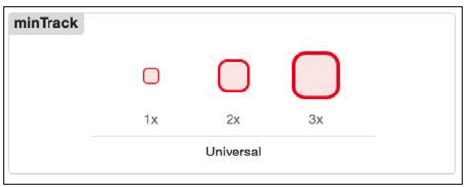

Repeat the previous steps for the `maxTrack` and `thumb` images.

Now, you can finally write code that's necessary to configure the custom element of the slider, as follows:

```swift
let minTrack = UIImage(named: "minTrack")
let maxTrack = UIImage(named: "maxTrack")
let thumb = UIImage(named: "thumb")
// Create resizable images
let resizableMinTrack = minTrack?.resizableImageWithCapInsets(
	UIEdgeInsets(top: 0, left: 5, bottom: 0, right: 5))
let resizableMaxTrack = maxTrack?.resizableImageWithCapInsets(
	UIEdgeInsets(top: 0, left: 5, bottom: 0, right: 5))
// Configure the styles!
UISlider.appearance().setMaximumTrackImage(resizableMaxTrack, forState: UIControlState.Normal)
UISlider.appearance().setMinimumTrackImage(resizableMinTrack, forState: UIControlState.Normal)
UISlider.appearance().setThumbImage(thumb, forState: UIControlState.Normal)
```

From now on, when you create a new instance of UISlider, these customizations will be used.