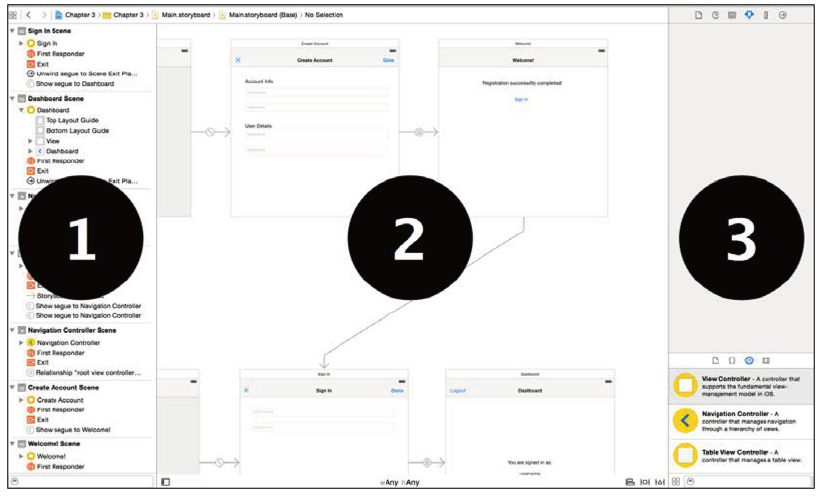
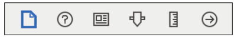
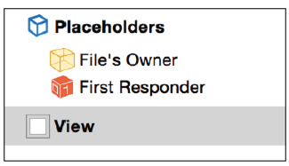
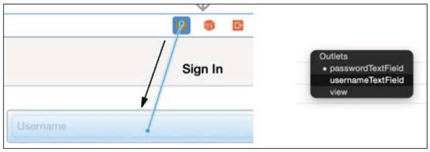
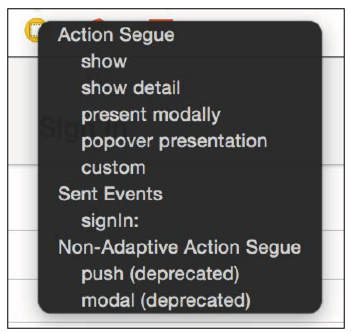
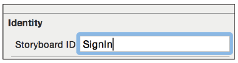
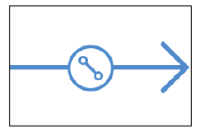
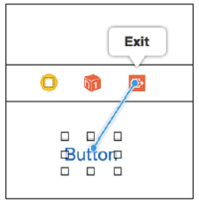
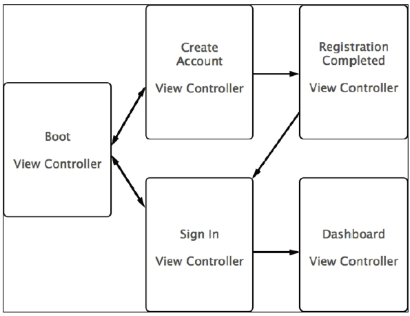
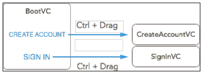

[toc]

# 3 Interface Builder, XIB, and Storyboard

## 3.1 Interface Builder

An XML Interface Builder (XIB) file, on the other hand, is normally used to contain the interface of a single view (or portions of it). In some ways, you can imagine a Storyboard as a set of XIB files connected through navigation information.

Storyboards 和 XIB 都是 XML 文件。在构建时编译为 Nib packages。Interface Builder 用于编辑 XML 文件。

## 3.2 编辑器概述



1. The document outline，树形视图，列出所有视图控制器和元素。
2. The interface editor
3. The utilities panel，现在 interface editor 或 document outline 中选中一个元素，然后可以使用6个子面板：



从左到右依次是：

- **File inspector**：该面板与 Storyboard/XIB 整体有关，不与其中单个组件有关。可以本地化、目标关系等。
- **Quick Help**：选中一个组件后，该面板给出相应文档的概述。
- **Identity inspector**：编辑选中组件的标示，指定类。From this view, you can also get the object ID of the selected component used inside XML files to identify the element itself.
- **Attributes inspector**：该面板根据当前选中的组件呈现。
- **Size inspector**：显示当前选中的组件的 bounds、frames 信息，以及 Auto Layout 约束。
- **Connections inspector**：显示选中组件所有关联的连接信息。For `UIButton`, for instance, you will see all `UIControlEvent` available and the actions connected to them.

## 3.3 使用 XIB

XIB 最常用的用途是定义单个视图控制器的界面。

当你创建一个新的视图控制器，你可以勾选 **Also create XIB file**，让自动创建 XIB 文件。

When you open the XIB file with the interface editor, you'll see that the **document outline** already contains some elements:



**Placeholders** 节下面有两个代理对象，一般不需要修改。

The **File's Owner** section describes the class that will own the interface created through the XIB file. 这里该对象是创建 XIB 文件时一同创建的视图控制器。若你不是一同创建的两个文件，你需要手工通过 Identity inspector 关联，**Class** 字段为界面的所有者。

The **First Responder** section is a proxy to any object that, at any given time during the application's execution, has the first responder status. For example, when a user selects a text field, the first responder proxy object points to it.

document outline 中已经包含了一个视图对象。它将作为界面的容器。如果 XIB 文件是随视图控制器一起创建的，则该视图已经连接到了 **file's owner** 的主视图。这个连接，可以在 **Connections inspector** 中查看。

From now on, every time a view controller instance is created using the
`init(coder:)` method, the view controller's `view` property will point to the view defined in the XIB file.

创建视图控制器，并指定 XIB 文件，通过 `init(nibName:bundle:)` 方法。

```swift
let signInVC = SignInViewController(nibName:"SignInViewController", bundle:nil)
```

## 3.4 通过 Storyboard 管理界面

A Storyboard can be considered a container of XIB files that can be connected through navigation logics. 应用可以使用多个故事板。例如，用一个故事板管理与设置相关的所有视图控制器。用另一个故事板处理核心功能。

Each Storyboard has an entry point controller called **initial view controller** that defines where the navigation starts. 初始视图控制器在左边有一个灰色箭头。要重新设置初始视图控制器，可以移动箭头到另一个视图控制器，或勾选 **Attributes inspector** 的 "is initial view controller" 选项。

## 3.5 连接界面和代码

例子。实现登录逻辑。创建 `UIViewController` 的子类 `SignInViewController`。第一步是拖放一个视图控制器对象到故事板的 interface editor。选中新创建的视图控制器，在 **Identity inspector** 中，更新 **custom class area**，选择 `SignInViewController` 做类名。

在 `SignInViewController` 类中定义 `username` 和 `password` 字段和 `signIn` 方法。

先定义好两个属性：

```swift
@IBOutlet weak var usernameTextField: UITextField!
@IBOutlet weak var passwordTextField: UITextField!
```

现在连接界面元素和类属性。按住 Ctrl 鼠标从 view controller **图标**拖到文本框上面。松开鼠标后，会出现新窗口，选择要连接的属性。连接后，可以在工具面板 **Connections inspector** 中看到这个连接。



先定义好 action 方法：

```swift
@IBAction func signIn(sender: UIButton) {
```

按住 Ctrl 鼠标从 **Sign In** 按键拖到 **视图控制器的图标**。释放鼠标后，从中选择要连接的方法以及按钮的 **touchUpInside** 事件。



After the user sign in is completed, you probably want to present a new view
controller to the authenticated user. If this controller is designed into a Storyboard, you can instantiate it programmatically just by referring to its Storyboard ID. This task is accomplished by first obtaining an instance of the Storyboard that you can use inside your code using the `init(name:Bundle:)` initializer of the `UIStoryboard` class. Run the following line of code:

```swift
var storyboard = UIStoryboard(name: "Main", bundle: nil)
```

This function is straightforward: it requires the name of the Storyboard and the bundle it belongs to initialize. (If the Storyboard is in the main bundle, you can just pass nil). Once an instance of the Storyboard is available within the code, it can be used to instantiate the desired view controller, but a **Storyboard ID** for this controller has to be defined in the **Identity inspector**:



Then, the view controller can be easily initialized through the next code:

```swift
let welcomeVC = storyboard.instantiateViewControllerWithIdentifier("Welcome") as! WelcomeViewController
```

You can also create an instance of the initial view controller using the
`initializeInitialViewController` function.

## 3.6 利用 segues 实现导航

The whole navigation of the application can be defined using Storyboards with the help of **segues**.

A segue is an instance of the `UIStoryboardSegue` class that is normally initialized directly through a `Storyboard`. Its main role is to define a relationship or transition between view controllers. 有两类 segues：一种是 **relationship segue**, which is adopted with `UINavigationViewController`, `UITabBarController`, and `UISplitViewController` to define their children view controllers, 另一种是 **adaptive segue**, which is used to transition from one view controller to another.

Creating a segue is extremely simple. Let's say you want to define the relationship between a navigation view controller and its root view controller. You can press Ctrl and drag from the navigation view controller to the view controller you want to set as root.

The HUD that appears when you release the mouse button allows you to set the
view controllers' relationship **selecting**—in this case, "root view controller". A line with a special icon will identify that the relationship has just been created:



With the exact same process, you can create adaptive segues. You just need to insert a button into a view controller, press Ctrl and drag from this button to another controller, and select one of the possible adaptive segues presented by the gray HUD.

An adaptive segue is defined by a string **identifier**, a **source view controller** that is the segue's starting point, and a **destination view controller** that is the controller the segue will present.

There are several types of segues you can choose from, each defining how the destination view controller will be inserted into the current application structure. Take a look at the following table:

- **Show**：This segue adds the destination view controller to the stack. Depending on the structure of the application, the new controller can be pushed into the stack or presented as a modal dialog.
- **Show detail**：This is similar to the Show segue but more specific; if the application displays a detail master view, the destination controller replaces the detail view.
- **Present modally**：This presents the destination view modally.
- **Present as a popover**：When run on an iPad, this segue presents the destination controller in a popover, while on an iPhone, it is presented modally.
- **Custom**：This presents your own custom-built segues.

You can gain full control over the segue execution overriding some `UIViewController` methods. The `shouldPerformSegueWithIdentifier(identifier:sender:)` can be implemented to define whether the segue for a given identifier has to start, while, overriding the `prepareForSegue(segue:sender:)` methods, you then have the chance to set useful information for the view controllers before the segue starts.

常见需要时利用该函数，设置目标控制器的一些字段。From the segue instance, you can access the `identifier` segue and the `sourceViewController` and `destinationViewController` properties to get references to the view controllers involved with the segue. Now, execute the following script:

```swift
override func prepareForSegue(segue: UIStoryboardSegue, sender: AnyObject?) {
	if segue.identifier == "userDetails" {
		let detailsVC = segue.destinationViewController as! detailsViewController
		detailsVC.firstname = user.firstname
		detailsVC.lastname = user.lastname
	}
}
```

### The unwind segue

With an adaptive segue, you can set up a "one-way" navigation flow. This is obviously not enough and with unwind segues; the navigation flow can be reversed, moving back to a view controller previously inserted in the navigation stack. An unwind segue implementation starts from a function with a predefined prototype, as shown in the following snippet:

```swift
@IBAction func <function name>(segue:UIStoryboardSegue){}
```

You can add code inside this function, but to make unwind work, it is enough to define a function with this signature inside the destination view controller.

This acts similarly to an anchor to the view controller where the function is defined, and it is triggered by another view controller currently visible to the user. As soon as this function is triggered, the navigation stack is reorganized to show the view controller that contains the unwind function.

To set how the unwind segue can be triggered and from where, you need to link an action to the **Exit** proxy, which is the orange icon that you can find above any view controller in the interface editor:



If you feel that it's a bit counterintuitive at first, don't worry; it's normal. You are, in fact, connecting the button action to a function (the unwind function), which is not in the same view controller of the button.


下面是一个例子。实现注册登录流程。



### （未）Hands-on code

Open the **Start** project for this chapter, and you will find a complete structure of view controllers that are not connected to each other yet. While you're at it, also check the Completed **project** so that you can have a preview of the final result and verify your implementation. In the following paragraphs, we will set up the segues that implement the navigation introduced in the previous image.

The **Boot** view controller is the **initial view controller** of the Storyboard, and it is where the user can choose to sign in or create a new account. Through two adaptive segues of the **Show** type, you can connect the **Sign In** and **Create Account** buttons to the appropriate view controllers. It's really easy: just press Ctrl and drag from the buttons to the view controller that you want to show, and select the Show segue. At this point, you can already launch the application to check the result.



