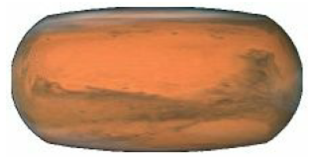
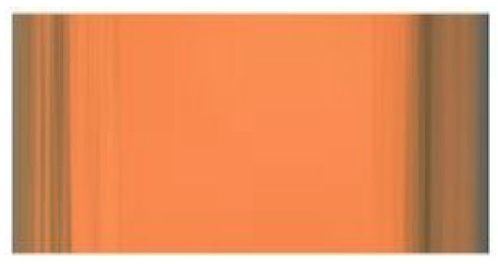
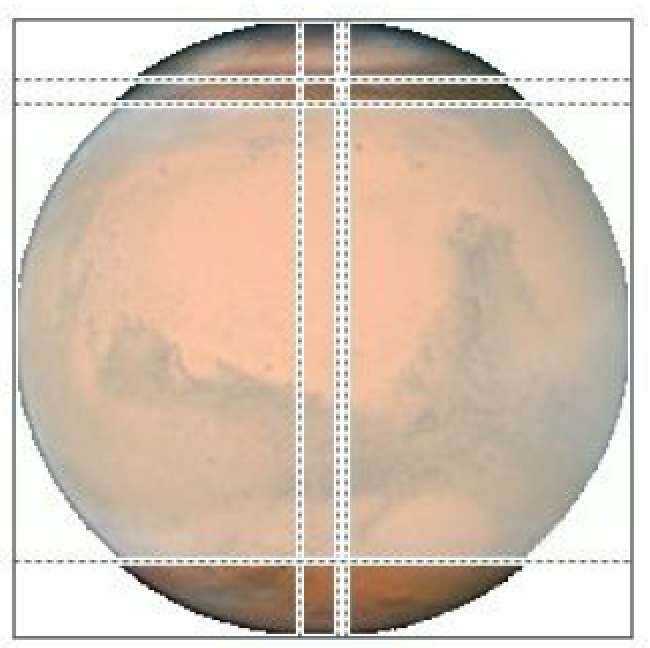
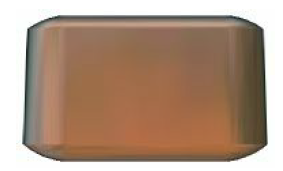

[toc]

# 2 绘制

本章讨论绘图机制。不要害怕自己写绘图代码！不难！

## 2.1 UIImage

通用的 UIKit 图片类是 `UIImage`。`UIImage` 可以从磁盘读取文件。被包含进 bundle 的图片最好使用 PNG，因为 iOS 会对其特殊处理。

在 bundle 中已存在得到图片，可以通过 `UIImage` 的初始化 `init(named:)`获取。该方法从两个地方寻找图片：

- **Asset catalog**：在 asset catalog 中找 image set。
- **应用 bundle 顶层**：在应用的 bundle 的顶层寻找根据名字的文件。名字要带扩展名；否则默认是 `.png`。

asset catalog 先于应用的 bundle 搜索。如果有多个 asset catalog，它们都会被搜索，但搜索顺序是不确定的，也不能制定；因此避免 image sets 同名。

`init(named:)` 的一个好处是图片可以缓存在内存。Alternatively, you can read an image file from anywhere in your app’s bundle directly and without caching, using `init(contentsOfFile:)`, 它期待一个路径字符串；可以通过  `NSBundle.mainBundle()` 获取到应用 bundle 的引用；`NSBundle` 的实例方法负责根据路径名获取 bundle 内的文件，如 `pathForResource:ofType:`。

`init(named:)` 和 `pathForResource:ofType:` 使用的路径，会考虑分辨率。若设备是双倍精度的屏幕，若有 @2x 文件会被自动使用。产生的 `UIImage` 会被标记为双倍精度；`scale` 属性取值 2.0。iOS 8 还支持 @3x。

Thanks to the `scale` property, a high-resolution version of an image is drawn at the same size as the single-resolution image. Thus, on a high-resolution screen, your code continues to work without change, but your images look sharper.

> iOS 8 不会运行在单分辨率的 iPhone上。因此只支持 iPhone 的应用不需要单分辨率的图片。但 iOS 8 会运行在单分辨率的 iPad 上。

同样的，若应用运行在 iPad 上，加注 `~ipad` 的文件会被自动使用。(This is true not just for images but for any resource obtained by name from the bundle. See Apple’s Resource Programming Guide.)

asset catalog 的好处之一是，你可以忽略这些后缀名规范。asset catalog 知道何时使用 image set 中的哪个图片。要为 iPad 丹徒提供图片，在图片集的 **Attributes inspector** 中，把 Device 从 Universal 改为其他，会自动增加槽位。

iOS 8 开始，asset catalog 还可以区分不同 **size class** 的版本的资源。在图片集的 Attributes inspector，利用 Width 和 Height 菜单指定你想要区别的 size class。Thus, for example, if we’re on an iPhone with the app rotated to landscape orientation, and if there’s both an Any height and a Compact height alternative in the image set, the Compact height version is used. Moreover, these features are live; for example, if the app rotates from landscape to portrait, and there’s both an Any height and a Compact height alternative in the image set, the Compact height version is replaced with the Any height version in your interface, automatically.

The way an asset catalog performs all this magic, in iOS 8, is through **trait collections** and the `UIImageAsset` class. When an image is extracted from an asset catalog through `init(named:)` and the name of its image set, its `imageAsset` property is a `UIImageAsset`. All the images in that image set are available through the `UIImageAsset`; each image has a trait collection associated with it (its `traitCollection`), and you can ask the `UIImageAsset` for the image appropriate to a particular trait collection by calling `imageWithTraitCollection:`. A built-in interface object that displays an image is automatically trait collection–aware in iOS 8; it receives the `traitCollectionDidChange:` message and responds accordingly. We can imagine how this works under the hood by building a `UIView` with an `image` property that does the same thing:

```swift
class MyView: UIView {
    var image : UIImage!
    override func traitCollectionDidChange(previous: UITraitCollection?) {
        if self.traitCollection != previous {
        	self.setNeedsDisplay()
        }
    }
    override func drawRect(rect: CGRect) {
        if var im = self.image {
            if let asset = self.image.imageAsset {
                let tc = self.traitCollection
                im = asset.imageWithTraitCollection(tc)
            }
            im.drawAtPoint(CGPointZero)
        }
    }
}
```

Moreover, your code can combine images into a `UIImageAsset` — the code equivalent of an image set in an asset catalog, but without an asset catalog. Thus you could, for example, create images in real time (as I’ll describe later in this chapter), or fetch images out of your app bundle, and configure them so that one is used when an iPhone app is in portrait orientation and the other is used when the app is in landscape orientation, automatically, like this:

```swift
let tcdisp = UITraitCollection(displayScale: UIScreen.mainScreen().scale)
let tcphone = UITraitCollection(userInterfaceIdiom: .Phone)
let tcreg = UITraitCollection(verticalSizeClass: .Regular)
let tc1 = UITraitCollection(traitsFromCollections: [tcdisp, tcphone, tcreg])
let tccom = UITraitCollection(verticalSizeClass: .Compact)
let tc2 = UITraitCollection(traitsFromCollections: [tcdisp, tcphone, tccom])
let moods = UIImageAsset()
let frowney = UIImage(named:"frowney")!
let smiley = UIImage(named:"smiley")!
moods.registerImage(frowney, withTraitCollection: tc1)
moods.registerImage(smiley, withTraitCollection: tc2)
```

After that, if frowney is placed into the interface — for example, by handing it over to a `UIImageView` as its image, as I’ll explain in a moment — it automatically alternates with smiley when the app changes orientation. The remarkable thing is that this works even though there is no persistent reference to frowney, smiley, or the `UIImageAsset` (moods). The reason is that frowney and smiley are cached by the system (because of the call to `init(named:)`), and they each maintain a strong reference to the `UIImageAsset` with which they are registered.

> New in iOS 8, you can also specify a target trait collection while fetching an image from the asset catalog or from your app bundle, by calling `init(named:inBundle:compatibleWithTraitCollection:)`. The bundle specified will usually be `nil`, meaning the app’s main bundle.

## 2.2 UIImageView

很多内建的UI对象都接受 `UIImage`，作为绘制自己的一部分。例如 `UIButton` 可以显示一张图片，见第12章。如果仅是想在界面显示一张图片可以用 `UIImageView`。

工程中已知的图片列在 **Media library**。从媒体库中图片拖到画布上，会添加一个 `UIImageView` 显示那个图片。

一个 `UIImageView` 实际可以有两个图片，一个添加到 `image` 属性，另一个添加到 `highlightedImage` 属性；`highlighted` 属性决定显示哪张图片。用户触摸不会自动导致  `UIImageView` 高亮。但 `UIImageView` 会随着容器高亮。例如当单元格高亮时，里面的 `UIImageView` 会跟着高亮。

`UIImageView` 也是 `UIView`，因此可以有背景色、alpha 值等。可以赋予一个新图片替换原来的图片，或设置 `image` 属性为 `nil` 移除它。

绘制方式由 `contentMode` 属性决定（`UIViewContentMode`，继承自 `UIView`）；例如， `.ScaleToFill` 表示图片宽高缩放到视图的宽高，不保持原图长宽比。 `.Center` 表示居中绘制，不改变原图大小。

若 `UIImageView` 的 `clipsToBounds` 属性为 false，则大于视图的图片，且未被 `contentMode` 缩小，会完整显示，超过视图边界。

在代码中创建 `UIImageView` 可以利用便利初始化器 `init(image:)` 或 `init(image:highlightedImage:)`。默认 `contentMode` 是 `.ScaleToFill`，但开始时不是图片缩放，而是视图自己缩放到图片大小。In this example, I’ll put a picture of the planet Mars in the center of the app’s interface (Figure 2-1; for the CGRect center property, see Appendix B):

```swift
let iv = UIImageView(image:UIImage(named:"Mars")) // asset catalog
mainview.addSubview(iv)
iv.center = iv.superview!.bounds.center
iv.frame.integerize()
```

向已存在的 `UIImageView` 赋值一个新的图片，视图的大小取决于图片视图是否是自动布局的。若不采用自动布局且视图大小设为绝对值，图片视图不会改变大小。但使用自动布局，新图片的大小成为图片视图新的 `intrinsicContentSize`，因此图片视图会才能图片大小，除非有约束阻止它。

### 2.2.1 Resizable Images

调用 `resizableImageWithCapInsets:resizingMode:`，一个 `UIImage` 可以产生一个 resizable 图片。参数 `capInsets:` 是结构 `UIEdgeInsets`，包含四个浮点数，表示上左下右 inset 值。它们表示从图片边缘向内的距离。若上下文大于图片，resizable 图片有两种行为，取决于 `resizingMode:` 的值（`UIImageResizingMode`）：

- `.Tile`：inset 区内的矩形平铺；each edge is formed by tiling the corresponding edge rectangle outside the inset area. The four corner rectangles outside the inset area are drawn unchanged.
- `.Stretch`：The interior rectangle of the inset area is stretched once to fill the interior; each edge is formed by stretching the corresponding edge rectangle outside the inset area once. The four corner rectangles outside the inset area are drawn unchanged.

界面有的地方需要一个 resizable 图片；for example, a custom image that serves as the track of a slider or progress view must be resizable, so that it can fill a space of any length. And there can frequently be other situations where you want to fill a background by tiling or stretching an existing image.

In these examples, assume that `self.iv` is a `UIImageView` with absolute height and width (so that it won’t adopt the size of its image) and with a `contentMode` of `.ScaleToFill` (so that the image will exhibit resizing behavior). First, I’ll illustrate tiling an entire image (Figure 2-2); note that the `capInsets:` is `UIEdgeInsetsZero`:

```swift
let mars = UIImage(named:"Mars")!
let marsTiled = mars.resizableImageWithCapInsets(UIEdgeInsetsZero, resizingMode: .Tile)
self.iv.image = marsTiled
```


Now we’ll tile the interior of the image, changing the `capInsets:` argument from the previous code (Figure 2-3):

```swift
let marsTiled = mars.resizableImageWithCapInsets(
    UIEdgeInsetsMake(
        mars.size.height / 4.0,
        mars.size.width / 4.0,
        mars.size.height / 4.0,
        mars.size.width / 4.0
        ), resizingMode: .Tile)
```


Next, I’ll illustrate stretching. We’ll start by changing just the `resizingMode:` from the previous code (Figure 2-4):

```swift
let marsTiled = mars.resizableImageWithCapInsets(
    UIEdgeInsetsMake(
        mars.size.height / 4.0,
        mars.size.width / 4.0,
        mars.size.height / 4.0,
        mars.size.width / 4.0
    ), resizingMode: .Stretch)
```



A common stretching strategy is to make almost half the original image serve as a cap inset, leaving just a pixel or two in the center to fill the entire interior of the resulting image (Figure 2-5):

```swift
let marsTiled = mars.resizableImageWithCapInsets(
    UIEdgeInsetsMake(
        mars.size.height / 2.0 - 1,
        mars.size.width / 2.0 - 1,
        mars.size.height / 2.0 - 1,
        mars.size.width / 2.0 - 1
    ), resizingMode: .Stretch)
```


You should also experiment with different scaling `contentMode` settings. In the preceding example, if the image view’s `contentMode` is `.ScaleAspectFill`, and if the image view’s `clipsToBounds` is true, we get a sort of gradient effect, because the top and bottom of the stretched image are outside the image view and aren’t drawn (Figure 2-6).



Alternatively, you can configure a resizable image without code, in the
project’s asset catalog. It is often the case that a particular image will be
used in your app chiefly as a resizable image, and always with the same
capInsets: and resizingMode:, so it makes sense to configure this
image once rather than having to repeat the same code. And even if an
image is configured in the asset catalog to be resizable, it can appear in
your interface as a normal image as well — for example, if you use it to
initialize an image view, or assign it to an image view under autolayout,
or if the image view doesn’t scale its image (it has a contentMode of
.Center, for example).
To configure an image in an asset catalog as a resizable image, select the
image and, in the Slicing section of the Attributes inspector, change the
Slices pop-up menu to Horizontal, Vertical, or Horizontal and Vertical.
When you do this, additional interface appears. You can specify the
resizingMode with another pop-up menu. You can work numerically, or
click Show Slicing at the lower right of the canvas and work graphically.
The graphical editor is zoomable, so zoom in to work comfortably.
The reason this feature is called Slicing and not Resizing is that it can do
more than resizableImageWithCapInsets:resizingMode: can do: it
lets you specify the end caps separately from the tiled or stretched
region, with the rest of the image being sliced out. The meaning of your
settings is intuitively clear from the graphical slicing editor. In Figure 2-
7, for example, the dark areas at the top left, top right, bottom left, and
bottom right will be drawn as is. The narrow bands will be stretched, and
the small rectangle at the top center will be stretched to fill most of the
interior. But the rest of the image, the large central area covered by a sort
of gauze curtain, will be omitted entirely. The result is shown in Figure 2-
8.




#### （未）2.2.2 Image Rendering Mode

Several places in an iOS app’s interface automatically treat an image as a transparency mask, also known as a template. This means that the image color values are ignored, and only the transparency (alpha) values of each pixel matter. The image shown on the screen is formed by combining the image’s transparency values with a single tint color. Such, for example, is the behavior of a tab bar item’s image.

The way an image will be treated is a property of the image, its `renderingMode`. This property is read-only; to change it, generate a new image with a different rendering mode, by calling imageWithRenderingMode:. The rendering mode values (UIImageRenderingMode) are:

- `.Automatic`
- `.AlwaysOriginal`
- `.AlwaysTemplate`

### 2.3 Graphics Contexts


