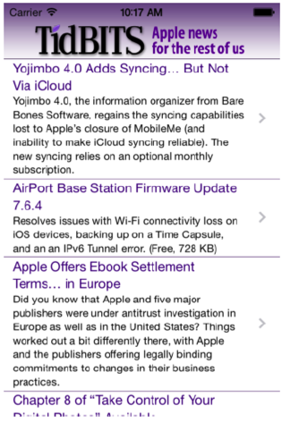

[toc]

# 6 [iOS9] 视图控制器

几乎不可能直接使用 `UIViewController`，一般都是使用它的某个子类。用内建的子类，如 `UINavigationController` 或 `UITabBarController` 或你自定义的子类。

视图控制器有一个**主视图**；`view` 属性指向该视图。A view controller’s main view has no explicit pointer to the view controller that manages it, but a view controller is a `UIResponder` and is in the responder chain just above its view, so it is the view’s `nextResponder`.

## 6.1 视图控制器的责任

视图控制器必须有一个视图，否则它就没有意义了。视图要有意义，必须在界面上显示出来。一般由已在界面上的视图控制器负责将其他视图（属于其他视图控制权的）放入界面。视图控制器不仅负责将视图放入界面，也要负责将视图从界面上移除。

视图控制器会为视图出现或消失提供动画。内建的视图控制器使用一些内建的方式和动画。若需要手工将视图放入界面，一般也需要手工提供动画。内建视图控制器的动画也是可以定制的。

视图控制器可以自动保存和恢复状态。当应用在后台终止后，下次重启可以恢复之前显示的界面。

最强大的视图控制器是**根视图控制器**。根视图控制器管理根视图。根视图位于视图层级的顶部，作为主窗口的唯一直接子视图。窗口从 `rootViewController` 属性获得根视图控制器，从中获取根视图控制器的主视图，设置正确的 frame（可能会修改大小），将其设置自己的子视图。根视图控制器决定应：

- 界面的旋转。是否随用户旋转设备而旋转视图。
- 控制**状态栏**。状态栏实际一个次级窗口，属于运行时管理，但运行时向根视图控制器询问如何显示状态栏。

## 6.2 视图控制器的层级

只有一个跟视图控制器。其他视图控制器从属于它。在 iOS 中视图控制器之间有两种从属关系：

**一、包含关系（Parentage，containment）**

一个视图控制器可以包含另一个视图控制器。二者是父子关系。包含关系在界面上也有反映：子视图控制器的视图，是父视图控制器的子视图。**父视图控制器负责将子视图控制器的视图放入界面**，也负责后续将其移除。

例子。一个新闻列表。父视图控制器是 `UINavigationController`。一个子视图控制器提供视图，显示列表。用户触摸列表中的一项，列表从屏幕一边划出，详情从另一边划入。父视图负责添加新的字视图控制器，负责界面的动画。此时，父视图控制器，以及它的视图（这里是根视图），仍是存在的。



**二、呈现、模态（Presentation，modal views）**

一个视图控制器（presenting view controller）呈出另一个视图控制器（presented view controller）。二者不是父子关系。第二个视图控制器的视图，全部或部分地、替换或遮盖第一个视图控制器的视图。

该机制的名字，以及视图控制器之间的关系，在 iOS 4 及之前称为 modal。如被呈现的（presented）视图控制器称为模态视图控制器，视图是模态视图。

被呈现的模态控制器，可以像普通模态对话框一样，提供确认或取消按钮，才能进一步操作。但现在不是所有的被呈现的模态控制器都需要模态的。

---

一个应用只有一个根视图控制器。其他视图控制器都必须有一个父视图控制器或一个 presenting 视图控制器。

视图层级与视图控制器的层级对应。例如，父视图控制器的视图必须是子视图控制器的视图的父视图；presented 视图控制器的视图是 presenting 视图控制器视图的子视图，或完全替换它。

一般不需要手工将视图控制器的视图放入界面。只要处理好视图控制器的关系，它们的视图的关系会被视图控制器内建逻辑处理。

还是新闻列表的例子。上面的 LOGO 视图，属于导航条。下面的新闻列表视图是 `UITableView`。触摸一条新闻，列表走开，新视图属于另外的视图控制器占据原来新闻列表。但导航条不变。

以为 `UINavigationController` 是窗口的 `rootViewController`，因此 `UINavigationController` 的视图自动成为窗口的子视图。`UINavigationController` 的子视图控制器的视图，自动成为 `UINavigationController` 视图的子视图。

若你自己实现一个父视图控制器，你需要手工将子视图控制器的视图放入界面，作为子视图。

不用手工将一个视图控制器的视图放入界面，除了以下两种情况：

- 视图控制器的父视图是你定制的一个视图控制器.There is a complicated parent–child dance you have to do. See “Container View Controllers” on page 339.
- You’re doing a custom transition animation. See “Custom Transition” on page 315.

## 6.3 创建视图控制器对象

在代码中实例化：

```swift
let llc = LessonListController(terms: self.data)
let nav = UINavigationController(rootViewController:llc)
```

视图控制器可以通过加载一个 nib 创建。

一个 .xib 文件包含一个视图控制器。一个 .storyboard 文件包含多个视图控制器；视图控制器是故事板的结构的基础。每个场景一个视图控制器。故事板中每个视图控制器在构建后进入一个 nib 文件。可以自动加载，也可以手工加载。

视图控制器创建后要被 retain。例子：

```swift
let llc = LessonListController(terms: self.data)
let nav = UINavigationController(rootViewController:llc)
self.presentViewController(nav, animated:true, completion:nil)
```

If a view controller is instantiated automatically from a storyboard, it will be retained automatically. 但背后实现方法与上述代码无异。

## 6.4 How a View Controller Gets Its View

视图控制器会延迟加载它的视图，当它的 `view` 属性被访问时才加载。因为视图控制器是一个相对轻量级的对象，而视图对象相对重量级。

若非必要不要访问 `view` 属性，因为会引起视图的加载。要判断是否控制器是否已有视图，调用 `isViewLoaded` 方法。New in iOS 9, you can refer to a view controller’s view safely, without loading it, as its `viewIfLoaded` (an Optional); you can also cause the view controller to load its view explicitly, rather than as a side effect of mentioning its view, by calling `loadViewIfNeeded`.

视图控制器获得视图后，会调用 `viewDidLoad` 方法。在这个方法里可以对视图进行修改。注意此时视图可能尚未显示在界面上（测试 `self.view.window` 是否为 `nil`）。因此此时视图的大小等信息都是不能用的，不能据此做计算。

视图控制器如何获得它的视图？对于内建的 `UIViewController` 不用你关心。但如果是你自定义的 `UIViewController` 的子类，可能需要你了解视图控制器如何获得视图。有多种办法：

- 在视图控制器的代码中，手工创建视图。
- The view may be created as an empty generic view, automatically.
- The view may be created in its own separate nib.
- 视图和视图控制器在同一个 nib。

### 6.4.1 手工创建视图

实现 `UIViewController` 的 `loadView` 方法。创建某个 `UIView`，赋给 `self.view`。不能调用任何父类方法。

> `loadView` 不是 `viewDidLoad`。

例子。（需要一个无故事板的工程，见第一章。）

```swift
override func loadView() {
	let v = UIView()
	v.backgroundColor = UIColor.greenColor()
	self.view = v
	let label = UILabel()
	v.addSubview(label)
	label.text = "Hello, World!"
	label.autoresizingMask = [
		.FlexibleTopMargin,
		.FlexibleLeftMargin,
		.FlexibleBottomMargin,
		.FlexibleRightMargin]
	label.sizeToFit()
	label.center = CGPointMake(v.bounds.midX, v.bounds.midY)
	label.frame.makeIntegralInPlace()
}
```

一般来说，谁把视图控制器的视图放入界面，谁就应该负责给视图正确的 frame。

### 6.4.2 使用自动创建的占位视图

区别创建一个视图和填充它。思路是，创建一个通用的视图做主视图。然后在 `viewDidLoad` 中填充它。

```swift
override func loadView() {
	let v = UIView()
	self.view = v
}
override func viewDidLoad() {
	super.viewDidLoad()
	let v = self.view
	v.backgroundColor = UIColor.greenColor()
	let label = UILabel()
	v.addSubview(label)
	label.text = "Hello, World!"
	label.translatesAutoresizingMaskIntoConstraints = false
	NSLayoutConstraint.activateConstraints([
		label.centerXAnchor.constraintEqualToAnchor(v.centerXAnchor),
		label.centerYAnchor.constraintEqualToAnchor(v.centerYAnchor),
	])
}
```

实际上，若你不实现 `loadView`。默认的实现与上面的代码一样，会创建一个普通的 `UIView`，赋给 `view`。因此实际我们可以完全删掉上述代码中的 `loadView`。

### （未）6.4.3 View in a Separate Nib

### （未）6.4.4 Nib-Instantiated View Controller

### （未）6.4.5 Storyboard-Instantiated View Controller

## 6.5 View Resizing

视图控制器的视图可能被调整大小。调整大小可能发生在：视图被放入界面，应用旋转，界面大小变化，如导航栏的高度调整、消失出现。On the iPhone 6, it may even be resized because a change in the **Display Zoom** setting changes the effective size of the screen. Apple describes views and view controllers as *adaptive* to size changes.

### 6.5.1 Nib 编辑其中的视图大小

设置编辑器针对的设备尺寸。打开故事板，选中视图控制器；或打开 .xib 文件，选中顶层的视图，在 **Attributes inspector**，**Simulated Metrics** 一节下，可以选择设备的大小、朝向以及影响布局的元素（状态栏、顶部栏、底部栏）。但在 nib 编辑器中看到的大小与实物还是有区别。

The **Interface Builder Preview** feature can be a big help here, allowing you to view your interface laid out for multiple devices simultaneously.

From this point of view, Xcode’s “Use Size Classes” option is a boon. 默认它把视图控制器的主视图显示为一个正方形：没有任何实际设备是这个形状。它这是在提示你界面要适配多种真实大小。

### 6.5.2 Bars and Underlapping

控制器的视图要考虑屏幕上下通栏。

任务栏是透明的，因此背后的视图可见。根视图，或其他全屏的视图，会填满整个窗口。因此你的视图的上边必须避开状态栏。

导航控制器（navigation bar, toolbar）的上下通栏，或标签控制器可以是半透明的。若是，视图控制器的视图默认延伸到半透明的通栏的下方。因此，你的视图也要避开这些区域，这些区域不要放有用的东西。

通知栏可以显示或不显示。上下通栏也可以显示或不显示。若显示，它们的高度可能变。你的界面如何处理这些变化？主要机制是视图控制器的 **layout guides**。

Recall (from Chapter 1) that a view controller supplies two properties, its `topLayoutGuide` and its `bottomLayoutGuide`. 这两个对象在运行时自动移动，以反映视图的环境：

`topLayoutGuide` 的定位如下：

- 若只有状态栏，没有顶部通栏，`topLayoutGuide` 放在状态栏下方。
- 若有顶部通栏，`topLayoutGuide` 放在顶部通栏的下方。
- 若都没有，`topLayoutGuide` 放在视图的顶部。

`bottomLayoutGuide` 的定位如下：

- 若有底部通栏，`bottomLayoutGuide` 放在底部通栏的上方。
- 若没有，`bottomLayoutGuide` 放在底部通栏的下方。

在布局中使用 layout guides 的最简单的方法是利用自动布局。约束视图的顶部到 `topLayoutGuide` 的底部，视图的底部到 `bottomLayoutGuide` 的顶部；可以保证当 layout guide 移动时视图也移动。这些约束在 nib 编辑器中是默认的！When you’re using the new iOS 9 anchor notation for creating a constraint in code, you’ll use the `topLayoutGuide`’s `bottomAnchor` and the `bottomLayoutGuide`’s `topAnchor`.

If you need actual numbers in order to perform layout-related calculations, a layout guide’s spacing from the corresponding edge of the view controller’s main view is reported by its `length` property. Note that `viewDidLoad` is too early to obtain a meaningful value; the earliest coherent opportunity is probably `viewWillLayoutSubviews` (I’ll discuss this event later). New in iOS 9, if you are constructing a constraint relative to the height of a layout guide, you can use its `heightAnchor` property.

#### 6.5.2.1 状态栏和可见性和样式

状态栏默认显示。但在 iPhone 横屏状态默认不显示。`UIViewController` 的子类可以重写以下方法控制状态栏的可见性和样式：

- `preferredStatusBarStyle`：Your choices (`UIStatusBarStyle`) are `.Default` and `.LightContent`，分别表示暗色的文字和亮色的文字。
- `prefersStatusBarHidden`：返回 true 让状态栏不可见；返回 false 让状态栏可见，即使在 iPhone 横屏时。调用父类方法将采用默认行为。
- `childViewControllerForStatusBarStyle`、`childViewControllerForStatusBarHidden`：将状态栏的可见性和样式代理给子视图控制器的 `preferredStatusBarStyle` 或 `prefersStatusBarHidden`。例如标签控制器可以让子视图控制决定。

不需要手工调用这些方法；they are called automatically when the view controller situation changes (including when the interface rotates)。如果确实需要立即更新控制，如为了适应某种新情况，应该调用 `setNeedsStatusBarAppearanceUpdate`。If this call is inside an animation block, the animation of the change in the look of the status bar will have the specified duration. 动画的方式可以由视图控制器的 `preferredStatusBarUpdateAnimation` 方法决定；返回值包括：（`UIStatusBarAnimation`） `.Fade`、 `.Slide`、 `.None`。

修改状态栏的可见性后，top layout guide 将向上或向下移动20个点。如果有视图的约束相对于 top layout guide，这些视图将移动。若此时主视图已可见，用户看到的移动是瞬间的。如果你想让用户看到平滑的动画。在调用 `setNeedsStatusBarAppearanceUpdate` 的动画块内里调用 `layoutIfNeeded`。

```swift
var hide = false
override func prefersStatusBarHidden() -> Bool {
	return self.hide
}
@IBAction func doButton(sender: AnyObject) {
	self.hide = !self.hide
	UIView.animateWithDuration(0.4, animations: {
		self.setNeedsStatusBarAppearanceUpdate()
		self.view.layoutIfNeeded()
	})
}
```

#### 6.5.2.2 Extended layout

若你的 `UIViewController` 的父控制器是导航或标签控制器，你可以通过以下属性控制上通栏（导航条）或下通栏（工具条、标签条）是否遮盖视图：

- `edgesForExtendedLayout`：A `UIRectEdge`. 默认是 `.All`，表示上面或下面半透明的通栏将覆盖在视图上面。另一个极端是 `.None`，表示上下通栏都不能覆盖。还有两个选项 `.Top`  和 `.Bottom` 表示仅上部通栏覆盖或仅下部通栏覆盖。
- `extendedLayoutIncludesOpaqueBars`：If true, then if `edgesForExtendedLayout` permits underlapping of bars, those bars will be underlapped even if they are opaque. 默认是 false，表示只有半透明的通栏会覆盖在上面（underlapped）。

### 6.5.3 Resizing Events

A UIViewController receives events that notify it of pending view size changes. (Trait collections, size classes, and view layout events were discussed in Chapter 1.) 下面事件主要与界面的旋转有关；new in iOS 9, they are associated also with iPad multitasking (Chapter 9):

- `willTransitionToTraitCollection:withTransitionCoordinator:`：Sent when the app is about to undergo a change in the trait collection (because the
size classes will change). Common examples are rotation of 90 degrees on an
iPhone, or a change between fullscreen and splitscreen on an iPad. This event is not sent on launch or when your view controller’s view is first embedded into the interface. If you override this method, call super. `UIViewController` receives this event by virtue of adopting the `UIContentContainer` protocol.
- `viewWillTransitionToSize:withTransitionCoordinator:`：Sent when the app is about to undergo rotation (even if the rotation turns out to be 180 degrees and the size won’t actually change) or an iPad multitasking size change. The new size is the first parameter; the old size is still available as `self.view.bounds.size`. This event is not sent on launch or when your view controller’s view is first embedded into the interface. If you override this method, call super. UIViewController receives this event by virtue of adopting the `UIContentContainer` protocol.
- `traitCollectionDidChange:`：Sent after the trait collection changes. The parameter is the old trait collection; the new trait collection is available as `self.traitCollection`. Sent after the trait collection changes, including on launch or when the trait collection is set for the first time (in which case the parameter will be nil). `UIViewController` receives this event by virtue of adopting the `UITraitEnvironment` protocol.

In addition, a `UIViewController` receives these events related to the layout of its view:

- `updateViewConstraints`：The view is about to be told to update its constraints (`updateConstraints`), including at application launch. If you override this method, call super.
- `viewWillLayoutSubviews`、`viewDidLayoutSubviews`：These events surround the moment when the view is sent `layoutSubviews`, including at application launch.

In a situation where all these events are sent, the order is:

- willTransitionToTraitCollection:withTransitionCoordinator:
- viewWillTransitionToSize:withTransitionCoordinator:
- updateViewConstraints
- traitCollectionDidChange:
- viewWillLayoutSubviews
- viewDidLayoutSubviews

There is no guarantee that any of these events, if sent, will be sent exactly once.

> Your view can be resized under many circumstances, such as the showing and hiding of a navigation bar that isn’t underlapped, without the `viewWillTransitionToSize:...` event being sent. Thus, to detect these changes, you’ll have to fall back on layout events such as `viewWillLayoutSubviews`. I regard this as a flaw in the iOS view controller event architecture.

### （未）6.5.4 旋转

在 iOS 7 及之前，窗口实际没有旋转，只是根视图变换，changing the bounds size to match the new orientation。但 iOS 8 开始，应用是真的旋转。Rotation expresses itself in two ways:

**The status bar orientation changes**

You can hear about this (though this will rarely be necessary) by way of these app delegate events and notifications:

- `application:willChangeStatusBarOrientation:duration:` (and the corresponding `UIApplicationWillChangeStatusBarOrientationNotification`)
- `application:didChangeStatusBarOrientation:` (and the corresponding `UIApplicationDidChangeStatusBarOrientationNotification`)

The current orientation (which is also the app’s current orientation) is available from the `UIApplication` as its `statusBarOrientation`; the app delegate methods also provide the other orientation (the one we are changing to or from, respectively) as the second parameter. Possible values (`UIInterfaceOrientation`) are:

- `.Portrait`
- `.PortraitUpsideDown`
- `.LandscapeLeft`
- `.LandscapeRight`

Two global convenience functions, `UIInterfaceOrientationIsLandscape` and
`UIInterfaceOrientationIsPortrait`, take a `UIInterfaceOrientation` and return a Bool.

**The view controller’s view is resized**

The view controller receives events related to resizing, as I described in the preceding section. These may or may not include a change in the trait collection. Thus, the most general way to learn that rotation is taking place is through `viewWillTransitionToSize:withTransitionCoordinator:`. On the other hand, you are more likely to care about a 90 degree rotation on an iPhone than any other kind of rotation, and in that case `willTransitionToTraitCollection:withTransitionCoordinator:` applies.

There are two complementary uses for rotation:

- Compensatory rotation：
The app rotates to compensate for the orientation of the device, so that the app appears right way up with respect to how the user is holding the device. The challenge of compensatory rotation stems, quite simply, from the fact that the screen is not square. This means that if the app rotates 90 degrees, the interface no longer fits the screen, and must be changed to compensate.
- Forced rotation：The app rotates when a particular view appears in the interface, or when the app launches, to indicate that the user needs to rotate the device in order to view the app the right way up. This is typically because the interface has been specifically designed, in the face of the fact that the screen is not square, to appear in one orientation (portrait or landscape).

In the case of the iPhone, no law says that your app has to perform compensatory
rotation. Most of my iPhone apps do not do so; indeed, I have no compunction about
doing just the opposite. My view controller views often look best in just one orientation
(or one pair of opposed orientations, either just portrait or just landscape), and they
stubbornly stay there regardless of how the user holds the device. A single app may
contain view controller views that work best in different orientations; thus, my app forces
the user to rotate the device differently depending on what view is being displayed. This
is reasonable, because the iPhone is small and easily reoriented with a twist of the user’s
wrist, and it has a natural right way up, especially because it’s a phone. (The iPod touch
isn’t a phone, but the same argument works by analogy.)
On the other hand, Apple would prefer iPad apps to rotate to at least two opposed
orientations (such as landscape with the button on the right and landscape with the
button on the left), and preferably to all four possible orientations, so that the user isn’t
restricted in how the device is held.
It’s fairly trivial to let your app rotate to two opposed orientations, because once the app
is set up to work in one of them, it can work with no change in the other. But allowing
a single interface to rotate between two orientations that are 90 degrees apart is trickier,
because its dimensions must change — roughly speaking, its height and width are
transposed — and this may require a change of layout and might even call for more
substantial alterations, such as removal or addition of part of the interface. A good
example is the behavior of Apple’s Mail app on the iPad: in landscape, the master pane
and the detail pane appear side by side, but in portrait, the master pane is removed and
must be summoned as a temporary overlay on top of the detail pane.


