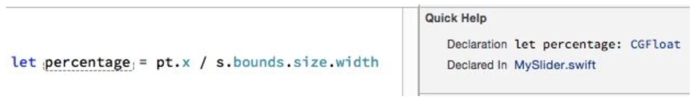

[toc]

## 3.7 内建的简单类型

### 3.7.1 Bool

`Bool` 对象类型（一个结构）有两个值，`true`、 `false`。

```swift
var selected : Bool = false
func application(application: UIApplication, didFinishLaunchingWithOptions launchOptions: [NSObject: AnyObject]?) -> Bool {
	return true
}
```

与其他编程语言不同的是，**Swift 不会将任何东西隐式转换成 Bool**。

布尔运算符：`!`、 `&&`、 `||`。

### 3.7.2 数字

主要的数字类型是 `Int` 和 `Double`。其他类型多数为兼容 C 和 Objective-C。

#### Int

`Int` 是一个结构。范围从 `Int.max` 到 `Int.min`。最大最小值的实际值取决于平台和架构。

任何整数字面量都是 `Int`。在字面量中间可以使用下划线：目的是提高长的数字的可读性。数字开头可以加任意多的零。

可以使用科学计数法。例如 `3e2` 是300。

二进制、八进制和十六进制字面量分别前缀 `0b`、 `0o`、 `0x`。例如 `0x10`。科学计数法使用 `p`，表示2的N次方。例如 `0x10p2` 对应十进制是 64（16 * 2^2）。

There are instance methods for converting to a different underlying byte-order representation (bigEndian, littleEndian, byteSwapped) but I have never had occasion to use them.

#### Double

Double 是一个结构，表示浮点数，精度大约 15 个数字（64位存储）。

任何带小数的数字字面量默认都是 `Double`。在字面量中使用下划线或在开头放0都是可以的。也可以使用科学计数法。

Double 字面量不能以小数点开头。必须前缀0。

#### 强制类型转换（Coercion）

强制类型转换，是一个数值类型转换为另一个类型。Swift并没有真正的**显式**强转，但 **实例化** 起了相同的作用。比如，要 Int 转 Double，用 Int 实例化 Double。

```swift
let i = 10
let x = Double(i)
println(x) // 10.0, a Double
let y = 3.8
let j = Int(y)
println(j) // 3, an Int
```

当数值**字面量**赋给变量或函数参数时，会发生隐式的强转。如 `let d : Double = 10`。该规则只适用于字面量，变量不具备该特性。例如下面的代码编译会报错：

```swift
let i = 10
let d : Double = i // compile error
```

只能显式实例化：

```swift
let i = 10
let d : Double = Double(i)
```

相同的规则也适于**数值计算**。**Swift只会隐式强转字面量**。当 Int 与 Double 一起计算，Int 会转换为 Double：

```swift
let x = 10/3.0
println(x) // 3.33333333333333
```

**但对于变量不行**：

```swift
let i = 10
let n = 3.0
let x = i / n // compile error; you need to say Double(i)
```

#### 其他数值类型

Cocoa 还有大量其他类型。除了 Int，还有多个有符号整数：`Int8`, `Int16`, `Int32`, `Int64`，和多个无符号整数 UInt ：`UInt8`, `UInt16`, `UInt32`, `UInt64`。除了 Double，还有低精度的 `Float` （32位存储，6到7个精度）、扩展精度 `Float80`；在 Core Graphics 中，还有 `CGFloat`（大小是 Float 或 Double）。

与 C 的接口交互时会遇到 C 的数值类型。这些类型对 Swift 而言仅仅是类型别名；例如 `CDouble` 对应 C 的 double，是 Double 的别名。`CLong`（C 的 long）是一个 Int。Cocoa 框架也产生一些别名，如 `NSTimeInterval` 是一个 Double。

前面说不同数值类型不能赋值、传递或一起运算。这么多类型，增加了需要“类型强转”的可能性。例如下面的代码， `CGImageGetWidth` 和 `CGImageGetHeight` 都返回 `UInt`。但 `CGSizeMake` 期望 `CGFloat`。在 Swift 中，必须显式强转：

```swift
var szCG = CGSizeMake(
   CGFloat(CGImageGetWidth(marsCG)),
   CGFloat(CGImageGetHeight(marsCG))
)
```

Cocoa 自己会负责转换。但 Swift 不行。因此在 Objective-C 可行的代码在 Swift 中可能需要额外的强转。例如在 Objective-C 中，`UIInterfaceOrientationMaskPortrait` 是 `NSInteger`。下面的代码是可以的：

```
-(NSUInteger)supportedInterfaceOrientations {
	return UIInterfaceOrientationMaskPortrait;
}
```

但在 Swift 不行，等效的代码通不过编译。只能显式转换：

```swift
override func supportedInterfaceOrientations() -> Int {
	return Int(UIInterfaceOrientationMask.Portrait.rawValue)
}
```

The good news here — perhaps the only good news — is that if you can get enough of your code to compile, Xcode’s Quick Help feature will tell you what type Swift has inferred for a variable (Figure 3-1). This can assist you in tracking down your issues with numeric types.



有时把一个**整数**类型赋给另一个**整数**类型时，可能不知道期望的整数类型具体是什么类型。可以借助 Swift 的动态转换 `numericCast`。例如 i 和 j 是两个不同类型的整数类型的变量， `i = numericCast(j)` 将 j 转换为 i 的整数类型。

#### 数值计算

`+ - * /`。

除是整除。小数舍弃。

`%` 取余。The result can be negative, if the first operand is negative; if the second operand is negative, it is treated as positive. Floating-point operands are legal.

整数类型可以使用**位运算符**：`& | ^ ~ << >>`。

位运算常用于选项：

```swift
typedef NS_OPTIONS(NSUInteger, UIViewAnimationOptions) {
	UIViewAnimationOptionLayoutSubviews = 1 << 0,
	UIViewAnimationOptionAllowUserInteraction = 1 << 1,
    UIViewAnimationOptionBeginFromCurrentState = 1 << 2,
	// ...
};

let opts : UIViewAnimationOptions = .Autoreverse | .Repeat
```

判定某个位是否置位：

```swift
override func didTransitionToState(state: UITableViewCellStateMask) {
    let editing = UITableViewCellStateMask.ShowingEditControlMask.rawValue
    if state.rawValue & editing != 0 {
    	// ... the ShowingEditControlMask bit is set...
    }
}
```

整数会上溢或下溢。例如，相加两个整数超过 `Int.max`，这是运行时错误，**应用会崩溃**。

若想允许此种操作，需要使用特殊的上溢、下溢方法。这些方法返回一个元组：

```swift
let i = Int.max - 2
let (j, over) = Int.addWithOverflow(i, 12/2)
```

Now `j` is `Int.min + 3` (because the value has wrapped around from `Int.max` to `Int.min`) and `over` is true (to report the overflow).

若你不想知道是否发生溢出，可以使用以下运算符，直接抑制掉错误：`&+`, `&-`, `&*`。

赋值与运算符结合的快捷运算符：`+=, -=, *=, /=, %=, &=, |=, ^=, ~=, <<=, >>=`。

`++` 和 `--`。

全局函数包括 `abs`、 `max`、 `min`：

```swift
let i = -7
let j = 6
println(abs(i)) // 7
println(max(i,j)) // 6
```

其他数字函数，如平方根，来自 C 库，也可见，只要引入 UIKit。小心数字类型，没有隐式强转，包括字面量。
例如，`sqrt` 期望 C double，即 `CDouble`，即 `Double`。因此你不能写 `sqrt(2)` ；只能用 `sqrt(2.0)`。
例如，`arc4random` 返回 `UInt32`。因此如果 `n` 是一个 `Int`，不能使用 `arc4random() % n`；必须先将 `arc4random` 的结果强转为 `Int`。

#### 比较

数字比较返回 `Bool`。`== != < <= > >=`。

比较两个 Double，更可靠的方法是比较差异：

```swift
let isEqual = abs(x - y) < 0.000001
```

### 3.7.3 字符串

字符串是一个结构。字符串字面量用双引号包围。

```swift
let greeting = "hello"
```

Swift 字符串是 Unicode。若知道 Unicode 字符的 codepoint，可以使用语法 `\u{...}`，括号里面是2个、4个或8个十六进制数字：

```swift
let checkmark = "\u{21DA}"
```

一些转义字符：`\n \t \" \\`。

Swift字符串允许插值，语法 `\(...)`。例如：

```swift
var n = 5
let s = "You have \(n) widgets."
```

括号里面不仅可以是变量名，可以是任何表达式：

```swift
var m = 4
var n = 5
let s = "You have \(m + n) widgets."
```

双引号不能进入括号。转义双引号也是不行的。例如，不能：

```swift
let ud = NSUserDefaults.standardUserDefaults()
let s = "You have \(ud.integerForKey("widgets")) widgets." // compile error
```

只能分开写：

```swift
let ud = NSUserDefaults.standardUserDefaults()
let n = ud.integerForKey("widgets")
let s = "You have \(n) widgets.)"
```

拼接两个字符串，最简单的方法是使用 `+` 运算符：

```swift
let s = "hello"
let s2 = " world"
let greeting = s + s2
```

背后原理是 `+` 运算符被重载了。所有运算符都可以被重载。

除了使用 `+=`，可以调用 `extend` 方法：

```swift
var s = "hello"
let s2 = " world"
s.extend(s2) // or: s += s2
```

另一种连接字符串的方法是 `join`。参数是一个数组，用给定分隔符连接它们：

```swift
let s = "hello"
let s2 = "world"
let space = " "
let greeting = space.join([s, s2])
```

比较运算符对字符串也重载了。

其他实例方法。`isEmpty` 返回一个 Bool，判定字符串是否为空串。`hasPrefix` 和 `hasSuffix` 判定字符串是否以特定字符串开头或结尾。如 `"hello".hasPrefix("h")`。 `uppercaseString` 和 `lowercaseString` 将字符串转换为大写或小写。

字符串或整数之间的强转。整数转字符串，可以使用插值；或用整数作为 String 的初始化：

```swift
let i = 7
let s = String(i)
```

以其他进制表示整数：

```swift
let i = 31
let s = String(i, radix:16) // "1f"
```

字符串转换为整数使用实例方法 `toInt`。转换可能失败，因此返回结果不是 `Int`，而是一个包裹 `Int` 的 `Optional`。

```swift
let s = "31"
let i = s.toInt() // Optional(31)
```

字符串长度通过全局的 `count` 函数获取：

```swift
let s = "hello"
let length = count(s) // 5
```

逐字符遍历可以使用 for...in 结构。字符是 Character 对象：

```swift
let s = "hello"
for c in s {
   println(c) // print each Character on its own line
}
```

Swift语言与其他语言不同，不提供一些基础的操作，如判断字符串包含特定字符。这些功能由 Foundation 框架提供。Swift String 桥接到 Foundation `NSString`。粗略说，Swift 字符串可以使用 Foundation NSString 的方法：

```swift
let s = "hello, world"
let s2 = s.capitalizedString // "Hello, World"
```

`capitalizedString` 属性来自 Foundation 框架；由 Cocoa 提供，而非 Swift。它是 `NSString` 的属性。又一个例子，定位子字符串：

```swift
let s = "hello"
let range = s.rangeOfString("ell") // Optional(Range(1..<4))
```

Swift 的 String `s` 变成了 NSString，然后 NSString 的 `rangeOfString` 方法被调用，返回一个 Foundation 的结构 `NSRange`；NSRange 转换为 Swift 的 Range，然后包裹进一个 Optional。
有时你不想经历上面完整的转换。例如你最后就想得到 Foundation `NSRange`。此时必须显式将字符串强转为 `NSString`。（ `as` 运算符在第4章详解。）

```swift
let s = "hello"
let range = (s as NSString).rangeOfString("ell") // (1,3), an NSRange
```

另一个例子。从字符串中取出指定位置范围的子串，可以使用 Foundation 的 `NSString` 的 `substringWithRange:` 方法。该方法需要一个 `NSRange`。但如果你在 Swift 中使用  `NSRange` 会报错：

```swift
let s = "hello"
let ss = s.substringWithRange(NSMakeRange(1, 3)) // compile error
```

原因是 Swift 已经调整了 NSString 的 `substringWithRange:`，期望你在这里使用 Swift 的 `Range`。若想使用原来的版本，必须通过转换明确调用 `NSString` 的方法：

```swift
let s = "hello"
let ss = (s as NSString).substringWithRange(NSMakeRange(1,3))
```

Swift 还包含一些内建的顶层的函数，用于字符串。

```swift
let s = "howdy"
let ok = contains(s, "o") // true
```

除了字符， `contains` 还接受一个函数，返回一个 Bool。例如，判定字符串中是否有元音：

```swift
let s = "howdy"
let ok = contains(s) { contains("aeiou", $0)} // true
```

`find` reports the index of a character (as an Optional):

```swift
let s = "howdy"
let ix = find(s, "o") // 1, wrapped in an Optional
```

`dropFirst` and `dropLast` take a string and return (in effect) a new string without the first or last character, respectively. `prefix` and `suffix` extract the string of the given length from the start or end of the original string:

```swift
let s = "hello"
let s2 = prefix(s, 4) // "hell"
```

`split` 将字符串分隔为字符串数组。根据一个函数（取一个字符，返回一个Bool）。例子，从元音处或空格处断开：

```swift
let s = "hello world"
let arr = split(s, {contains("aeiou ", $0)}) // ["h", "ll", "w", "rld"]
```

Optional parameters allow split to do things such as limit the number of partitions:

```swift
let s = "hello world"
let arr = split(s, {contains("aeiou ",$0)}, maxSplit: 1) // ["h", "llo world"]
```

### 3.7.4 字符

Character 对象类（一个结构）表示单个 Unicode grapheme cluster —— 一般是一个字符。字符串由一组 Character 对象构成。

并没有字符字面量。要创建 Character 对象，要从单字符字符串开始：

```swift
let c = Character("h")
```

Alternatively, to make a Character from a Unicode codepoint integer, pass through the `UnicodeScalar` class: `let c = Character(UnicodeScalar(0x68))`。

字符也可以比较大小。

字符串和字符的数组可以相互转换：

```swift
let s = "hello"
var arr = Array(s)
arr.removeLast()
let s2 = String(arr) // "hell"
```

这只是个例子：实际上我们可以用全局方法 `dropLast`，直接用在字符串上。

访问特定位置上的字符，可以：

```swift
let s = "hello"
var arr = Array(s)
let c = arr[1]
```

但不可以：

```swift
let s = "hello"
let c = s[1] // compile error
```

原因是字符串的索引是一个特殊的类型：`Index`。In particular, they are the type defined by the `Index` struct inside the `String` struct, which must thus be referred to from outside as `String.Index`. 不能将 `Int` 转换为 `String.Index`。获取期望的 `String.Index` 的唯一方法是从 `startIndex` 或 `endIndex` 开始，然后用 `advance`：

```swift
let s = "hello"
let ix = s.startIndex
let ix2 = advance(ix, 1)
let c = s[ix2] // "e"
```

**搞得这么复杂的原因是Swift要走一遍字符串才能知道字符的位置。**；调用 `advance` 方法即让 Swift 走走看。

Once you’ve done the work to obtain a desired `String.Index`, you can use it to modify the string (provided your reference to the string is a var, of course). The `splice(atIndex:)` instance method inserts a string into a string:

```swift
var s = "hello"
let ix = s.startIndex
let ix2 = advance(ix,1)
s.splice("ey, h", atIndex: ix2) // "hey, hello"
```

Similarly, `removeAtIndex` deletes a single character (and returns that character). String manipulations involving longer stretches of the original string require use of a Range, which is the subject of the next section.

**String 和 NSString 的差异**

Swift 和 Cocoa 对字符串“元素”的定义是不同的。Swift使用“字符”。`NSString` 使用UTF-16 codepoints。两种方式各有利弊。NSString 比 Swift 更快更高效，但 Swift 更直觉。为强调该区别，非字面量的 Swift 字符串没有 `length` 属性；instead, its `utf16` property exposes its codepoints, 全局函数 `count` 给出与 NSString `length` 属性相同的结果。

Fortunately, the element mismatch doesn’t arise very often in practice; but it can arise. Here’s a good test case:

```swift 
let s = "Ha\u{030A}kon"
println(count(s)) // 5
let length = (s as NSString).length // or: let length = count(s.utf16)
println(length) // 6
```

### 3.7.5 Range

Range 对象类型（一个结构）。有两个运算符可以构成 Range 字面量；提供起始值和结束值，中间是 Range 运算符：

- `...`。包括结束值。
- `..<`。不包括结束值。

Range 运算符外可以包括空格。

起始值不能大于结束值（编译不报错，运行错误！）

范围的起始、结束值一般是数字，多数是 `Int`：`let r = 1...3`。

若结束值是负数字面量，必须放在括号内：`let r = -1000...(-1)`。

范围常用于 for...in：

```swift
for ix in 1... 3 {
	println(ix) // 1, then 2, then 3
}
```

实例方法 `contains` 用于判定值是否落在范围内；

```swift
var ix = // ... an Int...
if (1...3).contains(ix) { // ...
```

范围用于数组下标。例如，获取字符串的第2、3、4个字符。先把字符串转换为数组：

```swift
let s = "hello"
let arr = Array(s)
let result = arr[1...3]
let s2 = String(result)
```

You can also use a Range to index into a String directly, but it has to be a `Range` of `String.Index`, which, as I’ve already pointed out, is rather clumsy to obtain. One way to get one is to let Swift convert the `NSRange` that you get back from a Cocoa method call into a Swift Range for you:

```swift
let s = "hello"
let r = s.rangeOfString("ell") // a Swift Range (wrapped in an Optional)
```

You can also generate a pair of `String.Index` using `advance` from the string’s `startIndex`, as I showed earlier; you can then make a Range from them. Once you have a range of `String.Index`, some additional Swift String instance methods spring to life. For example, you can extract a substring by its range, using subscripting:

```swift
let s = "hello"
let ix1 = advance(s.startIndex, 1)
let ix2 = advance(ix1, 2)
let r = ix1...ix2
let s2 = s[r] // "ell"
```

Alternatively, you can call `substringWithRange`: on a Swift String without casting to an `NSString`:

```swift
let s = "hello"
let ix = advance(s.startIndex, 1)
let ix2 = advance(ix, 2)
let ss = s.substringWithRange(ix...ix2) // "ell"
```

You can also splice into a range, thus modifying the string:

```swift
var s = "hello"
let ix1 = advance(s.startIndex, 1)
let ix2 = advance(ix1, 2)
let r = ix1...ix2
s.replaceRange(r, with: "ipp") // s is now "hippo"
```

Similarly, you can delete a stretch of characters by specifying a range:

```swift
var s = "hello"
let ix1 = advance(s.startIndex,1)
let ix2 = advance(ix1,2)
let r = ix1...ix2
s.removeRange(r) // s is now "ho"
```

Swift `Range` 和 Cocoa `NSRange` 的构建方式不同。Swift Range 由起始结束点构成。Cocoa `NSRange` 由起始点和长度构成。But you can coerce a Swift Range whose endpoints are Ints to an NSRange, and you can convert from an NSRange to a Swift Range with the `toRange` method (which returns an `Optional` wrapping a Range).

In our call to `substringWithRange`, as in our earlier call to `rangeOfString:`, Swift goes even further. It bridges between Range and NSRange for us, correctly taking account of the fact that Swift and Cocoa interpret characters and string length differently — and the fact that an NSRange’s values are Ints, while the endpoints of a Range describing a Swift substring are `String.Index`.

### 3.7.6 Tuple

tuple是轻量级的多个值的有序集合。例如，下面的 `pair` 是一个元组。有一个 Int 和一个 String 元素。

```swift
var pair : (Int, String)
pair = (1, "One")
```

若类型可以被推断，就可以省略类型：`var pair = (1, "One")`。

元组是纯粹的 Swift 有的东西。与 Cocoa 和 Objective-C 并不兼容。

同时给多个变量赋值，把变量名放在元组中：

```swift
var ix: Int
var s: String
(ix, s) = (1, "One")
```

在一行上声明和初始化多个值：

```swift
let (ix, s) = (1, "One") // can use let or var here
```

通过元组，可以使用在一行上交换两个值：

```swift
var s1 = "Hello"
var s2 = "world"
(s1, s2) = (s2, s1) // now s1 is "world" and s2 is "Hello"
```

若想忽略某个值，可以在相应位置填充下划线：

```swift
let pair = (1, "One")
let (_, s) = pair // now s is "One"
```

Swift 内建的遍历功能 for...in，每次循环可以发送当前元素及其索引，二者包围在一个元组中：

```swift
let s = "howdy"
for (ix, c) in enumerate(s) {
   println("character \(ix) is \(c)")
}
```

有两种方式可以引用元组中的元素。第一种方式使用数字下标，注意通过点运算符：

```swift
let pair = (1, "One")
let ix = pair.0 // now ix is 1
```

若到元组的引用不是一个常量，可以通过这种方式修改其值：

```swift
var pair = (1, "One")
pair.0 = 2 // now pair is (2, "One")
```

访问元组中元素的第二种方式是通过名字。但首先要先命名：

```swift
var pair : (first:Int, second:String) = (1, "One")
```

或这样：

```swift
var pair = (first:1, second:"One")
```

然后就可以引用其名了：

```swift
var pair = (first: 1, second: "One")
let x = pair.first // 1
pair.first = 2
let y = pair.0 // 2
```

可以把一个具名的元组分配给一个不具名的元组（反之亦然）：

```swift
var pair = (1, "One")
var pairWithNames : (first:Int, second:String) = pair
let ix = pairWithNames.first // 1
```

如果想在程序的其他地方使用某种元组，最好给它一个名字。命名使用 Swift 的 `typealias` 关键字。

```swift
class Board {
   typealias Slot = (Int,Int)
   // ...
}
...
func pieceAt(p:Slot) -> Piece {
	let (i, j) = p
	// ... error-checking goes here...
	return self.grid[i][j]
}
```

元组，与函数参数列表的相似性不是巧合。参数列表就是一个元组。即每个函数都取一个元组参数，并返回一个元组。因此可以向函数传入一个元组。

```swift
func f (i1:Int, i2:Int) -> () {}
...
let p = (1,2)
f(p)
```

`f` 是一个顶级函数，因此它默认没有外部参数名。若函数有外部参数名，需要传具名的元组。

```swift
func f2 (#i1:Int, #i2:Int) -> () {}
...
let p2 = (i1:1, i2:2)
f2(p2)
```

`Void`，是无返回值的函数返回的类型。有了上面的知识，可以说，它其实是一个空的元组，因此可以被 `()` 替代。

### 3.7.7 Optional

Optional 对象类型（是一个枚举）包裹其他对象。一个 Optional 对象只能包裹一个对象；或不包裹任何对象。

例子，创建一个 Optional 对象，包裹一个 String "howdy"，一种方式是：

```swift
var stringMaybe = Optional("howdy")
```

声明和初始化后，`stringMaybe` 的类型固定了。只能把另一个 Optional 且同样包裹字符串的对象赋给它。而不能把包裹其他类型的 Optional 付给他。

```swift
var stringMaybe = Optional("howdy")
stringMaybe = Optional("farewell")

stringMaybe = Optional(123) // compile error
```

Optional 对语言非常重要，因此语言内建了特殊语法。可以给一个**已确定类型的** Optional 直接赋那个类型的值。例如 `stringMaybe` 是一个包裹 String 的 Optional，可以直接赋一个 String 给它。

```swift
var stringMaybe = Optional("howdy")
stringMaybe = "farewell" // now stringMaybe is Optional("farewell")
```

如何显式声明一个特定 Optional 类型的变量？注意声明时必须显式指定它包裹的对象的类型。正式上称 Optional 是泛型的，如包裹字符串的 Optional 是 `Optional<String>` （第4章会详细讲）。但不必那样写。Swift 语言支持表述 Optional 类型的语法糖衣：使用包裹类型的名字，后跟问号。例如：

```swift
var stringMaybe : String?
```

综上，完全不需要 Optional 初始化器。在一步内可以完成声明 Optional 类型并赋初值：

```swift
var stringMaybe : String? = "howdy"
```

若一个函数参数类型是一个包裹 String 的 Optional，则我们可以将 `stringMaybe` 传给它：

```swift
func optionalExpecter(s:String?) {}
let stringMaybe : String? = "howdy"
optionalExpecter(stringMaybe)
```

或直接传被包裹类型，这里是 String。因为参数传递就像赋值。

```swift
func optionalExpecter(s:String?) {
   // ... here, s will be an Optional wrapping a String...
   println(s)
}
optionalExpecter("howdy") // console prints: Optional("howdy")
```

但反过来不行！不能在期望被包裹类型的地方，传包裹该类型的 Optional 对象：

```swift
func realStringExpecter(s:String) {}
let stringMaybe : String? = "howdy"
realStringExpecter(stringMaybe) // compile error
```

正确做法是先解包。见下面章节。

#### 解包 Optional

解包（unwrap）。一种方法是后缀一个**解包运算符**（或**强制解包运算符**）。即后缀一个叹号。

```swift
func realStringExpecter(s:String) {}
let stringMaybe : String? = "howdy"
realStringExpecter(stringMaybe!)
```

要调用 Optional 包裹的对象的方法，也必须先解包。即不能：

```swift
let stringMaybe : String? = "howdy"
let upper = stringMaybe.uppercaseString // compile error
```

必须先解包：

```swift
let stringMaybe : String? = "howdy"
let upper = stringMaybe!.uppercaseString
```

如果要反复使用解包后的值，不要重复使用解包运算符。应先把解包结果保存下来：

```swift
// self.window is an Optional wrapping a UIWindow
self.window = UIWindow(frame:UIScreen.mainScreen().bounds)
let window = self.window!
// now window (not self.window) is a UIWindow, not an Optional
window.rootViewController = RootViewController()
window.backgroundColor = UIColor.whiteColor()
window.makeKeyAndVisible()
```

但还有另外的方式：

#### 隐式解包

Swift 提供了另外一种方式，在期望被包裹类型的地方使用 Optional：你可以将 Optional 声明为隐式解包的。它实际是另一种类型 `ImplicitlyUnwrappedOptional`。它是一种 Optional，但可以直接传给期望被包裹类型的地方。可以显式解包 ImplicitlyUnwrappedOptional，但不必。

```swift
func realStringExpecter(s:String) {}
var stringMaybe : ImplicitlyUnwrappedOptional<String> = "howdy"
realStringExpecter(stringMaybe) // no problem
```

与 Optional 一样，Swift 为隐式解包的 Optional 提供了语法糖。包裹 String 的 Optional 可以声明为 `String?`；隐式解包的 Optional 可以声明为 `String!`。因此之前的代码可以重写为：

```swift
func realStringExpecter(s:String) {}
var stringMaybe : String! = "howdy"
realStringExpecter(stringMaybe)
```

隐式解包与普通的 Optional （比如 `String?` 和 `String!`）可互换，即可以相互赋值给对方。

#### nil

判断 Optional 是否包含值，或让 Optional 不再包含值，需要用到一个特殊的关键字：`nil`。

- 判断 Optional 是否包裹值，让 Optional 变量与 nil 比较。
- 让 Optional 不再包含值，将 nil 赋给 Optional 变量。

例子：

```swift
var stringMaybe : String? = "Howdy"
println(stringMaybe) // Optional("Howdy")
if stringMaybe == nil {
   println("it is empty") // does not print
}
stringMaybe = nil
println(stringMaybe) // nil
if stringMaybe == nil {
	println("it is empty") // prints
}
```

Swift中的nil不是值，它是一个缩写。不包含被包裹对象的 Optional 实际是 `Optional.None`，不包裹 String 的 Optional 实际是 `Optional<String>.None`。显然，用 nil 更方便。I’ll explain in Chapter 4 what those expressions signify.

类型为 Optional 的变量（var）的值自动是 nil。下面是合法的：

```swift
func optionalExpecter(s:String?) {}
var stringMaybe : String?
optionalExpecter(stringMaybe)
```

In Swift 1.2, the implicit initialization rule for Optional-typed variables applies to true variables (`var`) but not to constants (`let`). That’s because, in Swift 1.2, a let variable that isn’t initialized in its declaration might be initialized subsequently.

Swift中最重要的一项规则：不能解包空的 Optional（等于 nil 的 Optional）。**显式解包空的 Optional 会让程序在运行时崩溃。**

```swift
var stringMaybe : String?
let s = stringMaybe! // crash
```

The crash message reads: “Fatal error: unexpectedly found nil while unwrapping an Optional value.” 实际中你会大量遇到这种错误。**这几乎是导致 Swift 程序崩溃的最重要的方式。**

要消灭这类错误，应先检查是否为空，再解包：

```swift
var stringMaybe : String?
// ... stringMaybe might be assigned a real value here...
if stringMaybe != nil {
    let s = stringMaybe!
    // ...
}
```

#### Optional 链

不解包不能向 Optional 发消息。 Optional 自身并不响应任何消息。

**条件解包（unwrapped optionally）**。不用 `!` 解包，用 `?` 解包。仅当 Optional 不为空时才解包并向值发消息；否则不解包。如下面的例子。

```swift
var stringMaybe : String?
// ... stringMaybe might be assigned a real value here...
let upper = stringMaybe?.uppercaseString
```

注意，条件解包参与的表达式的结果是一个 Optional；若解包成功（解包链能产生一个值），值包裹仅一个 Optional 并返回；否则此链返回一个 nil。因此，上面的 `upper` 是一个 **Optional**。可能为 nil，取决于 `stringMaybe` 是否为 nil。

更长的 Optional 链也是合法的。不管链中有多少个 Optional 需要解包，只要其中一个是条件解包的，则整个表达式产生一个 Optional。

```swift
// self.window is a UIWindow?
let f = self.window?.rootViewController?.view.frame
```

注意上面的代码不会产生嵌套的 Optional：不会产生一个 `CGRect` 包裹在 Optional 中，又包裹一层 Optional。

> 但其他情况可能导致 Optional 嵌套。见第 4 章。

若 Optional 链在赋值的左边：

```swift
self.window?.rootViewController = UIViewController()
```

当 `self.window` 为 nil，程序不会崩溃。如果我们想知道赋值是否成功，我们可以利用在 Swift 中，表达式不返回值则返回一个 Void。因此我们可以根据表达式的结果是否为 nil 判断赋值是否成功：

```swift
let ok : Void? = self.window?.rootViewController = UIViewController()
if ok != nil {
	// it worked
}
```

实际上不需要保存临时变量，可以直接把结果与 nil 比较：

```swift
if (self.window?.rootViewController = UIViewController()) != nil {
   // it worked
}
```

> I’ll discuss some additional Swift syntax for checking whether an Optional is nil when I come to flow control in Chapter 5.


> 普通解包与条件解包，以及普通 Optional 声明与隐式解包的 Optional 声明，虽然都用 `!` 和 `?`，但两个概念没有关系！

#### 比较与 Optional

与除 nil 之外的东西比较，Optional 会被特殊处理，比较的是被包裹的值，而不是 Optional 自身。例如：

```swift
let s : String? = "Howdy"
if s == "Howdy" { // ... they _are_ equal!
```

若 Optional 未包含任何值，则不相等（安全！）。

若被包裹的类型支持大于或小于等运算符，也是可以直接使用的：

```swift
let i : Int? = 2
if i < 3 { // ... it _is_ less!
```

#### Why Optionals?

一个目的是与 Objective-C 交换值。Objective-C 中任何对象引用都可以为 nil。因此需要一个机制向 Objective-C 发送 nil，或从 Objective-C 接收 nil。Optional 是唯一方式。**从 Swift 视角看，所有的 Objective-C 对象都是 Optional。**

例如， UIView 的 `backgroundColor` 属性，它的类型是 `UIColor?`。若要给它赋值，可以直接赋 `UIColor` 对象，或 nil。这是 Swift 提供的便利。但如果要访问它的值，注意解包。否则出错，例如：

```swift
let v = UIView()
let c = v.backgroundColor
let c2 = c.colorWithAlphaComponent(0.5) // compile error
```

但很多 Cocoa 对象类型不会被标记为 Optional；尽管它们的引用都可以为 nil；但实际上它们不会。于是 Swift 在这些情况下，将值作为对象本身。为此苹果手工调整了（hand-tweaking） Cocoa APIs。在第一版 Swift，从 Cocoa 收到的所有对象值都是 Optional，一般是隐式解包的 Optional。但随后 Apple 大量修改了API，消除了不需要使用 Optional 的地方。In a few cases, you will still encounter implicitly unwrapped Optionals coming from Cocoa. That simply means that Apple hasn’t gotten around to hand-tweaking this corner of the API yet. For example, as of this writing, the API for the CALayer `drawInContext:` method looks like this:

```swift
func drawInContext(ctx: CGContext!)
```

`ctx` 是 `nil` 的可能性为零。因此这里使用隐式解包是无害的。

另一重要用途是推迟变量初始化，一般是实例属性。iOS 编程中的典型例子是一个 outlet。

```swift
class ViewController: UIViewController {
	@IBOutlet var myButton: UIButton!
	// ...
}
```

在试图控制器实例刚开始，`myButton` 是没有值的。因此上述变量被声明称隐式解包的 Optional。

最后，Optional 的一个重要用途是，允许值被标记为空或错误的（erroneous）。例如 String 的 `toInt` 方法：它返回一个 Optional。因为转换可能失败。

```swift
let s = "31"
let i = s.toInt() // Optional(31)
```

Objective-C 不像 Swift 所有东西都是对象。因此有些情况下 Cocoa 方法要返回特殊值表示错误。例如 NSString 的 `rangeOfString:` 方法， 若找不到子串，返回一个 `NSRange`， `length` 为0，`index` 是一个特殊值 —— `NSNotFound`（一个很大的负数）。Swift 在桥接 Cocoa API 的过程中，处理了这些情况，如果失败（返回的 NSRange 是 `NSNotFound`），Swift 返回 `nil`！

不是所有 Swift–Cocoa 桥接都做了这些转换。例如 NSArray 的 `indexOfObject:`，结果是 Int，不是 Optional。

```swift
let arr = [1,2,3]
let ix = (arr as NSArray).indexOfObject(4)
if ix == NSNotFound { // ...
```

就上面的例子，还有种方式，调用 Swift 的 `find`：

```swift
let arr = [1,2,3]
let ix = find(arr,4)
if ix == nil { // ...
```
