[toc]

# 6 Xcode 工程解剖

## 6.1 新建工程

1. Start up Xcode and choose File → New → Project.
2. 选模板。实际是将一个模块文件夹拷贝一份。这类选 *iOS*，选 *Application*。选 *Single View Application*。
3. 工程名 Empty Window。有空格是没问题的。
4. Note the Company Identifier field.
5. 选 Swift 语言。但在一个项目中可以混用 Swift 和 Objective-C。
6. 设备设为**iPhone**。
7. Make sure Use Core Data is not checked. Click Next.
8. 设置工程位置。

## 6.2 工程窗口

工程包含：

- 源文件
- .storyboard 或 .xib 文件，图形化表达界面对象
- 资源，如图片、声音
- 设置（编译器指令等
- 框架

一个工程的窗口包含四部分：

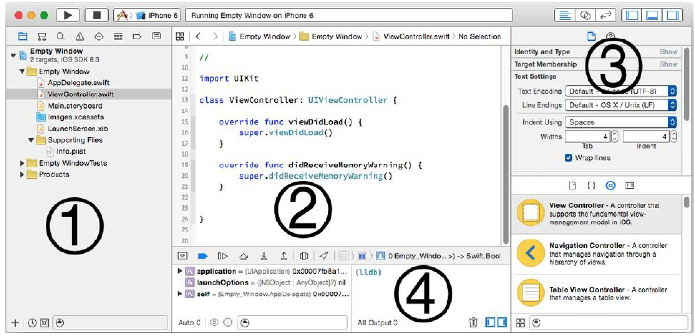

1. 左边是导航区（Navigator pane）。Show and hide it with View → Navigators → Show/Hide Navigator (Command-0).
2. 中间是编辑区。可以同时显示多个。
3. 右边是工具区（Utilities pane）。Show and hide it with View → Utilities → Show/Hide Utilities (Command-Option-0).
4. 底部是调试区。Show and hide it with View → Show/Hide Debug Area (Command-Shift-Y).

### 导航区

导航区上方工具栏按钮（如下图）分别是：工程导航、符号导航、搜索导航、问题导航、测试导航、调试导航、断电导航、报告导航：

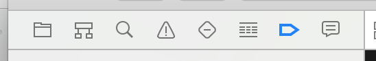

New in Xcode 6 is view debugging, which displays, and allows you to explore, your app’s view hierarchy. To switch to view debugging, choose Debug → View Debugging → Capture View Hierarchy (or click the Debug View Hierarchy button in the bar at the top of the Debug pane).

### 工具面板

The Utilities pane’s importance emerges mostly when you’re editing a .storyboard or .xib file (Chapter 7). But it can be useful also while editing code, because Quick Help, a form of documentation (Chapter 8), is displayed here as well, plus the Utilities pane is the source of code snippets (Chapter 9).

上半部分的功能取决于编辑器中的内容。下半部分显示四个库中的一个：文件模板库、代码片段库、对象库、媒体库。

### （未）编辑区

编辑器能记住显示的历史，通过Jump条上的返回按钮可以回到上次查看的内容。或者，用 Navigate → Go Back (Command-Control-Left)。

可以同时编辑多个文件，或显示一个文件的多个视图。可以用三种方式：assistants, tabs, 和 secondary windows。

**Assistants**

打开辅助（assistant）面板。点击工具条第二个按钮，*Show the Assistant editor*。要关闭辅助面板，可以单机工具条的第一个按钮，*Show Standard Editor*，或点击辅助面板右上角的关闭按钮。

## 6.3 工程文件及其依赖

Project navigator 中第一项表示工程自己。

工程导航中的项与物理位置：

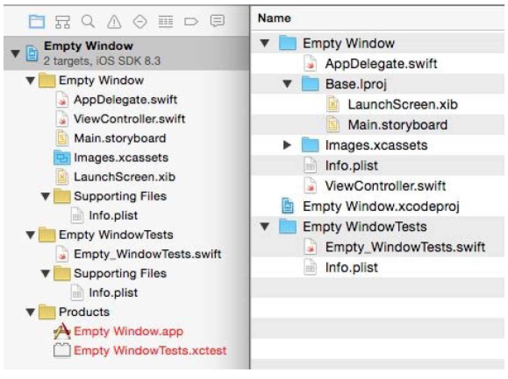

> 警告。不要在 Finder 中直接修改工程文件夹，除了打开。不要直接将文件放入工程文件夹。更不要删除任何项。不要重命名。

“组”这个概念是 Project 导航区中类似于文件夹的概念。**组** 并不一定对应磁盘上的文件夹，磁盘上的文件夹也不一定对应工程导航中的 **组**：

**Empty Window** 组对应于磁盘上的 **Empty Window** 文件夹。新增的核心文件，也应该放在 **Empty Window** 组；但不必须。

类似的 **Empty WindowTests** 组对应磁盘上的 **Empty WindowTests** 文件夹。这两个组对应工程的两个目标。见下一节。并不墙纸要求目标与工程导航中的组一一对应。

**Supporting Files** 组位于 Empty Window 组内；但在磁盘上，没有对应的文件夹。

工程导航中的 Images.xcassets 对应磁盘上一个特殊结构的文件夹。This is an asset catalog; you add images to the asset catalog in Xcode, which maintains that folder on disk for you. I’ll talk more about the asset catalog later in this chapter, and in Chapter 9.

你可以随意添加自己的组。组并不会影响应用的构建；它们只是工程导航上的便利。

**Products** 组的内容不对应任何文件夹的内容。工程中的每个目标会构建产生一个可执行 Bundle，到这些 Bundle 的应用列在 Products 组内。

Another conventional group is the **Frameworks** group, 列出代码依赖的框架。Your code does depend on some frameworks, but by default they are not listed in the Project navigator, and the Project navigator has no **Frameworks** group, because these frameworks are not explicitly linked into your build; instead, your code uses modules, which means that the `import` statements at the top of your files are sufficient to cause linkage to take place implicitly. 但若你想显式链接一个框架，它会列在 Project 导航区，and you might then create a Frameworks group, just to give that listing a nice place to live. I’ll discuss frameworks later in this chapter.

## 6.4 目标

目标描述如何构建一个产品。构建时，实际构建的是一个或多个目标。

在工程导航中选中 Empty Window 工程，在编辑器左侧你会看到两组内容：工程和一组目标。我们的 Empty Window 工程有两个目标：app 目标，称为 Empty Window；测试目标，称为 Empty WindowTests。

有些情况下你需要向工程添加更多目标。For example, new in Xcode 6 and iOS 8, you can write a framework as part of your iOS app; with a custom framework, you can factor common code into a single locus, and you can configure its privacy details as a namespace. A custom framework needs to be built, so it, too, is a target. Also new to Xcode 6 and iOS 8 are application extensions, such as today extensions (content to appear in the notification center) and photo editing extensions (custom photo editing interface to appear in the Photos app). These, too, are targets.

工程名和目标列表有两种显示方式（Figure 6-7）：编辑器的左边；或左边收起后，是弹出菜单。If, in the column or pop-up menu, you select the project, you edit the project; if you select a target, you edit the target. I’ll use those expressions a lot in later instructions.

Figure 6-7. Two ways of showing the project and targets
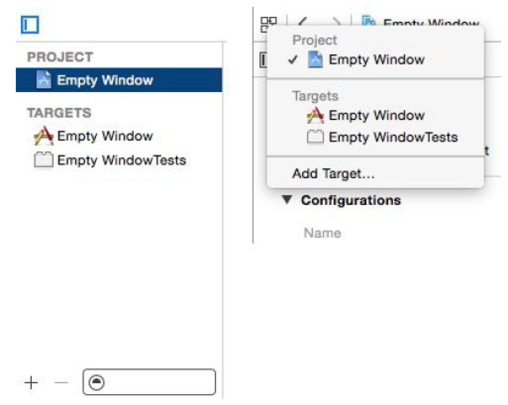

### Build Phases

编辑 Empty Window 阶段。点击编辑器上面的 **Build Phases**，如下图。

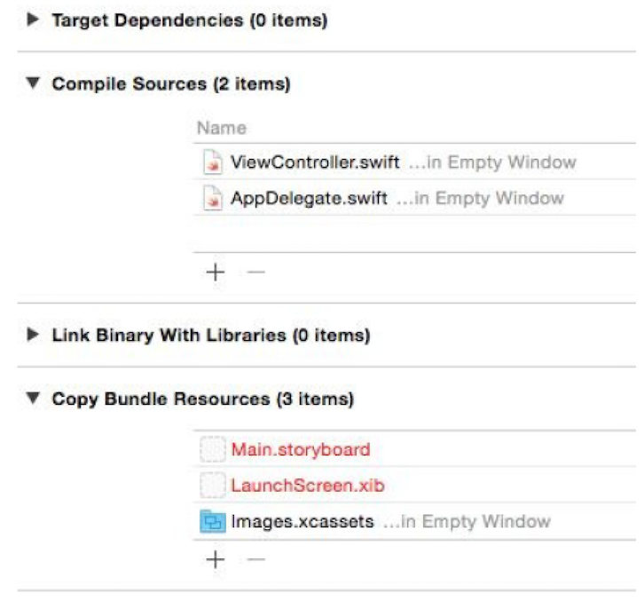

两个阶段有具体内容：

- **Compile Sources**：一般包含所有 .swift 文件。
- **Copy Bundle Resources**：This build phase currently applies to the asset catalog; any images you add to the **asset catalog** will be copied into your app as part of the catalog. 现在列出的还有 LaunchScreen.xib 和应用的 .storyboard 文件。拷贝不一定是原封不动的拷贝。Certain types of file are automatically treated in special ways as they are copied into the app bundle. For example, copying the asset catalog means that icons in the catalog are written out to the top level of the app bundle, and the asset catalog itself is transformed into a `.car` file; 拷贝 .storyboard 文件时会将其转换为 `.storyboardc` 文件，which is itself a bundle containing nib files.

可以手工编辑这些列表，有时也需要这样做。例如，若你有一个声音文件，按尚不在 *Copy Bundle Resources*，你可以把它从工程导航区拖到 *Copy Bundle Resources*。

It is possible that you might need to alter the *Link Binary With Libraries* build phase. Certain libraries, usually frameworks, are linked to the compiled code (now referred to, following compilation, as the binary), thus telling your code to expect those libraries to be present on the device when the app runs. Our Empty Window project does link to some frameworks, but it doesn’t use this build phase to do it; instead, it imports the frameworks as modules and the frameworks are linked automatically. However, in some cases you would need to link the binary with additional frameworks explicitly; I’ll talk about that later in this chapter.

A useful trick is to add a Run Script build phase, which runs a custom shell script late in the build process. To do so, choose *Editor → Add Build Phase → Add Run Script Build Phase*. Open the newly added Run Script build phase to edit the custom shell script. A minimal shell script might read:

	echo "Running the Run Script build phase"

The “Show environment variables in build log” checkbox causes the build process’s environment variables and their values to be listed in the build log during the Run Script build phase. This alone can be a reason to add a Run Script build phase; you can learn a lot about how the build process works by examining the environment variables.

### Build Settings

To see them, edit the target and click **Build Settings** at the top of the editor (Figure 6-9). Here you’ll find a long list of settings, most of which you’ll never touch.

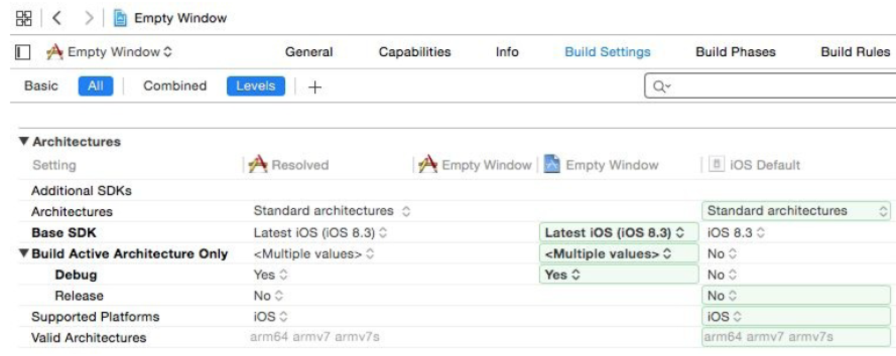

有两种显示方式：Combined 或 Levels；上图显示的是 Levels。它分别列出了最终值、目标的设置、工程的设置和内建的默认的设置。

你可以设置目标层面或工程层面的设置。选择一个设置，在工具面板中的 Quick Help 中会显示解释。For further details on what the various build settings are, consult Apple’s documentation, especially the *Xcode Build Setting Reference*.

### Configurations

There are actually multiple lists of build setting values — though only one such list applies when a particular build is performed. Each such list is called a configuration. Multiple configurations are needed because you build in different ways at different times for different purposes, and thus you’ll want certain build settings to take on different values under different circumstances.

默认有两种配置：

- Debug：用于开发阶段。
- Release：This configuration is used for late-stage testing, when you want to check performance on a device, and for archiving the app to be submitted to the App Store.

Configurations exist at all because the project says so. To see where the project says so, edit the project and click Info at the top of the editor (Figure 6-10). Note that these configurations are just names. You can make additional configurations, and when you do, you’re just adding to a list of names. The importance of configurations emerges only when those names are coupled with build setting values. Configurations can affect build setting values both at the project level and at the target level.

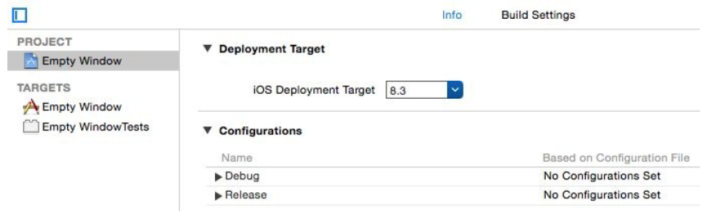

For example, return to the target build settings (Figure 6-9) and type “Optim” into the search field. Now you can look at the Optimization Level build setting (Figure 6-11). The Debug configuration value for Optimization Level is None: while you’re developing your app, you build with the Debug configuration, so your code is just compiled line by line in a straightforward way. The Release configuration value for Optimization Level is Fastest, Smallest; when your app is ready to ship, you build it with the Release configuration, so the resulting binary is faster and smaller, which is great for your users installing and running the app on a device, but would be no good while you’re developing the app because breakpoints and stepping in the debugger wouldn’t work properly.

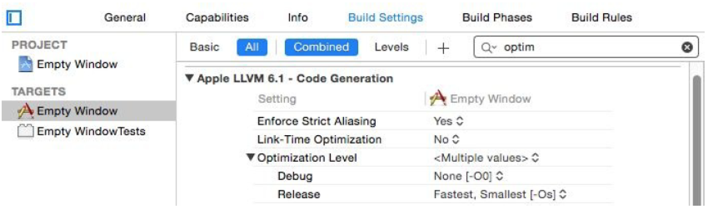

### （未）Schemes and Destinations

## 6.5 从工程到运行的应用

一个应用文件实际是一个特殊的文件，称为 package (and a special kind of package called a bundle)。在 Finder 中，通过 *Show Package Contents* 可以查看包的内容。

我们以 Empty Window 应用为例。在 Finder 中找到它；默认它在 Library/Developer/Xcode/DerivedData 下的某个文件夹。

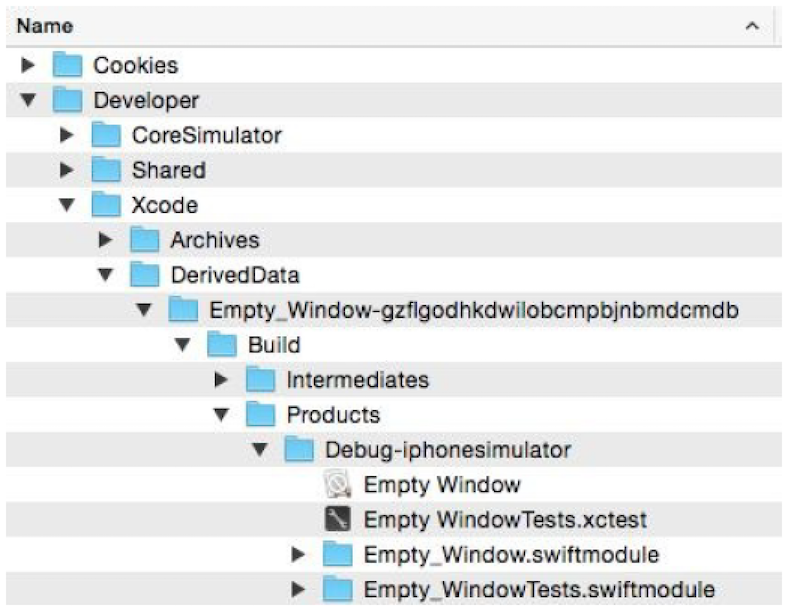

在 Finder 中，Control 并单击 Empty Window app，显示包内容，即可看到构建的结果：

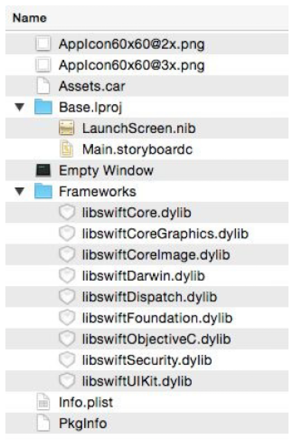

Think of the app bundle as a transformation of the project folder:

- **Empty Window**：应用编译后的代码。构建将 ViewController.swift 和 AppDelegate.swift 编译到一个文件，即应用的可执行文件。启动应用时，可执行代码链接到各种库，然后执行。
- **Main.storyboardc**：我们的故事板文件。构建使用 ibtool 工具将 Main.storyboard 编译成 .storyboardc 文件（a bundle of nib files）。
Main.storyboardc occupies the same subfolder location (inside `Base.lproj`) as Main.storyboard does in the project folder; as I said earlier, this folder structure has to do with localization (to be discussed in Chapter 9).
- **Assets.car 和 AppIcon60x60.png**：An asset catalog and a pair of icon files. In preparation for this build, I added some icon images and some other image resources to the original asset catalog, Images.xcassets. This file has been processed (using the `actool` command-line tool), resulting in a compiled asset catalog file (.car) containing any images that have been added to the catalog. 同时，图标文件被写到应用 bundle 的顶级目录。
- **Info.plist**：A configuration file in a strict text format (a property list file). It is derived from, but is not identical to, the project’s Info.plist. It contains instructions to the system about how to treat and launch the app. For example, the project’s Info.plist has a calculated bundle name derived from the product name, `$(PRODUCT_NAME)`; in the built app’s Info.plist, this calculation has been performed, and the value reads `Empty Window`. Also, in conjunction with the asset catalog writing out our icon files to the app bundle’s top level, a setting has been added to the built app’s Info.plist telling the system the name of those icon files.
- **Frameworks**：这里有9个框架。这些框架包含了完整的 Swift 语言。Other frameworks used by our app are built into the system, but not Swift. This packaging of the Swift frameworks into the app bundle permits Apple to evolve the Swift language rapidly and independently of any system version, and allows Swift to be backward compatible to iOS 7. 坏处是这些框架大约有 5 MB。
- **PkgInfo**：A tiny text file reading APPL????, signifying the type and creator codes for this app. The PkgInfo file is something of a dinosaur; it isn’t really necessary for the functioning of an iOS app and is generated automatically. You’ll never need to touch it.

### Build Settings

We have already talked about how build settings are determined. Xcode itself, the project, and the target all contribute to the resolved build setting values, some of which may differ depending on the build configuration. Before building, you, the programmer, will have specified a scheme; the scheme determines the build configuration, meaning the specific set of build setting values that will apply as this build proceeds.

### （未）Property List Settings

Your project contains a property list file that will be used to generate the built app’s Info.plist file. The file in the project does not have to be named Info.plist! The app target knows what file it is because it is specified in the Info.plist File build setting. For example, in our project, the value of the app target’s Info.plist File build setting has been set to Empty Window/Info.plist. (Take a look at the build settings and see!)

The property list file is a collection of key–value pairs. You can edit it, and you may need to do so. There are three main ways to edit your project’s Info.plist:

### Nib 文件

一个 nib 文件描述部分UI，以编译的形式。通过编辑 .storyboard 或 .xib 文件准备 nib；本质上，你在设计一些对象，当引用运行和 nib 文件加载后将要实例化的文件。

nib 文件通过编译产生（命令行工具 `ibtool`）。一个 .xib 文件产生一个 nib 文件；一个 .storyboard 文件产生一个 .storyboardc bundle，其中包含多个 nib 文件。This compilation takes place by virtue of the .storyboard or .xib file being listed in the app target’s Copy Bundle Resources build phase.

我们的工程只有一个故事板：Main.storyboard。它被当做应用的主故事板。不是因为名字，而是因为在`Info.plist` 文件中 “Main storyboard file base name” (UIMainStoryboardFile) 指向它（`“Main”`）。当应用启动时，故事板产生的第一个 nib 将自动加载，帮助创建应用的初始化界面。

### 附加资源

资源是嵌入到应用 bundle 的辅助文件，在应用运行时按需取用，如图片或声音。将这些资源添加到工程，并确保他们在 **Copy Bundle Resources** 列表中。在运行时如何访问这些资源一般取决于你的代码：一般来说可以把 bundle 看做一个文件夹。

要想工程添加资源，在工程导航中，选择 *File → Add Files to [Project]*，或将资源从 Finder 拖到工程导航中。接着出现以下对话框：

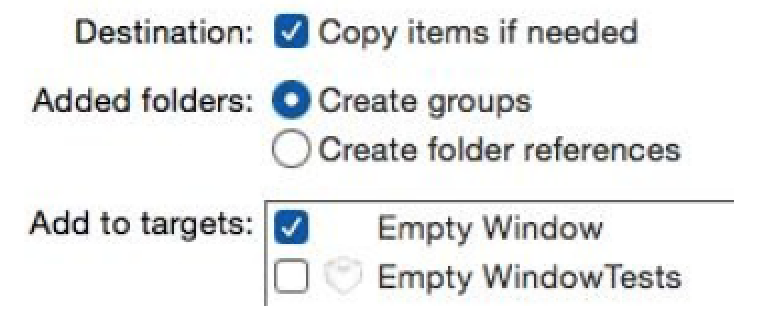

- Destination：基本上保持勾选，让资源拷贝进工程文件夹内。
- Added folders：进度添加到工程的是一个文件夹时才用到该选项；区别在于工程如何引用文件夹中的内容：
  - Create groups：文件夹名变成一个普通的 group；文件夹下的内容放入 group；但在 Copy Bundle Resources build phase，它们单独列出，独立拷贝到应用 bundle 的顶级。
  - Create folder references：The folder is shown in blue in the Project navigator (a folder reference); 在 Copy Bundle Resources 列表中以文件夹显示，即将整个文件夹一起拷贝到应用的 bundle。里面的内容不会被放到 bundle 最外层。
- Add to targets：添加到哪个或哪些目标的 *Copy Bundle Resources*。

用于 iOS 的图片资源一般以套图形式，适配多种屏幕分辨率。iOS 8 可能运行在单、双和三倍分辨率的屏幕上。你需要最多三个尺寸的图片。为适应框架的图片加载方法，这类资源需要遵守一个命名约定，如 listen.png, listen@2x.png, listen@3x.png。

手工命名多个 listen.png 版本容易出错。可以利用 asset catalog。这里使用默认的 catalog：`Images.xcassets`.

编辑默认 catalog，点击第一列下方的加号，选择 *New Image Set*。图片集默认名字是 *Image*。有三个槽位。将图片拖到响应的槽位。图片原来的名字不重要。图片会被自动拷贝到工程文件夹(inside the asset catalog folder)。将图片集的名字从 `Image` 改成 `listen`。后面使用时可以直接使用这个名字，不需要扩展名。

> asset catalog 中的项选中后，可以用 Attributes inspector (Command-Option-4) 查看信息，如原来的文件名。

### 代码文件与 App Launch Process

使用 *File → New → File* 创建文件时，可以选择 *Cocoa Touch Class* 或 *Swift File*。如果要创建 Cocoa 类的子类，前者更合适。如创建 `UIViewController` 的子类。

应用启动时，系统知道可执行代码在应用 bundle 哪里，因为应用 bundle 的 Info.plist 文件有一个键 “Executable file”（`CFBundleExecutable`）；默认，值来自环境变量 `EXECUTABLE_NAME`（这里是 “Empty Window”）。

#### 进入点

The trickiest part of the app launch process is getting started. Having located and loaded the binary, the system must call into it. But where? If this app were an Objective-C program, the answer would be clear. Objective-C 是 C，所以进入点是 main 函数。工程中有一个 main.m 文件包含 main 函数，如

```objc
int main(int argc, char *argv[]) {
    @autoreleasepool {
        return UIApplicationMain(argc, argv, nil, NSStringFromClass([AppDelegate class]));
    }
}
```

main 函数做了两件事：

- 启动内存管理环境：`@autoreleasepool` 及后面的大括号。
- 调用 `UIApplicationMain` 函数，which does the heavy lifting of helping your app pull itself up by its bootstraps and get running.

若是一个 Swift 应用，没有 main 函数。但 Swift 有一个特殊的特性：`@UIApplicationMain`。打开 `AppDelegate.swift` 文件：

```swift
@UIApplicationMain
class AppDelegate: UIResponder, UIApplicationDelegate {
```

This attribute essentially does everything that the Objective-C main.m file was doing: it creates an entry point that calls `UIApplicationMain` to get the app started.

Under certain circumstances, you might like to remove the `@UIApplicationMain` attribute and substitute a main file. You are free to do this. 文件可以是 Objective-C file 或 Swift 文件。这里创建一个 Swift 文件：`main.swift`。将其加入到目标。文件名必须是 `main.swift`，因为只有它可以将可执行代码放在文件顶层。The file should contain essentially the Swift equivalent of the Objective-C call to `UIApplicationMain`, like this:

```swift
import UIKit
UIApplicationMain(Process.argc, Process.unsafeArgv, nil, NSStringFromClass(AppDelegate))
```

#### UIApplicationMain

Regardless of whether you write your own main.swift file or you rely on the Swift `@UIApplicationMain` attribute, you are calling `UIApplicationMain`. This one function call is the primary thing your app does. Your entire app is really nothing but a single gigantic call to `UIApplicationMain`! Moreover, `UIApplicationMain` is responsible for solving some tricky problems as your app gets going. Where will your app get its initial instances? What instance methods will initially be called on those instances? Where will your app’s initial interface come from? 下面列出 `UIApplicationMain` 都做了哪些事件：

1. `UIApplicationMain` 创建应用的第一个对象：一个共享的应用对象。在代码中可以通过 `UIApplication.sharedApplication()` 访问。调用 `UIApplicationMain` 时传入的第三个参数（一个字符串）指定了这个共享的对象是哪个类的对象。若传 `nil`（多数情况是这样），使用默认类 `UIApplication`。若你创建了 `UIApplication` 的子类，则在这里传入，如`NSStringFromClass(MyUIApplicationSubclass)`。
2. `UIApplicationMain` 创建应用的第二个对象：应用的代理。每个应用都有代理。调用 `UIApplicationMain` 时传入的第四个参数（也是一个字符串），指定代理是哪个类的对象。`@UIApplicationMain` 特性默认就放在 AppDelegate.swift 文件中的 `AppDelegate` 类上。
3. 若 Info.plist 文件指定了一个主故事板。`UIApplicationMain` 会加载它并在其中寻找起始的视图控制器（或故事板的进入点）；然后它会实例化这个视图控制器，成为应用的第三个对象。在我们的 Empty Window 工程，使用 Single View Application 模板，初始视图控制器是 `ViewController`。
4. 若有一个主故事板，`UIApplicationMain` 将创建应用的窗口，这是应用的第四个对象。对象的类是 `UIWindow`（或者，应用代理可以换用 `UIWindow` 子类的对象）。窗口对象会赋给引用代理的 `window` 属性；初始视图控制器会赋给窗口对象的 `rootViewController` 属性。
5. `UIApplicationMain` 现在开始调用应用代理的一些方法，包括 `application:didFinishLaunchingWithOptions:` （或 `application:willFinishLaunchingWithOptions:`，若存在）。在 `application:didFinishLaunchingWithOptions:` 方法中你可以初始化值及进行其他初始化；但不要做耗时的事情，因为此时界面尚未显示。
6. 若有主故事板，此时 `UIApplicationMain` 会让界面显示出来：调用 `UIWindow` 对象的 `makeKeyAndVisible` 方法。
7. 窗口现在要出现了。窗口让根视图控制器准备它的主视图，将主视图显示在窗口中。若视图来自 `.storyboard` 或 `.xib` 文件，相应的 nib 文件会加载并实例化。

现在应用就启动并对用户可见了。`UIApplicationMain` 会一直运行，响应用户操作，处理事件循环等等。

#### 没有故事板的应用

应用可以没有主故事板。此时，创建窗口对象，给它一个根视图控制器，调用 `makeKeyAndVisible` 等操作需要通过代码完成。

实验。创建一个新的 iPhone 工程，仍选 Single View Application 模板。创建后：

1. 编辑目标。在 General 面板中，select “Main” in the Main Interface field and delete it (and press Tab to set this change).
2. 删除 Main.storyboard 和 ViewController.swift 文件。
3. 清空 AppDelegate.swift 的代码。

在 AppDelegate.swift 总创建显示窗口：

Example 6-1. An App Delegate class with no storyboard

```swift
import UIKit
@UIApplicationMain
class AppDelegate : UIResponder, UIApplicationDelegate {
    var window : UIWindow?
    func application(application: UIApplication, didFinishLaunchingWithOptions launchOptions: [NSObject: AnyObject]?) -> Bool {
        self.window = UIWindow(frame:UIScreen.mainScreen().bounds)
        self.window!.backgroundColor = UIColor.whiteColor()
        self.window!.makeKeyAndVisible()
        return true
    }
}
```

结果是一个空的白色的窗口：因为 `backgroundColor` 设为白色。

此时应用尚未有根视图控制器。下面创建一个视图控制器及 `.xib` 文件包含视图。设置根视图控制器要放在 `makeKeyAndVisible()` 调用之前。

```swift
self.window!.rootViewController = UIViewController()
```

创建新文件。模板选 Cocoa Touch Class。命名为 `MyViewController`，父类为 
`UIViewController`。一定要勾选 *Also create XIB file*。保存后会创建两个文件 `MyViewController.swift` 和 `MyViewController.xib`。

在应用代理的 `application:didFinishLaunchingWithOptions:` 方法中，修改根视图控制器：

```swift
self.window!.rootViewController = MyViewController(nibName:"MyViewController", bundle:nil)
```

### （未）框架与 SDKs

你使用的多数框架是 Apple 自己的框架。这些框架已安装在设备上（ `/System/Library/Frameworks` ）。

在电脑上运行时也需要这些框架。iOS 设备上的 `System/Library/Frameworks` 在电脑上也有一份，在 Xcode 中。这些拷贝称为 SDK。What SDK is used depends upon what destination you’re building for.

构建代码时，链接到 iPhone SDK，在 `Xcode.app/Contents/Developer/Platforms/iPhoneOS.platform/Developer/SDKs/iPhoneOS.sdk`。运行时链接到设备上的框架，在设备的 
`/System/Library/Frameworks/`。


代码中可以使用 `NSString`，因为引入了 `NSString` 头。实际上你的代码只引入了 `UIKit` 头，它又引入了 `Foundation` 头，它又引入了 `NSString` 头。

```swift
import UIKit
```

If you Command-click `UIKit`, you are taken to Swift’s rendering of the `UIKit` header. There at the top is import `Foundation`. If you look at the `Foundation` header and scroll down, you’ll see import `Foundation.NSString`. And if you look in the `NSString` header, you’ll see the declaration of the `rangeOfString:` method.

使用框架包含两部分：引入库的头，链接到库。

As your code is built, it is linked to any needed frameworks, in accordance with the list of frameworks in the target’s *Link Binary With Libraries* build phase.

但我们的工程没有使用显式的链接。查看 app 目标下的 *Link Binary With Libraries* build phase，会发现它是空的。这是因为 Swift 使用模块，模块可以进行自动的链接。In Objective-C, both those features are optional, and are governed by build settings. But in Swift, use of modules and autolinking is automatic.

Modules are cached information stored on your computer at Library/Developer/Xcode/DerivedData/ModuleCache. Merely opening a Swift project causes any imported modules to be cached here. If you drill down into the ModuleCache folder, you’ll see the modules for over a dozen frameworks and headers (.pcm files). Swift 使用模块简化导入和链接过程，并提高编译性能。

Moreover, because autolinked frameworks are not listed in the Project navigator, their headers are not navigable in the Project navigator (whereas the headers of explicitly linked frameworks are), and their headers are not searchable in the Project navigator (whereas the headers of explicitly linked frameworks are, by using a search scope of “within workspace and frameworks”).

Fortunately, if you miss those features, there’s no harm in linking to a framework
manually, to create a listing for it in the Project navigator, even if that framework is also being autolinked.

有时必须手工链接一个框架。例如，若你需要在界面上使用 `MKMapView` (Map Kit View)。You can configure this in a .storyboard or .xib file, 但运行时，应用汇崩溃，报错：“Could not instantiate class named MKMapView”。原因是 nib 加载后，发现它需要 `MKMapView`，但它不知道 `MKMapView` 是什么。`import MapKit` 也不解决问题；解决方法是手工链接 `MapKit` 框架：

1. Edit the target and look at the Build Phases pane.
2. Under Link Binary With Libraries, click the Plus button.
3. A list of available frameworks appears (along with dynamic libraries). Scroll down to `MapKit.framework`, select it, and click Add.

New in iOS 8 and Xcode 6, you can also create your own framework as part of your
project. A framework is a module, so this can be a useful way to structure your code, as I described in Chapter 5 when discussing Swift privacy. To make a new framework:

1. Edit the target and choose Editor → Add Target.
2. On the left of the dialog, under iOS, select Framework & Library; on the right, select Cocoa Touch Framework. Click Next.
3. Give your framework a name; let’s call it Coolness. You can pick a language, but I’m not sure this makes any difference, as no code files will be created. The Project and Embed pop-up menus should be correctly set by default. Click Finish.

A new Coolness framework target is created in your project, along with a corresponding test target. If you now add a .swift file to the Coolness target, and inside it define an object type and declare it `public`, and if you `import Coolness` back in one of your main app target’s files, such as `AppDelegate.swift`, that file will be able to see the public members of the Coolness framework.

## （未）6.6 Renaming Parts of a Project

## （未）6.7 Bilingual Targets