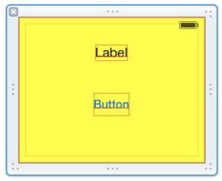
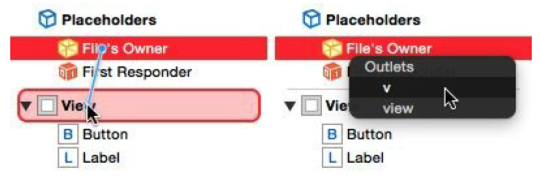

[toc]

# 7 Nib 管理

获得实例的第三种方式：加载一个 nib。nib 是一个文件，包含一系列创建和配置实例的指令。加载一个 nib，即通过这些指令创建和配置实例。Nib 通过 Xcode 的图形界面编辑。虽然 nib 做的事情通过代码也能做，无论是实例化 UIView 或其子类，配置、布局等，nib 不是必需的。有时通过代码产生UI对象更方便。看情况使用。

视图控制器（UIViewController）能与 nib 很好的协作：它会**自动**加载 nib，获取产生的实例，将它们放到UI中。

> nib 过去是 “NeXTStep Interface Builder” 的缩写。nib 编辑器是一个独立的应用，称为 Interface Builder。现在 nib 编辑器可以编辑 **.storyboard** 文件或 **.xib** 文件；它们在编译阶段被编译成 nib 文件（第6章）。

## （未）7.1 Nib编辑器界面

## 7.2 Nib 的加载

nib 加载后，应用便可使用其中的实例。
nib 加载需要时间，因此启动时加载尽量少的 nib 减少启动时间。
并没有卸载。
nib 文件中产生实例的指令，每次加载时都执行。一个 nib 文件可以被加载多次。例如一个 nib 文件表示一个表格行。

### nib 何时被加载

**故事板实例化一个视图控制器**

一个故事板是多个场景的集合。每个场景起始于一个视图控制器。当需要某个视图控制器时，包含该视图控制器的 nib 被加载。

多数情况下，故事板会自动创建视图控制器。也可以手工从故事板实例化一个视图控制器。To do so, you start with a `UIStoryboard` instance, and then:

- You can instantiate the storyboard’s initial view controller by calling `instantiateInitialViewController`.
- You can instantiate any view controller whose scene is named within the storyboard by an identifier string by calling `instantiateViewControllerWithIdentifier:`.

**视图控制器从 nib 加载它的主视图**

视图控制器有一个主视图。获取它有多种方式。其中一种是从 nib 加载。

若视图控制器属于故事板的一个场景，且场景位于故事板的画布中（一般是这样），会涉及**两个** nib：包含视图控制器的 nib，包含主视图的 nib。这两个 nib 都是自动加载的。

通过其他方式实例化的视图控制器，也可以有一个关联的 nib 文件（`.xib` 文件产生的），包含控制器的主视图。此时，视图控制器也会自动加载关联的 nib，取出其中的主视图。

视图控制器通过 nib 文件名，与它的主视图的 nib 文件的关联。在第6章，我们曾在代码中配置这种管理，使用 `UIViewController` 的初始化器 `init(nibName:bundle:)`：

```swift
self.window!.rootViewController = MyViewController(nibName:"MyViewController", bundle:nil)
```

于是关联的 nib 文件名是 `MyViewController.xib`。

**代码显式加载一个 nib 文件**

若 nib 文件来自 `.xib` 文件，代码可以手工加载。调用下面方法中的某个：

- `loadNibNamed:owner:options:`：`NSBundle` 的实例方法。Usually, you’ll direct it to `NSBundle.mainBundle()`.
- `instantiateWithOwner:options:`：`UINib` 的实例方法。The nib in question was specified when `UINib` was instantiated and initialized with `init(nibName:bundle:)`.

To specify a nib file while the app is running actually requires two pieces of information — its name and the bundle containing it. And indeed, a view controller has not only a `nibName` property but also a `nibBundle` property, and the methods for specifying a nib, such as `init(nibName:bundle:)`, have a `bundle:` parameter that allows you specify the bundle. In real life, however, the bundle will be the app bundle (or `NSBundle.mainBundle()`, which is the same thing); this is the default, so there will be no need to specify a bundle — and you’ll pass nil instead of supplying an explicit bundle.

### 手工加载 nib

In real life, you’ll probably configure your app so that most nib loading takes place automatically, in accordance with the various mechanisms and situations I’ve just outlined. But in order to understand the nib-loading process, it will be useful for you to practice loading a nib manually. Let’s do that.

First we’ll create and configure a `.xib` file in our Empty Window project:

1. In the Empty Window project, choose File → New → File and specify an iOS → User Interface → View file. This will be a `.xib` file containing a UIView instance. Click Next.
2. In the Save dialog, accept the default name, View, for the new .xib file. Click Create.
3. We are now back in the Project navigator; our `View.xib` file has been created and selected, and we’re looking at its contents in the editor. Those contents consist of a single `UIView`. It’s too large, so select it and, in the Attributes inspector, change the Size pop-up menu, under **Simulated Metrics**, to **Freeform**. Handles appear around the view in the canvas; drag them to make the view smaller.
4. Populate the view with some arbitrary subviews, dragging them into it from the Object library. You can also configure the view itself; for example, in the Attributes inspector, change its background color (Figure 7-7).



Our goal now is to load this nib file, manually, in code, when the app runs. Edit ViewController.swift and, in the `viewDidLoad` method body, insert this line of code:

```swift
NSBundle.mainBundle().loadNibNamed("View", owner: nil, options: nil)
```

Build and run the app. Hey, what happened? Where’s the designed view from View.xib? Did our nib fail to load? No. Our nib did not fail to load. We loaded it! But we’ve omitted two further steps.

Remember, there are three tasks you have to perform when you load a nib:

1. Load the nib.
2. Obtain the instances that it creates as it loads.
3. Do something with those instances.

We performed the first task — we loaded the nib — but we didn’t obtain any instances from it. Thus, those instances were created and then vanished in a puff of smoke! In order to prevent that, we need to capture those instances somehow. The call to `loadNibNamed:owner:options:` returns an array of the top-level nib objects instantiated from the loading of the nib. Those are the instances we need to capture! We have only one top-level nib object — the UIView — so it is sufficient to capture the first (and only) element of this array. Rewrite our code to look like this:

```swift
let arr = NSBundle.mainBundle().loadNibNamed("View", owner: nil, options: nil)
let v = arr[0] as! UIView
```

We have now performed the second task: we’ve captured the instances that we created by loading the nib. The variable `v` now refers to a brand-new UIView instance. But still nothing seems to happen when we build and run the app, because we aren’t doing anything with that UIView. That’s the third task. Let’s fix that by doing something clear and dramatic with the UIView: we’ll put it into our interface! Rewrite our code once again:

```swift
let arr = NSBundle.mainBundle().loadNibNamed("View", owner: nil, options: nil)
let v = arr[0] as! UIView
self.view.addSubview(v)
```

Build and run the app. There’s our view! This proves that our loading of the nib worked: we can see, in our running app’s interface, the view that we designed in the nib (Figure 7-8).

## （未）7.3 Connections

A connection is something in a nib file. It unites two nib objects, running from one to the other. 连接有方向。两个对象分别称为源和目标。

有两种连接：outlet 连接和 action 连接。

### 7.3.1 Outlets

When a nib loads and its instances come into existence, there’s a problem: those instances
are useless unless you can get a reference to them. In the preceding section, we solved that
problem by capturing the array of top-level objects instantiated by the loading of the nib.
But there’s another way: use an outlet. This approach is more complicated — it requires
some advance configuration, which can easily go wrong. But it is also more common,
especially when nibs are loaded automatically.

一个 outlet 是一个有名字的连接，核心是一个字符串。当 nib 加载后，源对象中有一个属性，名字就是 outlet 的名字，值是目标对象。

例如，若 nib 中有一个 `Dog` 对象和一个 `Person` 对象。`Dog` 对象有一个 `master` 属性。一个名叫 `master` 的 从 `Dog` 对象到 `Person` 对象。则 nib 加载后，两个对象被创建，`Person` 对象被赋给 `Dog` 对象的 `master` 属性。

> 源对象中的属性不是自动创建的，要手工提前创建好。

### 7.3.2 Nib 的所有者

To use an outlet to capture a reference to an instance created from a nib, we need an outlet that runs from an object outside the nib to an object inside the nib. This seems metaphysically impossible — but it isn’t. The nib editor permits such an outlet to be created, using the *nib owner object*. First, I’ll tell you where to find the *nib owner object* in the nib editor; then I’ll explain what it is:

- 在故事板场景中，nib 所有者是顶层的视图控制器。It is the first object listed for that scene in the document outline, and the first object shown in the scene dock.
- 在 `.xib` 文件中，nib 所有者是一个代理对象。It is the first object shown in the document outline or dock, and is listed under Placeholders as the File’s Owner.

nib 编辑器中的 nib 所有者对象，在 nib 加载时已经存在了。但 nib 加载机制如何知道哪个对象是 nib 所有者对象。需要在加载时告诉它：

- If your code loads the nib either by calling `loadNibNamed:owner:options:` or by calling `instantiateWithOwner:options:`, you specify an owner object as the `owner:` argument.
- 若视图控制器自动加载 nib，视图控制器实例将自己注册为所有者对象。

回到 Empty View 应用。We’re already loading the View nib in code in ViewController.swift. This code is running inside a `ViewController` instance. So we’ll use that instance as the nib owner.

1、首先创建实例属性：

```swift
class ViewController: UIViewController {
	@IBOutlet var v : UIView! = nil
```

The `@IBOutlet` attribute is a hint to Xcode to allow us to create the outlet in the nib editor.

2、编辑 View.xib。Our first step must be to ensure that the nib owner object is designated as a `ViewController` instance. Select the File’s Owner proxy object and switch to the *Identity inspector*. In the first text field, under Custom Class, set the Name value as `ViewController`. Tab out of the text field and save.

3、Now we’re ready to make the outlet! In the document outline, hold down the Control key and drag from the File’s Owner object to the View; a little line follows the mouse as you drag. Release the mouse. A little HUD (heads-up display) appears, listing possible outlets we are allowed to create (Figure 7-11). There are two of them: `view` and `v`. Click `v` (not view!).

4、最后需要修改加载 nib 的代码。We no longer need to capture the top-level array of instantiated objects. That’s the whole point of this exercise! Instead, we’re going to load the nib with ourself as owner. This will cause our `v` instance property to be set automatically, so we can proceed to use it immediately:

```swift
NSBundle.mainBundle().loadNibNamed("View", owner: self, options: nil)
self.view.addSubview(self.v)
```

Figure 7-11. Creating an outlet


Build and run. It works! The first line loaded the nib and set our `v` instance property to the view instantiated from the nib. Thus, the second line can display `self.v` in the interface, because `self.v` now is that view.

Let’s sum up what we just did. Our preparatory configuration was a little tricky, because it was performed in two places — in code, and in the nib:

- In code, there must be an instance property in the class whose instance will act as owner when the nib loads. (Not only did we create the property, but we also marked it as `@IBOutlet`.)
- In the nib editor, the class of the nib owner object must be set to the class whose instance will act as owner when the nib loads.
- In the nib editor, an outlet must be created, with the same name as the property, from the nib owner to some nib object. (This will be possible only if the other two configurations were correctly performed.)

If all those things are true, then, when the nib loads, if it is loaded with an owner of the correct class, that owner’s instance property will be set to the outlet destination.

### 7.3.3 自动配置的 nib

有时 nib 的所有者是自动配置的。

An important example is how a view controller gets its main view. A view controller has a `view` property. The actual view will typically come from a nib. So the view controller instance needs to act as owner when that nib loads, and there needs to be a `view` outlet from the nib owner object to that view. If you examine an actual nib that holds a view controller’s main view, you’ll see that this is, in fact, the case.

Look at our Empty Window project. Edit Main.storyboard. It has one scene, whose nib owner object is the View Controller object. Select the View Controller in the document outline. Switch to the *Identity inspector*. It tells us that the nib owner object’s class is indeed `ViewController`!

Now, still with the View Controller in the document outline selected, switch to the Connections inspector. It tells us that there is indeed an outlet connection from the View Controller to the View object, and that this is outlet is indeed named `"view"`! If you hover the mouse over that outlet connection, the View object in the canvas is highlighted, to help you identify it.

That explains completely how this view controller gets its main view! The storyboard scene associates this view controller instance with the view nib containing this view. When the view controller needs its main view (because that view is about to be displayed in the interface), the view nib loads — with the view controller as owner. Thus, the view controller’s view property is set to the view that we design here. The view is then displayed in the interface — and that’s why the design that you construct here actually appears in the running app.

The same sort of thing is true in our Truly Empty project from Chapter 6. Edit
MyViewController.xib. The nib owner object is the File’s Owner proxy object. Select the File’s Owner object. Switch to the Identity inspector. It tells us that the nib owner object’s class is MyViewController! Switch to the Connections inspector. It tells us that there is an outlet connection to the View object, called `"view"`!

That explains how this view controller gets its main view. We told this view controller where to find its nib when we instantiated it by saying `MyViewController(nibName:"MyViewController", bundle:nil)`. But the nib itself was already correctly configured, because Xcode set it up that way when we created the `MyViewController` class and checked the “Also create XIB file” checkbox. The view controller loads the nib with itself as owner, and the outlet works: the view from the nib file becomes the view controller’s view, and appears in the interface.

### 7.3.4 配置错误的 Outlet


