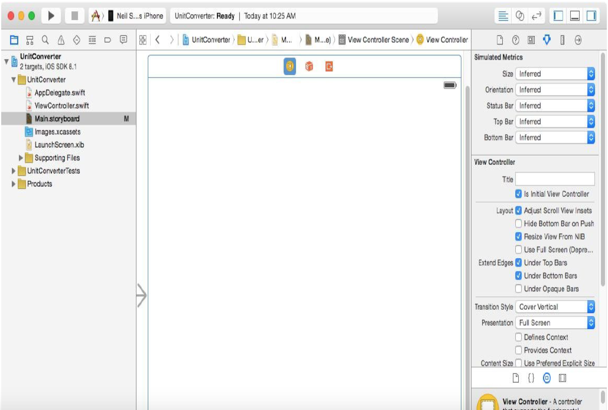
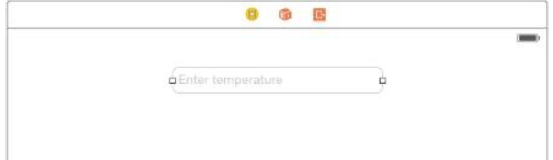
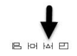
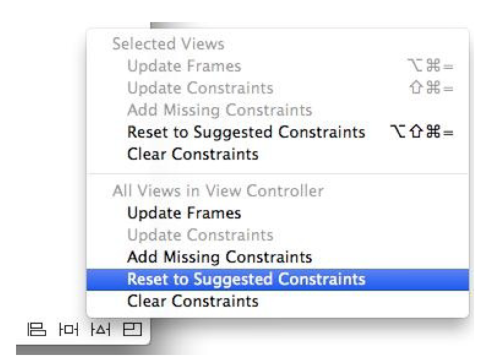
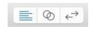
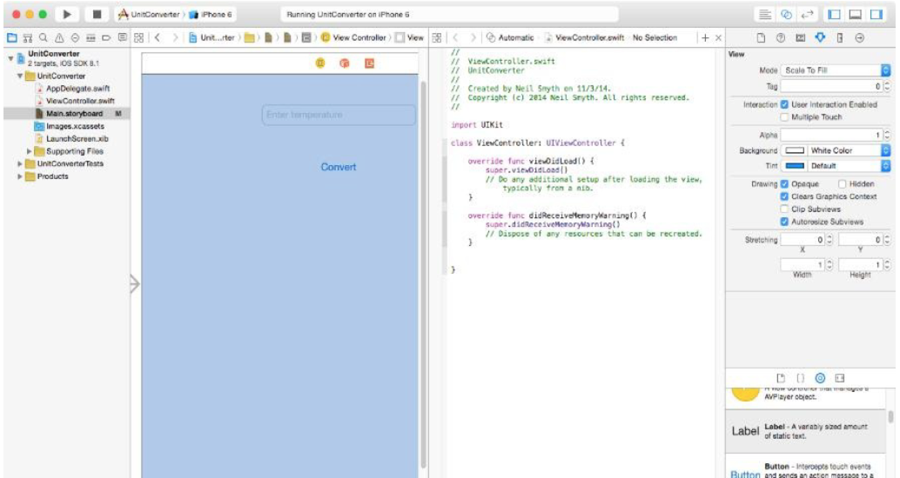
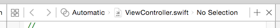
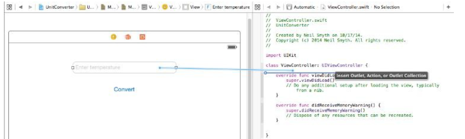
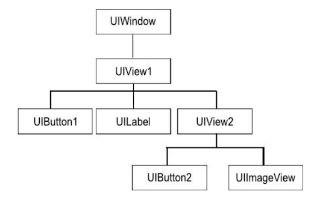

[toc]

# 15 iOS 8 应用开发架构

> 关键点：视图、视图控制器、Action、Outlet。

**用户界面（视图）一般通过 Interface Builder 工具构建**，视图控制器和模型代码通过代码编辑器用 Swift 编写。本节介绍 **视图** 与 **视图控制器** 之间如何交互。

当用户与视图上的对象交互时 —— 例如，触摸后释放按钮 —— 会触发一个事件。更具体的说，定义当用户与一个视图对象交互时，视图控制器的哪个方法要被调用。这叫 Target-Action 模式。

将一个 视图对象 与 视图控制器对象中特定方法 关联，需要通过 `Action`。Action 是视图控制器对象中的一个方法，供 **事件** 在视图对象上触发时调用。Action 方法通过 **IBAction** 关键字声明。

与 Action 相对应的是 **Outlet**。Action 让视图对象调用控制器对象的一个方法。Outlet 与此相反，允许控制器的方法访问一个视图对象的属性。例如，若视图控制器需要设置 UILabel 的文本。先需要用 **IBOutlet** 关键字定义一个 Outlet，用其引用视图对象。

# 16 创建一个交互的 App

本章演示视图-控制器关系，及 Target-Action 模式。

样例应用：单位转换，华氏转摄氏。

新建一个工程，模板选择 iOS -> Application-> Single View Application。
产品名：UnitConverter。
Devices 选 Universal（这样UI适于部署到所有iPhone和iPad屏幕尺寸）。
语言选 Swift。

## 16.2 创建UI

在自动产生的故事板 Main.storyboard 中设计 UI。打开该文件，将其加载到 Interface Builder。



从对象库面板，拖一个 Text Field 到设计区。调整大小，见下图：



在 Attributes Inspector，输入文本框的 Placeholder：Enter temperature。修改 Keyboard Type 为 Numbers and Punctuation。

添加按钮。从对象库拖 Button 对象到视图。双击编辑其文本：Convert。

显示结果的标签。拖一个 Label 对象到视图，放在按钮下。修改其 Alignment 特性，令其居中。双击，删掉其内容。

为了适应各种不同iPad和iPhone，需要添加一些 **Auto Layout constraints**。点击当前场景的背景，点击 *Resolve Auto Layout Issues* 按钮：



From the menu, select the *Reset to Suggested Constraints* option listed under All Views in View Controller:



现在UI就设计好了。

点击工具栏中的运行按钮，运行在模拟器中。

## 16.4 添加 Actions 和 Outlets

Action 具体形式是视图控制器中的一个**方法**。

先创建 `UIViewController` 的一个子类。创建工程时，Xcode会自动创建一个它的子类，名叫`ViewController`，在源文件`ViewController.swift`。

```swift
import UIKit
class ViewController: UIViewController {
    override func viewDidLoad() {
        super.viewDidLoad()
        // Do any additional setup after loading the view, typically from a nib.
    }
    override func didReceiveMemoryWarning() {
        super.didReceiveMemoryWarning()
        // Dispose of any resources that can be recreated.
    }
}
```

添加 outlets 和 action，可以手工声明。但更简单的方法是利用 Xcode Assistant Editor：打开 Main.storyboard，显示 Assistant Editor（View -> Assistant Editor -> Show Assistant Editor menu）。或直接点击工具栏右侧，下图中间的按钮：



In the event that multiple Assistant Editor panels are required, additional tiles may be added using the *View -> Assistant Editor -> Add Assistant Editor* menu option. 默认，编辑面板出现在 Interface Builder 面板右侧：



Assistant Editor 默认处于 Automatic 模式，根据 Interface Builder 中选中的元素，自动显示正确的源码。若没有正确显示，可以通过编辑面板顶部的工具栏选择文件。



创建第一个 outlet，按住Ctrl将文本框拖到到 ViewController.swift 中，放在类声明下面：



释放后，在弹出的对话框中，名字输入 `tempText`。Connection 要选 **Outlet**。产生的代码：

```swift
class ViewController: UIViewController {

    @IBOutlet weak var tempText: UITextField!

    ...
```

第二个 outlet，从 Label，命名为 `resultLabel`。

下面创建用户点击按钮后执行的 action。方法也是将按钮拖到源文件，`viewDidLoad` 方法下面。Connection 要选 **Action**。命名为 `convertTemp`，事件类型选 **Touch Up Inside**。创建好方法后，填充其内容如下：

```swift
@IBAction func convertTemp(sender: AnyObject) {
    let fahrenheit = (tempText.text as NSString).doubleValue
    let celsius = (fahrenheit - 32)/1.8
    let resultText = "Celsius \(celsius)"
    resultLabel.text = resultText
}
```

`sender` 是触发事件的对象（这里是按钮）。`UITextField` 对象的 `text` 属性是 `NSString` 类型的。 `NSString` 类的实例**方法** `doubleValue` 可以将字符串转化为数字。

现在可以运行了。

## 16.6 隐藏键盘

最后一步，隐藏键盘的机制：用户触摸背景或按下键盘回车键后，应收起键盘。

用户触摸背景的处理，在试图控制器中实现 `touchesBegan` 事件处理器：

```swift
override func touchesBegan(touches: Set<NSObject>, withEvent event: UIEvent) {
    tempText.endEditing(true)
}
```

第二步，按下回车键隐藏键盘。按住Ctrl键点击文本框，拖到 `viewDidLoad` 方法下面。修改 connection 为 **Action**，命名为 `textFieldReturn`，事件为 **Did End on Exit event**。填充事件处理器：

```swift
@IBAction func textFieldReturn(sender: AnyObject) {
	sender.resignFirstResponder()
}
```

The first responder is the object with which the user is currently interacting (in this instance, the virtual keyboard displayed on the device screen).

运行。

# 17 理解 iOS 8 视图、窗口和视图层级

所有的视图都是 UIKit `UIView` 的子类，如 `UILabel`、 `UIImageView`、 `UIButton`、 `UITextField` 等。

另一个重要的视图是 `UIWindow` 类。它也是 `UIView` 的子类。可以手工创建，但一般由 Interface Builder 自动创建。

一个UI层级的示例：



At the top of this hierarchy sits the `UIWindow` object.

视图层级决定当用户与UI交互时，事件如何被处理；定义了所谓 **responder chain**。例如，当子视图收到事件但不能处理时，事件会被向上传递。若上面的也不能处理，就继续向上传递。

## 17.4 视图类型

UIKit中的视图分为下面几类：

- `UIWindow`：视图层级的根视图。
- 容器视图：例如，`UIScrollView` 类为 `UITableView` 和 `UITextView` 提供滚动能力。
- 控件：不仅提供信息也相应交互。它们都继承 `UIControl` 类（它自己是 `UIView` 的子类），包括按钮、文本框。
- 显示视图：显示，但不相应用户交互。包括 `UILabel` 和 `UIImageView`。
- 文本和Web视图： `UITextView` 和 `UIWebView` 类都提供显示格式化文本的能力。
- 导航视图和Tab条：一般由 Interface Builder 创建。
- Alert 视图


