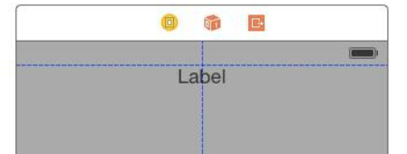
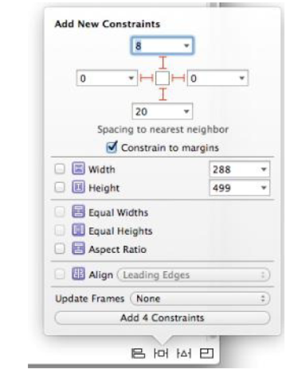
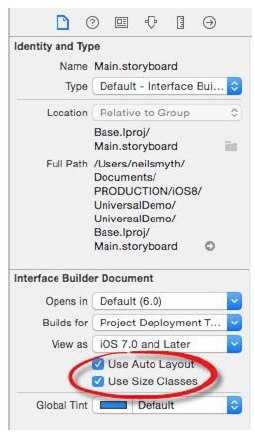
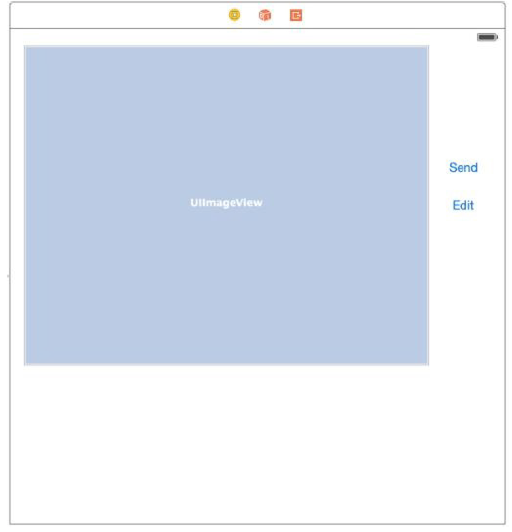

[toc]

# 18 iOS 8 Auto Layout 介绍

iOS 6 之前，布局涉及概念 **autosizing**。Autosizing 使用包括一些 springs 和 struts，逐个视图定义，子视图相对于父视图如何定位和设置大小。这种方法的缺陷是，需要大量代码处理朝向等各种变化。

iOS 6 最重要的特性之一是引入了 **Auto Layout**。

## 18.1 Auto Layout 概述

Auto Layout 的目的是对布局的描述独立于设备大小和朝向。实现方式是通过视图之间的约束。例如，一个按钮，约束1，定位在父容器水平中央；约束2，按钮的底边距离父容器的底边固定距离。

与 autosizing 不同的是，Auto Layout 约束不仅可以加在子视图或父视图之间。也可以在子视图之间。例如，可以让两个按钮总是相隔固定距离，不管朝向或大小改变。约束甚至可以跨父视图边界，例如，两个具有不同父视图的视图之间可以对齐。

约束可以是显式的或可变的（或者用自动布局的语义讲是相等或不相等）。例如，按钮的宽度约束，显式约束让按钮宽70点：`myLabel.width = 70`。若按钮要显示动态内容，这个约束可能有问题 —— 当内容过长的时候。另一种约束方式：`myLabel.width <= 800`。

约束是独立的。一个视图的两个约束可能有冲突。解决办法是分配不同优先级。优先级取值0到1000。1000表示必需的约束。

## 18.2 对齐矩形（Alignment Rects）

约束作用于视图的内容，而不是视图显示的框架（frame）。该内容被称为视图的对齐矩形（alignment rect）。如两个视图居中对齐的约束，基于两个视图的 **对齐矩形**，不管视图 frame 的 padding。

## 18.3 本质的内容大小（Intrinsic Content Size）

有些视图具有本质的内容大小（intrinsic content size）。它是视图决算出的最佳大小。例如按钮的本质内容大小取决于文本或图片的长宽，加上内部决定的围绕内容的margin。对于具有本质内容大小的视图，Auto Layout 将自动为长宽添加**各添加两个约束**。一个为了防止视图大小超过内容大小（称为 content hugging constraint）。另一个约束用于防止视图大小小于内容（称为 compression resistance constraint）。

通过调整 compression resistance 和 content hugging 约束的优先级，可以控制视图的**Intrinsic**行为。例如，若 compression resistance 优先级较高，则视图允许放大但不允许缩小。若二者优先级都高，则导致视图解决任何形式的缩放。

## 18.5 创建约束的三种方式

- **Interface Builder**：见下面两章。
- **Visual Format Language**：见第23章。
- 使用API代码：见 *Implementing iOS 8 Auto Layout Constraints in Code*。

推荐使用 Interface Builder 创建约束。若通过代码创建约束，Visual format language 比 API 更推荐使用。

## 18.6 约束详解

约束是一个 `NSLayoutConstraint` 类的实例，创建后添加到视图。约束规则一般可以用一个等号表示，最复杂的形式如：

```
view1.attribute = multiplier * view2.attribute2 + constant
```

Attributes用 `NSLayoutAttribute<name>` 常量表示。其中 `<name>` 取值 `Left`, `Right`, `Top`, `Bottom`, `Leading`, `Trailing`, `Width`, `Height`, `CenterX`, `CenterY` 或 `Baseline` （如 `NSLayoutAttribute.Width`）。`multiplier` 和 `constant` 是浮点数。

例一，让两个视图的宽度相等：

```
view1.width = view2.width
```

让两个视图的水平中心对其：

```
view1.centerX = view2.centerX
```

底边相对位置：

```
view1.bottom = view2.bottom – 20
```

让view1的宽度等于view2宽度2倍，减去30：

```
view1.width = view2.width * 2 - 30
```

前面讨论的都是相等。还可以用某种不等的形式，`<=` 或 `>=`：

```
view1.width >= 100
```

# 19 在 Interface Builder 中使用 Auto Layout 约束

创建新工程，模板 Single View Application。

## 19.2 在 Interface Builder 中启用或禁用 Auto Layout

默认 Auto Layout 对UI设计文件是打开的（包括 storyboard 和 XIB 文件）。选中 Main.storyboard，打开 File Inspector 面板。找到如下图所示选项：


**Size classes** 是 Xcode 6 和 iOS 8 的新特性，允许在同一个故事板中，Auto Layout 为不同的设备屏幕尺寸配置。本章关注 Auto Layout，为避免混淆，先关了 **Use Size Classes** 选项。在弹出的对话框中，保证 *Keep size data* 选择 *iPhone*。

尽管默认启用了 Auto Layout，Interface Builder 不会自动添加任何约束。视图使用xy坐标绝对定位。为了展示这一点，从对象库中拖一个标签视图，放在窗口底部，水平居中（垂直的蓝色引导线出现）。但实际视图位置目前还是按xy坐标定义的。

当设备横屏时会出现问题。横屏可以通过模拟器模拟。还可以通过 Interface Builder 的 simulated metrics 功能实现。先在故事板中**选中视图控制器**。方法是点击视图上方工具栏中的试图控制器图标，如下图：


选中后，打开右侧的 **Attributes Inspector**。在 **Simulated Metrics** 一节下， **Orientation** 选项改为 **Landscape**，如下图：


横屏后，标签消失了。因为其相对于父视图的绝对位置没变，现在已经超出了父视图的可见范围。

不同屏幕大小也可以暴露出问题。屏幕大小可以通过 **Simulated Metrics** 的 **Size** 项实现。也可以通过 Preview。Preview 屏可以通过 **Assistant Editor** 打开。 点击上方工具栏的 **Automatic**， 选择 **Preview -> Main.storyboard**，如下图：


选择后，出现UI布局的预览，默认显示 iPhone 4-inch 模型。左下角的 + 按钮可以增加其他模型。效果如下图：


要改变设备预览的朝向，点击底部的旋转按钮，如下图：


向布局添加约束有多种方式。最简单的是通过 Auto Layout 工具条。选中标签，点击 **Pin** 图标，如下图：


本例的目标是，向标签添加约束，例如，令其底部对齐父容器固定距离。先看 *Spacing to nearest neighbor section* 一节。若文本框旁边的线（所谓 I-beam 按钮）是暗的，表示约束尚未被设置。文本框中的值表示到它最近邻居的距离。最近的邻居可能是最近的兄弟视图或父视图。

选中下面的 I-beam 按钮。如下图所示：


下面是让标签水平居中于父视图。一种方式是点击 Auto Layout 工具条的 Align 按钮。选中 **Horizontal Center in Container**， 并设置值为0。如下图：


现在在不同朝向和屏幕大小下再测试。

## 19.3 Interface Builder 的 Auto Layout 功能

Xcode 6 提供了一系列新功能，用于帮助实现 Auto Layout。

### 19.3.1 建议的约束

新添加到布局中的对象，默认没有任何约束。可以让 Interface Builder 添加 **建议的约束**，Interface Builder 将会根据视图的位置添加它认为正确的约束。

建议的约束可以添加到当前选中的视图，或整个场景的布局。

In situations where constraints are missing from a layout resulting in warnings, Interface Builder also provides the option to automatically add the constraints that it believes are missing.

上述任务通过点击工具条的 Resolve Auto Layout Issues 按钮实现，见下图：


上面的选项用于当前选中的视图，下面的选项用于视图控制器中所有视图。

建议的约束有时不能尽善尽美，但是一个很好的起点。

要试验 **建议的约束**，先清掉之前的约束（Resolve Auto Layout Issues -> Clear Constraints）。

### 19.3.2 视觉线索

Interface Builder 提供一些视觉提示，高亮当前配置的约束和问题。选中视图后，视图的约束会显示出来。例如：


垂直贯穿线表示标签对其父容器水平中心，等价表达式是：

```
label.NSLayoutAttribute.CenterX = superview.NSLayoutAttribute.CenterX
```

标签根底部之间的 I-beam 线表示视图与父容器底部的距离约束。线上若无其他符号表示这是一个相等约束。下图是一个大于等于约束的例子：


两个按钮下面的连线表示基线对齐。

### 19.3.3 高亮约束的问题

Interface Builder 还会高亮约束的缺失、模糊或冲突。

有模糊时，约束用橙色线绘制。
模糊的一种是约束的缺失。如一个标签，只规定了水平居中，会出现橙色，因为不知道垂直如何布置。

红色的约束线表示约束冲突。如下面的例子，一个约束设置宽度为110，另一个约束设置宽度至少120：


添加约束后，布局不会自动更新视图的位置、大小。此时，Interface Builder 绘制一个点点的橙色外框，表示选中项的实际大小和位置。要更新显示，选中视图中，从 Resolve Auto Layout Issues 中选择 **Update Frames** 菜单项。

### 19.3.4 查看、编辑和删除约束

所有的约束可以在 Document Outline 面板中查看。该面板有时是隐藏的，单击故事板左下方的按钮可以显示：


约束分视图显示出来，例子见下图：


双击约束线可以编辑约束：


还可以在画布中选中视图，打开工具面板的 **Size Inspector**。如下图所示，有两个约束。


## 19.4 在 Interface Builder 中创建新约束

最简单的方法之一，是使用故事板右下角的多个选项。

另一种方法是，按住Ctrl点击某个视图，将结果线拖出视图的边界。释放后，会显示一个上下文菜单，包含约束的选项。菜单选项取决于拖动的方向。例如，向下拖动，添加的约束到视图底边，或垂直居中到容器。

将线拖到画布中的另一个视图，设置间距、对齐、尺寸约束等。如下图：


## 19.5 添加长宽比约束

可以限制视图保持长宽比，方法是按住 Ctrl，拖动后释放。在菜单中选择 Aspect Ratio。


## 19.6 解决 Auto Layout 问题

Xcode 6 提供一些辅助的解决问题的办法。

首先，单击画布右上角警告三角形可以查看当前问题：


解决问题的方式之一是用 **Resolve Auto Layout Issues** 菜单，选择 *adding missing constraints* 或 *resetting to suggested constraints*。

More detailed resolution options are available from within the document outline panel. 当有问题需要解决时，一个带白色箭头的红色圆会出现在视图控制器右边。如下图：


点击这个红色圆可以列出当前所有布局的问题：


点击右边的错误或警告图标，会弹出一个对话框，提供可能的解决方法：


# 20. 一个 iOS 8 Auto Layout 的例子

利用上一章的 AutoLayoutExample 工程，删掉所有视图。

> 上一章中，禁用了 Use Size Classes

## 20.2 设计 UI

先打开 Main.storyboard，选择背景视图，显示 Utilities 面板的 Attributes Inspector，将背景色改为灰色。

拖一个 Label 视图，将其水平居中，垂直方向放到 top margin guideline 处，见下图。第二个 Label 视图放到一个的左边。



最后，拖一个 View 对象，将其放到标签下方，占满余下空间，适当留margin。

## 20.3 添加 Auto Layout 约束

选中布局中的View对象，在故事板画布右下角的工具栏中，选择 Pin 菜单。在 **Spacing to nearest neighbor** 一节中，启用四个边的约束：



选择右边的标签，显示 Pin 菜单，在 **Spacing to nearest neighbor** 一节中，启用到顶部的约束。这次不要手工输入数值，利用下拉菜单，选择 **Use Standard Value**，并勾选 **Top Layout Guide**。


仍然选中右边标签，选择 Align 菜单，添加约束让标签在容器中水平对齐。

下面需要在两个标签之间建立约束。Ctrl点击左边标签，拖到右边标签后释放。在菜单中，按住Shift键，选择 **Baseline** 和 **Horizontal Spacing** 选项。回车。

现在旋转画布测试结果。在画布中选中视图控制器，在 Attributes Inspector 中，修改 Orientation 为 Landscape。效果如下：


## 20.4 调整约束的优先级

仍保持 landscape 模式，双击左边标签，将文字改为 **Customer Record:**。在 Attributes Inspector 中，修改 **Alignment** 属性，右对齐。

转换回 portrait 朝向，左边的标签被父容器截断了：


解决方法，添加一个约束，在第一个标签的左边跟容器之间。先把视图旋转回 landscape 模式，让标签可见。打开 Pin 菜单。关闭 **Constrain to margins** 选项，and establish a **standard** space constraint between the left hand edge of the view and the nearest neighbor. 在确认添加之前，修改 **Update Frames** 选项为 **Items of New Constraints**，让视图的帧更新以反映新的约束。

现在，转到 Portrait 模式，此时，发现文字在右边截断了。


原因是右边的标签与一个约束，要求其水平居中于容器，该约束的优先级为1000。而第一个标签的约束要求其左右两边必须与父容器和右边标签间隔标准宽度。且约束优先级也为1000。要让标签可见，这些约束中的一个要降低优先级。

选中第二个标签，此时会显示它的约束。双击水平居中对齐约束（垂直的蓝线）。修改优先级，在下拉菜单中，选中 **Prevent “Customer Record:” From Clipping**，Xcode会自动计算合适的优先级。


结果：


# 21 用代码实现 iOS 8 Auto Layout 约束

布局可以通过 Interface Builder 和手工编码协同构建。第二，有些约束无法通过 Interface Builder 构建，主要是一些跨视图层级的约束。若视图层级是在运行时动态创建的， Interface Builder 也无法使用。

## 21.1 在代码中创建约束

两步，先创建约束，再添加到视图。

创建约束用到类 `NSLayoutConstraint`。之前介绍的约束的线性表达式与该类的使用是对应的。例如，对于约束：

	view1.bottom = view2.bottom – 20

创建方法：

```swift
var myConstraint = NSLayoutConstraint(item: view1,
    attribute: NSLayoutAttribute.Bottom,
    relatedBy: NSLayoutRelation.Equal,
    toItem: view2,
    attribute: NSLayoutAttribute.Bottom,
    multiplier: 1.0,
    constant: -20)
```

例2：

```swift
var myConstraint = NSLayoutConstraint(item: mybutton,
    attribute: NSLayoutAttribute.Width,
    relatedBy: NSLayoutRelation.Equal,
    toItem: mylabel,
    attribute: NSLayoutAttribute.Width,
    multiplier: 5.0,
    constant: 0)
```

使用不等关系的例子：mybutton.width >= 200

```swift
var myConstraint = NSLayoutConstraint(item: mybutton,
    attribute: NSLayoutAttribute.Width,
    relatedBy: NSLayoutRelation.GreaterThanOrEqual,
    toItem: nil,
    attribute: NSLayoutAttribute.Width,
    multiplier: 1.0,
    constant: 200)
```

因为没有相关的第二个视图，`toItem:`参数为`nil`。

## 21.2 向视图添加约束

每个约束，调用一次视图的 `addConstraint` 方法。

问题是，约束要添加到哪个视图？如果约束只引用一个视图，则添加到视图的上一级视图。若引用多个视图，则添加到他们最近的公共祖先。


```swift
var myConstraint = NSLayoutConstraint(item: mybutton,
    attribute: NSLayoutAttribute.Width,
    relatedBy: NSLayoutRelation.Equal,
    toItem: mylabel,
    attribute: NSLayoutAttribute.Width,
    multiplier: 5.0,
    constant: 0)
self.view.addConstraint(myConstraint)
```

## 21.3 关闭 Auto Resizing Translation

当通过代码的方法添加视图到布局，默认 toolkit 会尝试将视图的 autosizing mask 转换为 Auto Layout 约束。但不幸的是，这些自动产生的约束会与通过代码添加的约束冲突。It is essential, therefore, that translation be turned off for views to which constraints are to be added in code. This is achieved by calling the `setTranslatesAutoresizingMaskIntoConstraints` method of the target view, passing through false as an argument. For example, the following code creates a new Button view, turns off translation and then adds it to the parent view:

```swift
let mybutton = UIButton()
mybutton.setTitle("My Button", forState: UIControlState.Normal)
mybutton.setTranslatesAutoresizingMaskIntoConstraints(false)
self.view.addSubview(mybutton)
```
## 21.4 实例应用

Create a new Xcode project using the Single View Application template. Select Universal from Devices menu and Swift from the language menu, entering **AutoLayoutCode** as the product name.

处于演示目的，创建视图、添加约束的代码放在视图控制器的 `viewDidLoad` 方法中。

```swift
override func viewDidLoad() {
    super.viewDidLoad()

    let superview = self.view
    let mylabel = UILabel()
    mylabel.setTranslatesAutoresizingMaskIntoConstraints(false)
    mylabel.text = "My Label"
    let mybutton = UIButton()
    mybutton.setTitle("My Button", forState: UIControlState.Normal)
    mybutton.backgroundColor = UIColor.blueColor()
    mybutton.setTranslatesAutoresizingMaskIntoConstraints(false)
    superview.addSubview(mylabel)
    superview.addSubview(mybutton)

    var myConstraint = NSLayoutConstraint(item: mylabel,
    	attribute: NSLayoutAttribute.CenterY,
    	relatedBy: NSLayoutRelation.Equal,
    	toItem: superview,
    	attribute: NSLayoutAttribute.CenterY,
    	multiplier: 1.0,
    	constant: 0)
    superview.addConstraint(myConstraint)

    myConstraint = NSLayoutConstraint(item: mylabel,
        attribute: NSLayoutAttribute.CenterX,
        relatedBy: NSLayoutRelation.Equal,
        toItem: superview,
        attribute: NSLayoutAttribute.CenterX,
        multiplier: 1.0,
        constant: 0)
    superview.addConstraint(myConstraint)

    myConstraint = NSLayoutConstraint(item: mybutton,
        attribute: NSLayoutAttribute.Trailing,
        relatedBy: NSLayoutRelation.Equal,
        toItem: mylabel,
        attribute: NSLayoutAttribute.Leading,
        multiplier: 1.0,
        constant: -10)
    superview.addConstraint(myConstraint)

    myConstraint = NSLayoutConstraint(item: mybutton,
        attribute: NSLayoutAttribute.Baseline,
        relatedBy: NSLayoutRelation.Equal,
        toItem: mylabel,
        attribute: NSLayoutAttribute.Baseline,
        multiplier: 1.0,
        constant: 0)
    superview.addConstraint(myConstraint)
}
```

## 21.7 删除约束

在之前执行添加的视图上，调用 `removeConstraint` 方法，传入之前添加的约束对象：

```swift
self.myview.removeConstraint(myconstraint)
```

通过 Interface Builder 创建的约束可以连接到一个 outlet 属性。见下一章。


# 22 在 iOS 8 中实现跨层级的 Auto Layout 约束

Auto Layout 约束无法在 Interface Builder 中实现的功能之一是跨视图层级的引用。这种约束只能通过代码实现。

视图结构如下，目标是对齐按钮和标签。


Create a new iOS application based on the Single View Application template. Enter **CrossView** as the product name.

修改背景为灰色。将 UIView, Button and Label 拖到画布，如下图。让标签水平、垂直对齐父容器。


打开 Resolve Auto Layout Issues 菜单，在 All Views in View Controller 一节下选择 Reset to Suggested Constraints。

**22.2 建立 Outlets**

跨层级的约束需要一些 outlets。Since the constraint will need to reference both the button and the label, outlets need to be configured for these views. 打开 Assistant Editor。确保其显示的是 ViewController.swift。Ctrl单击标签，拖到代码中，连接类型为 Outlet，名叫 `myLabel`。重复步骤，添加按钮，叫 `myButton`。

目前标签水平居中到父容器。我们想将其改为对齐到按钮中心。这涉及删除 CenterX 约束，替换为到按钮的约束。这就需要 View B 和 CenterX 约束的 outlet。

Ctrl点击拖放 View B，命名为 `viewB`。

点击标签，让关联的约束出现。点击垂直的蓝色的中线，Ctrl点击拖动它到代码，命名为  `centerConstraint`。


**22.3 删除约束**

```swift
override func viewDidLoad() {
	super.viewDidLoad()
	viewB.removeConstraint(centerConstraint)
}
```

传给 `removeConstraint` 方法的，是之前配置的 outlet。

**22.4 添加跨层级的约束**

```swift
override func viewDidLoad() {
    super.viewDidLoad()
    viewB.removeConstraint(centerConstraint)
    let constraint = NSLayoutConstraint(item: myLabel,
        attribute: NSLayoutAttribute.CenterX,
        relatedBy: NSLayoutRelation.Equal,
        toItem: myButton,
        attribute: NSLayoutAttribute.CenterX,
        multiplier: 1.0,
        constant: 0.0)
    self.view.addConstraint(constraint)
}
```

测试吧。

# 23 理解 iOS 8 Auto Layout 可视化格式语言

第三种创建自动布局约束的方法涉及代码和 visual format language。

**介绍**

一组特定格式的字符串，传递给 `NSLayoutConstraint` 类的 `constraintsWithVisualFormat` 方法产生约束。其语法，与布局的视觉表示紧密相连。

**可视化格式语言的例子**

描述一个视图对象的语法，视图名字外面加方括号，例如：`[mybutton]`。

两个视图并排放置：`[mybutton1][mybutton2]`。

两个视图直接的水平距离用横线表示：`[mybutton1]-[mybutton2]`。这里表示两个视图之间使用标准距离。下面这句，让两个视图之间间距30个点：`[mybutton1]-30-[mybutton2]`。

上面的约束，都是水平约束。垂直约束要加`V:`前缀。例如，设定处置距离：`V:[mylabel]-50-[mybutton]`。水平的前缀`H:`可加可不加。

设置视图的宽度：`[mybutton(100)]`。或不等关系：`[mybutton(<=100)]`。设置两个视图的宽度关系：`[mylabel(==mybutton2)]`。

视图的父视图用`|`表示。例如，下面的语言表示 `mybutton1` 与容器左右边间隔20和30个点：`|-20-[mybutton1]-30-|`。

指定优先级500：`[mybutton1(>=70@500)]`。

格式语言可以一条创建多个约束：`V:|-20-[mybutton1(>=70@500)]-[mybutton2(==mybutton1)]-30-[mybutton3]-|`。

**constraintsWithVisualFormat**

`constraintsWithVisualFormat`方法格式如下：

	NSLayoutConstraint.constraintsWithVisualFormat(<visual format string>,
    	options: <options>,
        metrics: <metrics>,
        views: <views dictionary>)

该方法返回一个`NSLayoutConstraint`数组。
`<visual format string>`即可视化格式语言的字符串。若引用了多个视图，则必须包含`<options>`。The purpose of this is to indicate how the views are to be aligned and the value must be of type `NSLayoutFormatOptions`, for example `.AlignAllLeft`, `.AlignAllRight`, `.AlignAllTop`, `.AlignAllBaselines` etc.

`<metrics>`可选，一个 `NSDictionary` 对象，包含格式字符串中引用的常量的值。

`<views dictionary>`是一个 `NSDictionary` 对象，包含格式字符串中用到的视图名到视图对象的映射。

When using a visual format string that will result in the creation of multiple constraints, the options
should include an alignment directive such as NSLayoutFormatOptions.AlignAllBaseLines.

例子：

```swift
// Get a reference to the superview
let superview = self.view
// Create a label
let myLabel = UILabel()
myLabel.setTranslatesAutoresizingMaskIntoConstraints(false)
myLabel.text = "My Label"
// Create a button
let myButton = UIButton()
myButton.backgroundColor = UIColor.redColor()
myButton.setTitle("My Button", forState: UIControlState.Normal)
myButton.setTranslatesAutoresizingMaskIntoConstraints(false)
// Add the button and label to the superview
superview.addSubview(myLabel)
superview.addSubview(myButton)
// 视图映射
let viewsDictionary = ["myLabel": myLabel, "myButton": myButton]
// Create and add the vertical constraints
superview.addConstraints(NSLayoutConstraint.constraintsWithVisualFormat("V:|-
[myButton]-|",
	options: NSLayoutFormatOptions.AlignAllBaseline,
    metrics: nil,
    views: viewsDictionary))

// Create and add the horizontal constraints
superview.addConstraints(NSLayoutConstraint.constraintsWithVisualFormat("|-[myButton]-[myLabel(==myButton)]-|",
	options: NSLayoutFormatOptions.AlignAllBaseline,
    metrics: nil,
    views: viewsDictionary))
```

# 24 使用 Size Classes 设计 Universal iOS User Interfaces

虽然有自动布局，但为 iPhone 和 iPad 设备布局一般还是要创建和维护两个故事板，每种设备一个。

iOS 8 和 Xcode 6 引入一个新概念可以在一个故事板中为不同屏幕大小和朝向设计用户界面。

**理解 Size Classes**

尺寸列表对各种屏幕进行分类。分类不按具体大小或朝向，而是分两种类型：**compact** 或 **regular**。

例如，垂直（**portrait**）显示的 iPhone，尺寸类别为 regular 高度和 compact 宽度。 横放时，变成 compact 高度和 regular 宽度。而 iPad 家族，不管横放竖放，都是 regular 高度和 regular 宽度。

**Interface Builder 中的尺寸类别**

Xcode 6 的 Interface Builder 允许一个故事板存储几个尺寸类别的不同自动布局约束。

不同的尺寸类别，不仅可以配置不同的自动布局约束，还可以改变视图的显示、隐藏，选择显示哪个版本的图片。例如手机上显示小图，平板上显示大图。

**设置默认：Any**

有时，某些自动布局约束或视图的设置在所有尺寸类别中是相同的。为避免重复配置，可将其配置到 **Any** 类别。Any模式下的配置会被所有尺寸类别使用，除非该类别有覆盖默认的配置。

设计统一用户界面推荐方法是，选一种特定设备（如iPad）作为 Any 类别，做出全部配置。然后为其他尺寸类别指定需要覆盖的。

**在 Interface Builder 中使用尺寸类别**

每个故事板可以配置启用或关闭 Size classes。打开故事板，在工具面板中的 File Inspector 可以改变它：



下图表示已启用尺寸类别，同时高度和宽度都设为 Any ：


单击上面的状态栏，弹出的面板里面有一个网格，如下图。修改可以改变长宽的尺寸类别的组合。目前，处于长和宽都是Any的状态。


下面，修改尺寸类别为 Compact Width and Regular Height，如图：


**下面进入例子。**

Create a new Xcode Single View Application project named **UniversalDemo** with the language option set to Swift and the Devices menu set to Universal. 创建好后，选中 Main.storyboard 文件，显示 File Inspector， 确保 **Use Size Classes** 启用。

** 先为iPad设计布局 **

iPad布局作为 Any 布局。向布局添加1个 ImageView 和2个 Buttons，如图：



选中图片视图，打开 Pin 菜单，设置顶部和右边约束为0，保持选中 **Constrain to margins**：


Ctrl点击图片视图并沿对角线拖动，释放后，在菜单中选择 **Aspect Ratio**。

仍选中图片视图，打开 Pin 菜单，启用右边的约束。下拉菜单中选择 **View** 选项，如下图。这样让约束相对于父视图，而不是某个按钮。


选中图片视图，按Shift点击编辑按钮让二者都选中。打开 Auto Layout Align 菜单，启用约束 Vertical Centers。

只选中编辑按钮，打开 Pin 菜单，启用左右两边的约束，禁用 **Constrain to margins**。

最后，选择发送按钮，显示 Pin 菜单，配置左右和底部约束，禁用 **Constrain to margins**。

将尺寸类别修改为 “wRegular hRegular”，查看布局是否有问题。回到 “wAny hAny” 做必要的调整。

Be sure to return the size classes setting to “wAny hAny” before proceeding with the tutorial.

**添加统一图片资源**

图片资源在示例代码 **universal_images** 文件夹下。示例代码下载：
http://www.ebookfrenzy.com/retail/ios8/

在工程导航面板中，点击打开 **Images.xcassets**，然后点击菜单 **Editor -> New Image Set**。双击新的图片集，重命名为 **Sunset**。将图片 `sunset_wAny_hAny.png` 拖到 1x 位置：


回到 Main.storyboard，点击图片视图，在 **Attributes Inspector** 中，点击 Image 字段，选择 **Sunset**。

测试一下。

**为iPhone设计布局**

将持此类别改为 “Wcompact hRegular”，表示手机竖屏模式。

调整布局。首先，去掉编辑按钮。选中编辑按钮，选择 Attributes Inspector，找到最后一个属性 **Installed**。点击前面的 + 按钮，选择 **Compact Width | Regular Height (current)**：


会出血一个新选项，用于决定在该尺寸类吧下是否要 **installed** 给定视图。取消选中。然后发现编辑按钮消失。


**添加一个给特定尺寸类别使用的图片**

选中 Sunset 图片集，打开 Attributes Inspector，修改 Width 属性为 **Any & Compact**。在图片集中，会出现新的一行。从示例代码中将 `sunset_wCompact_hRegular.png` 拖到 1x 位置，如下图：


Return to the storyboard file and note that the new image is now displayed on the current size class (the “wAny hAny” class will continue to display the previous image).

Shift单击图片和发送按钮，选择 Resolve Auto Layout Issues 菜单中的 Clear Constraints from the Auto Layout。再选择 Resolve Auto Layout Issues 中的 Update Frames。

在画布中，重新设计布局使之如下图：


选中图片视图，显示 Pin 菜单，启用 Constrain to margins 选项。上、左右边距0，底部边距选 Bottom Layout Guide。

选择发送按钮，打开 Align 菜单，选择 Horizontal Center in Container 约束。打开 Pin 菜单，顶部边距使用当前值。

Select the view controller background, display the Attributes Inspector and change the background color to Black Color.

**去掉冗余的约束**

In a previous step, the Edit button was uninstalled from the “wCompact hRegular” size class for the storyboard layout. When the view was uninstalled, however, a number of constraints that referenced the view were left in place. This may result in warnings when the app is compiled and run. As the final task before testing the app, these constraints will need to be uninstalled for the current size class.

If it is not already displayed, show the Xcode Document Outline panel by clicking on the button indicated by the arrow in Figure 24-15:


Within the Document Outline, unfold the section entitled Constraints located under the entry for the Edit button and Shift-click on the constraints that refer to the Edit button:


Display the Attributes Inspector and click on the + button to the left of the Installed setting and, from the menu, select Compact Width | Regular Height (current). A new option will appear labelled “wC hR”. Turn off the check box for this size class. Note that the selected constraints in the document outline
panel are now grayed out. This indicates that the constraints still exist for other size classes but are uninstalled in the current size class.

