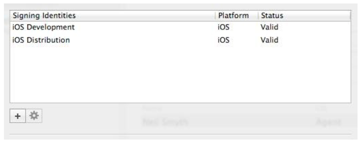

[toc]

源代码：http://www.ebookfrenzy.com/retail/ios8/

Swift中分号是可选的。

## （---）1-3章

## 5. 在 iOS 8 设备上测试应用（Xcode 6）

One of these features makes it considerably easier to obtain the signing certificates and provisioning profiles that are necessary to perform testing of applications on physical iOS devices.

### 5.1 Xcode 配置 Apple IDs

打开 Xcode 偏好设置。选择 **Accounts** 页。选择 Add Apple ID… 。

### 5.2 产生签名标示

应用在物理设备上测试，必须先用开发者的 signing identity 签名。应用分发到 App Store 则必须用 a distribution signing identity 签名。Signing identities 由一个证书和一个私钥组成。

Signing identities can be generated from within the Xcode account preferences panel. Begin by selecting the Apple ID for which the identities are to be generated before clicking on the View Details… button located in the lower right hand corner of the window. This will display a list of signing identities and any provisioning profiles associated with those identities. If no valid signing identities are listed (as is the case in Figure 5-3), the next step is to generate them.

Begin by clicking on the + button and selecting the iOS Development option from the resulting menu. Xcode will then contact the Apple Developer Member Center portal and request and download a developer signing identity. Repeat these steps, this time selecting iOS Distribution from the menu to create and download a distribution signing identity. Once completed, the two identities should now be listed as shown in Figure 5-4:



创建后，signing identities 和账户信息可以迁移到其他机器，by clicking on the button displaying a gear cog on the first account settings page and selecting the **Export Accounts…** menu option. On the destination system repeat these steps, this time selecting the **Import Accounts…** option.

It is worth noting that the certificates associated with the signing identities can also be viewed and created within the Apple Developer Member Center portal. Within a browser, navigate to the following URL and log in using your Apple ID credentials:
https://developer.apple.com/membercenter

Within the member center, click on the Certificates, Identifiers and Profiles option and choose Certificates from the list of options under the iOS Apps category. On the resulting page, the certificates for both signing identifiers should be listed. Clicking on a certificate will display details such as the expiration date as outlined in Figure 5-5:

As can be seen in the left hand panel of Figure 5-5, the member center also provides options to manually create App IDs and Provisioning Profiles. With Xcode 6, however, these are typically created automatically.

### （未）5.3 设备注册

### （未）5.4 手工添加测试设备

### （未）5.5 在已注册的设备上运行应用

## 6. Swift Playgrounds介绍

Playgrounds 是 Xcode 6 新特性之一。用于学习 Swift 和实验 iOS 8 SDK。它是一个交互式的环境，输入 Swift 代码后实时显示结果。

新建一个Playground：select the File -> New -> Playground。

左边是编辑区，右边是结果区。

### 6.5 在Playgrounds中使用UIKit

不仅可以实验简单的Swiftly代码。iOS 8 SDK中很多功能也可以测试。

刚创建好的 playground，包含一行代码导入 iOS UIKit Framework（`import UIKit`）。实现UI的类大多包含在UIKit Framework中。An extremely powerful feature of playgrounds is that it is also possible to work with UIKit along with many of the other Frameworks that comprise the iOS 8 SDK.

例子：

```
let myLabel = UILabel(frame: CGRectMake(0, 0, 200, 50))
myLabel.backgroundColor = UIColor.redColor()
myLabel.text = "Hello Swift"
myLabel.textAlignment = .Center
myLabel.font = UIFont(name: "Georgia", size: 24)
myLabel
```

点击结果区的功能按钮，可以显示每一步及最终的标签效果。


