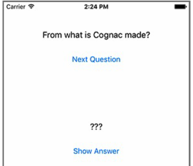
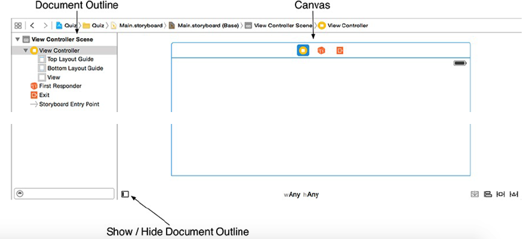
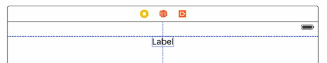
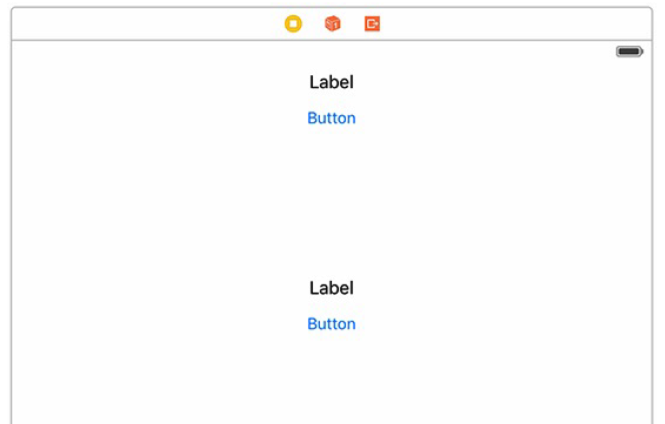
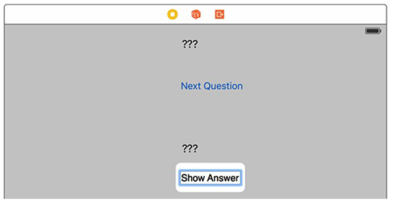
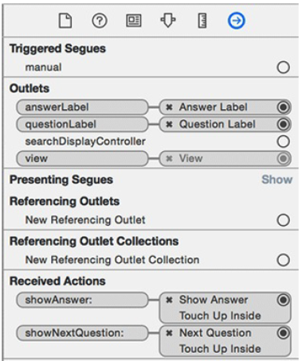
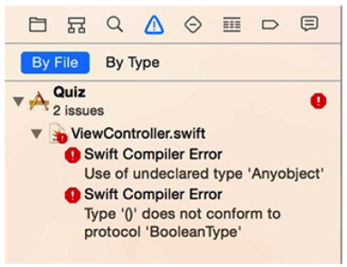
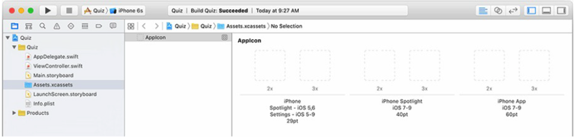
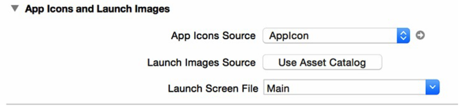

[toc]

# 1 一个简单的 iOS 应用

应用名 Quiz。显示一个问题。点击一个按钮显示答案。再单击一个按钮显示下一个问题。



## 1.1 创建 Xcode 工程

*Product Name* 取 *Quiz*。组织和公司标示取 *Big Nerd Ranch* 和 *com.bignerdranch*。

语言选 Swift。设备选 *iPhone*。

Make sure that the *Use Core Data*, *Include Unit Tests*, and *Include UI Tests* checkboxes are unchecked.

## 1.3 设计问题

- The model layer will consist of two instances of `[String]`.
- The view layer will consist of two instances of `UILabel` and two instances of
`UIButton`.
- The controller layer will consist of an instance of `AppDelegate` and an instance of `ViewController`.

## 1.4 Interface Builder

Click once on the `Main.storyboard` file. Xcode will open its graphic-style editor called *Interface Builder*. Interface Builder 将编辑区分成两部分：左边是 document outline，右边是 canvas。



The large rectangle that you see in the Interface Builder canvas is called a **scene**.

## 1.5 构建界面

拖一个 Label 到画布上。



最终效果：



分别双击标签和按钮，更改文字，如下图：



创建自动布局的部分略。见原书。

创建 Outline 和 action 的步骤略。见书。

```swift
class ViewController: UIViewController {
	@IBOutlet var questionLabel: UILabel!
	@IBOutlet var answerLabel: UILabel!
	@IBAction func showNextQuestion(sender:AnyObject) {
	}
	@IBAction func showAnswer(sender:AnyObject) {
	}
}
```

可以在右侧的 connections inspector 中查看创建的所有 Connection。Select the *View Controller* in the document outline. Then, in the utilities area, click the tab *Show the connections* to reveal the connections inspector.



## 1.6 创建模型

在控制器中添加代码：

```swift
let questions:[String] = ["From what is cognac made?",
	"What is 7 + 7?",
	"What is the capital of Vermont?"]
let answers:[String] = ["Grapes",
	"14",
	"Montpelier"]
var currentQuestionIndex:Int = 0
```

实现Action代码：

```swift
@IBAction func showNextQuestion(sender:AnyObject) {
	++currentQuestionIndex
	if currentQuestionIndex == questions.count {
		currentQuestionIndex = 0
	}
	let question:String = questions[currentQuestionIndex]
	questionLabel.text = question
	answerLabel.text="???"
}
@IBAction func showAnswer(sender:AnyObject) {
	let answer:String = answers[currentQuestionIndex]
	answerLabel.text = answer
}
```

在应用启动后显示第一个问题：

```swift
class ViewController : UIViewController {
	...
	override func viewDidLoad() {
		super.viewDidLoad()
		questionLabel.text = questions[currentQuestionIndex]
	}
}
```

## 1.7 构建

If building turns up any errors, you can view them in the issue navigator by selecting the tab in the navigator area.



## 1.8 应用的图标

- iPhone 6s Plus and iPhone 6 Plus: 180x180 pixels (@3x)
- iPhone 6s, iPhone 6, and iPhone 5: 120x120 pixels (@2x)
- iPad and iPad mini: 152x152 pixels (@2x)
- iPad Pro: 167x167 pixels (@2x)

In the project navigator, find **Assets.xcassets**. Select this file to open it and then select *AppIcon* from the resource list on the lefthand side (Figure 1.26).

Figure 1.26 Showing the Asset Catalog


This panel is the *Asset Catalog*, where you can manage all of the images that your application will need.

## 1.9 启动（Launch）屏

Another item you should set for the project is the launch image, which appears while an application is loading. For example, the *Clock* application’s launch image shows the four tabs along the bottom, all in the unselected state. Once the application loads, the correct tab is selected and the content becomes visible.

可以用一个 *launch screen file* 产生一张启动屏的图片。

在工程导航中点击最上层的 *Quiz*，打开工程设置。在 *App Icons and Launch Images* 一节中，*Launch Screen File* 一项选 `Main`：启动屏图片会根据 Main.storyboard 产生。


