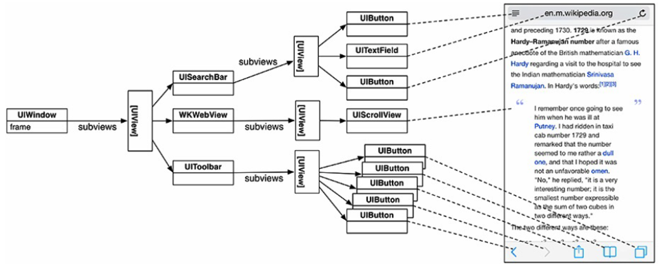
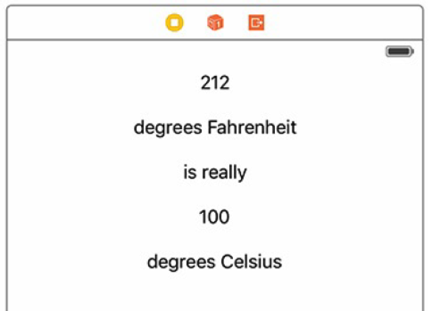
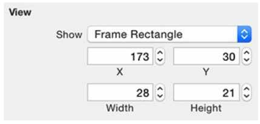
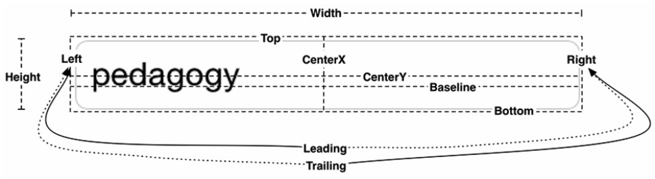
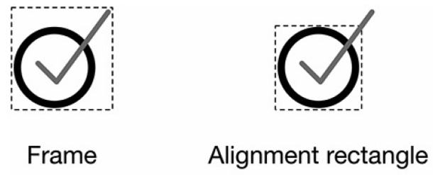
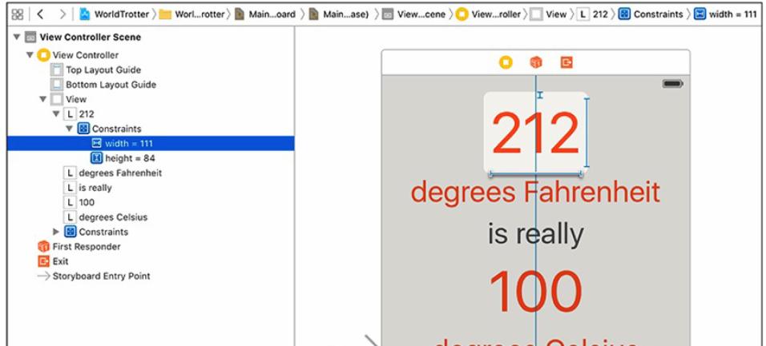

[toc]

# 3 视图和视图层级

下面5章创建引用 *WorldTrotter*。转换摄氏温度和华氏温度。

## 3.2 视图层级

一个应用只有一个 `UIWindow` 对象。`UIWindow` 也是 `UIView` 的子类。



每个视图先将自己绘制在自己的层上（`CALayer`）。然后所有视图的层合并显示在屏幕上。

## 3.3 创建新工程

模板选 Single View Application。产品名：WorldTrotter。

## 3.4 视图和框架（frame）

When you initialize a view programmatically, you use its `init(frame:)` designated initializer. This method takes one argument, a `CGRect`, that will become the view’s `frame`, a property on `UIView`.

```swift
var frame : CGRect
```

视图的框架决定视图的大小和相对于父视图的位置。因为框架是矩形所以视图总是矩形。

`CGRect` 有两个成员：`origin` 和 `size`。`origin` 是 `CGPoint`，有两个 `CGFloat` 成员：`x` 和 `y`。`size` 是 `CGSize`，有两个 `CGFloat` 属性：`width` 和 `height`。

位置原点在左上角。x轴向右。y轴向下。

```java
class ViewController: UIViewController {
	override func viewDidLoad() {
		super.viewDidLoad()
		let firstFrame = CGRect(x:160, y:240, width:100, height:150)
		let firstView = UIView(frame:firstFrame)
		firstView.backgroundColor = UIColor.blueColor()
		view.addSubview(firstView)
	}
}
```

编译运行。

注意上面表示尺寸的整数的单位都是点，不是像素。为了兼容 Retina 等屏幕。

每个 `UIView` 对象都有一个 `superview` 属性。反向关系是自动建立的。

下面通过 Interface Builder 添加正式的UI。首先删除控制器中之前实验的代码。

Select the *View Controller* either in the document outline or by clicking the yellow circle above the interface.

Open the attributes inspector, which is the fourth tab in the utilities area. You can quickly open this pane using the keyboard shortcut Command-Option-4. At the top of the pane, find the section labeled *Simulated Metrics* and change the *Size* to be *iPhone 4.7-inch*. This will resize the square interface to match the dimensions of the 4.7-inch devices.

拖5个 UILabel。如下图所示。



选中最上面的 Label。打开 size inspector（工具面板第5个）。在 View 节，找 *Frame Rectangle*。设置如下：



在 Main.storyboard 中选中背景视图。在 attributes inspector 中设置背景色为 #F5F4F1。

选中所有 Label。在 Editor 菜单下选择 *Size to Fit Content* (Command-=)。

## 3.5 自动布局

The Auto Layout system is based on the *alignment rectangle*. 矩形有7个布局特性。见下图。



对齐矩形与框架多数情况下相同。但框架围绕整个视图，而布局矩形只围绕用作对齐的内容。Figure 3.17 shows an example where the frame and the alignment rectangle are different.



你无法直接定义视图的对齐矩形。You do not have enough information (like screen size) to do that. Instead, you provide a set of constraints. Taken together, these constraints enable the system to determine the layout attributes, and thus the alignment rectangle, for each view in the view hierarchy.

视图的“固有内容大小”是隐式的宽度和高度约束。若你不显式指定宽高，视图将处于其本质宽度、高度。

现在我们移除顶部标签的显式的宽度和高度的约束。

在 Main.storyboard 中选中 Label 上的宽度约束。可以直接在画布上点击。或在 document outline 中找到约束（见下图）。然后按 Delete。



注意到删除后 Label 上的约束仍然是蓝色的。此时宽高是从 Label 固有内容大小 推断出的。
