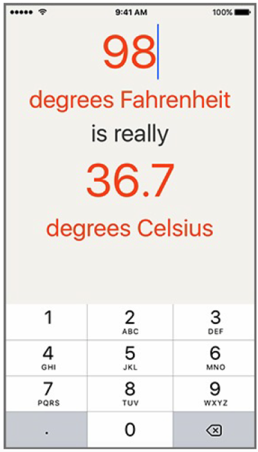
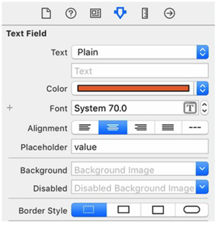
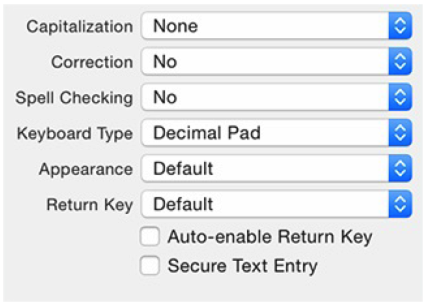
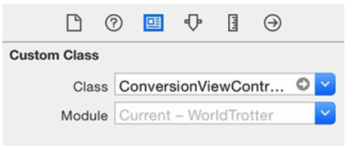
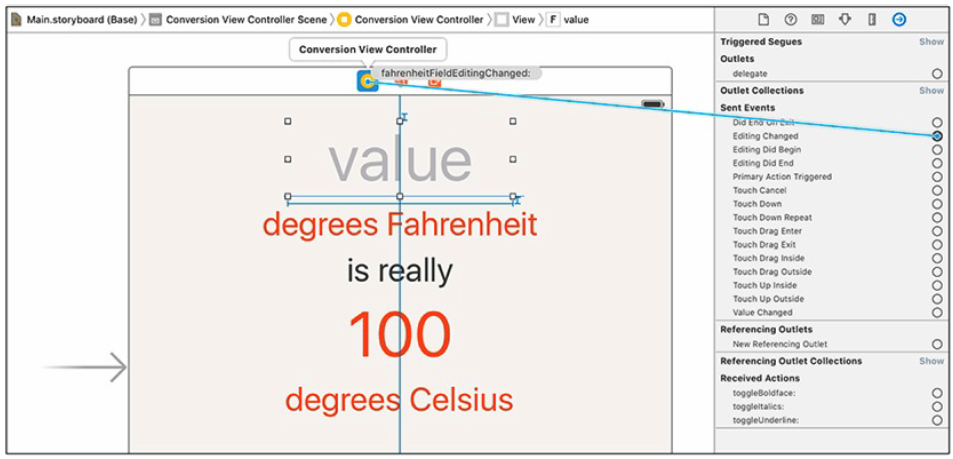
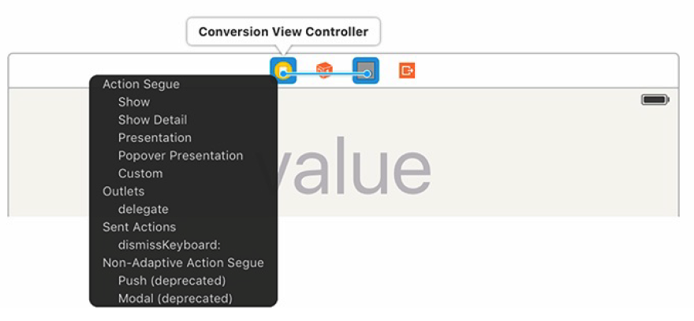
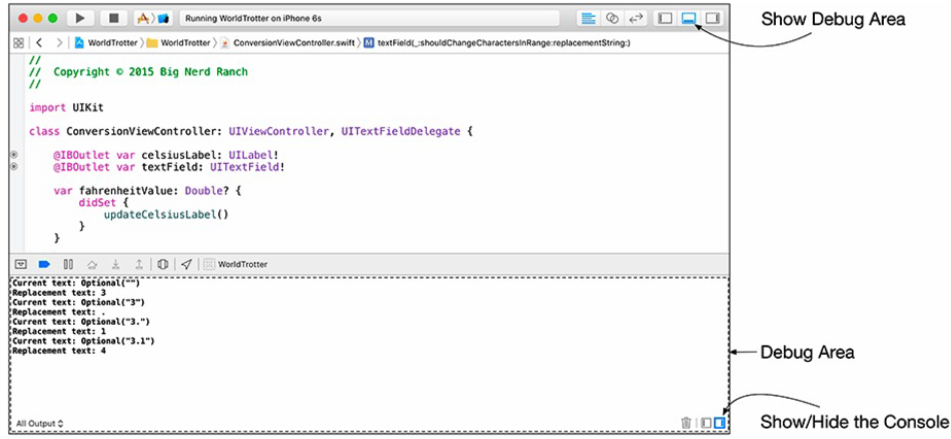

[toc]

# 4 文本输入和代理

添加一个文本框。



## 4.1 文本编辑

Set the placeholder text to be `value`. This is the text that will be displayed when the user has not entered any text.

Set the *Border Style* to be none, which is the first element of the segmented control with the dotted lines.

文本框的 attributes inspector：



构建并运行。点击文本框，若没有键盘弹出。点击模拟器的 Hardware 菜单，*Keyboard → Toggle Software Keyboard*，或按键盘快捷键 *Command-K*。
By default, the simulator treats your computer’s keyboard as a Bluetooth keyboard connected to the simulator. This is not usually what you want. Instead, you want the simulator to mimic an iOS device running without any accessories attached by using the onscreen keyboard.

### 4.1.1 键盘特性

键盘的外观取决于 `UITextField` 的一组属性 `UITextInputTraits`。其中一个决定键盘类型。这里我们相用数字键盘。

In the attributes inspector for the text field, find the attribute named *Keyboard Type* and choose *Decimal Pad*. In the same section, you can see some of the other text input traits that you can customize for the keyboard. Change both *Correction* and *Spell Checking* to *No*.

Figure 4.7 Keyboard text input traits


### 4.1.2 响应文本框的改变

输入华氏，自动更新摄氏。

删除 ViewController.swift。创建 ConversionViewController.swift。

```swift
import UIKit
class ConversionViewController : UIViewController {
}
```

现在需要将 Main.storyboard 中界面与新的视图控制器关联起来。打开 Main.storyboard，选择 View Controller（通过 document outline 选择，或点画布上方的黄色的圆圈）。打开工具面板的 *identity inspector*。找到 *Custom Class* 一节，将 *Class* 设为 `ConversionViewController`。You will learn what all of this is doing in Chapter 5.



定义 outlet 和 action。

```swift
class ConversionViewController : UIViewController {
	@IBOutlet var celsiusLabel:UILabel!
	@IBAction func fahrenheitFieldEditingChanged(textField : UITextField) {
		celsiusLabel.text=textField.text
	}
}
```

You are going to have changes to the text field trigger the action you defined in `ConversionViewController`. In the connections inspector, locate the *Sent Events* and the *Editing Changed* event. Click and drag from the circle to the right of *Editing Changed* to the *Conversion View Controller* and click the `fahrenheitFieldEditingChanged:` action in the pop-up menu (Figure 4.10).



```swift
@IBAction func fahrenheitFieldEditingChanged(textField: UITextField) {
	celsiusLabel.text = textField.text
	if let text = textField.text where !text.isEmpty {
		celsiusLabel.text = text
	} else {
		celsiusLabel.text = "???"
	}
}
```

### 4.1.3 键盘退回

Currently, there is no way to dismiss the keyboard. Let’s add that functionality. 常见做饭是监听用户键入 Return 键。但这里，由于数字键盘没有 Return 键，因此让用户触摸背景退货键盘。

When the text field is tapped, the method `becomeFirstResponder()` is called on the text field. This is the method that, among other things, causes the keyboard to appear. 要退回键盘，调用的是文本框的 `resignFirstResponder()` 方法。You will learn more about these methods in Chapter 13.

需要到文本框的 outlet。Let’s take care of the code first.

```swift
@IBOutlet var celsiusLabel:UILabel!
@IBOutlet var textField:UITextField!
```

Now implement an action method that will dismiss the keyboard when called.

```swift
@IBAction func dismissKeyboard(sender: AnyObject) {
	textField.resignFirstResponder()
}
```

触发上述方法需要一个手势识别。A gesture recognizer is a subclass of `UIGestureRecognizer` that detects a specific touch sequence and calls an action on its target when that sequence is detected. There are gesture recognizers that detect taps, swipes, long presses, and more. 这里我们使用`UITapGestureRecognizer`，用于侦测用户触摸背景视图。You will learn more about gesture recognizers in Chapter 18.

在 Main.storyboard 中，从对象库中拖一个 *Tap Gesture Recognizer* 到 *Conversion View Controller* 的背景。You will see a reference to this gesture recognizer in the scene dock, the row of icons above the canvas.

Control-drag from the gesture recognizer in the scene dock to the *Conversion View Controller* and connect it to the `dismissKeyboard:` method (Figure 4.11).

Figure 4.11 Connecting the gesture recognizer action


## 4.2 实现温度转换

```swift
let numberFormatter : NSNumberFormatter = {
	let nf = NSNumberFormatter()
	nf.numberStyle = .DecimalStyle
	nf.minimumFractionDigits = 0
	nf.maximumFractionDigits = 1
	return nf
}()

func updateCelsiusLabel() {
	if let value = celsiusValue {
		celsiusLabel.text = numberFormatter.stringFromNumber(value)
	} else {
		celsiusLabel.text="???"
	}
}
```

下一节，通过代理实现，最多只能输入一个小数点。

## 4.3 代理

代理是面向对象式的回调。事件触发回调。Some objects need to make a callback for more than one event. For instance, the text field wants to “callback” when the user enters text as well as when the user presses the Return key. However, there is no built-in way for two (or more) callback functions to coordinate and share information. This is the problem addressed by delegation – you supply a single
delegate to receive all of the event-related callbacks for a particular object. This delegate object can then store, manipulate, act on, and relay the information from the callbacks as it sees fit.

用户在文本框中输入时，文本框将询问其代理，是否接受用户的修改。对于 WorldTrotter，若用户输入两个小数点则禁止输入。文本框的代理是 `ConversionViewController` 对象。

### 4.3.1 采纳协议

首先要让 `ConversionViewController` 类采纳协议 `UITextFieldDelegate`。对于每种代理角色，都有一个协议，指出支持调用的方法。

```swift
class ConversionViewController : UIViewController, UITextFieldDelegate {
```

The `UITextFieldDelegate` protocol looks like this:

```swift
protocol UITextFieldDelegate : NSObjectProtocol {
	optional func textFieldShouldBeginEditing(textField:UITextField)->Bool
	optional func textFieldDidBeginEditing(textField:UITextField)
	optional func textFieldShouldEndEditing(textField:UITextField)->Bool
	optional func textFieldDidEndEditing(textField:UITextField)
	optional func textField(textField:UITextField,
		shouldChangeCharactersInRangerange:NSRange,
		replacementStringstring:String)->Bool
	optional func textFieldShouldClear(textField:UITextField)->Bool
	optional func textFieldShouldReturn(textField:UITextField)->Bool
}
```

### 4.3.2 使用代理

Now that you have declared `ConversionViewController` as conforming to the
`UITextFieldDelegate` protocol, you can set the `delegate` property of the text field. 打开 Main.storyboard，Control 并把文本框拖到 Conversion View Controller。在弹出菜单中选择 `delegate`。

在控制器中实现需要的方法。在正式实现功能前，首先我们先测试一下，将信息打到控制台。

```swift
func textField(textField:UITextField,
	shouldChangeCharactersInRangerange:NSRange,
	replacementStringstring:String)->Bool {
	print("Current text:\(textField.text)")
	print("Replacement text:\(string)")
	return true
}
```

Figure 4.12 Printing to the console


Logically, if the existing string has a decimal separator and the replacement string has a decimal separator, the change should be rejected.

```swift
func textField(textField:UITextField,
	shouldChangeCharactersInRangerange:NSRange,
	replacementStringstring:String) -> Bool {
	let existingTextHasDecimalSeparator = textField.text?.rangeOfString(".")
	let replacementTextHasDecimalSeparator = string.rangeOfString(".")
	if existingTextHasDecimalSeparator !=nil &&
		replacementTextHasDecimalSeparator != nil {
		return false
	} else {
		return true
	}
}
```
