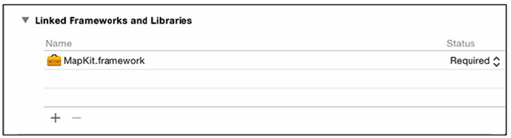

[toc]

# 5 视图控制器

本章将使用多个视图控制器。


## 5.1 视图控制器的视图

`UIViewController` 的根视图：

```swift
var view : UIView!
```

A view controller’s view is not created until it needs to appear on the screen. This optimization is called lazy loading, and it can conserve memory and improve
performance.

视图控制器有两种方式创建它的视图层级：

- 编程方式，重写 `UIViewController` 的 `loadView()` 方法。
- in Interface Builder, by using an interface file such as a storyboard

## 5.2 设置初始视图控制器

一个故事板可以有多个视图控制器。但只有其中一个是 initial 视图控制器。初始视图控制器作为故事板的进入点。

打开 Main.storyboard， 从对象库中拖一个 View Controller 到画布。


想让这个视图控制器显示一个 `MKMapView`。选中 *View Controller* 的视图 —— 不是 *View Controller* 自身！按下 Delete 删除。然后从对象库中拖一个 Map Kit View 到视图控制器。


选中 *View Controller*，打开 attributes inspector。在 View Controller 节下勾选 *Is Initial View Controller*。Did you notice that the gray arrow on the canvas that was pointing at the Conversion View Controller is now pointing to the View Controller? The arrow, as you have probably surmised, indicates the initial view controller. 另一种分配初始视图控制器的方法是将箭头从一个视图控制器拖到另一个。

现在应用不能运行。因为 `MKMapView` 所在框架尚未加载到应用中。你需要手工链接 MapKit 框架到应用。打开 project navigator，点击 *WorldTrotter* 打开工程设置。Find and open the General tab in the settings. Scroll down to the bottom and find the section labeled **Linked Frameworks and Libraries**. Click on the + at the bottom and search for **MapKit.framework**. Select this framework and click Add (Figure 5.6).



每个应用都有一个 **main interface**，它指向一个**故事板**。When the application launches, the initial view controller for the main interface gets set as the `rootViewController` of the window.

The *main interface* for an application is set in the project settings. Still in the General tab of the project settings, find the **Deployment Info** section. Here you will see the **Main Interface** setting (Figure 5.7). This is set to `Main`, which corresponds to Main.storyboard.


## 5.3 UITabBarController

In this chapter, you will create a `UITabBarController` that will allow the user to swap between the `ConversionViewController` and the `UIViewController` displaying the map.

`UITabBarController` keeps an array of view controllers. It also maintains a tab bar at the bottom of the screen with a tab for each view controller in its array. Tapping on a tab results in the presentation of the view of the view controller associated with that tab.

Open Main.storyboard and select the *View Controller*. From the *Editor* menu, choose *Embed In → Tab Bar Controller*. This will add the View Controller to the view controllers array of the Tab Bar Controller. You can see this represented by the *Relationship* arrow pointing from the Tab Bar Controller to the View Controller (Figure 5.8). 而且 Interface Builder 会把 *Tar Bar Controller* 设为故事板的初始视图控制器。


Add the *Conversion View Controller* to the Tab Bar Controller’s view controllers array. Control-drag from the *Tab Bar Controller* to the *Conversion View Controller*. From the *Relationship Segue* section, choose *view controllers* (Figure 5.9).


`UITabBarController` 自身也是一个 `UIViewController`。它的 `view` 有两个子视图：标签条和选中的视图控制器的视图。

标签条上每个标签可以显示一个标题和一个图片。每个视图控制器有一个 `tabBarItem` 属性，提供这个标题和图片。Figure 5.11 shows an example of this relationship in iPhone’s Phone application.


In the project navigator, open the Asset Catalog by opening Assets.xcassets.
然后将 ConvertIcon.png, ConvertIcon@2x.png, ConvertIcon@3x.png, MapIcon.png, MapIcon@2x.png, and MapIcon@3x.png 拖入。

Figure 5.12 Adding images to the Asset Catalog


`tabBarItem` 属性可以通过代码或故事板设置。

In Main.storyboard, locate the View Controller. Notice that a tab bar with the tab bar item in it was added to the interface since the view controller will be presented within a tab bar controller. This is very useful when laying out your interface.

Select this tab bar item and open its attributes inspector. Under the **Bar Item** section, change the **Title** to “Map” and choose **MapIcon** from the **Image** menu. You can also change the text of the tab bar item by double-clicking on the text on the canvas.


Now find the **Conversion View Controller** and select its tab bar item. Set the **Title** to be “Convert” and the **Image** to be **ConvertIcon**.

Let’s also change the first tab to be the **Convert View Controller**. The order of the tabs is determined by the order of the view controllers within the tab bar controller’s `viewControllers` array. You can change the order in a storyboard by dragging the tabs at the bottom of the **Tab Bar Controller**.

## 5.4 已加载和正在显示的视图

创建新文件 MapViewController。

```swift
import UIKit
class MapViewController : UIViewController {
}
```

打开 Main.storyboard，选中地图的视图控制器。Open its identity inspector and change the **Class** to `MapViewController`.

`viewDidLoad()` 调用时，视图控制器的界面已加载。控制器中的 outlets 都已被设置。

`viewWillAppear(_:)` 方法被调用，在视图控制器的视图要添加到窗口之前。

