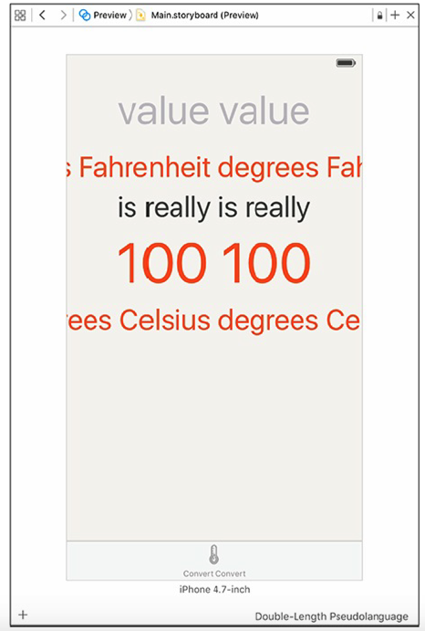

[toc]

# 7 国际化

Localization is the process of providing the appropriate data in your application based on the user’s Language and Region Format settings. You can find these settings in the iOS Settings application (Figure 7.1). Select the General row and then the Language & Region row.

本章把 WorldTrotter 适配西班牙语。

## 7.1 国际化

In this first section, you will use the `NSNumberFormatter` and `NSNumber` classes to internationalize the `ConversionViewController`.

`NSNumberFormatter` has a `locale` property, which is set to the device’s current locale. Whenever you use an `NSNumberFormatter` to create a number, it checks its `locale` property and sets the format accordingly. 因此 Celsius 标签一开始就国际化了。

`NSLocale` knows how different regions display symbols, dates, and decimals and
whether they use the metric system. An instance of `NSLocale` represents one region’s settings for these variables.

When you call the method `currentLocale()` on `NSLocale`, the instance of
`NSLocale` that represents the user’s region setting is returned. Once you have that instance of `NSLocale`, you can ask it questions like, “What is the currency symbol for this region?” or, “Does this region use the metric system?”
To ask one of these questions, you call the method `objectForKey(_:)` on the
`NSLocale` instance with one of the `NSLocale` constants as an argument.

```swift
let currentLocale = NSLocale.currentLocale()
let isMetric = currentLocale.objectForKey(NSLocaleUsesMetricSystem)?.boolValue
let currencySymbol = currentLocale.objectForKey(NSLocaleCurrencyCode)
```

in Spain, the decimal separator is a comma instead of a period (and the thousands separator is a period instead of a comma). The number 123,456.789 in the United States would be written 123.456,789 in Spain.

之前只检查不能输入多个小数点，检查的是点，这是不对的。修正，

```swift
func textField(textField:UITextField,
	shouldChangeCharactersInRangerange:NSRange,
	replacementStringstring:String) ->Bool {
	let currentLocale = NSLocale.currentLocale()
	let decimalSeparator = currentLocale.objectForKey(NSLocaleDecimalSeparator) as! String
	let existingTextHasDecimalSeparator = textField.text?.rangeOfString(decimalSeparator)
	let replacementTextHasDecimalSeparator = string.rangeOfString(decimalSeparator)
	if existingTextHasDecimalSeparator != nil && replacementTextHasDecimalSeparator != nil {
		return false
	} else {
		return true
	}
}
```

In `fahrenheitFieldEditingChanged(_:)`, you are using an initializer for the `Double` type that takes in a string as its argument. 初始器不知道如何处理字符串中小数点不是点的字符串。修正，利用 `numberFormatter.numberFromString`，

```swift
@IBAction func fahrenheitFieldEditingChanged(textField:UITextField) {
	if let text = textField.text, number = numberFormatter.numberFromString(text) {
		fahrenheitValue = number.doubleValue
	} else {
		fahrenheitValue = nil
	}
}
```

If the string contains a valid number, the method returns an instance of `NSNumber`. `NSNumber` is a class that can represent a variety of number types, including Int, Float, Double, and more. You can ask an instance of
`NSNumber` for its value represented as one of those values. You are doing that here to get the `doubleValue` of the number.

本地化包括声音、图片、文字等。

当你构建一个目标时，会创建一个 bundle。添加到目标的所有资源都会拷贝到这个 bundle，包括可执行文件。在运行时该 bundle 由一个 NSBundle 对象表示，称为主 bundle。很多类需要 `NSBundle` 配合来加载资源。

Localizing a resource puts another copy of the resource in the application bundle. These resources are organized into language-specific directories, known as `lproj` directories. Each one of these directories is the name of the localization suffixed with `lproj`. 例如美国英语的资源目录是 `en_US.lproj`。（区域是可以省略的。）These language and region codes are standard on all platforms, not just iOS.

当你向 bundle 要求一个资源文件的路径时，首先在 bundle 的顶层寻找。若没有，寻找设备设置的语言区域对应的 lproj 目录。

To simplify the process of localizing interface files, Xcode has a feature called **base internationalization**. Base internationalization creates the `Base.lproj` directory, which contains the main interface files. Localizing individual interface files can then be done by creating just the `Localizable.strings` files. It is still possible to create the full interface files, in case localization cannot be done by changing strings alone. However,
with the help of Auto Layout, strings replacement is sufficient for most localization needs.

In the next section, you will use Auto Layout to prepare your layout for localization.

打开 Main.storyboard，显示 assistant editor。The preview assistant allows you to easily see how your interface will look across screen sizes and orientations as well as between different localized languages.

You have not localized the application into another language yet, but Xcode supplies a pseudolanguage for you to use. Pseudolanguages help you internationalize your applications before receiving translations for all of your strings and assets. The built-in pseudolanguage, **Double-Length Pseudolanguage**, mimics languages that are more verbose by repeating whatever text string is in the text element. So, for example, “is really” becomes “is really is really.”

Select the Language pop-up that says **English** and choose **Double-Length Pseudolanguage**. The labels all have their text doubled (Figure 7.6).



double-length pseudolanguage 立即揭示了一个问题：标签溢出了屏幕左右。解决方法是限制所有的标签开头和结尾在父视图的 margin 内。修改标签的行数为0，这样文本就能自动换行。

In the canvas, select the “degrees Fahrenheit” label. You are going to add constraints to this label in a new way. Control-drag from the label to the left side of the superview. When you do, a context-sensitive pop-up will appear giving you the constraints that make sense for this direction (Figure 7.7). Select **Leading Space to Container Margin** from the list.


The direction that you drag influences which possible constraints are displayed. A horizontal drag will show horizontal constraints, and a vertical drag will show vertical constraints. A diagonal drag will show both horizontal and vertical constraints, which is useful for setting up many constraints simultaneously.

Now Control-drag from the “degrees Fahrenheit” label to the right side of the superview and select **Trailing Space to Container Margin**.

On their own, these constraints are not very good. They maintain the existing fixed distance between the leading and trailing edges of the label, as you can see in the preview assistant (Figure 7.8).


What you really want is for the distance between the label and the margins to be greater than or equal to 0. 可以通过不等约束完成。Select the leading constraint by clicking on the I-bar to the left of the label. Open its attributes inspector and change the **Relation** to **Greater Than or Equal** and the **Constant** to 0 (Figure 7.9).


Do the same for the trailing constraint. Take a look at the preview assistant; the interface is looking better, 标签文本现在被截断了。

Select the label and open its attributes inspector. Change the Lines count to 0. Now take a look at the preview assistant; the label is no longer being truncated and instead the text flows to a second line. Since the other labels are all related to the label above them, 它们会自动向下移动。

## 7.2 本地化

本节开始本地化应用，即为新语言更新字符串和资源。本节将本地化 Main.storyboard 文件。创建 English 和 Spanish 两个本地化。

在工程导航中选中 Main.storyboard，打开 file inspector，在 **Localization** 一节下面，勾选 **English**，确保下拉列表选的是 **Localizable Strings**。此配置将创建一个字符串表。


在工程导航中，选择顶部的 WorldTrotter。选中编辑器左边栏中，Project 一节下的 WorldTrotter，在标签页 **Info**，点击 **Localizations** 最后的加号按钮，选择 **Spanish (es)**。在对话框中，不要勾选 LaunchScreen.storyboard；只勾选 Main.storyboard。确认参考语言是 **Base**，文件类型是 **Localizable Strings**。这些操作将创建新文件夹 **es.lproj** 和文件 **Main.strings**。现在 **Localizations** 如下图所示：


在工程导航中，展开 Main.storyboard。Xcode 将 Main.storyboard 放进 **Base.lproj** 目录。


在工程导航中，点击 Spanish 版本的 Main.strings。翻译其中内容。然后测试。First, there is a little Xcode glitch to be aware of: sometimes Xcode ignores a resource file’s changes when you build an application. To ensure that your application is being built from scratch, first delete it from your device or simulator. (Press and hold its icon in the launcher. When it starts to wiggle, tap the delete badge.) Relaunch Xcode. (Yes, exit and start it again.) Then, choose Clean from the Product menu. Finally, to be absolutely sure, press and hold the Option key while opening the Product menu and choose Clean Build Folder…. This will force the application to be entirely recompiled, rebundled, and reinstalled.

### NSLocalizedString 和字符串表

字符串表是一个键值对的列表。它是应用的一个资源文件。

在代码中使用国际化的字符串，要用 `NSLocalizedString(_:comment:)` 函数。函数有两个参数，一个键，和一个注释（描述字符串目的）。

```swift
let greeting = NSLocalizedString("Hello!", comment: "The greeting for the user")
```

有一个命令可以找到文件中使用的所有 `NSLocalizedString(_:comment:)`，产生字符串表。在终端中找到使用 `NSLocalizedString(_:comment:)` 函数的文件 `MapViewController.swift` 所在的目录，然后执行：

```
genstrings MapViewController.swift
```

将产生的文件 `Localizable.strings` 拖到工程导航中。

Now that you have created `Localizable.strings`, you need to localize it in Xcode. Open its file inspector and click the Localize… button in the utility area. Make sure Base is selected from the pop-up and click Localize. Add the Spanish and English localization by checking the box next to each language.

## 7.4 NSBundle 在国际化的中角色

The real work of taking advantage of localizations is done for you by the class
NSBundle. A bundle represents a location on the filesystem that groups the compiled code and resources together. **main bundle** 是 application bundle 的另一个名字，其中包含应用中所有的资源和可执行文件。You will learn more about the application bundle in Chapter 15.

构建应用时，所有的 lproj 目录都会拷贝进 main bundle。Figure 7.17 shows the main bundle for **WorldTrotter** with some additional images added to the project.


`NSBundle` knows how to search through localization directories for every type of resource using the instance method `URLForResource(_:withExtension:)`. When you want a path to a resource bundled with your application, you call this method on the main bundle. Here is an example using the resource file `Boo.png`:

```swift
let path = NSBundle.mainBundle().URLForResource:("Boo" withExtension: "png")
```

定位一个资源时， bundle 现在 application bundle 的顶层寻找。If so, it returns the full URL to that file. If not, the bundle gets the device’s language and region settings and looks in the appropriate **lproj** directories to construct the URL. 若还没有找到，搜索 **Base.lproj** 目录。若还为找到，返回 nil。

When you add a new localization to your project, Xcode does not automatically remove the resources from the top-level directory. This is why you must delete and clean an application when you localize a file – otherwise, the previous unlocalized file will still be in the root level of the application bundle. Even though there are **lproj** folders in the application bundle, the bundle finds the top-level file first and returns its URL.

## （未）7.5 Importing and Exporting as XLIFF


