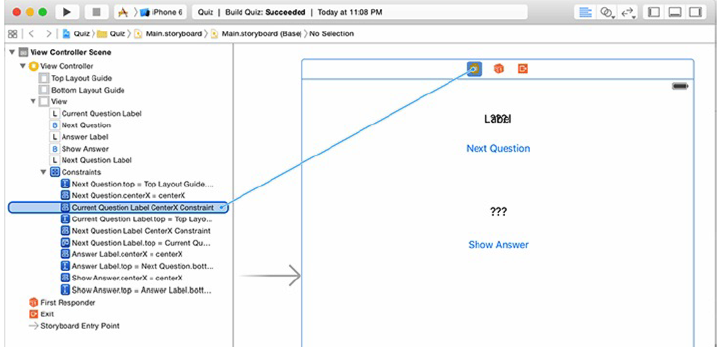

[toc]

# 8 动画

## 8.1 基本动画

The first type of animation you are going to use is the basic animation. 基本动画在初始值和结束值之间动画。

The simplest `UIView` animation method is:

```swift
class func animateWithDuration(duration:NSTimeInterval, animations: ()->Void)
```

`duration` 的类型 `NSTimeInterval` 实际是 `Double` 的一个别名。`animations` 变量是一个闭包。

## 8.2 Another Label

用户触摸 Next Question 按钮，当前问题的标签隐退，下一个问题的标签淡入：

```swift
@IBOutlet var currentQuestionLabel:UILabel!
@IBOutlet var nextQuestionLabel:UILabel!

func viewDidLoad() {
	super.viewDidLoad()
	let question = questions[currentQuestionIndex]
	currentQuestionLabel.text = question
}

override func viewWillAppear(animated:Bool) {
	super.viewWillAppear(animated)
	// Set the label's initial alpha
	nextQuestionLabel.alpha = 0
}
@IBAction func showNextQuestion(sender:AnyObject) {
	++currentQuestionIndex
	if currentQuestionIndex == questions.count {
		currentQuestionIndex = 0
	}
	let question: String = questions[currentQuestionIndex]
	nextQuestionLabel.text = question
	answerLabel.text="???"
	animateLabelTransitions()
}

func animateLabelTransitions() {
	// Animate the alpha
	UIView.animateWithDuration(0.5,
		delay:0,
		options:[],
		animations: {
			self.currentQuestionLabel.alpha = 0
			self.nextQuestionLabel.alpha = 1
		},
		completion: { _ in
			swap(&self.currentQuestionLabel, &self.nextQuestionLabel)
		})
}
```

## 8.4 Animating Constraints

进入退出方式改成，nextQuestionLabel 从左边飞入，currentQuestionLabel 从右边飞出。

首先需要获取到约束的引用。也通过 outlet。

```swift
@IBOutlet var currentQuestionLabel:UILabel!
@IBOutlet var currentQuestionLabelCenterXConstraint:NSLayoutConstraint!
@IBOutlet var nextQuestionLabel:UILabel!
@IBOutlet var nextQuestionLabelCenterXConstraint:NSLayoutConstraint!
```

打开 Main.storyboard，打开 document outline。展开 Constraints。从视图控制器按 Control 拖动到 **Current Question Label.centerX**，选择正确的 outlet。Do the same for **Next Question Label.centerX**.



Currently, the Next Question button and the answer subviews have their center X constrained to the center X of the currentQuestionLabel. When you implement the animation for this label to slide offscreen, the other subviews will go with it. This is not what you want.

Select the constraint that centers the X value of the Next Question button to the currentQuestionLabel and delete it. Then Control-drag upward from the Next
Question button to its superview and select Center Horizontally in Container.

Next, you want the two question labels to be one screen width apart. The center of nextQuestionLabel will be half of the screen width to the left of the view. The center of the currentQuestionLabel will be at its current position, centered in the screen.

When the animation is triggered, both labels will move a full screen width to the right, placing the nextQuestionLabel at the center of the screen and the
currentQuestionLabel half a screen width to the right of the screen (Figure 8.5). To accomplish this, when the view of ViewController is loaded you need to move the `nextQuestionLabel` to its offscreen position.

```swift
func viewDidLoad() {
	super.viewDidLoad()
	let question = questions[currentQuestionIndex]
	currentQuestionLabel.text = question
	updateOffScreenLabel()
}

func updateOffScreenLabel() {
	let screenWidth = view.frame.width
	nextQuestionLabelCenterXConstraint.constant = -screenWidth
}
```

现在让标签从左到右移动。动画约束与动画其他属性不同。在闭包中修改约束的 `constant`，动画不会出现。为什么？After a constraint is modified, the system needs to recalculate the frames for all of the related views in the hierarchy to accommodate this change. 如果需要更新很多约束，你不想每次更改后都要更新 frames。你可以在计算完后统一让系统更新一次 frames，调用 `layoutIfNeeded()`，强制视图根据最新的约束布局它的子视图。

```swift
func animateLabelTransitions() {
	// Animate the alpha
	// and the centerX constraints
	let screenWidth = view.frame.width
	self.nextQuestionLabelCenterXConstraint.constant = 0
	self.currentQuestionLabelCenterXConstraint.constant += screenWidth
	UIView.animateWithDuration(0.5,
		delay:0,
		options:[],
		animations:{
			self.currentQuestionLabel.alpha=0
			self.nextQuestionLabel.alpha=1
			self.view.layoutIfNeeded()
		},
		completion:{ _ in
			swap(&self.currentQuestionLabel, &self.nextQuestionLabel)
			swap(&self.currentQuestionLabelCenterXConstraint,
				&self.nextQuestionLabelCenterXConstraint)
			self.updateOffScreenLabel()
		})
}
```

There is one small problem to fix, but it can be a bit difficult to see. To see it more easily, turn on Slow Animations from the Debug menu in the simulator (Command-T). The width of all of the labels gets animated (to see this on the answerLabel, you need to click the Show Answer button). This is because the intrinsic content size changes when the text changes. The fix is to force the view to lay out its subviews before the animation begins. This will update the frames of all three labels to accommodate the next text before the alpha and sliding animations start.

Update `animateLabelTransitions()` to force the view to lay out its subviews before the animation begins.

```swift
func animateLabelTransitions() {
	//Force any outstanding layout changes to occur
	view.layoutIfNeeded()
	
	// Animate the alpha
	// and the centerX constraints
	let screenWidth = view.frame.width
	self.nextQuestionLabelCenterXConstraint.constant = 0
	self.currentQuestionLabelCenterXConstraint.constant += screenWidth
	...
}
```

## （未）8.5 Timing Functions

