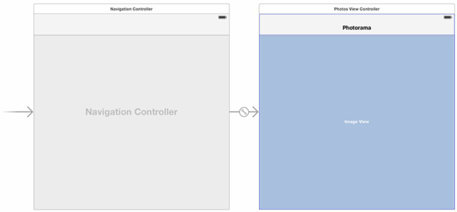

[toc]

# 19 Web Service

In the next four chapters, you will create an application named Photorama that reads in a list of recent photos from Flickr. This chapter will lay the foundation and focus on implementing the web service requests responsible for fetching the metadata for recent photos as well as downloading the image data for a specific photo. In Chapter 20, you will display all of the recent photos in a grid layout. Figure 19.1 shows Photorama at the end of this chapter.

Photorama will make a web service request to get recent photos from Flickr. The web service is hosted at https://api.flickr.com/services/rest. The data that is
returned will be JSON that describes the photos.

## 19.1 搭建 Photorama 应用

Create a new Single View Application for the Universal device family. Name this application **Photorama**.

删除 ViewController.swift。创建文件 PhotosViewController.swift，

```swift
import UIKit
class PhotosViewController: UIViewController {
      @IBOutlet var imageView: UIImageView!
}
```

打开 Main.storyboard，选择 View Controller；打开 identity inspector，修改 **Class** 为 `PhotosViewController`。With the Photos View Controller still selected, select the **Editor** menu and choose **Embed In → Navigation Controller**.

Select the **Navigation Controller** and open its attributes inspector. Under the **View Controller** heading, make sure the box for **Is Initial View Controller** is checked.

Drag an Image View onto the canvas for `PhotosViewController` and add constraints to pin it to all edges of the superview. Connect the image view to the `imageView` outlet on `PhotosViewController`. Open the attributes inspector for the image view and change the **Mode** to **Aspect Fill**.

Finally, double-click on the center of the navigation bar for the **Photos View Controller** and give it a title of **Photorama**. Your interface will look like Figure 19.3.



## 19.2 构造 URL

Flickr’s recent photos web service wants a URL that looks like this:

	https://api.flickr.com/services/rest/?method=flickr.photos.getRecent
	&api_key=a6d819499131071f158fd740860a5a88&extras=url_h,date_taken
	&format=json&nojsoncallback=1

You will create two types to deal with all of the web service information. The
`FlickrAPI` struct will be responsible for knowing and handling all Flickr-related information. This includes knowing how to generate the URLs that the Flickr API expects as well as knowing the format of the incoming JSON and how to parse that JSON into the relevant model objects. The `PhotoStore` class will handle the actual web service calls.

Let’s start by creating the `FlickrAPI` struct. Create a new Swift file named `FlickrAPI`. This file will define a `FlickrAPI` struct that will contain all of the knowledge that is specific to the Flickr API.

In FlickrAPI.swift, declare the `FlickrAPI` struct. 利用 `NSURLComponents` 类构造 URL。

```swift
import Foundation

enum Method:String {
      case RecentPhotos = "flickr.photos.getRecent"
}

struct FlickrAPI {
	private static let baseURLString = "https://api.flickr.com/services/rest"
	private static let APIKey = "a6d819499131071f158fd740860a5a88"
	
	private static func flickrURL(methodmethod: Method,
		parameters:[String:String]?) -> NSURL {
		let components = NSURLComponents(string:baseURLString)!
		var queryItems = [NSURLQueryItem]()
		let baseParams = [
			"method":method.rawValue,
			"format":"json",
			"nojsoncallback":"1",
			"api_key":APIKey
		]
		for (key, value) in baseParams {
  			let item = NSURLQueryItem(name:key, value:value)
			queryItems.append(item)
		}
		if let additionalParams = parameters {
			for(key, value) in additionalParams {
				let item = NSURLQueryItem(name:key, value:value)
				queryItems.append(item)
			}
		}
		components.queryItems = queryItems
		return components.URL!
	}
	
	static func recentPhotosURL() -> NSURL {
		return flickrURL(method: .RecentPhotos,
			parameters:["extras": "url_h,date_taken"])
	}
}
```

## 19.3 发送请求

A request is represented by the `NSURLRequest` class. The `NSURLSession` API is a collection of classes that use a request to communicate with a server in a number of ways. The `NSURLSessionTask` class is responsible for communicating with a server. The `NSURLSession` class is responsible for creating tasks that match a given configuration.

A new class, `PhotoStore`, will be responsible for initiating the web service requests. It will use the `NSURLSession` API and the `FlickrAPI` struct to fetch a list of recent photos and download the image data for each photo.

Let’s look at a few of the properties on `NSURLRequest`:

- `allHTTPHeaderFields` – This is a dictionary of metadata about the HTTP transaction, including character encoding and how the server should handle caching.
- `allowsCellularAccess`：是否允许请求走蜂窝数据。
- `cachePolicy` – This determines if and how the local cache should be used.
- `HTTPMethod` – This is the request method. The default is `GET`; other values are `POST`, `PUT`, and `DELETE`.
- `timeoutInterval` – This is the maximum duration a connection to the server will be attempted for.

The class that communicates with the web service is an instance of `NSURLSessionTask`. 有三种任务：数据任务、下载任务和上传任务。

- `NSURLSessionDataTask` retrieves data from the server and returns it as `NSData` in memory.
- `NSURLSessionDownloadTask` retrieves data from the server and returns it as a file saved to the filesystem.
- `NSURLSessionUploadTask` sends data to the server.

有些请求共享部分设置。如下载请求都不要走蜂窝数据。或某类请求有相同的缓存策略。为避免为每个请求重复配置，可以利用 `NSURLSession`。`NSURLSession` 是 `NSURLSessionTask` 对象的工厂。The session is created with a configuration that specifies properties that are common across all of the tasks that it creates.


创建文件 PhotoStore.swift。In PhotoStore.swift, add a property to hold on to an instance of `NSURLSession`.

```swift
import Foundation
class PhotoStore {
	let session: NSURLSession = {
      let config = NSURLSessionConfiguration.defaultSessionConfiguration()
      return NSURLSession(configuration:config)
	}()
	
	func fetchRecentPhotos() {
		let url = FlickrAPI.recentPhotosURL()
		let request = NSURLRequest(URL:url)
		let task = session.dataTaskWithRequest(request) {
			(data, response, error) -> Void in
			if let jsonData = data {
				if let jsonString = NSString(data:jsonData,
					encoding:NSUTF8StringEncoding) {
					print(jsonString)
				}
			} else if let requestError = error {
				print("Error fetching recent photos:\(requestError)")
			} else {
				print("Unexpected error with the request")
			}
		}
		task.resume()
	}
}
```

At the top of PhotosViewController.swift, add a property to hang on to an instance of `PhotoStore`.

```swift
class PhotosViewController: UIViewController {
	@IBOutlet var imageView: UIImageView!
	var store: PhotoStore!
```

You will use property injection to give the `PhotosViewController` its store dependency. Open AppDelegate.swift and use property injection to give the
`PhotosViewController` an instance of `PhotoStore`.

```swift
func application(application:UIApplication,
      didFinishLaunchingWithOptionslaunchOptions:[NSObject: AnyObject]?) -> Bool {
      // Override point for customization after application launch.
      let rootViewController = window!.rootViewControlleras!UINavigationController
      let photosViewController = rootViewController.topViewControlleras!PhotosViewController
      photosViewController.store = PhotoStore()
      return true
}
```

In PhotosViewController.swift, override `viewDidLoad()` and fetch the recent photos.


```swift
override func viewDidLoad() {
	super.viewDidLoad()
	store.fetchRecentPhotos()
}
```

## 19.4 对图片建模

对图片建模，创建 `Photo` 类。

```swift
import Foundation
class Photo {
	let title: String
	let remoteURL:NSURL
	let photoID:String
	let dateTaken:NSDate
	init(title:String, photoID:String, remoteURL:NSURL, dateTaken:NSDate) {
		self.title=title
		self.photoID=photoID
		self.remoteURL=remoteURL
		self.dateTaken=dateTaken
	}
}
```

## 19.5 JSON 数据

Apple 内建的解析 JSON 的类是 `NSJSONSerialization`。

Open PhotoStore.swift and update `fetchRecentPhotos()` to print the JSON object to the console.

```swift
func fetchRecentPhotos() {
	let url = FlickrAPI.recentPhotosURL()
	let request = NSURLRequest(URL:url)
	let task = session.dataTaskWithRequest(request) {
		(data, response, error) -> Void in
		if let jsonData = data {
  			do {
				let jsonObject: AnyObject
					= try NSJSONSerialization.JSONObjectWithData(jsonData, options:[])
				print(jsonObject)
			} catch let error {
				print("ErrorcreatingJSONobject:\(error)")
			}
		} else if let requestError = error {
			print("Error fetching recent photos:\(requestError)")
		} else {
			print("Unexpected error with the request")
		}
	}
	task.resume()
}
```

在 FlickrAPI.swift 中，定义枚举 `PhotosResult`，

```swift
enum PhotosResult {
      case Success([Photo])
      case Failure(ErrorType)
}
```

`ErrorType` is a protocol that all errors conform to. `NSError` is the error that many iOS frameworks throw, and it conforms to `ErrorType`. You will create your own `ErrorType` shortly.

At the top of FlickrAPI.swift, declare a custom enum to represent possible errors for the Flickr API.

```swift
enum FlickrError: ErrorType {
      case InvalidJSONData
}
```

利用 `NSDateFormatter` 将 `datetaken` 字符串转换为 `NSDate`对象。

```swift
private static let dateFormatter: NSDateFormatter = {
      let formatter = NSDateFormatter()
      formatter.dateFormat = "yyyy-MM-ddHH:mm:ss"
      return formatter
}()
```

Still in FlickrAPI.swift, write a new method to parse a JSON dictionary into a `Photo` instance.

```swift
private static func photoFromJSONObject(json: [String:AnyObject]) -> Photo? {
	guard let
		photoID = json["id"] as? String,
		title = json["title"] as? String,
		dateString = json["datetaken"] as? String,
		photoURLString = json["url_h"] as? String,
		url = NSURL(string:photoURLString),
		dateTaken = dateFormatter.dateFromString(dateString)
	else {
			// Don't have enough information to construct a Photo
			return nil
	}
	return Photo(title:title, photoID:photoID, remoteURL:url, dateTaken:dateTaken)
}
```

Now update `photosFromJSONData(_:)` to parse the dictionaries into Photo objects and then return these as part of the `Success` enumerator. Also handle the possibility that the JSON format has changed, so no photos were able to be found.

```swift
static func photosFromJSONData(data:NSData) -> PhotosResult {
	do {
		let jsonObject: AnyObject
			= try NSJSONSerialization.JSONObjectWithData(data,options:[])
		guard let
			jsonDictionary = jsonObject as? [NSObject:AnyObject],
			photos = jsonDictionary["photos"] as? [String:AnyObject],
			photosArray = photos["photo"] as? [[String:AnyObject]]
		else {
			// The JSON structure doesn't match our expectations
			return.Failure(FlickrError.InvalidJSONData)
		}
		var finalPhotos = [Photo]()
		for photoJSON in photosArray {
			if let photo = photoFromJSONObject(photoJSON) {
				finalPhotos.append(photo)
			}
		}
		if finalPhotos.count == 0 && photosArray.count > 0 {
			// We weren't able to parse any of the photos
			// Maybe the JSON format for photos has changed
			return.Failure(FlickrError.InvalidJSONData)
		}
		return.Success(finalPhotos)
	} catch let error {
		return.Failure(error)
	}
}
```

Next, in PhotoStore.swift, write a new method that will process the JSON data that is returned from the web service request.

```swift
func processRecentPhotosRequest(datadata:NSData?, error:NSError?) -> PhotosResult {
	guard let jsonData = data else {
		return.Failure(error!)
	}
	return FlickrAPI.photosFromJSONData(jsonData)
}
```

Now update the method signature for `fetchRecentPhotos()` to take in a completion closure that will be called once the web service request is completed.

```swift
func fetchRecentPhotos(completion completion:(PhotosResult) -> Void) {
	let url = FlickrAPI.recentPhotosURL()
	let request = NSURLRequest(URL:url)
	let task = session.dataTaskWithRequest(request) {
		(data, response, error) -> Void in
		let result = self.processRecentPhotosRequest(data:data, error:error)
		completion(result)
	}
	task.resume()
}
```

In PhotosViewController.swift, update the implementation of the `viewDidLoad()` to print out the result of the web service request.

```swift
override func viewDidLoad()
	super.viewDidLoad()
	store.fetchRecentPhotos() {
		(photosResult) -> Void in
		switch photosResult {
		case let .Success(photos):
			print("Successfully found \(photos.count) recent photos.")
		case let .Failure(error):
			print("Error fetching recent photos: \(error)")
		}
	}
}
```

## 19.5 下载和显示图片数据

Open Photo.swift and give it an optional `UIImage` property. Import the UIKit framework instead of Foundation.

```swift
import UIKit
class Photo {
	let title:String
	let remoteURL:NSURL
	let photoID:String
	let dateTaken:NSDate
	var image:UIImage?
```

Open PhotoStore.swift, 定义两个枚举

```swift
enum ImageResult {
	case Success(UIImage)
	case Failure(ErrorType)
}
enum PhotoError: ErrorType {
	case ImageCreationError
}
```

Now, in the same file, implement a method to download the image data.

```swift
func fetchImageForPhoto(photo:Photo, completion:(ImageResult)->Void) {
	let photoURL = photo.remoteURL
	let request = NSURLRequest(URL: photoURL)
	let task = session.dataTaskWithRequest(request) {
		(data,response,error)->Void in
		let result = self.processImageRequest(data:data, error:error)
		if case let.Success(image) = result {
			photo.image = image
		}
		completion(result)
	}
	task.resume()
}
```

Now implement a method that processes the data from the web service request into an image, if possible.

```swift
func processImageRequest(data data:NSData?, error:NSError?) -> ImageResult {
	guard let
		imageData = data,
		image = UIImage(data: imageData)
	else {
		// Couldn't create an image
		if data == nil {
			return.Failure(error!)
		} else {
			return.Failure(PhotoError.ImageCreationError)
		}
	}
	return.Success(image)
}
```

Since you only need to handle the `.Success` case, you use an `if case` statement to check whether result has a value of `.Success`.

To test this code, you will download the image data for the first photo that is returned from the recent photos request and display it on the image view. Open PhotosViewController.swift and update `viewDidLoad()`.

```swift
override func viewDidLoad()
	super.viewDidLoad()
	store.fetchRecentPhotos() {
		(photosResult)->Void in
		switch photosResult {
		case let .Success(photos):	
			print("Successfully found \(photos.count) recent photos.")
			if let firstPhoto = photos.first {
				self.store.fetchImageForPhoto(firstPhoto) {
					(imageResult)->Void in
					switch imageResult {
					case let .Success(image):
						self.imageView.image = image
					case let .Failure(error):
						print("Error downloading image: \(error)")
					}
				}
			}
		case let .Failure(error):
			print("Error fetching recent photos: \(error)")
		}
	}
}
```

现在运行代码，图片可能不会显示在界面上。原因是更新图片视图的代码没有在主线程中运行。

## 19.6 主线程

But by default, `NSURLSessionDataTask` runs the completion handler on a background thread. You need a way to force code to run on the main thread in order to update the image view. You can do that easily using the `NSOperationQueue` class.

In PhotosViewController.swift, update `viewDidLoad()`，

```swift
switch imageResult {
	case let .Success(image):
		self.imageView.image = image
		NSOperationQueue.mainQueue().addOperationWithBlock {
			self.imageView.image = image
		}
```

## 19.7 打印响应信息

The completion handler for `dataTaskWithRequest(_:completionHandler:)` provides an instance of `NSURLResponse`. When making HTTP requests, this response is of type `NSURLHTTPResponse` (a subclass of `NSURLResponse`). Print the `statusCode` and `headerFields` to the console. These properties are very useful when debugging web service calls.

When the request has a body, it must also have the `Content-Length` header. Handily, `NSURLRequest` will compute the size of the body and add this header for you. Here is an example of how to POST an image to an imaginary site using an `NSMutableURLRequest`.

```swift
if let someURL = NSURL(string:"http://www.photos.example.com/upload") {
	let image = profileImage()
	let data = UIImagePNGRepresentation(image)
	let req = NSMutableURLRequest(URL:someURL)
	// This adds the HTTP body data and automatically sets the content-length header
	req.HTTPBody = data
	// This changes the HTTP method in the request line
	req.HTTPMethod="POST"
	// If you wanted to set a request header, such as the Accept header
	req.setValue("text/json", forHTTPHeaderField: "Accept")
}
```