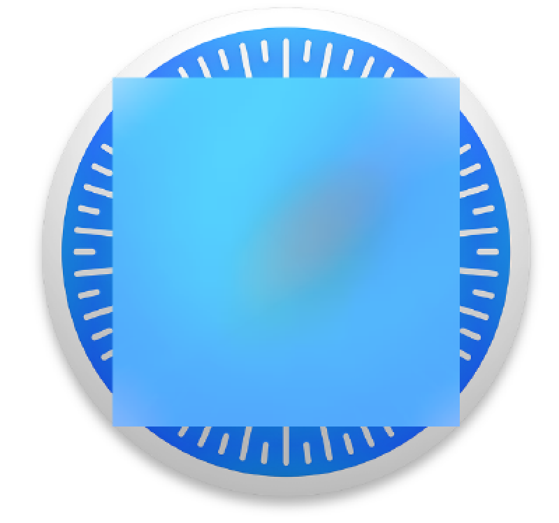

[toc]

## 1 基础

### 1.1. 向视图添加羽化（Blur）特效

You want to add blur effects to various UI components on your application.

Use the following two classes:

- `UIBlurEffect`：This is a class that represents a blur effect. You can initialize an instance of this class with its designated constructor and pass a value of type `UIBlurEffectStyle` to it. This value will then decide what type of blur effect you want to create.
- `UIVisualEffectView`：This is a simple UIView subclass that can accept and apply a visual effect of type `UIVisualEffect`. Because the `UIBlurEffect` class is a subclass of the `UIVisualEffect`, you can simply create a blur effect and pass it to your visual effect view. Once you have the visual effect view, you can add it to any other existing view that you have on or off screen.

Figure 1-1 shows Safari’s icon rendered with a visual effect view that includes a blur effect, blurring the center of that image.



For the purpose of this discussion, I have already added an image view on my view controller. The image is Safari.app’s icon. I have explained the process of extracting this icon in Recipe 19.2, so if you are curious and don’t have any other icon to use on your view controller, you can have a look at the aforementioned section of the book to learn how to extract Safari’s icon (or any other app’s icon for that matter). My view controller looks like Figure 1-2 at the moment.

What I want to do now is add a blurred view on top of this image view. As we learned in the Solution section of this recipe, we are going to create our blur effect and then create a visual effect view on top of our current view, like so:

```
import UIKit
class ViewController: UIViewController {
    override func viewDidLoad() {
        super.viewDidLoad()
        let blurEffect = UIBlurEffect(style: .Light)
        let blurView = UIVisualEffectView(effect: blurEffect)
        blurView.frame.size = CGSize(width: 200, height: 200)
        blurView.center = view.center
        view.addSubview(blurView)
    }
}
```

The UIBlurEffect class can be initialized with any of the blur styles that are specified in the `UIBlurEffectStyle` enumeration like so:

```
enum UIBlurEffectStyle : Int {
    case ExtraLight
    case Light
    case Dark
}
```

Another class of the aforementioned type is the `UIVibrancyEffect`. This class is very similar to the `UIBlurEffect` class, and in fact under the hood uses a blur effect as well. `UIVibrancyEffect` brings out the colors on the layers that are behind it. For instance, if you have a popup window that is about to appear on top of another view that contains many colorful photos on it, it is best to add a `UIVibrancyEffect` to a visual effect view and construct your popup using this visual effect view. That way, the colors underneath the popup (colors that come from the photos) will be more appealing to the user and the user will be able to get a better understanding of the content under your popup.

### 1.2. 使用 Popover 在屏幕上显示临时消息


