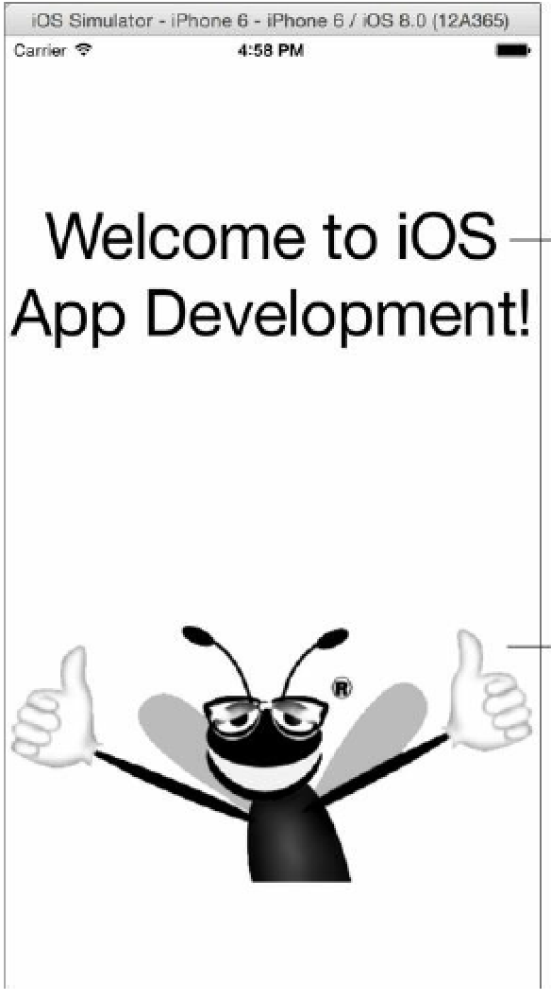
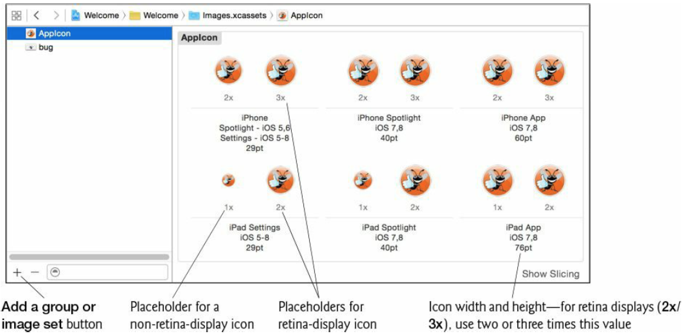
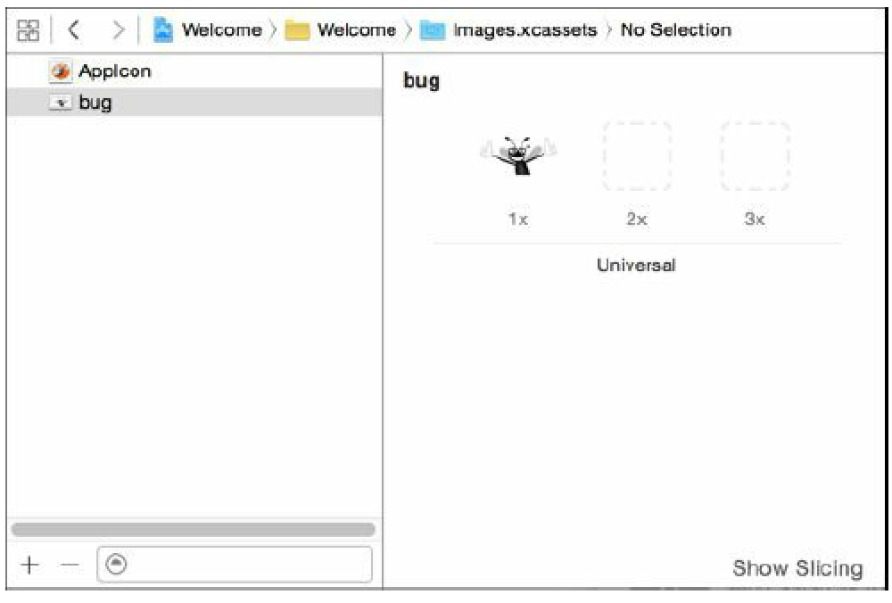

[toc]

## 2 Welcome App

本章目标：

- Xcode 基础
- 利用 Single View Application 工程模板快速开发新应用
- Create a universal app that can run on iPhones, iPod touches and iPads.
- 利用 Interface Builder, storyboarding 和 auto layout 设计 UI
- 在UI中显示文字和图片
- Support both portrait and landscape orientations.
- Edit the attributes of Cocoa Touch UI components.
- Build and launch an app in the iOS simulator.
- Make the app more accessible to visually impaired people by specifying string descriptions for use with iOS’s VoiceOver.
- 支持国际化

文字用 `UILabel`（来自 Cocoa Touch 的 UIKit 框架）。

### 2.3 Creating a Universal App Project with Xcode

模板用 Single View Application。产品名：Welcome。Company Identifier： com.deitel。Devices 选 Universal，表示该应用既可以在 iPhones 又可以在 iPads 运行。

### （未）2.4 Xcode Workspace Window

### 2.5 Storyboarding the Welcome App’s UI

#### 2.5.1 横竖屏

本应用将同时支持竖屏模式和横屏。（这是应用默认行为。）

要查看横竖屏的设置，在工程导航中选中工程，在编辑器中打开的工程设置里，在 *General -> Deployment Info* 一节，查看 *Device Orientation* 选项。默认选中 *Portrait, Landscape Left and Landscape Right* 三项。注意到 *Upside Down* 未选中。If the phone is upside down when the user receives a call, it’s more difficult to answer the phone. 为此，Apple建议不要在 iPhone 中支持 Upside Down。

#### 2.5.2 Providing an App Icon

Due to the variety of iPhones and iPads on which iOS 8 can execute, you’ll provide icons of various sizes to support the different screen sizes and resolutions. If you do not provide an icon for a particular size or if the icon you provide is not the correct size, Xcode will provide warnings.

**Asset Catalog**

跟随上节，在工程的 General 设置里，继续向下找到 *App Icons and Launch Images* 一节，点击向右按钮，（或点击 Images.xcassets 组），显示相应的 asset catalog。

**Icon Placeholders**

By default, the AppIcon image set is selected and empty placeholders are displayed for the various iPhone and iPad app icons. Each is labeled 1x, 2x or 3x. These represent non-retinadisplay (1x) and retina-display (2x or 3x) devices with difference pixel densities. The measurements are in points. For 1x icons the relationship is one point = one pixel, for 2x it’s one point = two pixels and for 3x (the iPhone 6 Plus) it’s one point = three pixels.

**Icon Sizes**

Below the 1x, 2x or 3x the asset catalog provides additional information about the purpose of a given icon. For example, iPhone Spotlight, iOS 7, 8, 40pt indicates an icon that would appear in the Spotlight search results on iPhones running iOS 7 or iOS 8. Such an icon must be 40 points (40pt) wide and tall. For a placeholder that’s labeled 1x, you provide an icon of the specified size. If that icon is labeled 2x or 3x, you provide an image that’s two or three times the specified size—80 or 120 points wide and tall, respectively.

**Launch Screen**

之前启动屏只是是图片。As of iOS 8, it can be a resizable UI that adjusts to fit the device on which the app is running. Xcode adds the file **launchscreen.xib** to each new project you create. This file displays your app’s name in the center of the screen. Though we do not do so in this app, you can select this file, then use Interface Builder to customize it.

#### 2.5.3 为应用中的图片创建 Image Set

To add a new image set, you can drag an image from a Finder window onto the list of image sets at the left of the asset catalog—Xcode names the image set as the image name without its filename extension and uses that image for devices with 1x resolution. You can then provide additional images for devices with 2x and 3x resolution.

#### （未）2.5.4 Overview of the Storyboard and the Xcode Utilities Area

#### 2.5.5 添加图片视图

显示 bug.png。In Cocoa Touch, images are usually displayed by an object of class `UIImageView`.

拖到 Interface Builder。

#### （未）2.5.6 Using Inspectors to Configure the Image View

#### （未）2.5.7 Adding and Configuring the Label

#### （未）2.5.8 Using Auto Layout to Support Different Screen Sizes and Orientations

### （未）2.6 Running the Welcome App

### （未）2.7 Making Your App Accessible

### （未）2.8 国际化

Using auto layout to design your UI is a key part of internationalization—when used correctly, auto layout enables iOS to present your UI in a manner appropriate for each locale. For example, a UI arranged left-to-right for some languages (e.g., English, French, Spanish, etc.) would typically be arranged right-to-left for others (e.g., Arabic, Hebrew, etc.).

Another important aspect of internationalization is preparing your string resources so that iOS can replace them with appropriate translated strings for the user’s locale. Xcode now supports **XLIFF** (XML Localization Interchange File Format) files for managing localized string resources. XLIFF is a standard XML representation for localizable data. As you’ll see, Xcode can export an XLIFF file containing all of your app’s localizable text. You provide this file to a translator and then import the translated XLIFF file. When your app executes on devices with different locale settings, iOS automatically chooses the correct string resources for that locale. You can learn more about XLIFF at
http://en.wikipedia.org/wiki/XLIFF
By default, each app you create uses **base internationalization**—the string resources in your app are separated from your storyboard and used as a template for providing localized strings for other languages. The language you use during development (in our case, English) is known as your app’s **base language**. If you don’t provide strings in the appropriate language for a given locale, iOS uses the base language strings by default.

In this section, we’ll demonstrate how to provide Spanish strings for the Welcome app’s Label and for its Image View’s accessibility strings. Then, we’ll demonstrate how to test the app for a Spanish locale. See Apple’s Internationalization and Localization Guide for more information:
http://bit.ly/iOSInternationalization

